# Welcome to CSC413!

## Introduction: Instructors

**Igor Gilitschenski** (LEC0101)

-   [i.gilitschenski\@utoronto.ca](mailto:i.gilitschenski@utoronto.ca)
-   Office Hours: Tue 7-8pm DH3070

**Florian Shkurti** (LEC0102)

-   [florian\@cs.toronto.edu](mailto:florian@cs.toronto.edu)
-   Office Hours: Wed 10-11am DH3066

Please use Piazza for course-related questions

## Introduction - You! Why you are here

. . .

-   I hope to apply \[deep learning models\] in my future career
-   To gain a better understanding of AI and potentially open up a career path in this direction

. . .

-   I am kinda leaning towards doing machine learning in grad school
-   My \[ROP\] supervisor suggested that I take this course.

## Introduction - You! Why you are here II

. . .

-   I am excited by the prospects of neural networks in the near future in fields such as finance, health, entertainment, etc.
-   Fields such as genetics are currently teeming with opportunities for deep learning, and I'd like to be a part of that advancement in the future.

. . .

-   It's fascinating what tasks NN can do and that's why i want to learn that.
-   Interested in learning about neural network after csc311

## Computational Resources?

-   Google Colab: 41%
-   Own machine: 59%
-   UTM machine: 0%

## Flipped Classroom

-   We turned tutorials into labs (practical, for credit)
-   We are trying active learning:
    -   we provide a lecture recording before class
    -   you watch it carefully before class
    -   you come to class to ask questions and do group exercises (practical, not for credit)
    -   maximizing interaction and discussion, minimizing one-way lecture

## Will it Work Better than Typical Lectures?

-   We don't know, but it's a useful experiment to try
-   Measuring success: students do better on average than previous years

## What is the Difference Between...

-   Artificial Intelligence
-   Machine Learning
-   Deep Learning

## AI vs ML vs DL

**Artificial Intelligence**: Create intelligent machines that perceive, reason, and act like humans. (CSC384)

**Machine Learning**: Find an algorithm that automatically learns from example data. (CSC311)

**Deep Learning**: Using deep neural networks to automatically learn from example data. (CSC413)

## Relationship

<center>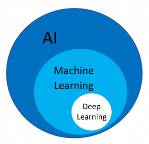{height="450"}</center>

## 

<center>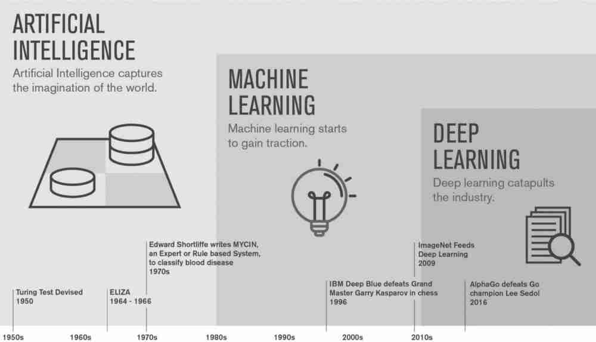</center>

## Why Machine Learning?

For many problems, it is difficult to program the correct behaviour by hand.

**Machine learning approach**: program an algorithm to automatically learn from data.

:::::: columns
::: {.column width="37%"}
{height="200"}
:::

::: {.column width="20%"}
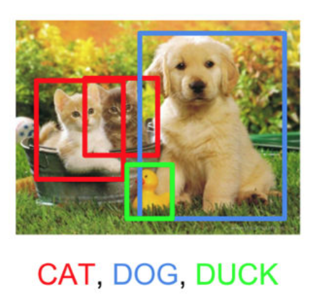{height="200"}
:::

::: {.column width="43%"}
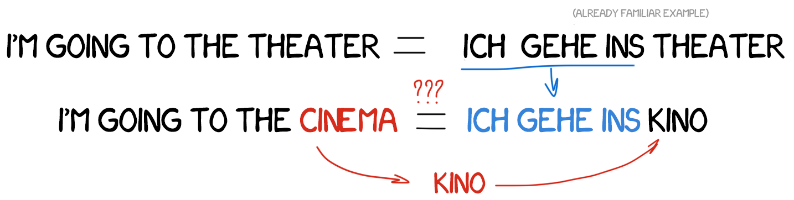{height="200"}
:::
::::::

\vspace{0.5em}

```{=html}
<!-- { height=35% }
{ height=35% }
\vspace{0.5em}
{ height=20% } -->
```

## Types of Machine Learning Problems

::: incremental
-   **Supervised Learning**: have labeled examples of the correct behavior, i.e. ground truth input/output response
    -   Regression (e.g. height prediction)
    -   Classification (e.g. sentiment classification)
-   **Unsupervised Learning**: no labeled examples; instead, looking for interesting patterns in the data (e.g. clustering)
-   **Reinforcement Learning**: learning system receives a reward signal, tries to learn to maximize the reward signal (e.g. playing StarCraft)
:::

## The Machine Learning Approach

Reframe **learning problems** into **optimization** problems by:

-   Choosing a model (with parameters to be tuned)
-   Choosing a loss/cost function to measure the "badness" of a choice of parameters
-   Choosing an optimizer to minimize the cost function

Different machine learning approaches differ in the model, loss, and optimizer choice.

This is why it is important to have a strong foundation in math, specifically calculus, linear algebra, and probability

## What are Neural Networks?

Neural networks are a class of models originally inspired by the brain.

-   Most of the biological details aren't essential, so we use vastly simplified models of neurons.
-   Nowadays we mostly think about math, statistics, etc

$$
y = \phi \left(\bf{w}^\top \bf{x} + b\right)
$$

## What are Neural Networks? II

-   Nowadays we mostly think about math, statistics, etc

$$
y = \phi \left(\bf{w}^\top \bf{x} + b\right)
$$

-   Neural networks are collections of thousands (or millions) of these simple processing units that together perform useful computations

## Why Neural Networks?

-   Very effective across a range of applications (vision, text, speech, medicine, robotics, etc.)
-   Widely used in both academia and the tech industry
-   Powerful software frameworks (PyTorch, TensorFlow, JAX, etc.) let us quickly implement sophisticated algorithms

## What is Deep Learning?

A "deep" neural network contains many "layers".

Later layers use the output of earlier layers as input.

The term **deep learning** emphasizes that the neural network algorithms often involve hierarchies with many stages of processing.

## Deep Learning Caveats: Interpretability

<center>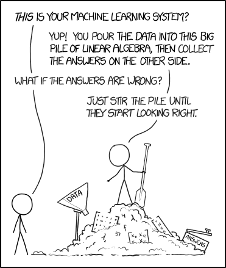{height="400"}</center>

from <https://xkcd.com/1838/>

## Deep Learning Caveats: Adversarial Examples

<center>{height="400"}</center>

## Deep Learning Caveats: Fairness

<center>{width="600"}</center>

## Fairness in Machine Learning

<center>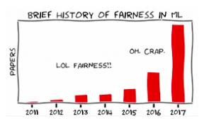{height="400"}</center>

## Course Coverage

-   Mostly supervised learning
    -   Multi-layer perceptions (week 2-5)
    -   Convolutional Neural Networks for images (weeks 6-7)
    -   Recurrent Neural Networks for sequences (weeks 8-9)
-   Some unsupervised learning
    -   Autoencoders (week 10)
    -   Generative Adversarial Networks (week 11)
-   Special topic TBA (week 12)

## Course Syllabus Scavenger Hunt: Breakout Group

1.  What textbook (if any) are we using for this course?
2.  How much are the assignments worth and what time are they due?
3.  Can you do complete the assignments in a group?
4.  What happens during tutorials? Where are they held?
5.  What software will we use for this course?

## Course Syllabus Scavenger Hunt: Breakout Group II

6.  What is the late policy in this course? How do grace tokens work?
7.  When is are the tests? How much are they worth?
8.  Is there an exam? Is there a final project? How does it work?
9.  What is plagiarism and how can you avoid it?

<!-- 02linear -->

# Linear Models

## Supervised Learning with Linear Models

One of the fundamental building blocks in deep learning are linear models, where you decide based on a linear function of the input vector.

Common supervised learning problems;

-   **Regression**: predict a scalar-valued target (e.g. stock price)
-   **Binary classification**: predict a binary label (e.g. spam vs. non-spam email)
-   **Multi-class classification**: predict a discrete label (e.g. object category, from a list)

## Problem Setup

**Input**: Represented using the vector $\textbf{x}$

-   Example: $\textbf{x}$ represents assignment grades (0-100)
-   To start, let's assume that $x$ is a scalar, and that we only have the cumulative assignment grade

**Output**: Represented using the scalar $t$

-   Example: $t$ represents the grade on an exam (0-100)
-   We'll use the scalar $y$ to denote a *prediction* of the value of $t$

## Example: Exam Grade Prediction

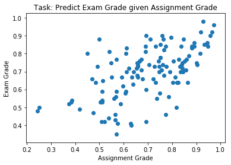{height="50%"}

-   Data: $(x^{(1)}, t^{(1)}),\, (x^{(2)}, t^{(2)}),\, \ldots , (x^{(N)}, t^{(N)})$
-   The $x^{(i)}$ are called *inputs*
-   The $t^{(i)}$ are called *targets*

## Linear Regression Model

A **model** is a set of assumptions about the underlying nature of the data we wish to learn about. The **model**, or **architecture** defines the set of allowed family of **hypotheses**.

In linear regression, our **model** will look like this

$$y = \sum_j w_j x_j + b$$

Where $y$ is a prediction for $t$, and the $w_j$ and $b$ are **parameters** of the model, to be determined based on the data.

## Linear Regression for Exam Grade Prediction

For the exam prediction problem, we only have a single feature, so we can simplify our model to:

$$y = w x + b$$

## Linear Regression for Exam Grade Prediction II

Our **hypothesis space** includes all functions of the form $y = w x + b$. Here are some examples:

-   $y = 0.4 x + 0.2$
-   $y = 0.9 x + 0.2$
-   $y = 0.1 x + 0.7$
-   $y = - x - 1$
-   ...

## Linear Regression for Exam Grade Prediction III

The variables $w$ and $b$ are called **weights** or **parameters** of our model. (Sometimes $w$ and $b$ are referred to as coefficients and intercept, respectively.)

## Which Hypothesis is Better Suited to the Data?

<center>

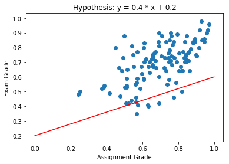{height="220"} 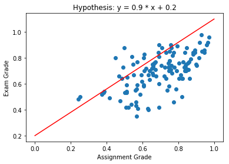{height="220"}

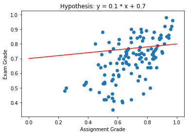{height="220"} 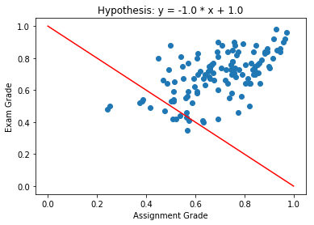{height="220"}

</center>

## Hypothesis Space

We can visualize the hypothesis space or **weight space**:

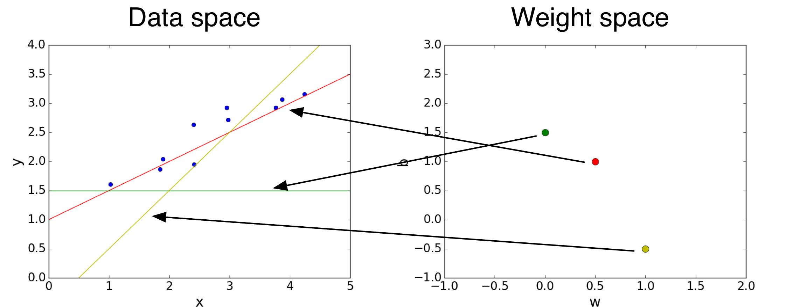{width="80%"}

Each *point* in the weight space represents a hypothesis.

## Cost Function (Loss Function)

The "badness" of an entire hypothesis is the average badness across our labeled data.

\begin{align*}
\mathcal{E}(w, b) &= \frac{1}{N} \sum_i \mathcal{L}\left(y^{(i)}, t^{(i)}\right) \\
    &= \frac{1}{2N} \sum_i \left(y^{(i)} - t^{(i)}\right)^2 \\
    &= \frac{1}{2N} \sum_i \left(\left(w x^{(i)} + b\right) - t^{(i)}\right)^2
\end{align*}

## Cost Function (Loss Function) II

This is called the **cost** of a particular hypothesis (in practice, "loss" and "cost" functions are used inter-changeably).

Since the loss depends on the choice of $w$ and $b$, we call $\mathcal{E}(w, b)$ the **cost function**.

## Minimize Cost: Direct Solution

Find a *critical point* by setting $$
\frac{\partial \mathcal{E}}{\partial w} = 0 \quad \text{and} \quad \frac{\partial \mathcal{E}}{\partial b} = 0
$$

Possible for our hypothesis space, and covered in the notes.

However, let's use a technique that can also be applied to more general models.

## Minimize Cost: Gradient Descent

We can use gradient descent to minimize the cost function.

$$
\textbf{w} \leftarrow \textbf{w} - \alpha \frac{\partial \mathcal{E}}{\partial \textbf{w}}, \quad \text{where }\,
\frac{\partial \mathcal{E}}{\partial \textbf{w}} = \begin{bmatrix}
    \frac{\partial \mathcal{E}}{\partial w_1} \\
    \vdots \\
    \frac{\partial \mathcal{E}}{\partial w_D} \\
\end{bmatrix}
$$

The $\alpha$ is the **learning rate**, which we choose.

## Gradient Descent for Grade Prediction

<center>{height="350"}</center>

We'll initialize $w = 0$ and $b = 0$ (arbitrary choice)

We'll also choose $\alpha = 0.5$

## Gradient Descent: Step 0

<center>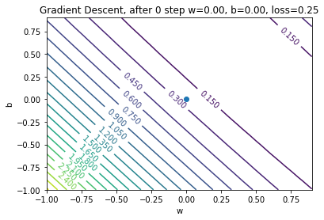{height="500"}</center>

## Gradient Descent: Step 1

<center>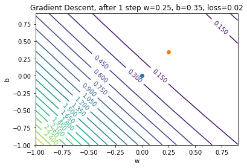{height="500"}</center>

## Gradient Descent: Step 2

<center>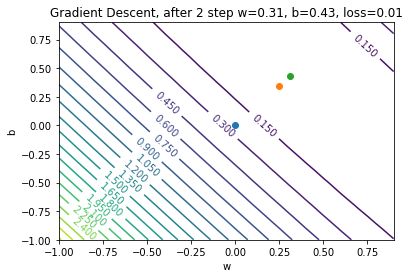{height="500"}</center>

## Gradient Descent: Step 3

<center>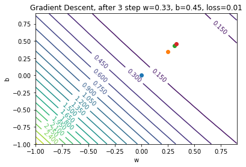{height="500"}</center>

## Gradient Descent: Step 4

<center>{height="500"}</center>

## Gradient Descent: When to stop?

In theory:

-   Stop when $w$ and $b$ stop changing (convergence)

In practice:

-   Stop when $\mathcal{E}$ almost stops changing (another notion of convergence)
-   Stop until we're tired of waiting

## Gradient Descent: how to Choose the Learning Rate?

-   If $\alpha$ is too small, then training will be *slow*
    -   Take a long time to converge
-   If $\alpha$ is too large, then we can have divergence!
    -   Take a long time to converge

## Computing the Gradient

To compute the gradient $\frac{\partial \mathcal{E}}{\partial w}$

$$
\frac{\partial \mathcal{E}}{\partial w} = \frac{1}{N}\sum_{i=1}^{N} \frac{\partial \mathcal{L}(y^{(i)},  t^{(i)})}{\partial w}
$$

But this computation can be expensive if $N$ is large!

. . .

Solution: estimate $\frac{\partial \mathcal{E}}{\partial w}$ using a *subset* of the data

## Stochastic Gradient Descent

Full batch gradient descent:

$$
\frac{1}{N}\sum_{i=1}^{N} \frac{\partial \mathcal{L}(y^{(i)},  t^{(i)})}{\partial w}
$$

Stochastic Gradient Descent:

Estimate the above quantity by computing the average of $\frac{\partial \mathcal{L}(y^{(i)},  t^{(i)})}{\partial w}$ across a small number of $i$'s

## Stochastic Gradient Descent II

Stochastic Gradient Descent:

Estimate the above quantity by computing the average of $\frac{\partial \mathcal{L}(y^{(i)},  t^{(i)})}{\partial w}$ across a small number of $i$'s

The set of examples that we use to estimate the gradient is called a **mini-batch**.

The number of examples in each mini-batch is called the **mini-batch size** or just the **batch size**

## Stochastic Gradient Descent Algorithm

In theory, any way of sampling a mini-batch is okay.

In practice, SGD is almost always implemented like this:

``` python
# repeat until convergence:
    # randomly split the data into mini-batches of size k
    # for each mini-batch:
        # estimate the gradient using the mini-batch
        # update the parameters based on the estimate
```

. . .

-   Each pass of the inner loop is called an **iteration**.
    -   One iteration = one update for each weight
-   Each pass of the outer loop is called an **epoch**.
    -   One epoch = one pass over the data set

## Iterations, Epochs, and Batch Size

Suppose we have 1000 examples in our training set.

Q: How many iterations are in one epoch if our batch size is 10?

. . .

Q: How many iterations are in one epoch if our batch size is 50?

## Batch Size Choice

Q: What happens if the batch size is **too large**?

Q: What happens if the batch size is **too small**?

## Linear Regression Summary

|  |  |
|-------------------------|-----------------------------------------------|
| Model | $$y = {\bf w}^T{\bf x} + b$$ |
| Loss Function | $$\mathcal{L}(y, t) = (y- t)^2$$ |
| Optimization Method | $$\min_{{\bf w},\, b}\left(\left\{\mathcal{E}({\bf w}, b)\right\}\right) \text{ via Gradient Descent}$$ |

## Linear Regression Summary II

Updating rules:

$$
{\bf w} \leftarrow {\bf w} - \alpha \frac{\partial \mathcal{E}}{\partial {\bf w}}, \quad b \leftarrow b  - \alpha \frac{\partial \mathcal{E}}{\partial b}
$$

## Linear Regression Vectorization

Use vectors rather than writing

$$
\mathcal{E}({\bf w}, b) = \frac{1}{2N}\sum_{i = 1}^N \left(\left({\bf w} {\bf x}^{(i)} + b\right) - t^{(i)}\right)^2
$$

So we have: $$
\textbf{y} = \textbf{X}\textbf{w} + b{\bf 1}
$$

where...

## Linear Regression Vectorization II

\begin{align*}
\textbf{X} &=
\begin{bmatrix}
    x^{(1)}_1 & ... & x^{(1)}_D \\
    \vdots & \ddots & \vdots \\
    x^{(N)}_1 & ... & x^{(N)}_D
\end{bmatrix},
\,
\textbf{w} =
\begin{bmatrix}
w_1 \\
\vdots \\
w_D \\
\end{bmatrix}, \,
\textbf{y} =
\begin{bmatrix}
    y^{(1)} \\
    \vdots \\
    y^{(N)} \\
\end{bmatrix},
\,
\textbf{t} =
\begin{bmatrix}
    t^{(1)} \\
    \vdots \\
    t^{(N)} \\
\end{bmatrix}
\end{align*}

(You can also fold the bias $b$ into the weight \textbf{w}, but we won't.)

## Vectorized Loss Function

After vectorization, the loss function becomes:

$$
\mathcal{E}(\textbf{w}) = \frac{1}{2N}(\textbf{y} - \textbf{t})^\top(\textbf{y} - \textbf{t})
$$

or

$$
\mathcal{E}(\textbf{w}) = \frac{1}{2N}({\bf Xw} + b{\bf 1}- {\bf t})^\top({\bf Xw} + b{\bf 1}- {\bf t})
$$

## Vectorized Gradient Descent

$$
{\bf w} \leftarrow {\bf w} - \alpha \frac{\partial \mathcal{E}}{\partial {\bf w}}, \quad b \leftarrow b  - \alpha \frac{\partial \mathcal{E}}{\partial b}
$$ Where $\frac{\partial \mathcal{E}}{\partial \textbf{w}}$ is the vector of partial derivatives: \begin{align*}
\frac{\partial \mathcal{E}}{\partial \textbf{w}} = \begin{bmatrix}
    \frac{\partial \mathcal{E}}{\partial w_1} \\
    ... \\
    \frac{\partial \mathcal{E}}{\partial w_D} \\
\end{bmatrix}
\end{align*}

## Why Vectorize?

Vectorization is *not* just for mathematical elegance.

When using Python with numpy/PyTorch/Tensorflow/JAX, code that performs vector computations is faster than code that loops.

Same holds for many other high level languages and software.

<!-- 03classify -->

# Classification

## Classification Setup

-   Data: $(x^{(1)}, t^{(1)})$, $(x^{(2)}, t^{(2)})$, ... $(x^{(N)}, t^{(N)})$
-   The $x^{(i)}$ are called *inputs*
-   The $t^{(i)}$ are called *targets*

In classification, the $t^{(i)}$ are discrete.

In binary classification, we'll use the labels $t \in \{0, 1\}$. Training examples with

-   $t = 1$ is called a **positive example**
-   $t = 0$ is called a **negative example**

## Classification Example

-   $x^{(i)}$ represents a person's assignment grade
-   $t^{(i)}$ represents whether that person had a "high" exam grade (arbitrary cutoff)

<center>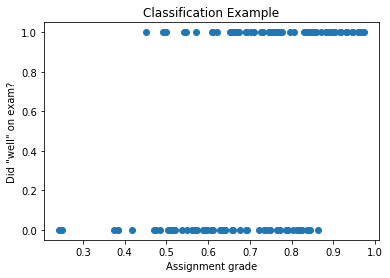{height="300"}</center>

## Q: Why not Use Regression?

Why can't we set up this problem as a regression problem?

Use the model:

$$
y = wx + b
$$

Our prediction for $t$ would be $1$ if $y \geq 0.5$, and $0$ otherwise.

```{=html}
<!--
\begin{align*}
y &= \begin{cases} 1 \textbf{if} wx + b  > 0 \\ 0 \text{otherwise}\end{cases} \\
  &= \begin{cases} 1 \textbf{if} x > \frac{b}{w} \\ 0 \text{otherwise}\end{cases} \\
\end{align*}
-->
```

With the loss function

$$\mathcal{L}(y, t) = \frac{1}{2}(y - t)^2$$

And minimize the cost function via gradient descent?

## Classification as Regression: Problem

<center>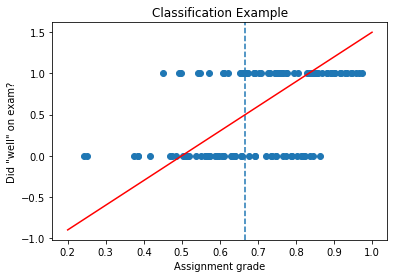{height="300"}</center>

If we have $\mathcal{L}(y, t) = \frac{1}{2}(y - t)^2$, then **points that are correctly classified will still have high loss**!

(blue dotted line above = decision boundary)

## The Problem (continued)

::::: columns
::: {.column width="45%"}
{height="300"}
:::

::: {.column width="55%"}
Example: a point on the top right

-   Model makes the correct prediction for point on top right
-   However, $(y - t)^2$ is large
-   So we are penalizing our model, even though it is making the right prediction!
:::
:::::

## Q: Why not Use Classification Error?

Why not still use the model:

$$
y = \begin{cases} 1, & \text{ if } \mathbf{w}^\top\mathbf{x} + b > 0 \\ 0, & \text{ otherwise }\end{cases}
$$

But use this loss function instead:

$$
\mathcal{L}(y, t) = \begin{cases} 0, & \text{ if } y = t \\ 1, & \text{ otherwise }\end{cases}
$$

## First Attempt at a Loss Function: The 0-1 Loss

$$
\mathcal{L}(y, t) = \begin{cases} 0, & \text{ if } y = t \\ 1, & \text{ otherwise }\end{cases}
$$

The gradient of this function is 0 almost everywhere!

So gradient descent will not change the weights! We need to define a surrogate loss function that is better behaved.

## Logistic Regression Model

Apply a **non-linearity** or **activation function** to the linear model $z$:

\begin{align*}
z &= wx + b \quad \quad \text{also called the logit}\\
y &= \sigma(z) \quad \quad \text{also called a log-linear model}
\end{align*}

where

$$\sigma(z) = \frac{1}{1 + e^{-z}}$$

is called the logistic or sigmoid function. Using the model $y$ for solving a classification problem is called **logistic regression**.

## The Sigmoid Function

$$\sigma(z) = \frac{1}{1 + e^{-z}}$$

::::: columns
::: {.column width="60%"}
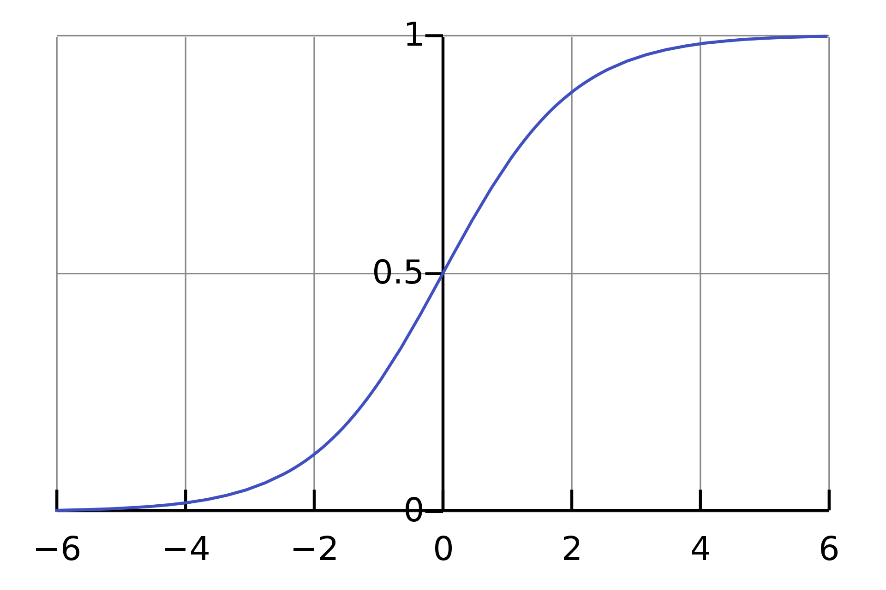{height="400"}
:::

::: {.column width="40%"}
Properties:

-   $\sigma(z) \in [0;\; 1]$
-   $\sigma(0) = \frac{1}{2}$
:::
:::::

## Logistic Regression Example

A logistic regression model will have this shape:

<center>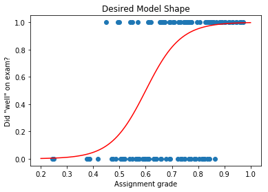{height="350"}</center>

But how do we train this model?

## Logistic Regression: Square Loss?

Suppose we define the model like this:

\begin{align*}
z &= wx + b \\
y &= \sigma(z) \\
\mathcal{L}_{SE}(y, t) &= \frac{1}{2}(y - t)^2
\end{align*}

The gradient of $\mathcal{L}$ with respect to $w$ is (homework):

$$
\frac{\partial \mathcal{L}}{\partial w} =
    \frac{\partial \mathcal{L}}{\partial y}
    \frac{dy}{dz}
    \frac{\partial z}{\partial w} = (y - t) y (1 - y) x
$$

## The Problem with Square Loss

Suppose we have a positive example ($t = 1$) that our model classifies extremely wrongly ($z = -5$):

Then we have $y = \sigma(z) \approx 0.0067$

. . .

Ideally, the *gradient* should give us strong signals regarding how to update $w$ to do better.

But... $\frac{\partial \mathcal{L}}{\partial w} = (y - t) y (1- y) x$ is small!

. . .

Which means that the update $w \leftarrow w - \alpha \frac{\partial \mathcal{L}}{\partial w}$ won't change $w$ much!

## Gradient Signal

The problem with using sigmoid activation with square loss is that we get **poor gradient signal**.

::::: columns
::: {.column width="40%"}
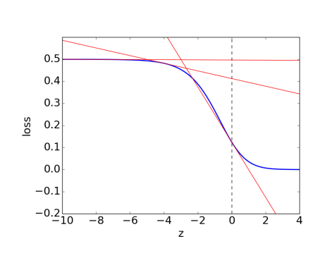{height="350"}
:::

::: {.column width="60%"}
-   The loss for a *very wrong prediction* ($y=0.0001$) vs a wrong prediction ($y=0.01$) are similar
-   This is a problem, because the gradients in the region would be close to 0
:::
:::::

We need a loss function that distinguishes between a wrong prediction and a *very* wrong prediction.

## The Cross Entropy Loss

The **cross entropy loss** provides the desired behaviour:

$$
\mathcal{L}(y, t) = \begin{cases} -\log(y), & \text{if } t = 1  \\ -\log(1 - y), & \text{ if } t = 0\end{cases}
$$

We can write the loss as:

$$\mathcal{L}(y, t) = - t \log(y) - (1-t) \log(1-y)$$

## Logistic Regression Summary

|  |  |
|-------------------------|-----------------------------------------------|
| Model | $$y = \sigma({\bf w}^T{\bf x} + b)$$ |
| Loss Function | $$\mathcal{L}(y, t) = -t \log(y) - (1-t) \log(1-y)$$ |
| Optimization Method | $$\min_{{\bf w},\, b}\mathcal{E}({\bf w}, b) \text{ via Gradient Descent}$$ |

## Logistic Regression Summary II

Updating rules:

$$
{\bf w} \leftarrow {\bf w} - \alpha \frac{\partial \mathcal{E}}{\partial {\bf w}}, \quad b \leftarrow b  - \alpha \frac{\partial \mathcal{E}}{\partial b}
$$

## Grade Classification Example

After running gradient descent, we'll get a model that looks something like:

<center>{height="400"}</center>

<!-- 04multi -->

# Multi-class Classification

## Multi-class Classification

Instead of there being two targets (pass/fail, cancer/not cancer, before/after 2000), we have $K > 2$ targets.

Example:

-   Beatles ($K$ = 4):
    -   John Lennon, Paul McCartney, George Harrison, Ringo Starr
-   Pets ($K$ = something large):
    -   cat, dog, hamster, parrot, python, ...

## Representing the Targets

We use a **one-hot vector** to represent the target:

$${\bf t} = (0,\, 0,\, \ldots ,\, 1,\, \ldots ,\, 0)$$

This vector contains $K-1$ zeros, and a single 1 somewhere.

Each *index* (column) in the vector represents one of the classes.

## Representing the Prediction

The prediction ${\bf y}$ will also be a vector. Like in logistic regression there will be a linear part, and an activation function.

Linear part: ${\bf z} = {\bf W}^\top{\bf x} + {\bf b}$

So far, this is like having $K$ separate logistic regression models, one for each element of the one-hot vector.

Q: What are the shapes of ${\bf z}$, ${\bf W}$, ${\bf x}$ and ${\bf b}$?

## Activation Function

Instead of using a *sigmoid* function, we instead use a **softmax activation** function:

$$y_k = \text{softmax}(z_1,...,z_K)_k = \frac{e^{z_k}}{\sum_{m=1}^K e^{z_m}}$$

The vector of predictions $y_k$ is now a **probability distribution** over the classes!

## Why Softmax?

-   Softmax is like the multi-class equivalent of sigmoid <!-- - $\sigma(z) = \text{softmax}(z, 1)_1$  -->
-   Softmax is a continuous analog of the "argmax" function
-   If one of the $z_k$ is much larger than the other, then the softmax will be approximately the argmax, in the one-hot encoding

## Cross-Entropy Loss

The cross-entropy loss naturally generalizes to the multi-class case:

\begin{align*}
\mathcal{L}({\bf y}, {\bf t}) &= -\sum_{k=1}^K t_k \log (y_k) \\
&= - {\bf t}^\top \log({\bf y})
\end{align*}

Recall that only one of the $t_k$ is going to be 1, and the rest are 0.

## Multi-class Classification Summary

|  |  |
|-------------------------|-----------------------------------------------|
| Model | $${\bf y} = \text{softmax}({\bf W}^T{\bf x} + {\bf b})$$ |
| Loss Function | $$\mathcal{L}({\bf y}, {\bf t}) =- {\bf t}^T \log({\bf y})$$ |
| Optimization Method | $$\min_{{\bf w},\, b}\mathcal{E}({\bf w}, b) \text{ via Gradient Descent}$$ |

## Multi-class Classification Summary II

Updating rules:

$$
{\bf W} \leftarrow {\bf W} - \alpha \frac{\partial \mathcal{E}}{\partial {\bf W}}, \quad {\bf b} \leftarrow {\bf b}  - \alpha \frac{\partial \mathcal{E}}{\partial {\bf b}}
$$

<!-- $_$ -->

## Example: Beatle Recognition

Given a $100 \times 100$ pixel colour image of a face of a Beatle, identify the Beatle

{height="50%"}

Four possible labels:

-   John Lennon
-   Paul McCartney
-   George Harrison
-   Ringo Starr

## Aside: Representing an Image

This is what John Lennon looks like to a computer:

<center>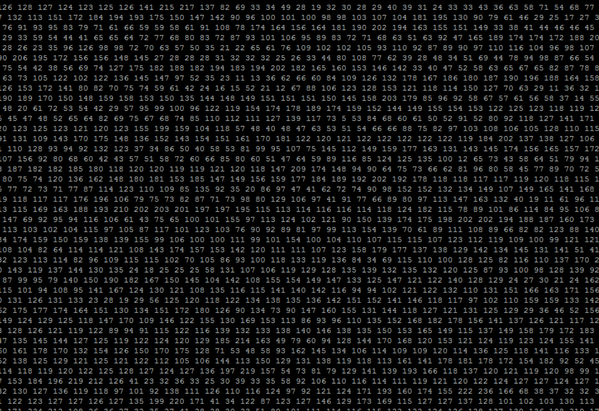{height="500"}</center>

## Image as a Vector of Features

<center>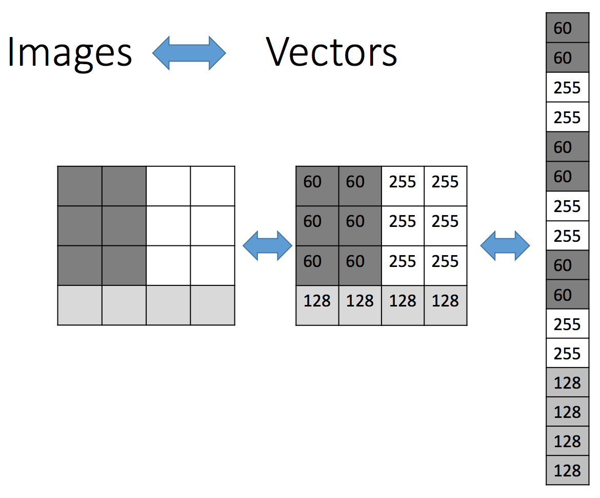{height="500"}</center>

## Features and Targets

Each of our input images are $100 \times 100$ pixels

${\bf y} = \text{softmax}\left({\bf W}^\top{\bf x} + {\bf b}\right)$

Q: What will be the length of our input (feature) vectors ${\bf x}$?

Q: What will be the length of our one-hot targets ${\bf t}$?

Q: What are the shapes of ${\bf W}$ and ${\bf b}$?

Q: How many (scalar) parameters are in our model, in total?

<!-- next -->

# What to do this Week?

-   You can start assignment 1 (will be posted soon)
    -   If you remember everything from CSC311, you can already complete Assignment 1
    -   Aim to finish Q1 this week, and start Q2
    -   Start early so you can get help early!
-   No tutorials this week, but do the pre-requisite math problems
    -   Suggested linear algebra and probability review

# What to do this Week? II

-   Complete the readings in <https://q.utoronto.ca/courses/291947/pages/week-1-overview>
-   Preview next week's materials
-   Take a peek at tutorial 2 (will be posted soon)
    -   Start early so you can get help early!