## Last Week

::: incremental
-   Review of linear models
    -   linear regression
    -   linear classification (logistic regression)
-   Gradient descent to train these models
:::

## This Week

::: incremental
-   Biological and Artifical Neurons
-   Limitations of Linear Models for Classification
-   Multilayer Perceptrons
-   Backpropagation
:::

<!-- 01neuron -->

# Biological and Artificial Neurons

## Neuron

{.absolute top="160" height="65%"}

::: notes
-   A Neuron is a cell also known as *nerve cell*
:::

## Neuron Anatomy

::: incremental
-   The **dendrites**, which are connected to other cells that provide information.
-   The **cell body**, which consolidates information from the dendrites.
-   The **axon**, which is an extension from the cell body that passes information to other cells.
-   The **synapse**, which is the area where the axon of one neuron and the dendrite of another connect.
:::

## What does a neuron do?

<center>

<!-- 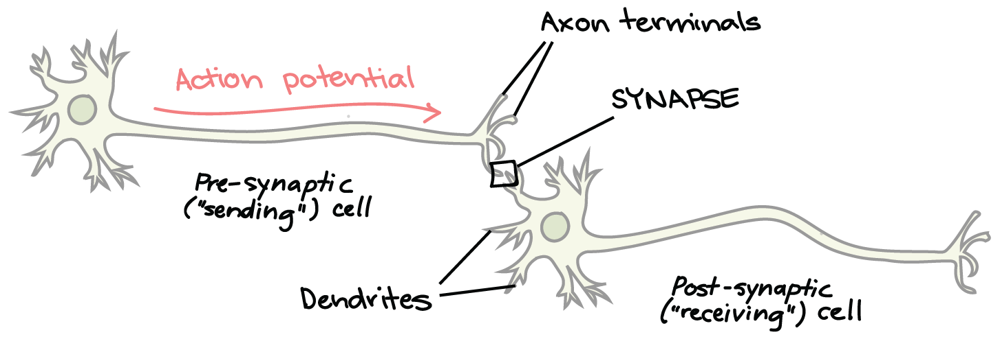{ height=30%} -->

{height="250"}

</center>

::: incremental
-   Consolidates "information" (voltage difference) from its dendrites
-   If the total activity in a neuron's dendrite lowers the voltage difference enough, the entire cell *depolarizes* and the neuron *fires*
:::

## What does a neuron do?

<center>

<!-- { height=30%} -->

{height="250"}

</center>

::: incremental
-   The voltage signal spreads along the axon and to the synapse, then to the next neurons
-   Neuron sends information to the next cell
:::

## What makes a neuron fire?

Neurons can fire in response to...

-   retinal cells
-   certain edges, lines, angles, movements
-   hands and faces (in primates)
-   specific people (in humans)
    -   although the existence of these "grandmother cells" is contested

::: notes
-   *Grandmother cells* are also known as *Jennifer Aniston neurons*
-   [Observed](https://en.wikipedia.org/wiki/Grandmother_cell) single neuron firing when shown pictures of Jennifer Aniston by operating on patients with epileptic seizures.
:::

## Modeling Individual Neurons

<center>{height="300"}</center>

::: incremental
-   $x_{i}$ are **inputs** to the neuron
-   $w_{i}$ are the neuron's **weights**
-   $b$ is the neuron's **bias**
:::

::: notes
-   In Learning with Artifical Neural Networks, we want to create a simplified model of neurons in the brain.
:::

## Modeling Individual Neurons II

<center>{height="300"}</center>

::: incremental
-   $f$ is an **activation function**
-   $f(\sum_i x_i w_i + b)$ is the neuron's **activation** (output)
:::

## Linear Models as a Single Neuron

<center>{height="300"}</center>

-   $x_{i}$ are the inputs
-   $w_{i}$ are components of the **weight vector** ${\bf w}$
-   $b$ is the **bias**

::: notes
-   A (univariate) linear model can be interpreted as one single neuron.
-   Univariate means that we model one single attribute.
:::

## Linear Models as a Single Neuron II

<center>{height="300"}</center>

-   $f$ is the identity function
-   $y = \sum_i x_i w_i + b = {\bf w}^\top {\bf x} + b$ is the output

## Logistic Regression Models (for Binary Classification) as a Single Neuron

<center>{height="300"}</center>

-   $x_{i}$ are the inputs
-   $w_{i}$ are components of the **weight vector** ${\bf w}$
-   $b$ is the **bias**

## Logistic Regression Models (for Binary Classification) as a Single Neuron II

<center>{height="300"}</center>

-   $f = \sigma$
-   $y = \sigma(\sum_i x_i w_i + b) = \sigma({\bf w}^\top {\bf x} + b)$

## Logistic Regression Models (for Multi-Class Classification) as a Neural Network

We use $K$ neurons (one for each class):

::: incremental
-   $x_{i}$ are the inputs
-   $w_{j,i}$ are components of the **weight matrix** $W\in \mathbb{R}^{K\times N}$
-   $b_i$ are components of the **bias vector** ${\bf b}$
-   $f = \text{softmax}$ : applied to the entire vector of values
-   ${\bf y} = \text{softmax}(W{\bf x} + {\bf b})$ : outputs of $K$ neurons
:::

::: notes
-   Now we have an entire weight matrix $W$ with $K$ rows and a $K$-dimensional bias vector. One for each class.
:::

<!-- 02limits -->

# Limits of Linear Models for Binary Classification

## XOR example

-   Single neurons (linear classifiers) are very limited in expressive power
-   XOR is a classic example of a function that's not linearly separable, with an elegant proof using convexity

<center>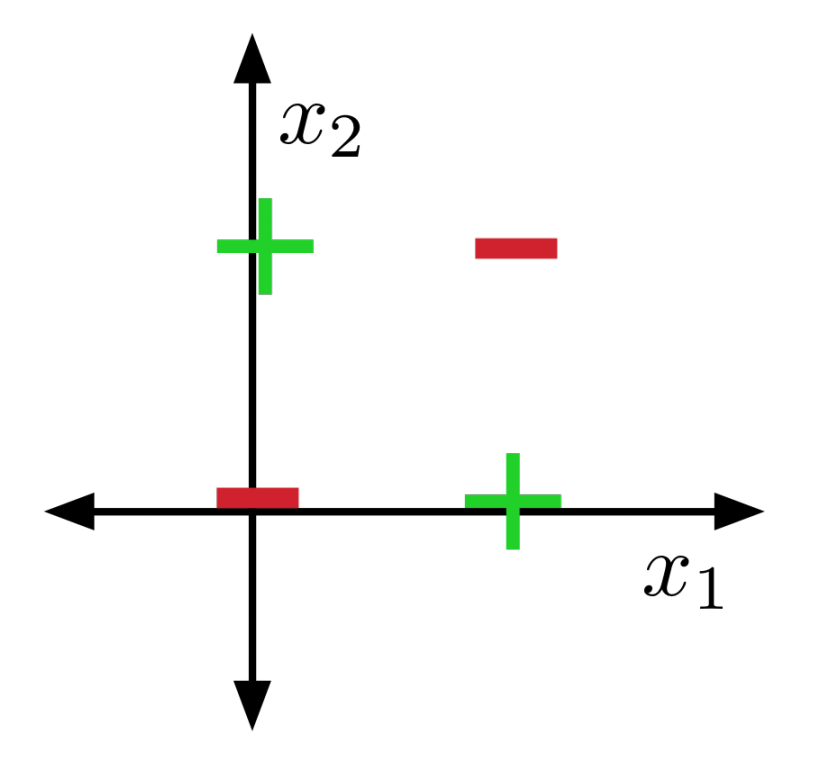{height="250"}</center>

## Convex Sets

A set $S\subseteq\mathbb{R}^n$ is **convex** if any line segment connecting points in $S$ lies in $S$.

::: fragment
More formally, $S$ is convex iff

$${\bf x_1}, {\bf x_2} \in S \implies \forall \lambda \in [0,\, 1],\, \lambda {\bf x_1} + (1 - \lambda){\bf x_2} \in S.$$
:::

::: fragment
A simple inductive argument shows that for ${\bf x_1}, \dots, {\bf x_N} \in S$, the **weighted average** or **convex combination** lies in the set:

$$\lambda_1 {\bf x_1} + \dots + \lambda_N {\bf x_N} \in S \text{ for }\lambda_1 + \dots + \lambda_N = 1\ .$$
:::

::: notes
-   *iff* stands for *"if and only if"*
:::

## XOR not linearly separable

**Initial Observations**

::: incremental
-   A binary linear classifier divides the euclidean space into two half-spaces
-   Half-spaces are convex
:::

## XOR not linearly separable II

:::: {.column width="75%"}
::: incremental
-   Suppose there were some feasible hypothesis. If the positive examples are in the positive half-space, then the green line segment must be as well.
-   Similarly, red line segment must lie within the negative half-space.
-   But the intersection can't lie in both half-spaces. Contradiction!
:::
::::

::: {.column width="25%"}
<center>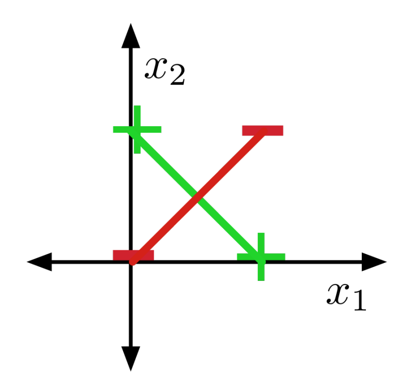</center>
:::

## History of the XOR Example

:::: {.column width="75%"}
::: incremental
-   Minsky and Papert shown in their work *Perceptrons* that XOR cannot be learned by a Neuron.
-   Its pessimistic outlook on perceptrons is assumed as one of the causes for the AI winter of the 70s / early 80s.
:::
::::

::: {.column width="25%"}
<center>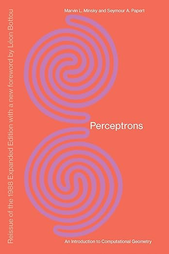</center>
:::

## A more troubling example

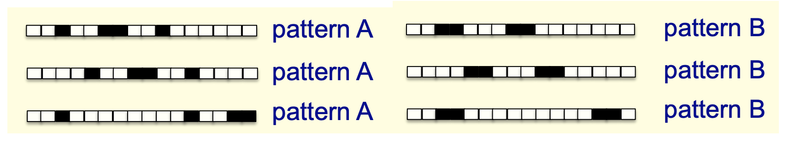{height="50%"}

::: fragment
These images represent 16-dimensional vectors. Want to distinguish patterns A and B in all possible translations (with wrap-around).
:::

::: fragment
Suppose there’s a feasible solution. The average of all translations of A is the vector (0.25, 0.25, . . . , 0.25). Therefore, this point must be classified as A. All translations of B have the same average. Contradiction!
:::

::: notes
-   The argument here is basically a convexity argument again
-   The average of all possible patterns A must be classified as A because of convexity. Same for B
-   However, both patterns have the same average leading to a contradiction
:::

## (Nonlinear) Feature Maps

Sometimes, we can overcome this limitation with **nonlinear feature maps**.

::: fragment
Nonlinear feature maps transform the original input features into a different (often higher dimensional) representation.
:::

::: fragment
Consider the XOR problem again and use the following feature map: $$\Psi({\bf x}) = \begin{pmatrix}x_1 \\ x_2 \\ x_1x_2 \end{pmatrix}$$
:::

## (Nonlinear) Feature Maps II

| $x_1$ | $x_2$ | $\phi_1({\bf x})$ | $\phi_2({\bf x})$ | $\phi_3({\bf x})$ | t   |
|-------|-------|-------------------|-------------------|-------------------|-----|
| 0     | 0     | 0                 | 0                 | 0                 | 0   |
| 0     | 1     | 0                 | 1                 | 0                 | 1   |
| 1     | 0     | 1                 | 0                 | 0                 | 1   |
| 1     | 1     | 1                 | 1                 | 1                 | 0   |

This is linearly separable (Try it!)

::: fragment
... but generally, it can be hard to pick good basis functions.
:::

::: fragment
**We'll use neural nets to learn nonlinear hypotheses directly**
:::

<!-- 03mlp -->

# Multilayer Perceptrons

## An Artificial Neural Network (Multilayer Perceptron)

<center>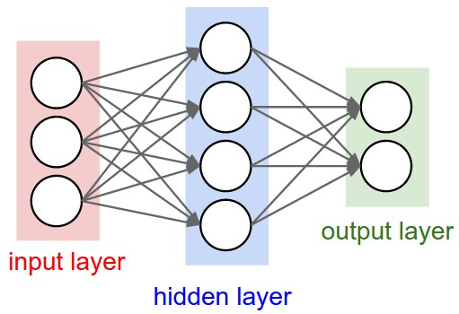{height="270"}</center>

**Idea**

::: incremental
-   Use a simplified (mathematical) model of a neuron as building blocks
-   Connect the neurons together accross multiple layers.
:::

## An Artificial Neural Network (Multilayer Perceptron) II

<center>{height="270"}</center>

::: incremental
-   An **input layer**: feed in input features (e.g. like retinal cells in your eyes)
-   A number of **hidden layers**: don't have specific meaning
-   An **output layer**: interpret output like a "grandmother cell"
:::

## But what do these neurons mean?

::: fragment
-   Use $x_i$ to encode the input
    -   e.g. pixels in an image
:::

::: fragment
-   Use $y$ to encode the output (of a binary classification problem)
    -   e.g. cancer vs. not cancer
:::

::: fragment
-   Use $h_i^{(k)}$ to denote a unit in the hidden layer
    -   difficult to interpret
:::

::: notes
-   $x_i$ can be thought of as the neurons that are connected to the receptors in the eye
-   $y$ can be thought of as a grandmother cell.
:::

## Example: MNIST Digit Recognition

<center>{height="600"}</center>

## MNIST Digit Recognition II

With a logistic regression model, we would have:

::: fragment
-   Input: An 28x28 pixel grayscale image
    -   ${\bf x}$ is a vector of length 784
:::

::: fragment
-   Target: The digit represented in the image
    -   ${\bf t}$ is a one-hot vector of length 10
:::

::: fragment
-   Model: ${\bf y} = \text{softmax}(W{\bf x} + {\bf b})$
:::

::: notes
-   Each $x_i$ is a intensity value of the corresponding pixel, i.e. a value between 0 and 255.
-   As a reminder: the one-hot vector has 1 at the entry corresponding to the classified number and 0 everywhere elese.
:::

## Adding a Hidden Layer

Two layer neural network

<center>{height="250"}</center>

::: incremental
-   Input size: 784 (number of features)
-   Hidden size: 50 (we choose this number)
-   Output size: 10 (number of classes)
:::

::: notes
-   All the numbers that we can choose such as the number of hidden units are known as *Hyperparameters*.
:::

## Side note about machine learning models

When discussing machine learning and deep learning models, we usually

-   first talk about **how to make predictions** assume the weights are trained
-   *then* talk about how to train the weights

Often the second step requires gradient descent or some other optimization method

## Making Predictions: computing the hidden layer

<center>{height="200"}</center>

\begin{align*}
h_1 &= f\left(\sum_{i=1}^{784} w^{(1)}_{1,i} x_i + b^{(1)}_1\right) \\
h_2 &= f\left(\sum_{i=1}^{784} w^{(1)}_{2,i} x_i + b^{(1)}_2\right) \\
...
\end{align*}

## Making Predictions: computing the output (pre-activation)

<center>{height="200"}</center>

\begin{align*}
z_1 &=  \sum_{j=1}^{50} w^{(2)}_{1,j} h_j + b^{(2)}_1  \\
z_2 &=  \sum_{j=1}^{50} w^{(2)}_{2,j} h_j + b^{(2)}_2  \\
...
\end{align*}

## Making Predictions: applying the output activation

<center>{height="200"}</center>

\begin{align*}
{\bf z} &= \begin{bmatrix}z_1 \\ z_2 \\ \vdots \\ z_{10}\end{bmatrix},\quad {\bf y} = \text{softmax}({\bf z})
\end{align*}

## Making Predictions: Vectorized

<center>{height="300"}</center>

\begin{align*}
{\bf h} &= f(W^{(1)}{\bf x} + {\bf b}^{(1)}) \\
{\bf z} &= W^{(2)}{\bf h} + {\bf b}^{(2)} \\
{\bf y} &= \text{softmax}({\bf z})
\end{align*}

## Activation Functions: common choices

Common Choices:

-   Sigmoid activation
-   Tanh activation
-   ReLU activation

Rule of thumb: Start with ReLU activation. If necessary, try tanh.

## Activation Function: Sigmoid

<center>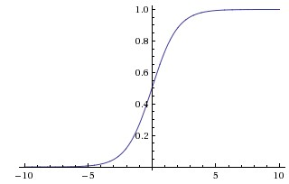{height="300"}</center>

-   Gradient vanishes at the extremes as the function converges to $0$ and $1$ respectively.
-   All activations are positive (see [this](https://artemoppermann.com/activation-functions-in-deep-learning-sigmoid-tanh-relu/) blog post to learn why we don't want this)

::: notes
-   Having only positive activations can lead to undesired behavior during training because all weights entering a neuron can either be only increased or only decreased.
:::

## Activation Function: Tanh

<center>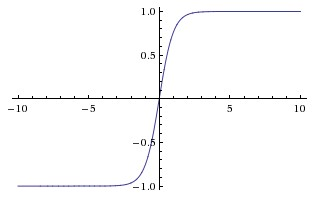{height="300"}</center>

-   scaled version of the sigmoid activation
-   also somewhat problematic due to gradient signal
-   activations can be positive or negative

## Activation Function: ReLU

<center>{height="300"}</center>

::: incremental
-   most often used nowadays
-   all activations are positive
-   easy to compute gradients
-   can be problematic if the bias is too large and negative, so the activations are always 0
:::

::: notes
-   The last point is known as the dying ReLU phenomenon if a neuron becomes inactive and never recovers.
:::

## Feature Learning

Neural nets can be viewed as a way of learning features:

<center>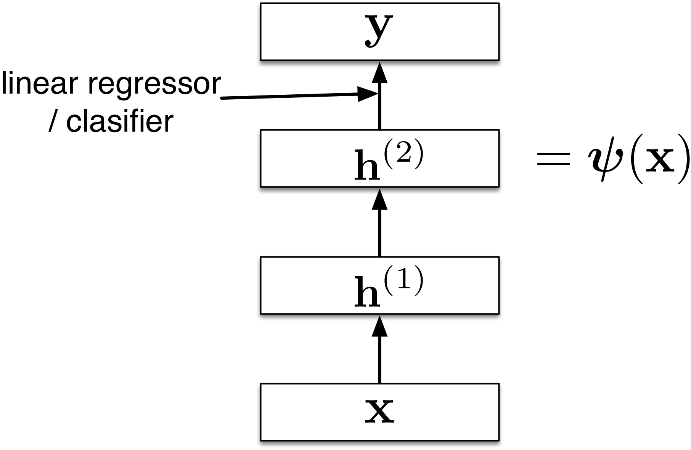{height="400"}</center>

## Feature Learning (cont'd)

The goal is for these features to become linearly separable:

<center>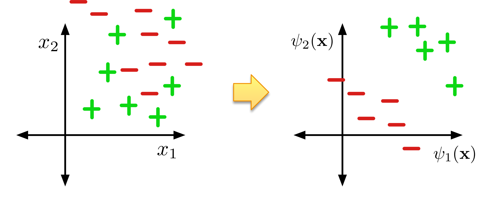{height="400"}</center>

## Computing XOR

Exercise: design a network to compute XOR

Use a hard threshold activation function:

\begin{align*}
    f(x) = \begin{cases}
                1, & x \geq 0 \\
                0, & x < 0
            \end{cases}
\end{align*}

## Computing XOR Demo

Demo: <https://playground.tensorflow.org/>

## Expressive Power: Linear Layers (No Activation Function)

::: incremental
-   We've seen that there are some functions that linear classifiers can't represent. Are deep networks any better?
-   Any sequence of \emph{linear} layers (with no activation function) can be equivalently represented with a single linear layer.
:::

::: fragment
\begin{align*}
{\bf y} &= \left(W^{(3)} W^{(2)} W^{(1)}\right) {\bf x} \\
        &= W^\prime {\bf x}
\end{align*}
:::

::: notes
Deep linear networks are no more expressive than linear regression!
:::

## Expressive Power: MLP (nonlinear activation)

::: incremental
-   Multilayer feed-forward neural nets with *nonlinear* activation functions are **universal approximators**: they can approximate any function arbitrarily well.
-   This has been shown for various activation functions (thresholds, logistic, ReLU, etc.)
    -   Even though ReLU is "almost" linear, it's nonlinear enough!
:::

## Universality for binary inputs and targets

::: incremental
-   Hard threshold hidden units, linear output
-   Strategy: $2^D$ hidden units, each of which responds to one particular input configuration
    -   Only requires one hidden layer, though it needs to be extremely wide!
:::

::: fragment
Limits of universality

-   You may need to represent an exponentially large network.
-   If you can learn any function, you might just overfit.
:::

::: notes
-   As an exercise: try to think how such units would look like.
:::

<!-- 04backprop -->

# Backpropagation

## Training Neural Networks

::: incremental
-   How do we find good weights for the neural network?
-   We can continue to use the loss functions:
    -   cross-entropy loss for classification
    -   square loss for regression
-   The neural network operations we used (weights, etc) are (almost everywhere) differentiable
:::

::: fragment
**We can use gradient descent!**
:::

## Gradient Descent Recap

**Goal**: Compute the minimum of a function $\mathcal{E}({\bf a})$

::: incremental
-   Start with a set of parameters $\mathbf{a}_0$ (initialize to some value)
-   Compute the gradient $\frac{\partial \mathcal{E}}{\partial \mathbf{a}}$.
-   Update the parameters towards the negative direction of the gradient
:::

## Gradient Descent for Neural Networks

**Idea:** Use gradient descent for "learning" neural networks.

::: incremental
-   We have a lot of parameters
    -   High dimensional (all weights and biases are parameters)
    -   Hard to visualize
    -   Many iterations ("steps") needed
-   In Deep Learning $\frac{\partial \mathcal{E}}{\partial w}$ is the average of $\frac{\partial \mathcal{L}}{\partial w}$ over multiple training examples
:::

::: fragment
**Challenge:** How to compute $\frac{\partial \mathcal{L}}{\partial w}$ effectively.
:::

::: fragment
**Solution:** Backpropagation!
:::

## Univariate Chain Rule

Recall: if $f(x)$ and $x(t)$ are univariate functions, then

$$\frac{d}{dt}f(x(t)) = \frac{df}{dx}\frac{dx}{dt}$$

## Univariate Chain Rule for Least Squares with a Logistic Model

Recall: Univariate logistic least squares model

\begin{align*}
z &= wx + b \\
y &= \sigma(z) \\
\mathcal{L} &= \frac{1}{2}(y - t)^2
\end{align*}

Let's compute the loss derivative

## Univariate Chain Rule Computation I

How you would have done it in calculus class

\begin{align*}
\mathcal{L} &= \frac{1}{2} ( \sigma(w x + b) - t)^2 \\
\frac{\partial \mathcal{L}}{\partial w} &= \frac{\partial}{\partial w} \left[ \frac{1}{2} ( \sigma(w x + b) - t)^2 \right] \\
&= \frac{1}{2} \frac{\partial}{\partial w} ( \sigma(w x + b) - t)^2 \\
&= (\sigma(w x + b) - t) \frac{\partial}{\partial w} (\sigma(w x + b) - t) \\
&\ldots
\end{align*}

## Univariate Chain Rule Computation II

How you would have done it in calculus class

\begin{align*}
\ldots &= (\sigma(w x + b) - t) \frac{\partial}{\partial w} (\sigma(w x + b) - t) \\
&= (\sigma(w x + b) - t) \sigma^\prime (w x + b) \frac{\partial}{\partial w} (w x + b) \\
&= (\sigma(w x + b) - t) \sigma^\prime (w x + b) x
\end{align*}

## Univariate Chain Rule Computation III

Similarly for $\frac{\partial \mathcal{L}}{\partial b}$

\begin{align*}
\mathcal{L} &= \frac{1}{2} ( \sigma(w x + b) - t)^2 \\
\frac{\partial \mathcal{L}}{\partial b} &= \frac{\partial}{\partial b} \left[ \frac{1}{2} ( \sigma(w x + b) - t)^2 \right] \\
        &= \frac{1}{2} \frac{\partial}{\partial b} ( \sigma(w x + b) - t)^2 \\
        &= (\sigma(w x + b) - t) \frac{\partial}{\partial b} (\sigma(w x + b) - t) \\
        &\ldots
\end{align*}

## Univariate Chain Rule Computation IV

Similarly for $\frac{\partial \mathcal{L}}{\partial b}$

\begin{align*}
\ldots &= (\sigma(w x + b) - t) \frac{\partial}{\partial b} (\sigma(w x + b) - t) \\
&= (\sigma(w x + b) - t) \sigma^\prime (w x + b) \frac{\partial}{\partial b} (w x + b) \\
&= (\sigma(w x + b) - t) \sigma^\prime (w x + b)
\end{align*}

. . .

Q: What are the disadvantages of this approach?

## A More Structured Way to Compute the Derivatives

<!-- \begin{minipage}{0.45 \linewidth} -->

\begin{align*}
z &= wx + b \\
y &= \sigma(z) \\
\mathcal{L} &= \frac{1}{2}(y - t)^2
\end{align*} <!-- \end{minipage} -->

Less repeated work; easier to write a program to efficiently compute derivatives

## A More Structured Way to Compute the Derivatives II

<!-- \begin{minipage}{0.45 \linewidth} -->

\begin{align*}
  \frac{d \mathcal{L}}{d y} &= y - t \\
  \frac{d \mathcal{L}}{d z} &= \frac{d \mathcal{L}}{d y}\sigma'(z) \\
  \frac{\partial \mathcal{L}}{\partial w} &= \frac{d \mathcal{L}}{d z} \, x \\
  \frac{\partial \mathcal{L}}{\partial b} &= \frac{d \mathcal{L}}{d z}
\end{align*} <!-- \end{minipage} -->

Less repeated work; easier to write a program to efficiently compute derivatives

## Computation Graph

We can diagram out the computations using a *computation graph*.

:::: {.column width="50%"}
::: incremental
-   The *nodes* represent all the inputs and computed quantities.
-   The *edges* represent which nodes are computed directly as a function of which other nodes.
:::
::::

::: {.column width="50%"}
<center>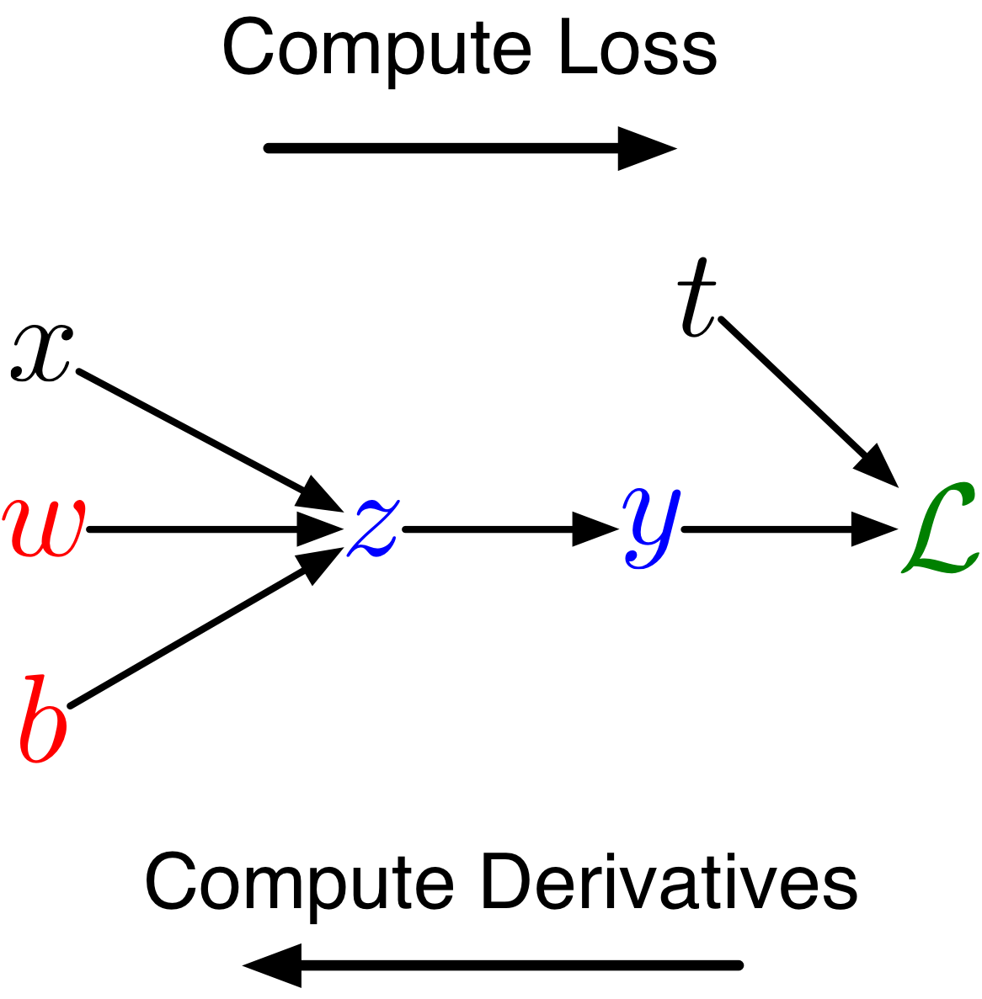{height="400"}</center>
:::

## Chain Rule (Error Signal) Notation

::: incremental
-   Use $\overline{y}$ to denote the derivative $\frac{d \mathcal{L}}{d y}$
    -   sometimes called the **error signal**
-   This notation emphasizes that the error signals are just values our program is computing (rather than a mathematical operation).
-   This is notation introduced by Prof. Roger Grosse, and not standard notation
:::

## Chain Rule (Error Signal) Notation II

::: {.column width="50%"}
Computing the loss:

\begin{align*}
z &= wx + b \\
y &= \sigma(z) \\
\mathcal{L} &= \frac{1}{2}(y - t)^2
\end{align*}
:::

:::: {.column width="50%"}
::: fragment
Computing the derivatives:

\begin{align*}
\overline{y} &= y - t \\
\overline{z} &= \overline{y} \sigma'(z) \\
\overline{w} &= \overline{z} \, x \\
\overline{b} &= \overline{z}
\end{align*}
:::
::::

## Multiclass Logistic Regression Computation Graph

In general, the computation graph *fans out*:

<center>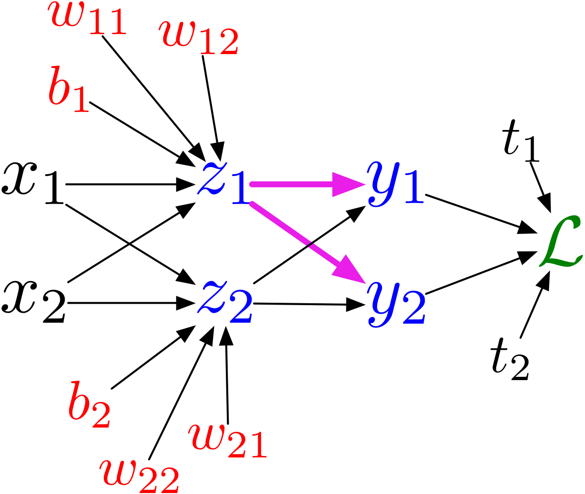{height="400"}</center>

## Multiclass Logistic Regression Computation Graph II

<!-- \begin{minipage}{0.45 \linewidth} -->

<!-- \includegraphics[width=\linewidth]{imgs/multiway_graph.png} -->

```{=html}
<!-- \end{minipage}
\begin{minipage}{0.45 \linewidth} -->
```

\begin{align*}
z_l &= \sum_j w_{lj} x_j + b_l \\
y_k &= \frac{e^{z_k}}{\sum_l e^{z_l}} \\
\mathcal{L} &= -\sum_k t_k \log{y_k}
\end{align*} <!-- \end{minipage} -->

There are multiple paths for which a weight like $w_{11}$ affects the loss $\mathcal{L}$.

## Multivariate Chain Rule

Suppose we have a function $f(x, y)$ and functions $x(t)$ and $y(t)$ (all the variables here are scalar-valued). Then

$$\frac{d}{dt}f(x(t), y(t)) = \frac{\partial f}{\partial x}\frac{dx}{dt} +  \frac{\partial f}{\partial y}\frac{dy}{dt}$$

<center>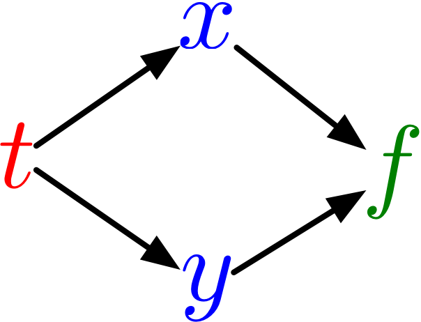{height="250"}</center>

## Multivariate Chain Rule Example

If $f(x, y) = y + e^{xy}$, $x(t) = \cos t$ and $y(t) = t^2$...

\begin{align*}
\frac{d}{dt}f(x(t), y(t)) &= \frac{\partial f}{\partial x}\frac{dx}{dt} +  \frac{\partial f}{\partial y}\frac{dy}{dt} \\
&= \left( y e^{xy} \right) \cdot \left( -\sin (t) \right) + \left( 1 + xe^{xy} \right) \cdot 2t
\end{align*}

## Multivariate Chain Rule Notation

<center>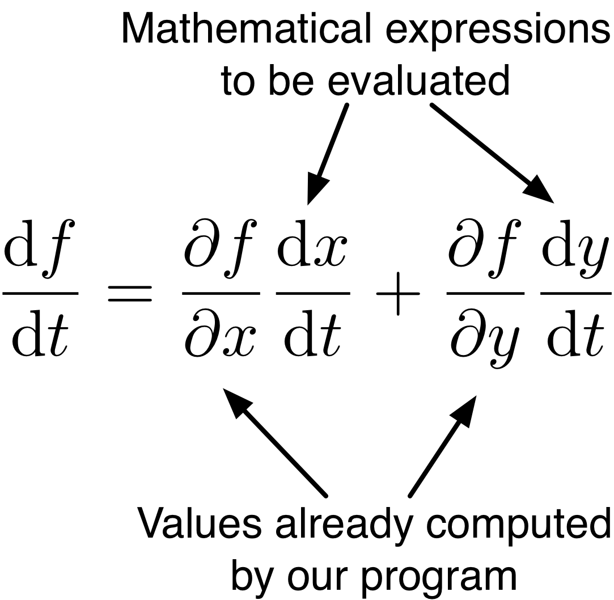{height="250"} 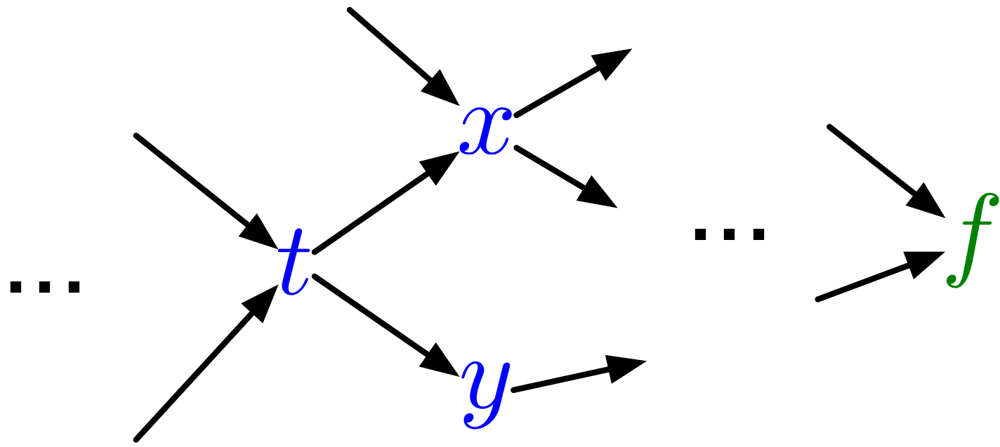{height="250"}</center>

In our notation

$$\overline{t} = \overline{x} \frac{dx}{dt} +  \overline{y} \frac{dy}{dt}$$

## The Backpropagation Algorithm

-   Backpropagation is an *algorithm* to compute gradients efficiency
    -   Forward Pass: Compute predictions (and save intermediate values)
    -   Backwards Pass: Compute gradients
-   The idea behind backpropagation is very similar to *dynamic programming*
    -   Use chain rule, and be careful about the order in which we compute the derivatives

## Backpropagation Example

<center>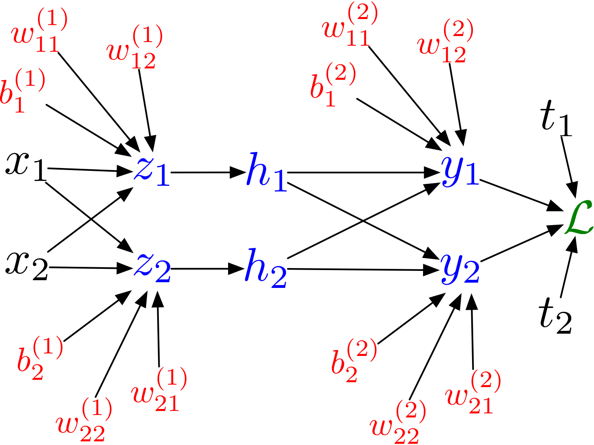{height="450"}</center>

<!-- \includegraphics[width=0.9 \linewidth]{imgs/mlp_graph.png} -->

## Backpropagation for a MLP

<!-- \begin{minipage}{0.45 \linewidth} -->

<!-- \includegraphics[width=0.9 \linewidth]{imgs/mlp_graph.png} -->

**Forward pass:** \vspace{-1em} \begin{align*}
z_i &= \sum_j w_{ij}^{(1)} x_j + b_i^{(1)} \\
h_i &= \sigma(z_i) \\
y_k &= \sum_i w_{ki}^{(2)} h_i + b_k^{(2)} \\
\mathcal{L} &= \frac{1}{2}\sum_k (y_k - t_k)^2
\end{align*} <!-- \end{minipage} -->

## Backpropagation for a MLP II

**Backward pass:**

::: {.column width="50%"}
\vspace{-1em}

\begin{align*}
\overline{\mathcal{L}} &= 1 \\
\overline{y_k}  &= \overline{\mathcal{L}}(y_k - t_k) \\
\overline{w_{ki}^{(2)}}  &= \overline{y_k}h_i \\
\overline{b_{k}^{(2)}}  &= \overline{y_k}
\end{align*}
:::

:::: {.column width="50%"}
::: fragment
\vspace{-1em}

\begin{align*}
\overline{h_i}  &= \sum_k \overline{y_k} w_{ki}^{(2)} \\
\overline{z_i} &= \overline{h_i} \sigma'(z_i) \\
\overline{w_{ij}^{(1)}} &= \overline{z_i} x_j \\
\overline{b_{i}^{(1)}} &= \overline{z_i}
\end{align*}
:::
::::

## Backpropagation for a MLP

::: {.column width="50%"}
<!-- \begin{minipage}{0.45 \linewidth} -->

<!-- \includegraphics[width=0.9 \linewidth]{imgs/mlp_graph.png} -->

**Forward pass:** \vspace{-1em} \begin{align*}
{\bf z} &=  W^{(1)}{\bf x} + {\bf b}^{(1)} \\
{\bf h} &= \sigma({\bf z}) \\
{\bf y} &=  W^{(2)}{\bf h} + {\bf b}^{(2)} \\
\mathcal{L} &= \frac{1}{2} || {\bf y} - {\bf t}||^2
\end{align*} <!-- \end{minipage} -->
:::

::: {.column width="50%"}
<center>{height="250"}</center>
:::

## Backpropagation for a MLP

::: {.column width="50%"}
**Backward pass:** \vspace{-1em} \begin{align*}
\overline{\mathcal{L}} &= 1 \\
\overline{{\bf y}}  &= \overline{\mathcal{L}}({\bf y} - {\bf t}) \\
\overline{W^{(2)}}  &= \overline{{\bf y}}{\bf h}^\top \\
\overline{{\bf b^{(2)}}}  &= \overline{{\bf y}} \\
& \ldots
\end{align*}
:::

::: {.column width="50%"}
<center>{height="250"}</center>
:::

## Backpropagation for a MLP

::: {.column width="50%"}
**Backward pass:** \vspace{-1em} \begin{align*}
& \ldots \\
\overline{{\bf h}}  &= {W^{(2)}}^\top\overline{y} \\
\overline{{\bf z}} &= \overline{{\bf h}} \circ \sigma'({\bf z}) \\
\overline{W^{(1)}} &= \overline{{\bf z}} {\bf x}^\top \\
\overline{{\bf b}^{(1)}} &= \overline{{\bf z}}
\end{align*}
:::

::: {.column width="50%"}
<center>{height="250"}</center>
:::

## Implementing Backpropagation I

<center>{height="500"}</center>

## Implementing Backpropagation II

**Forward pass:** Each node...

-   receives messages (inputs) from its parents
-   uses these messages to compute its own values

::: fragment
**Backward pass:** Each node...

-   receives messages (error signals) from its children
-   uses these messages to compute its own error signal
-   passes message to its parents
:::

::: fragment
This algorithm provides **modularity**!
:::

````{=html}
<!--
## In PyTorch (from tutorial 4)

```python
model = nn.Linear(784, 10) # classification model
criterion = nn.CrossEntropyLoss()
optimizer = optim.SGD(model.parameters(), lr=0.005)

zs = model(xs)           # forward pass
loss = criterion(zs, ts) # compute the loss (cost)
loss.backward()          # backwards pass (error signals)
optimizer.step()         # update the parameters
optimizer.zero_grad()    # a clean up step
```
-->
````

## Backpropagation in Vectorized Form

<center>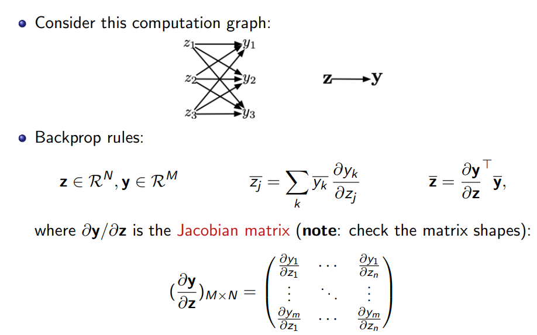{height="600"}</center>

## Backpropagation in practice

::: incrfemental
-   Backprop is used to train the overwhelming majority of neural nets today.
    -   Even optimization algorithms much fancier than gradient descent (e.g.\~second-order methods) use backprop to compute the gradients.
:::

## Backpropagation in practice II

::: incremental
-   Despite its practical success, backprop is believed to be neurally (biologically) implausible.
    -   No evidence for biological signals analogous to error derivatives.
    -   All the biologically plausible alternatives we know about learn much more slowly (on computers).
:::

<!-- Wrap-Up -->

# Wrap Up

## Summary

::: incremental
-   Artificial neurons draw inspiration from nerve cells / neurons in the brain
-   On its own, the expresiveness of a single neuron is limited
-   Stacking neurons and nonlinear activation functions allows for learning more complex functions
-   Backpropagation can be used for this learning task
:::

## What to do this week?

::: incremental
-   You can already complete Assignment 1
    -   Start early so you can get help early!
-   Attend tutorials this week!
-   Complete the readings for this week.
-   Preview next week's materials
:::