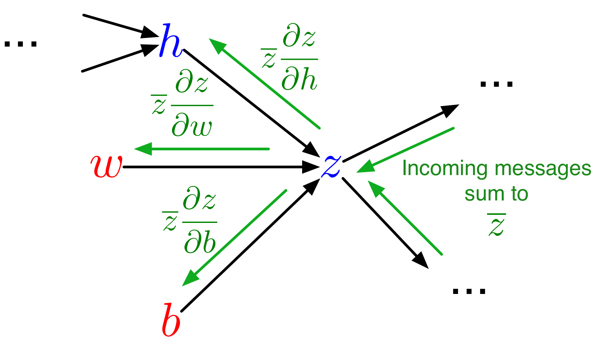
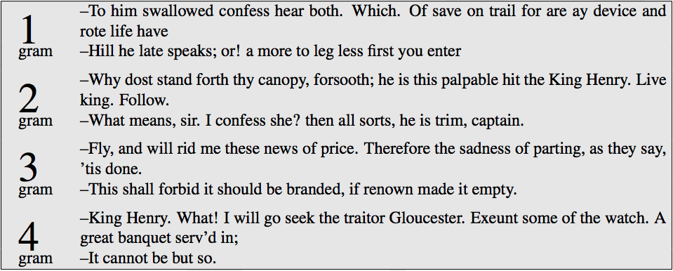
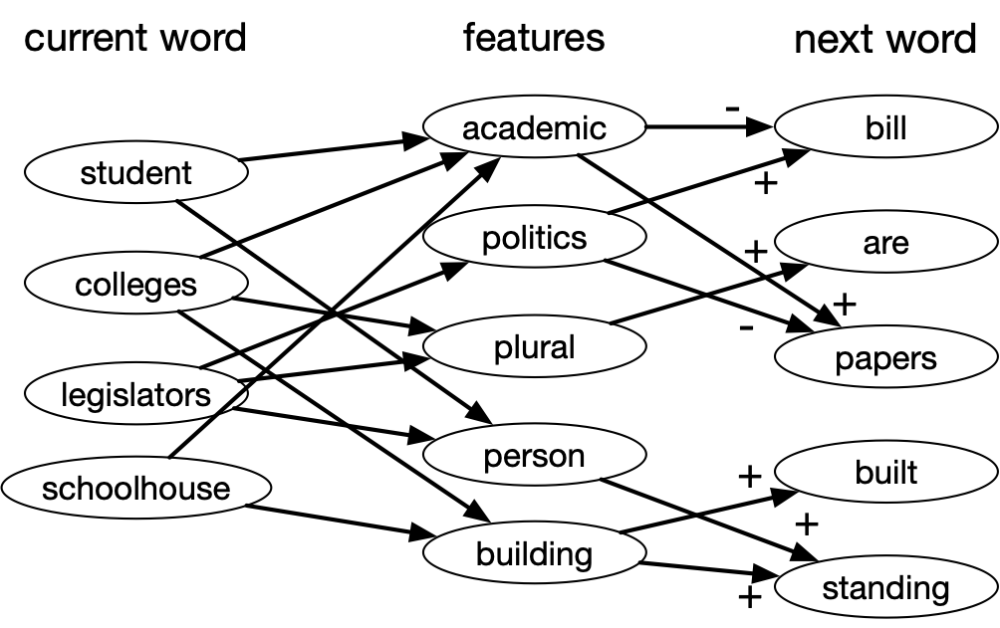
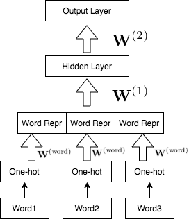
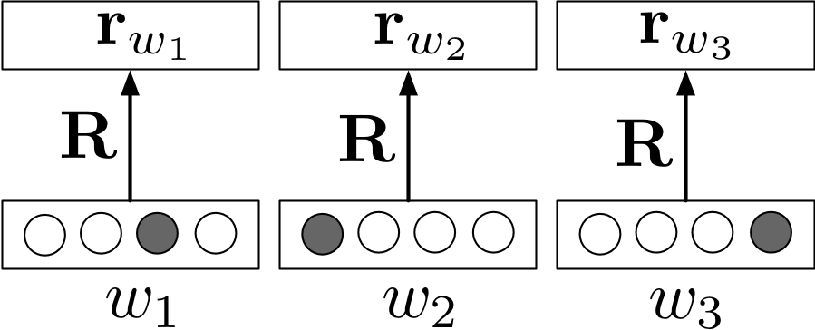
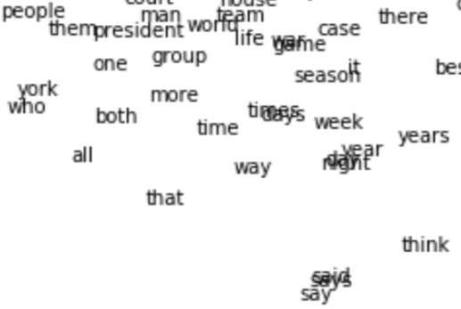
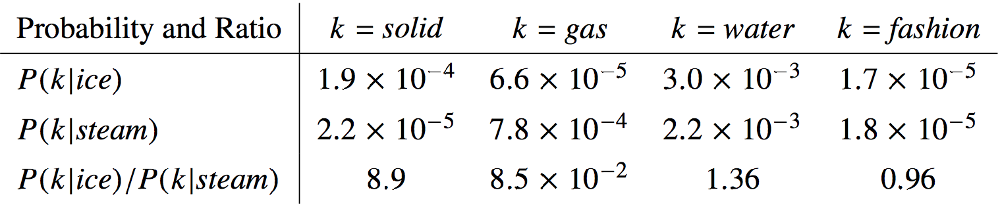

## Lecture Plan

Last week:

-   From linear models to **multilayer perceptrons**

. . .

-   Backpropagation to compute gradients efficiently

## Lecture Plan II

This week:

-   First hour:
    -   automatic differentiation

. . .

-   Second hour:
    -   distributed representations
    -   GloVe embeddings

Both will be helpful for Assignment 1

<!-- 01ad -->

# Automatic Differentiation (Autodiff)

## Derivatives in Machine Learning

The machine learning approach requires the minimization of some cost/loss function, which is often done using some variation of **gradient descent**. $$\theta \leftarrow \theta - \alpha\frac{\partial \mathcal{E}}{\partial \theta}$$

## Derivatives in Machine Learning

$$\theta \leftarrow \theta - \alpha\frac{\partial \mathcal{E}}{\partial \theta}$$

Approaches to computing derivatives:

1.  Manually working out derivatives

. . .

2.  Numeric differentiation (using finite difference approximations)

. . .

3.  Symbolic differentiation (using expression manipulation)

## Derivatives in Machine Learning

$$\theta \leftarrow \theta - \alpha\frac{\partial \mathcal{E}}{\partial \theta}$$

Approaches to computing derivatives:

2.  Numeric differentiation (using finite difference approximations)

3.  Symbolic differentiation (using expression manipulation)

. . .

4.  **Automatic differentiation or algorithmic differentiation**

## Terminology

-   **Automatic differentiation**: convert the program into a sequence of primitive operations, which have specified routines for computing derivatives.Then, we can compute gradients in a mechanical way via the chain rule.
    -   Also used in computational fluid dynamics, atmospheric sciences, etc.

. . .

-   **Backpropagation**: special case of autodiff where the *program* is a neural network forward pass.

. . .

-   Autograd, JAX, PyTorch, TensorFlow are examples of particular implementations of autodiff, i.e. different libraries

## Backpropagation

Steps:

-   Convert the computation into a sequence of **primitive operations**
    -   Primitive operations have easily computed derivatives

. . .

-   Build the computation graph

. . .

-   Perform a forward pass: compute the values of each node

. . .

-   Perform the backward pass: compute the derivative of the loss with respect to each node

## Autodiff, more generally

We will discuss how an automatic differentiation library could be implemented

-   build the computation graph

. . .

-   **vector-Jacobian products (VJP)** for primitive ops

. . .

-   perform the backward pass

You will probably never have to implement autodiff yourself but it is good to know its inner workings!

## Autodiff, more generally

**Key Insight**: For any new deep learning model that we can come up with, if each step of our computation is differentiable, then we can train that model using gradient descent.

```{=html}
<!--
## Converting to Primitive Operations

**Original Program**
$$y = \sigma(wx + b)$$

**Primitive Operations**
\begin{align*}
t_1 &= wx \\
z &= t_1 + b \\
t_3 &= -z \\
t_4 &= \text{exp}(t_3)\\
\dots
\end{align*}
-->
```

## Scalar Example

``` python
def f(x):
    h = 1.5
    for i in range(3):
        h = x * 1.5 + h
    return x * h
```

**Notation**: $x$ is the input, $y=f(x)$ is the output, we want to compute $\frac{dy}{dx}$

## Scalar Example

**Automatic Differentiation Steps**:

-   convert the computation into a sequence of **primitive operations**
    -   we need to be able to compute derivatives for these primitive operations

. . .

-   build the computation graph

. . .

-   perform forward pass

. . .

-   perform backward pass

## Scalar Example: Primitive Ops

``` python
def f(x):
    h = 1.5
    for i in range(3):
        h = x * 1.5 + h
    return x * h
```

Operations:

. . .

``` python
h0 = 1.5
z1 = x * 1.5
h1 = z1 + h0
z2 = x * 1.5
h2 = z2 + h1
z3 = x * 1.5
h3 = z3 + h2
y  = x * h3
```

## Scalar Example: Computation Graph

Exercise: Draw the computation graph:

``` python
h0 = 1.5
z1 = x * 1.5
h1 = z1 + h0
z2 = x * 1.5
h2 = z2 + h1
z3 = x * 1.5
h3 = z3 + h2
y  = x * h3
```

Based on the computation graph, we can compute $\frac{dy}{dx}$ via a forward and a backward pass.

## Vector Inputs and Outputs

More generally, input/output to a computation may be **vectors**

``` python
def f(a, w): # a and w are both vectors with size 10
    h = a
    for i in range(3):
        h = np.dot(w, h) + h
    z = w * h # element wise multiplication
    return z
```

So we have $\bf{y} = f(\bf{x})$ (in this example, $\bf{x}$ consists of values in both `a` and `w`)

**Q**: In our running example, what are the dimensions of ${\bf x}$ and ${\bf y}$?

\vspace{0.25in}

## The Jacobian Matrix

We wish to compute the gradients $\frac{\partial y_k}{\partial x_i}$ for each $k$ and $i$, at some $\bf{x}$.

In other words, we would like the to work with the **Jacobian matrix**

\begin{align*}
J_f({\bf x}) &= \begin{bmatrix}
\frac{\partial y_1}{\partial x_1}({\bf x}) & \ldots & \frac{\partial y_1}{\partial x_n}({\bf x}) \\
\vdots & \ddots & \vdots \\
\frac{\partial y_m}{\partial x_1}({\bf x}) & \ldots & \frac{\partial y_m}{\partial x_n}({\bf x})
\end{bmatrix}
\end{align*}

## The Jacobian Matrix

\begin{align*}
J_f({\bf x}) &= \begin{bmatrix}
\frac{\partial y_1}{\partial x_1}({\bf x}) & \ldots & \frac{\partial y_1}{\partial x_n}({\bf x}) \\
\vdots & \ddots & \vdots \\
\frac{\partial y_m}{\partial x_1}({\bf x}) & \ldots & \frac{\partial y_m}{\partial x_n}({\bf x})
\end{bmatrix}
\end{align*}

Note that we usually want to avoid explicitly constructing the entries of this Jacobian one by one.

Why? Computing all the partial derivatives one by one is expensive, even with backprop.

## Decomposing Into Primitive Operations

Suppose $f = f_2 \circ f_1$, so we have the computations ${\bf y} = f_2 \circ f_1(\bf{x})$, or in other words: \begin{align*}
{\bf z} &= f_1(\bf{x}) \\
{\bf y} &= f_2(\bf{z})
\end{align*}

If $f_1$ and $f_2$ are primitive operations with simple Jacobians, we can apply the **Jacobian chain rule**:

$$J_{f_2 \circ f_1}({\bf x}) = J_{f_2}({\bf z})J_{f_1}({\bf x})$$

## Autodiff, more generally

This video explains the different ways to automatically compute derivatives:

<https://www.youtube.com/watch?v=wG_nF1awSSY>

-   manual

. . .

-   finite differences

. . .

-   symbolic differentiation

. . .

-   autodiff (forward-mode and reverse-mode differentiation)
    -   how to avoid computing Jacobians one by one

## Avoiding Jacobian Products

In practice, computing entries of Jacobians one by one is expensive and we try to avoid it:

-   If the dimension of ${\bf y} = f({\bf x})$ is small, use **reverse-mode automatic differentiation**

. . .

-   If the dimension of ${\bf x}$ is small, use **forward-mode automatic differentiation**

**Q:** Which of these two cases apply to deep learning most often?

\vspace{0.25in}

## Reverse-Mode Automatic Differentiation

Suppose ${\bf y}$ is a scalar, and represents the loss $\mathcal{L}$ that we wish to minimize. \begin{align*}
{\bf z} &= f_1(\bf{x}) \\
\mathcal{L} &= f_2(\bf{z}) = {\bf y} \in \mathbb{R}
\end{align*}

Then we have:

-   $\overline{z} = \frac{\partial \mathcal{L}}{\partial z} = J_{f_2}(\bf{z})^\top$

. . .

-   Since $\overline{x_j} = \sum_i \overline{z_i} \frac{\partial z_i}{\partial x_j}$

## Reverse-Mode Automatic Differentiation

-   ... we have $\overline{\bf x}^\top = \overline{\bf z}^\top J_{f_1}(\bf{x})$

. . .

-   ... which is a **vector-Jacobian product**

. . .

**Summary:** For each primitive operation, we don't need to be able to compute entire Jacobian matrix. **We need to be able to compute the vector-Jacobian product.**

## Vector Jacobian Products

For each primitive operation, we must specify the VJPs for each of its arguments

The VJP function should takes in the output gradient (i.e. ${\bar y}$), the answer ($y$), and the arguments ($x$), and returns the input gradient (${\bar x}$). Here are some examples from <https://github.com/mattjj/autodidact/blob/master/autograd/numpy/numpy_vjps.py>

\footnotesize

``` python
defvjp(anp.negative, lambda g, ans, x: -g)
defvjp(anp.exp,    lambda g, ans, x: ans * g)
defvjp(anp.log,    lambda g, ans, x: g / x)

defvjp(anp.add,         lambda g, ans, x, y : unbroadcast(x, g),
                        lambda g, ans, x, y : unbroadcast(y, g))
defvjp(anp.multiply,    lambda g, ans, x, y : unbroadcast(x, y * g),
                        lambda g, ans, x, y : unbroadcast(y, x * g))
defvjp(anp.subtract,    lambda g, ans, x, y : unbroadcast(x, g),
                        lambda g, ans, x, y : unbroadcast(y, -g))
```

## Backprop as Message Passing

{width="50%"}

-   Each node in the computation graph receives **messages** from its children, which it aggregates to compute its error signal

. . .

-   **Messages** then get passed to its parents

. . .

-   Each message is a VJP

## Backprop as Message Passing

This design provides **modularity!** Each node needs to know how to compute its outgoing messages, i.e. the VJPs corresponding to each of its parents (arguments to the function).

## Differentiable Programming

Recall the **key insight** from earlier: For any new deep learning model that we can come up with, if each step of our computation is differentiable, then we can train that model using gradient descent.

Example: Learning to learning by gradient descent by gradient descent <https://arxiv.org/pdf/1606.04474.pdf>

With AD, any *program* that has differentiable components can be optimized via gradient descent

<!-- 02lang -->

# Distributed Representations

## Feature Mapping

-   Learning good *representations* is an important goal in machine learning
    -   These representations are also called *feature mappings*, or *embeddings*
    -   The representations we learn are often **reusable** for other tasks
    -   Finding good representations is an **unsupervised learning** problem!

## Feature Mapping

-   Assignment 1:
    -   Learn vector representations of *words*: **unsupervised learning**
    -   Sometimes also referred to as **self-supervised learning**

## Language Modeling

A language model...

-   Models the probability distribution of natural language text.

. . .

-   Determine the **probability** $p({\bf s})$ that a sequence of words (or a *sentence*) ${\bf s}$ occurs in text.

A language model gives us a way to compute $p({\bf s})$

## Why Language Models $p({\bf s})$?

-   Determine authorship:
    -   build a language model $p({\bf s})$ of Shakespeare
    -   determine whether a script is written by Shakespeare

. . .

-   Generate a machine learning paper (given a *corpus* of machine learning papers)

<!-- $_$ -->

## Why language models $p({\bf s})$?

-   Use as a *prior* for a speech recognition system $p({\bf s} | {\bf a})$, where ${\bf a}$ represents the observed speech signal.
    -   An **observation model**, or likelihood, represented as $p({\bf a} | {\bf s})$, which tells us how likely the sentence ${\bf s}$ is to lead to the acoustic signal ${\bf a}$.
    -   A **prior**, represented as $p({\bf s})$ which tells us how likely a given sentence ${\bf s}$ is. For example, "recognize speech" is more likely than "wreck a nice beach"

<!-- $_$ -->

## Why language models $p({\bf s})$?

-   Use as a *prior* for a speech recognition system $p({\bf s} | {\bf a})$, where ${\bf a}$ represents the observed speech signal.
    -   Use Bayes rule to infer a *posterior distribution* over sentences given the speech signal: $$p({\bf s} | {\bf a}) = \frac{p({\bf s}) p({\bf a} | {\bf s})}{\displaystyle \sum_{{\bf s^\prime}} p({\bf s^\prime})p({\bf a} | {\bf s^\prime})}$$

<!-- $_$ -->

## Training a Language Model

Assume we have a corpus of sentences ${\bf s}^{(1)}, \ldots, {\bf s}^{(N)}$

The **maximum likelihood** criterion says we want our model to maximize the probability that our model assigns to the observed sentences. We assume the sentences are independent, so that their probabilities multiply.

## Training a Language Model

In maximum likelihood training, we want to maximize $$\prod_{i=1}^N p\left({\bf s}^{(i)}\right)$$

<!-- $_$ -->

Or minimize: $$-\sum_{i=1}^N \log p\left({\bf s}^{(i)}\right)$$

Since $p({\bf s})$ is usually small, $-\log p({\bf s})$ is reasonably sized, and positive.

## Probability of a sentence

A sentence is a sequence of words $w_1, w_2, \ldots, w_T$, so \begin{align*}
p({\bf s}) &= p(w_1, w_2, \ldots, w_T) \\
           &= p(w_1)p(w_2 | w_1) \ldots p(w_T | w_1, w_2, \ldots, w_{T-1})
\end{align*} We can make a simplifying **Markov assumption** that the distribution over the next word depends on the preceding few words.

## Probability of a sentence

In assignment 1, we use a context length of 3 and model: \begin{align*}
p(w_t | w_1, w_2, \ldots, w_{t-1}) = p(w_t | w_{t-3}, w_{t-2}, w_{t-1})
\end{align*}

This is a self-supervised learning problem!

## N-Gram Language Model

A simple way of modeling $p(w_t | w_{t-2}, w_{t-1})$ is by constructing a table of conditional probabilities:

\begin{tabular}{r|rrrr}
  & cat & and & city & $\cdots$ \\
  \hline
  the fat & 0.21 & 0.003 & 0.01 & \\
  four score & 0.0001 & 0.55 & 0.0001 & $\cdots$ \\
  New York & 0.002 & 0.0001 & 0.48 & \\
  \vdots & & $\vdots$ & &
\end{tabular}

Where the probabilities come from the **empirical distribution**: $$p(w_3 = {\rm cat} | w_1 = {\rm the}, w_2 = {\rm fat}) = \frac{{\rm count}({\rm the\ fat\ cat})}{{\rm count}({\rm the\ fat})}$$

The phrases we're counting are called *n-grams* (where n is the length), so this is an **n-gram language model**. (Note: the above example is considered a 3-gram model, not a 2-gram model!)

## Example: Shakespeare N-Gram Language Model

<center>



</center>

## Problems with N-Gram Language Model

-   The number of entries in the conditional probability table is exponential in the context length.

. . .

-   **Data sparsity**: most n-grams never appear in the corpus, even if they are possible.

## Problems with N-Gram Language Model

Ways to deal with data sparsity:

-   Use a short context (but this means the model is less powerful),

. . .

-   Smooth the probabilities, e.g. by adding imaginary counts,

. . .

-   Make predictions using an ensemble of n-gram models with different $n$s.

## Local vs Distributed Representations

Conditional probability tables are a kind of **local representation**: all the information about a particular word is stored in one place: a column of the table.

But different words are related, so we ought to be able to share information between them.

## Local vs Distributed Representations

<center>{height="500"}</center>

## Distributed Representations: Word Attributes

\begin{tabular}{c|ccccc}
& {\bf academic} & {\bf politics} & {\bf plural} & {\bf person} & {\bf building} \\
\hline
{\bf students} & 1 & 0 & 1 & 1 & 0 \\
{\bf colleges} & 1 & 0 & 1 & 0 & 1 \\
{\bf legislators} & 0 & 1 & 1 & 1 & 0 \\
{\bf schoolhouse} & 1 & 0 & 0 & 0 & 1
\end{tabular}

Idea:

1.  use the **word attributes** to predict the next word.
2.  learn the **word attributes** using an MLP with backpropagation

## Sharing Information

Distributed representations allows us to share information between related words. E.g., suppose we've seen the sentence

> The cat got squashed in the garden on Friday.

This should help us predict the words in the sentence

> The dog got flattened in the yard on (???)

An n-gram model can't generalize this way, but a distributed representation might let us do so.

## Neural Language Model

<center>{height="450"}</center>

## Word Representations

Since we are using one-hot encodings for the words, the weight matrix of the word embedding layer acts like a lookup table.

<center>{height="350"}</center>

## Word Representations

Terminology:

-   "Embedding" emphasizes that it's a location in a high-dimensional space; words that are closer together are more semantically similar.
-   "Feature vector" emphasizes that it's a vector that can be used for making predictions, just like other feature mappings we've looked at (e.g. polynomials).

## What do Word Embeddings look like?

It's hard to visualize an $n$-dimensional space, but there are algorithms for mapping the embeddings to two dimensions.

::::: columns
::: {.column width="50%"}
<center></center>
:::

::: {.column width="50%"}
In assignment 1, we use algorithm called tSNE, which tries to make distances in the 2-D embedding match the original high-dimensional distances as closely as possible.
:::
:::::

## A note about these visualizations

-   Thinking about high-dimensional embeddings
    -   Most vectors are nearly orthogonal (i.e. dot product is close to 0)
    -   Most points are far away from each other
    -   "In a 30-dimensional grocery store, anchovies can be next to fish and next to pizza toppings" - Geoff Hinton

## A note about these visualizations

-   The 2D embeddings might be fairly misleading, since they can't preserve the distance relationship from a higher-dimensional embedding. (Unrelated words might be close together in 2D but far apart in 3D)

# GloVe Embeddings

## GloVe

-   Fitting language models is really hard
    -   It's really important to make good predictions about relative probabilities of rare words
    -   Computing the predictive distribution requires a large softmax

## GloVe

-   Maybe this is overkill if all you want is word representations

. . .

-   Global Vector (GloVe) embeddings are a simpler and faster approach based on a matrix factorization similar to principal component analysis (PCA)

Idea: First fit the distributed word representations using GloVe, then plug these embeddings into a neural net that does some other task (e.g. translation)

## The Distributional Hypothesis

**Distributional Hypothesis**: Words with similar distributions have similar meaning

Consider a **co-occurrence matrix** $X$, which counts the number of times the words appear nearby (say, less than 5 positions apart)

This is a $V \times V$ matrix, where $V$ is the vocabulary size.

## Co-occurrence Matrix

Sentence:

> The cat got squashed in the garden on Friday. The dog got flattened in the yard on Thursday.

## Co-occurrence Matrix

Part of the co-occurrence matrix:

|          | the | cat | dog | got | squashed |     |     |
|----------|-----|-----|-----|-----|----------|-----|-----|
| the      | 0   | 1   | 0   | 1   | 0        |     |     |
| cat      | 1   | 0   | 0   | 1   | 1        |     |     |
| dog      | 1   | 0   | 0   | 1   | 0        |     |     |
| got      | 2   | 1   | 1   | 0   | 1        |     |     |
| squashed | 0   | 1   | 1   | 1   | 0        |     |     |

## GloVe Embedding Training

**Key insight**: The co-occurrence matrix of words contain information about the semantic information (meaning) of words

{height="50%"}

In particular, the *ratio* of co-occurrences encodes semantic information!

## Intuition Pump

Suppose we fit a rank-K approximation

$${\bf X} \approx {\bf R}{\bf \hat{R}}^\top$$

Where ${\bf R}$ and ${\bf \hat{R}}$ are $V \times K$ matrices

-   Each row ${\bf r}_i$ of ${\bf R}$ is the K-dim representation of a word.
-   Each entry of ${\bf X}$ is approximated as $x_{ij} \approx {\bf r}_i^T {\bf \hat{r}}_j$ <!-- - Hence, more similar words are more likely to co-occur (Lisa: I think this interpretation is wrong)-->
-   Minimizing the squared Frobenius norm of the $\left|\left|{\bf X} - {\bf R}{\bf \hat{R}}^\top\right|\right|_F^2$ is basically PCA

. . .

-   There are some other tricks to make the optimization work

```{=html}
<!--
## GloVe -- (do we keep?)

**Problem**: ${\bf X}$ is extremely large, so fitting the factorization using least squares is infeasible

. . .

- **Solution**: Reweight the entries so that only nonzero counts matter

. . .

**Problem**: word counts are heavy-tail distributed (some words *very* frequently used, lots of infrequent words). The most common words will dominate the cost function.

. . .

- **Solution**: Approximate $\log x_{ij}$ instead of $x_{ij}$


## GloVe Cost function -- (do we keep?)

$$\mathcal{J}({\bf R}) = \sum_{i,j} f(x_{ij})({\bf r}_i^\top {\bf \hat{r}}_j + b_i + \hat{b}_j - \log x_{ij})^2$$

...where $f(x{ij}) = (\frac{x_{ij}}{100})^{\frac{3}{4}}$ if $x_{ij} < 100$ and 1 otherwise.

We only need to consider nonzero entries of ${\bf X}$!

Q: What are the tunable parameters in this model?
-->
```

## GloVe Embeddings

Pre-trained models are available for download:

<https://nlp.stanford.edu/projects/glove/>

Practitioners often use these embeddings to do other language modeling tasks.

## GloVe Embedding Demo

Demo on Google Colab

<https://colab.research.google.com/drive/1aNbE6HcawVF67RV0hWi4qK33Um7cKykr?usp=sharing>

## Key idea from the Demo

-   Distances are somewhat meaningful, and are based on **word co-occurrences**
    -   the words "black" and "white" will have similar embeddings because they co-occur with similar other words.
    -   "cat" and "dog" is more similar to each other than "cat" and "kitten" because the latter two words occur in *different contexts*!

## Key idea from the Demo

-   Word Analogies: Directions in the embedding space can be meaningful
    -   "king" - "man" + "woman" $\approx$ "queen"

. . .

-   Bias in Word Embeddings (and Neural Networks in General)
    -   neural networks pick up pattern in the data
    -   these patterns can be biased and discriminatory

## Bias and Fairness

Word embeddings are inherently biased because there is bias in the training data.

Neural networks learn patterns in the training data, so if the training data contains human biases, then so will the trained model! This effect was seen in:

-   [criminal sentencing](https://www.propublica.org/article/machine-bias-risk-assessments-in-criminal-sentencing)

. . .

-   [predictive policing](https://www.technologyreview.com/2020/07/17/1005396/predictive-policing-algorithms-racist-dismantled-machine-learning-bias-criminal-justice/)

. . .

-   [resume filtering](https://www.reuters.com/article/us-amazon-com-jobs-automation-insight-idUSKCN1MK08G)