# Lecture Overview

## Last Week

::: incremental
-   Automatic differentiation
-   Distributed representations
-   GloVe embeddings
:::

## This week

::: incremental
-   Computer Vision
-   Convolutional Layers
-   Downsampling
-   Training a ConvNet
-   Examples and Applications
:::

<!-- Commented out the GloVe section below as it is from a previous lecture. -->

<!-- 01vision -->

# Computer Vision

## Computer vision is hard

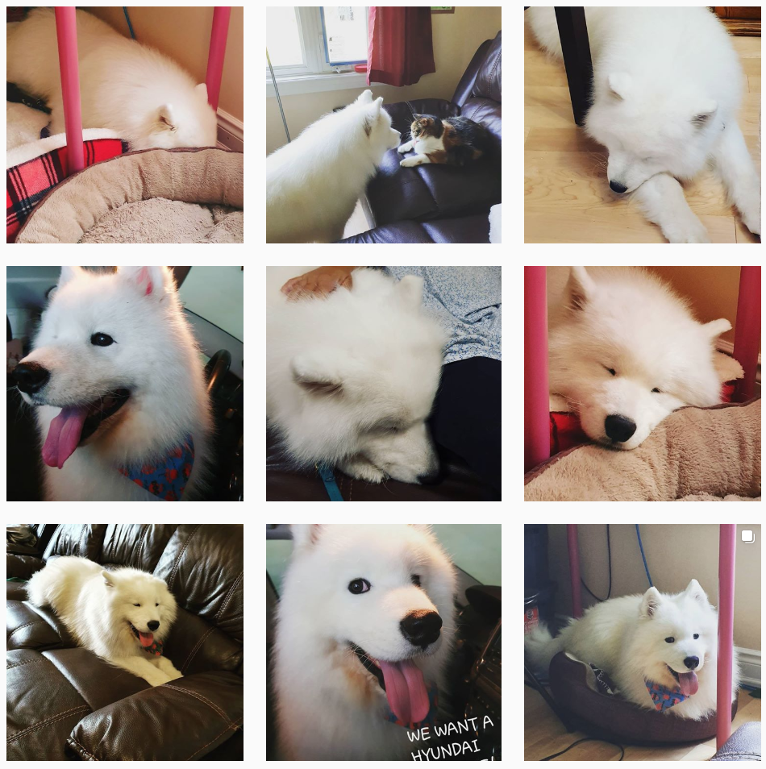{height="400"} 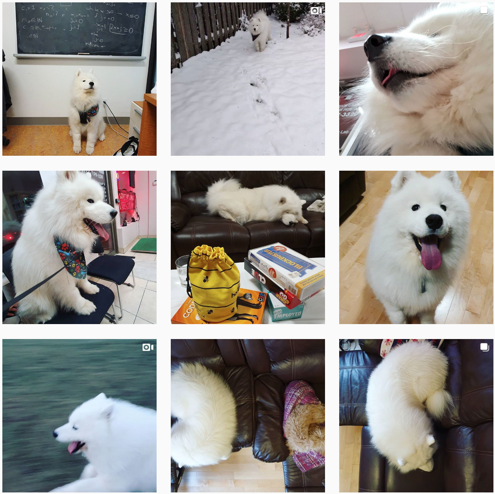{height="400"}

::: notes
-   In 2012, when Deep Learning had its most recent comeback it was because of computer vision.
-   Object change in pose, size, viewpoint, background, illumination
-   Some objects are hidden behind others: *occlusion*
:::

## Computer vision is really hard

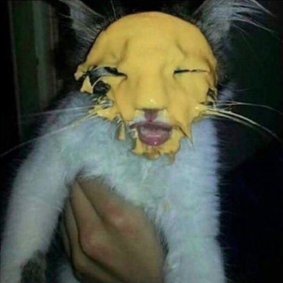{height="400"}

How can you "hard code" an algorithm that still recognizes that this is a cat?

## Working with Small Images

In the week 3 tutorial, we worked with small, MNIST images, which are $28 \times 28$ pixels, black and white.

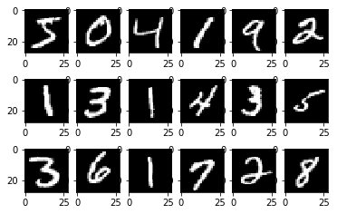{height="350"}

How do our models work?

## Notebook Demo - Logistic Regression Weights

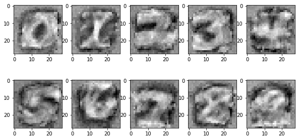{height="500"}

## Notebook Demo - MLP Weights (first layer)

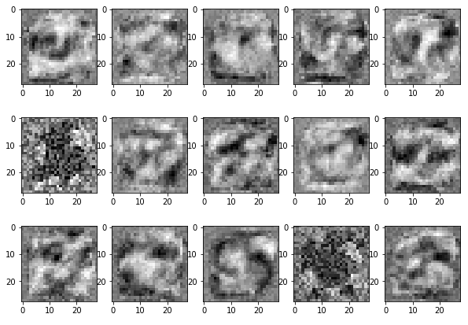{height="500"}

## Working with Large Images

-   Suppose you have an image that is 200 pixels x 200 pixels
-   There are 500 units in the first hidden layer

Q: How many **parameters** will there be in the first layer?

. . .

A: $200 \times 200 \times 500 + 500 =$ over 20 million!

## Working with Large Images II

Q: Why might using a fully connected layer be problematic?

::: incremental
-   computing predictions (forward pass) will take a long time
-   large number of weights requires a lot of training data to avoid overfitting
-   small shift in image can result in large change in prediction
:::

<!-- 02 Convolutional Layers -->

# Convolutional Layers

## Biological Influence

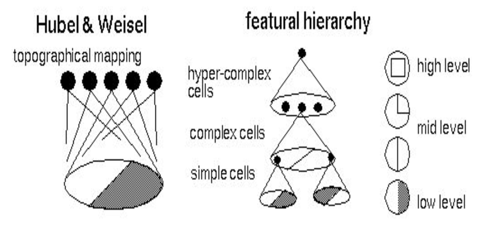{height="300"}

There is evidence that biological neurons in the visual cortex have *locally-connected* connections

See [Hubel and Wiesel Cat Experiment](https://www.youtube.com/watch?v=IOHayh06LJ4) (Note: there is an anesthetised cat in the video that some may find disturbing).

::: notes
-   Harvard neurophysiologists David H. Hubel / Torsten Wiesel
-   Inserted a microelectrode into primary visual cortex of a cat.
-   Projected patterns of light and dark on a screen in front of the cat
-   Found that some neurons fired rapidly when presented with lines at one angle, while others responded best to another angle.
-   More on this [here](https://historyofinformation.com/detail.php?entryid=4726)
:::

## Convolutional Neural Network

::: incremental
-   **Locally-connected layers**: compute *local* features based on small regions of the image
    -   Examples of *features*:
        -   a horizontal edge in an area
        -   a vertical edge in an area
        -   a blob (no edges) in the area
        -   a circular shape in the area
-   **Weight-sharing**: detect the *same* local features across the entire image
:::

## Locally Connected Layers

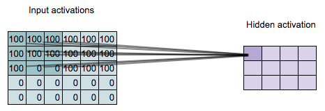{height="400"}

Each hidden unit connects to a small region of the input (in this case a $3 \times 3$ region)

## Locally Connected Layers

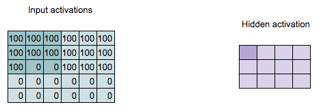{height="400"} (Remove lines for readability)

## Locally Connected Layers

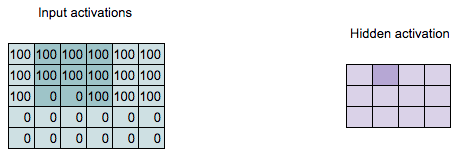{height="400"}

Hidden unit geometry has a 2D geometry consistent with the input.

## Locally Connected Layers

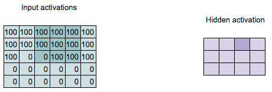{height="400"}

## Locally Connected Layers

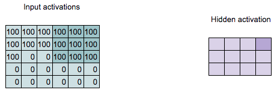{height="400"}

## Locally Connected Layers

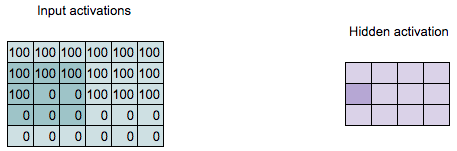{height="400"}

## Locally Connected Layers

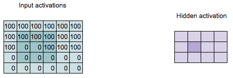{height="400"}

## Locally Connected Layers

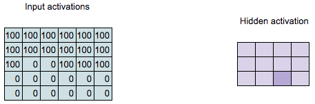{height="400"}

Q: Which region of the input is this hidden unit connected to?

## Locally Connected Layers

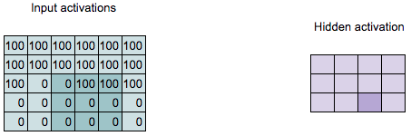{height="400"}

## Summary

Fully-connected layers:

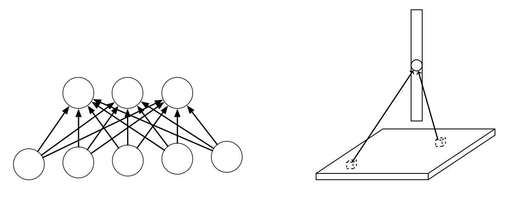{height="200"}

::: fragment
Locally connected layers:

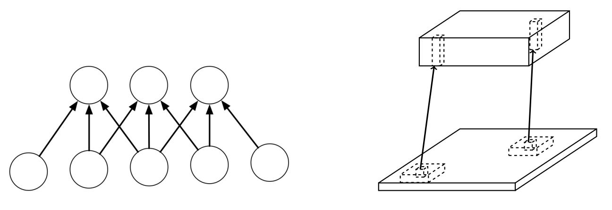{height="200"}

:::

## Weight Sharing

::: {.column width="50%"}

**Locally connected layers**

{height="200"}

:::

:::: {.column width="50%"}
::: fragment

**Convolutional layers**

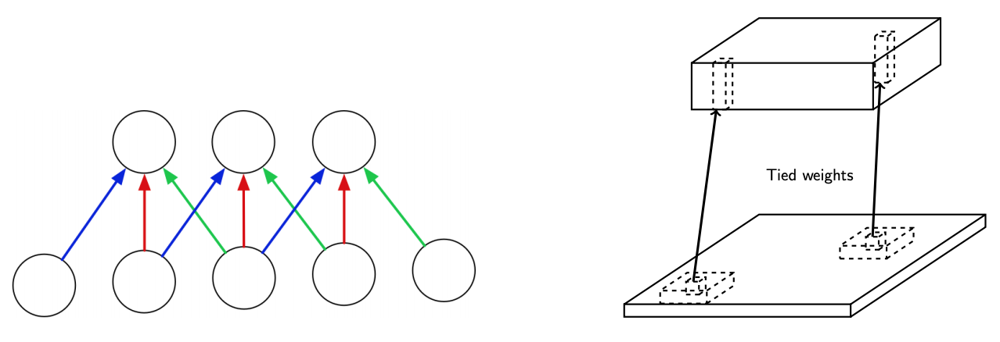{height="200"}

:::
::::

::: fragment
Use the *same weights* across each region (each colour represents the same weight)
:::

## Convolution Computation

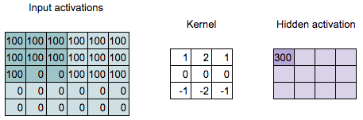{height="300"}

\begin{align*}
300 = & 100 \times 1 + 100 \times 2  + 100 \times 1 +  \\
      & 100 \times 0 + 100 \times 0 + 100 \times 0 + \\
      & 100 \times (-1) + 0 \times (-2) + 0 \times (-1)
\end{align*}

## Convolution Computation II

\begin{align*}
300 = & 100 \times 1 + 100 \times 2  + 100 \times 1 +  \\
      & 100 \times 0 + 100 \times 0 + 100 \times 0 + \\
      & 100 \times (-1) + 0 \times (-2) + 0 \times (-1)
\end{align*}

-   The **kernel** or **filter** (middle) contains the trainable weights
-   In our example, the **kernel size** is $3\times3$
-   The "**convolved features**" is another term for the output hidden activation

## Convolution Computation

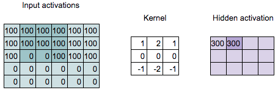{height="300"}

\begin{align*}
300 = &100 \times 1 + 100 \times 2  + 100 \times 1 +  \\
      &100 \times 0 + 100 \times 0 + 100 \times 0 + \\
      &0 \times (-1) + 0 \times (-2) + 100 \times (-1)
\end{align*}

## Convolution Computation

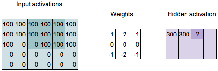{height="300"}

Q: What is the value of the highlighted hidden activation?

::: notes
-   Pause here and try to solve this for yourself.
:::

## Convolution Computation

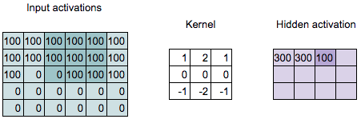{height="300"}

\begin{align*}
100 = &100 \times 1 + 100 \times 2  + 100 \times 1 +  \\
      &100 \times 0 + 100 \times 0 + 100 \times 0 + \\
      &0 \times (-1) + 100 \times (-2) + 100 \times (-1)
\end{align*}

## Convolution Computation

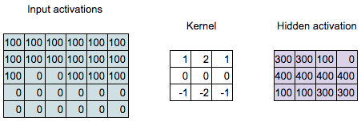{height="400"}

## Weight Sharing

Each neuron on the higher layer is detecting the same feature, but in different locations on the lower layer

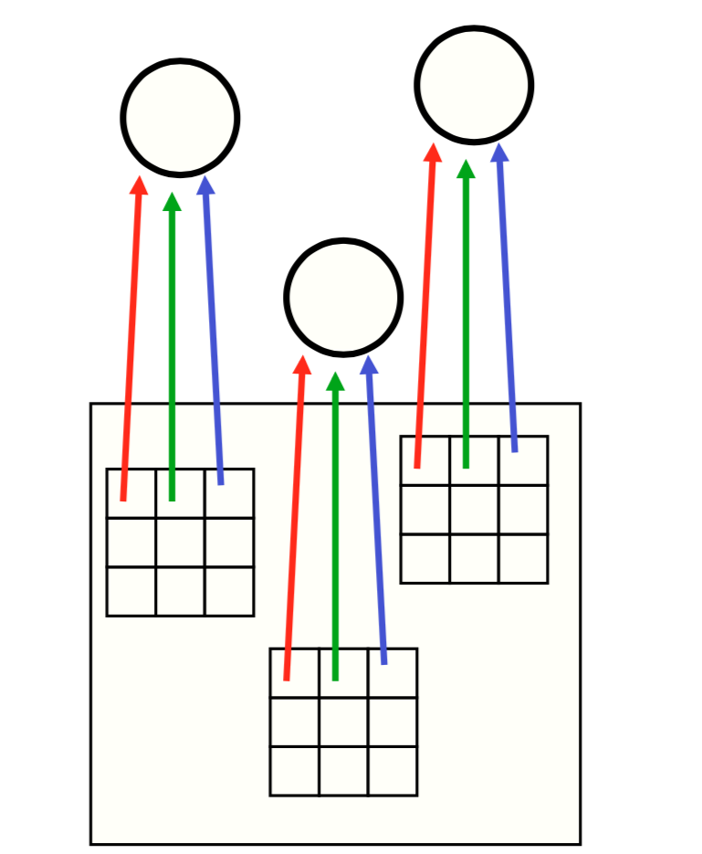{height="300"}

"Detecting" = output (activation) is high if feature is present "Feature" = something in a part of the image, like an edge or shape

## Sobel Filter - Weights to Detect Horizontal Edges

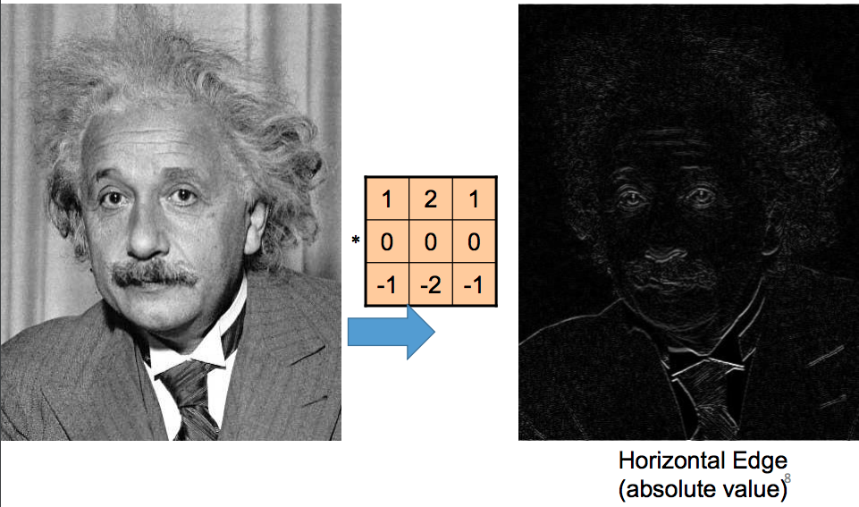{height="500"}

::: notes
-   The kernel we have seen in the previous example is commonly used to detect horizontal edges.
-   It is known as the *Sobel Filter* or *Sobel Operator*
:::

## Sobel Filter - Weights to Detect Vertical Edges

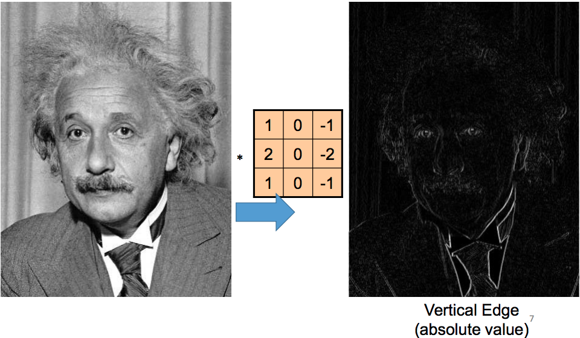

::: notes
-   There is another kernel for vertical edges.
:::

## Weights to Detect Blobs

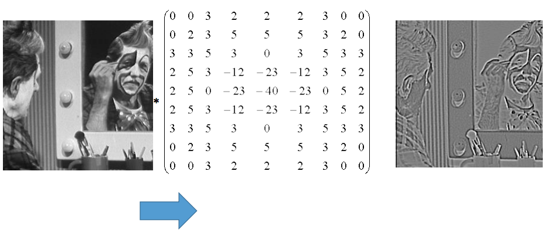

Q: What is the *kernel size* of this convolution?

::: notes
-   *Blob detection* is the task that aims at detecting regions of an image that differ from its surroundings.
-   This can involve e.g. brightness or color.
-   Here, the kernel is of size $9\times 9$
:::

## Example:

Greyscale input image: $7\times 7$

Convolution **kernel**: $3 \times 3$

Q: How many hidden units are in the output of this convolution?

. . .

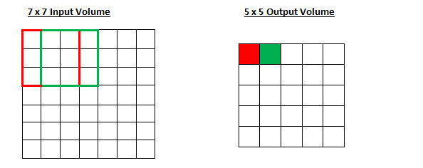{height="70%"}

Q: How many trainable weights are there?

. . .

There are $3 \times 3 + 1$ trainable weights ($+ 1$ for the bias)

## Convolutions in Practice

What if we have a coloured image?

What if we want to compute *multiple* features?

<!-- { height=70% } -->

## Convolution in RGB

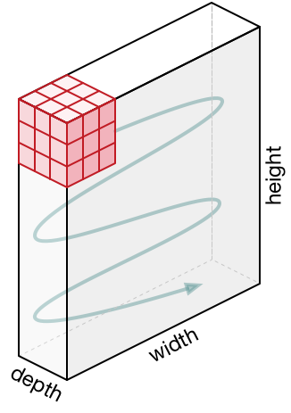{height="70%"}

The kernel becomes a 3-dimensional tensor!

In this example, the kernel has size **3** $\times 3 \times 3$

## Convolutions: RGB Input

Colour input image: **3** $\times 7 \times 7$

Convolution kernel: **3** $\times 3 \times 3$

Questions:

-   How many units are in the output of this convolution?
-   How many trainable weights are there?

## Terminology

Input image: $3 \times 32 \times 32$

Convolution kernel: **3** $\times 3 \times 3$

-   The number 3 is the number of **input channels** or **input feature maps**

## Detecting Multiple Features

Q: What if we want to detect many features of the input? (i.e. **both** horizontal edges and vertical edges, and maybe even other features?)

. . .

A: Have many convolutional filters!

. . .

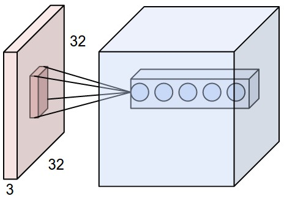{width="50%"}

## Many Convolutional Filters

Input image: $3 \times 7\times 7$

Convolution kernel: $3 \times 3 \times 3 \times$ **5**

Q:

-   How many units are in the output of this convolution?
-   How many trainable weights are there?

## More Terminology

Input image of size $3 \times 32 \times 32$

Convolution kernel of **3** $\times 3 \times 3 \times$ **5**

-   The number 3 is the number of **input channels** or **input feature maps**
-   The number 5 is the number of **output channels** or **output feature maps**

## Example

Input features: $5 \times 32 \times 32$

Convolution kernel: $5 \times 3 \times 3 \times 10$

Questions:

-   How many input channels are there?
-   How many output channels are there?
-   How many units are in the higher layer?
-   How many trainable weights are there?

::: notes
-   Modern deep learning frameworks have all of this implemented.
-   Still important to know as you design your network.
:::

<!-- Downsampling -->

# Downsampling

## Consolidating Information

In a neural network with fully-connected layers, we reduced the number of units in each hidden layer

Q: Why?

. . .

-   To be able to consolidate information, and remove out information not useful for the current task

Q: How can we consolidate information in a neural network with convolutional layers?

. . .

-   max pooling, average pooling, strided convolutions

## Max-Pooling

Idea: take the **maximum value** in each $2 \times 2$ grid.

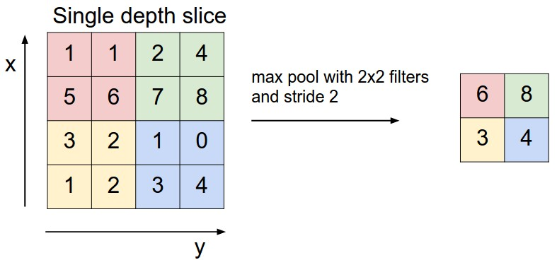

## Max-Pooling Example

We can add a max-pooling layer *after* each convolutional layer

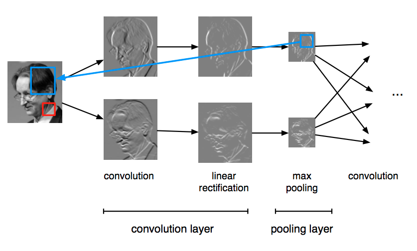

## Average Pooling

-   Average pooling (compute the average activation of a region)
-   Max pooling generally works better

## Strided Convolution

More recently people are doing away with pooling operations, using **strided** convolutions instead:

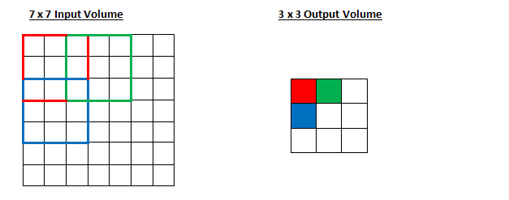

Shift the kernel by **2** (stride=2) when computing the next output feature.

::: notes
Visualization examples

-   <https://arxiv.org/pdf/1603.07285.pdf>
-   <https://github.com/vdumoulin/conv_arithmetic>
:::

<!-- 04train -->

# Training a Conv Net

## How do we train a conv net?

With backprop, of course!

::: fragment
Recall what we need to do. Backprop is a message passing procedure, where each layer knows how to pass messages backwards through the computation graph. Let’s determine the updates for convolution layers.
:::

## How do we train a conv net? II

::: incremental
-   We assume we are given the loss derivatives $\overline{y_{i,t}}$ with respect to the output units.
-   We need to compute the cost derivatives with respect to the input units and with respect to the weights.
:::

::: fragment
The only new feature is: how do we do backprop with tied weights?
:::

::: notes
-   The derivatives with respect of the input units are not needed for the first layer
-   But they are needed for all subsequent layers as the inputs to these subsequent layers are a function of previous layers' weights.
:::

## Multivariate Chain Rule (inputs)

Consider the computation graph for the inputs:

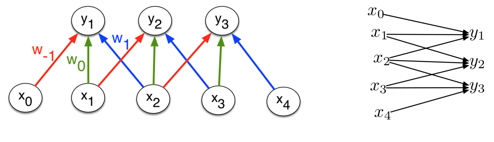{height="70%"}

::: fragment
Each input unit influences all the output units that have it within their receptive fields. Using the **multivariate Chain Rule**, we need to sum together the derivative terms for all these edges
:::

::: notes
-   This is a 1d signal, e.g. think of a 1d image with a line camera
-   Here we have "kernels" of size 3
-   We already applied multivariate chain rule for "tied inputs" in the past
:::

## Multivariate Chain Rule (weights)

Consider the computation graph for the weights:

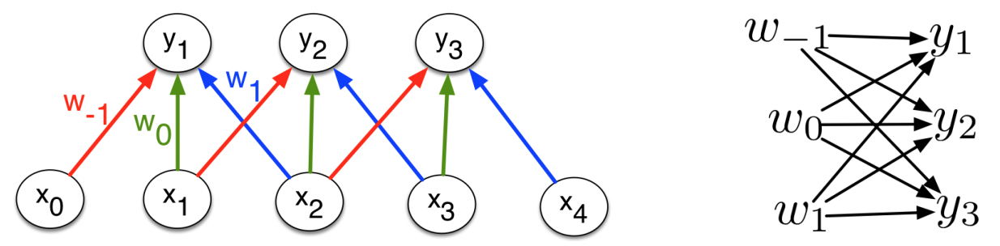{height="70%"}

::: fragment
Each of the weights affects all the output units for the corresponding input and output feature maps.
:::

## Backpropagation on conv layers

The formula for the convolution layer for 1-D signals:

$$
y_{i,t} = \sum_{j=1}^{J} \sum_{\tau = -R}^{R} w_{i,j,\tau} \, x_{j, t + \tau}.
$$

::: fragment
We compute the derivatives, which requires summing over all spatial locations:

\begin{align*}
\overline{w_{i,j,\tau}}
    &= \sum_{t} y_{i,t} \frac{\partial y_{i,t}}{\partial w_{i,j,\tau}} \\
    &= \sum_{t} y_{i,t} x_{j, t + \tau}
\end{align*}
:::

::: notes
-   Focus on 1-D signals with $J$ feature maps (e.g. colors) and kernel *radius* $R$ (i.e. a kernal size $K=2R+1$)
-   $i$ is the index of output feature map (of which we have $I$).
-   $t$ is the index of the output location ($t\in \{1, \ldots, \}$)
:::

<!-- 05 popular architecture examples -->

# Examples and Applications

## Object recognition

::: incremental
-   Object recognition is the task of identifying which object category is present in an image.

-   It's challenging because *objects can differ widely* in position, size, shape, appearance, etc., and we have to deal with occlusions, lighting changes, etc.

-   Why we care

    -   Direct applications to image search
    -   Closely related to object detection, the task of locating all instances of an object in an image
:::

## Datasets

::: incremental
-   In order to train and evaluate a machine learning system, we need to collect a dataset. The design of the dataset can have major implications.  \
-   Some questions to consider:
    -   Which categories to include?
    -   Where should the images come from?
    -   How many images to collect?
    -   How to normalize (preprocess) the images?
:::

## MNIST - Handwritten Digits Dataset

::: incremental
-   **Categories:** 10 digit classes
-   **Source:** Scans of handwritten zip codes from envelopes
-   **Size:** 60,000 training images / 10,000 test images, Grayscale, 28 x 28 pixels
-   **Normalization:** Centered within the image, scaled to a consistent size
:::

::: notes
-   Assumption: Digit recognizer is part of a larger pipeline.
-   In 1998, Yann LeCun and colleagues built a conv net called LeNet
-   It was able to classify digits with 98.9% test accuracy.
-   Good enough to be used in a system for automatically reading numbers on checks.
:::

## ImageNet I

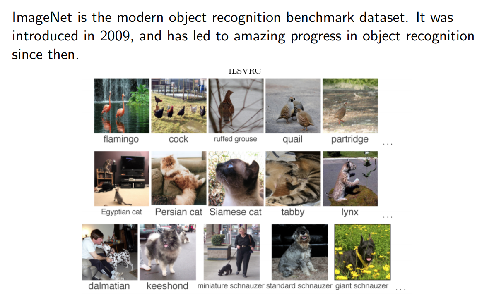{height="600"}

## ImageNet II

**Used for:** The ImageNet Large Scale Visual Recognition Challenge (ILSVRC), an annual benchmark competition for object recognition algorithms

::: fragment
**Design Decisions**
:::

::: incremental
-   **Categories:** Taken from a lexical database called WordNet
    -   WordNet consists of "synsets"
    -   Almost 22,000 classes used
    -   The 1,000 most common chosen for the ILSVRC
    -   The categories are really specific, e.g., hundreds of kinds of dogs
:::

## ImageNet III

-   **Size:** 1.2 million full-sized images for the ILSVRC

-   **Source:** Results from image search engines, hand-labeled by Mechanical Turkers

    -   Labeling such specific categories was challenging; annotators had to be given the WordNet hierarchy, Wikipedia, etc.

-   **Normalization:** None, although the contestants are free to do preprocessing

::: notes
-   Synsets are sets of synonymous words
:::

## ImageNet IV

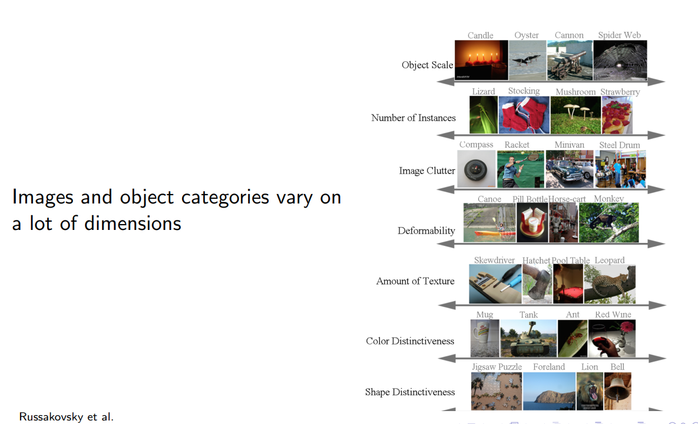{height="600"}

## ImageNet V

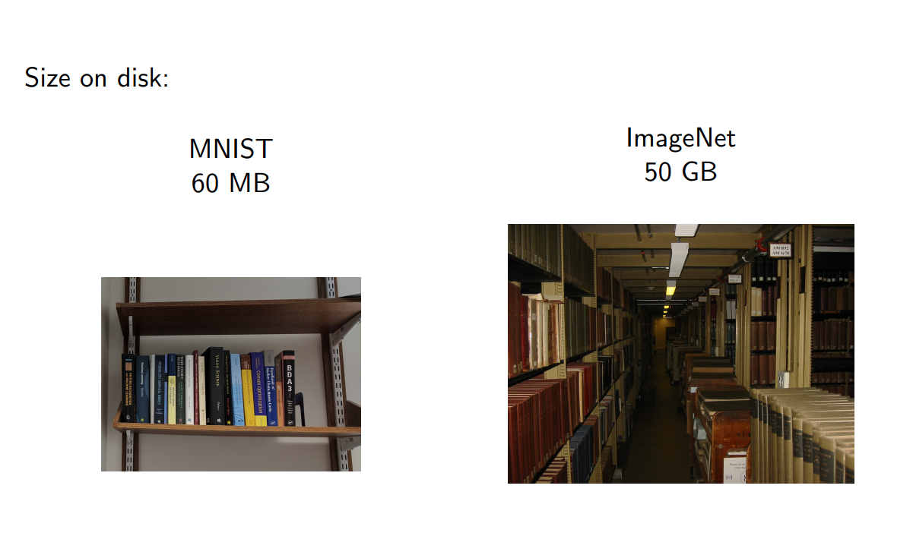{height="600"}

## ImageNet Results

| Year | Model                           | Top-5 error |
|------|---------------------------------|-------------|
| 2010 | Hand-designed descriptors + SVM | 28.2%       |
| 2011 | Compressed Fisher Vectors + SVM | 25.8%       |
| 2012 | AlexNet                         | 16.4%       |
| 2013 | a variant of AlexNet            | 11.7%       |
| 2014 | GoogLeNet                       | 6.6%        |
| 2015 | deep residual nets              | 4.5%        |

::: notes
-   Top-5 error: True class among the 5 "best" results
-   Human-performance is around 5.1%.
-   ISVRC stopped running because the performance is already so good.
:::

## What features do CNN's detect?

{height="600"}

## Size of a convnet

::: incremental
-   Ways to measure the size of a network:
    -   **Number of units.** The activations need to be stored in memory during training.
    -   **Number of weights.** The weights need to be stored in memory / number of parameters determines overfitting.
    -   **Number of connections.** There are approximately 3 add-multiply operations per connection (1 for the forward pass, 2 for the backward pass).
-   Fully connected layer with $M$ inputs and $N$ outputs has $MN$ connections / weights.
:::

::: notes
-   The story for conv nets is more complicated.
:::

## Size of a convnet II

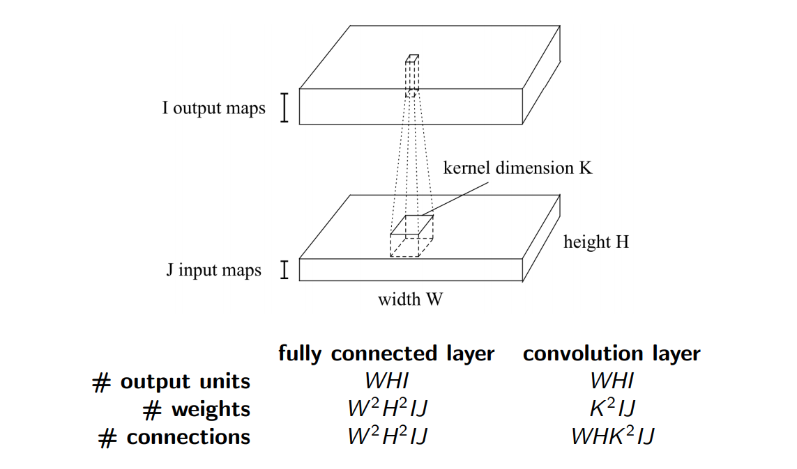{height="600"}

::: notes
-   **Output Units:** We assume no change in dimensions. For conv nets, this requires padding.
-   **Weights** Much fewer weights because $K^2 \ll W^2H^2$.
-   **Connections** Not the same as weights anymore.
:::

## Size of a convnet III

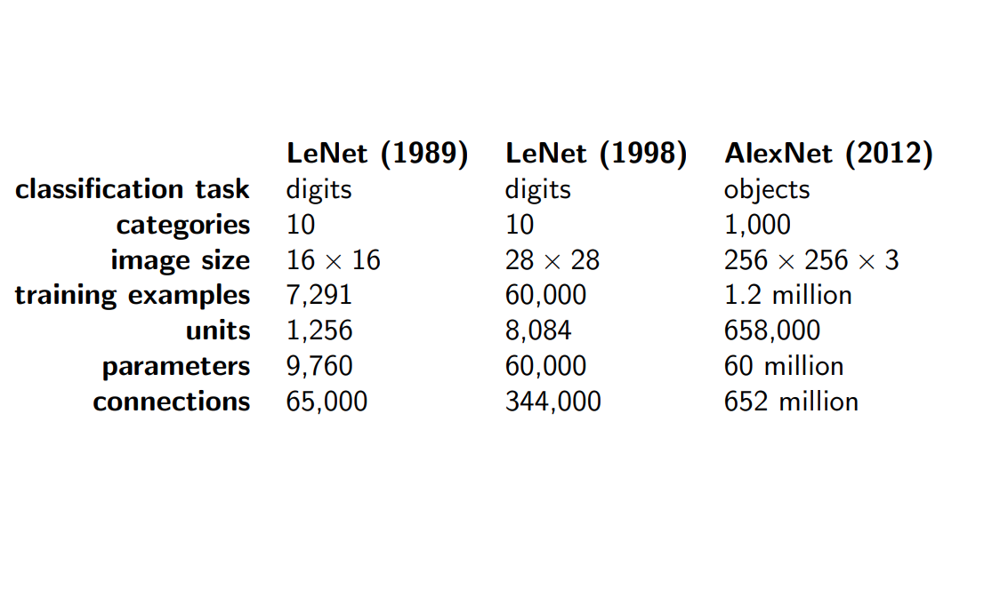{height="600"}

## LeNet Atchitecture

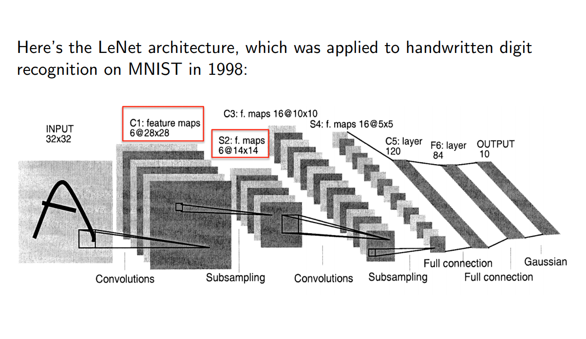{height="600"}

<!-- Moved from Downsampling section -->

## LeNet Architecture II

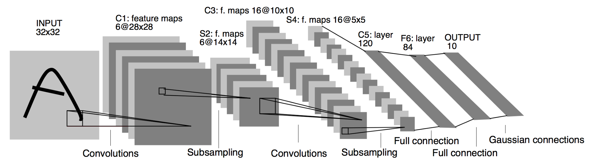

-   Input: 32x32 pixel, greyscale image
-   First convolution has 6 output features (5x5 convolution?)
-   First subsampling is probably a max-pooling operation
-   Second convolution has 16 output features (5x5 convolution?)
-   ...
-   Some number of fully-connected layers at the end

## ResNet Architecture

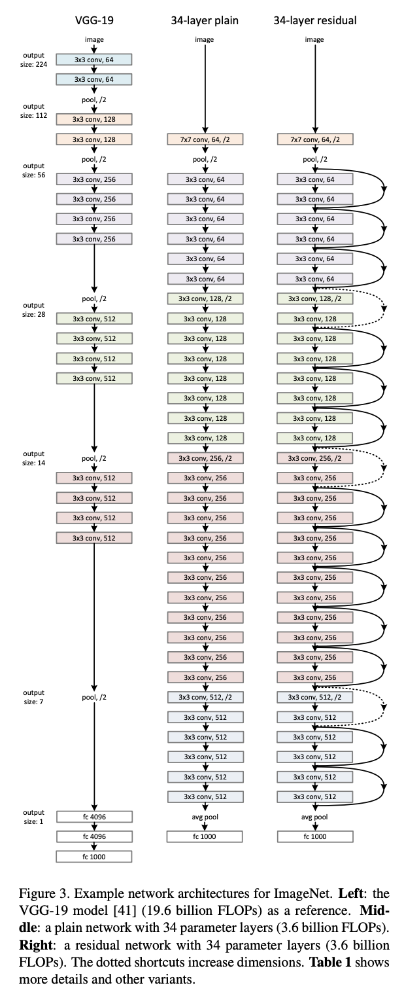{height="600"} 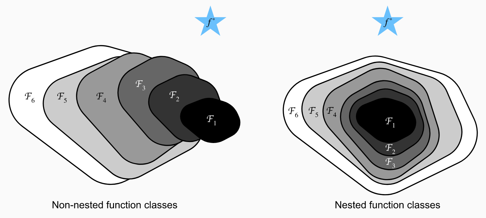{height="300"}

## ResNet Architecture II

::: incremental
-   Suppose we add another layer. How can we ensure that the new set of represented functions contains the old set, before the layer was added?
-   Why do we need this? We'd like to get larger (nested) sets of functions as we add more layers and not just different (non-nested) sets.
:::

## ResNet Blocks

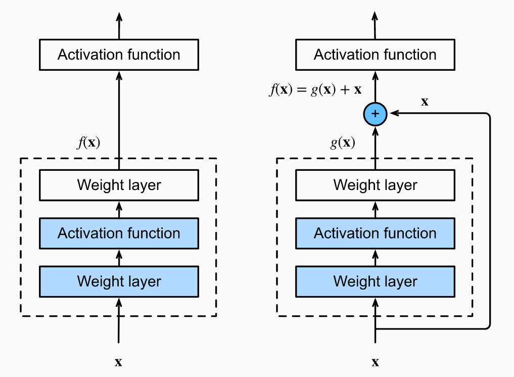{height="300"}

-   Side effect of adding identity $f(x) = x + g(x)$: better gradient propagation
-   See <https://d2l.ai/chapter_convolutional-modern/resnet.html>

## DenseNet Blocks

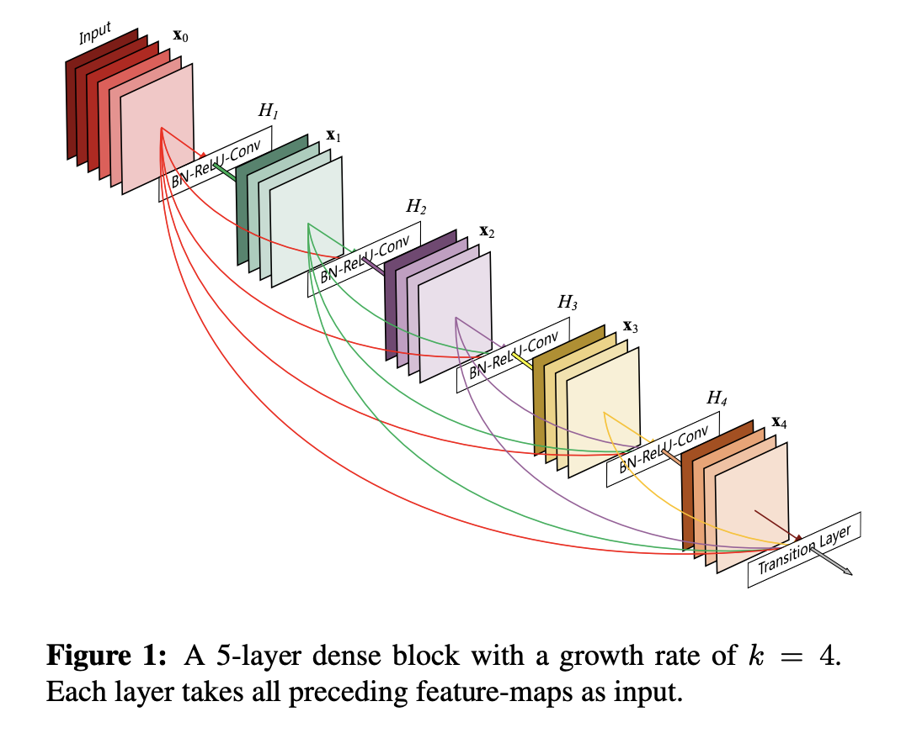{height="400"}

Same idea as ResNet blocks, but instead of addition $f(x) = x + g(x)$ they use concatenation $f(x) = [x, g(x)]$.

## DenseNet Architecture

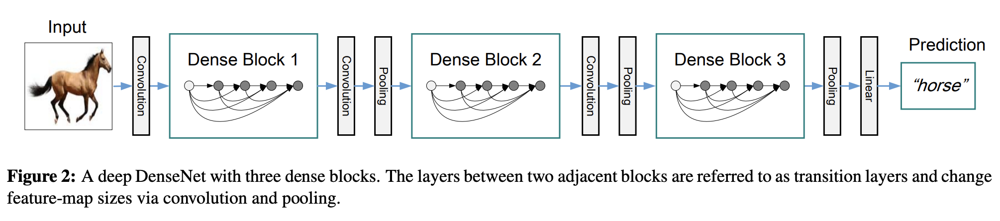{height="70%"}

See <https://d2l.ai/chapter_convolutional-modern/densenet.html>

# Wrap Up

## Summary

::: incremental
-   Computer Vision has been the main motivation for Conv Nets
-   They draw inspiration from biological vision systems
-   Key ideas are: *local connectivity* and *weight sharing*
-   Conv Nets can be trained using backpropagation
:::