## Lecture Plan

-   Optimization

# The Optimization Landscape

## Optimization Problem

Let's group all the parameters (weights and biases) of a network into a single vector ${\bf \theta}$

We wish to find the minima of a function $f({\theta}): \mathbb{R}^D \rightarrow \mathbb{R}$.

We already discussed gradient descent, but ...

-   What property does $f$ need to have for gradient descent to work well?
-   Are there techniques that can work better than (vanilla) gradient descent?

## Optimization Problem (cont'd)

We wish to find the minima of a function $f({\theta}): \mathbb{R}^D \rightarrow \mathbb{R}$.

We already discussed gradient descent, but ...

-   What property does $f$ need to have for gradient descent to work well?
-   Are there techniques that can work better than (vanilla) gradient descent?
-   Are there cases where gradient descent (and related) optimization methods fail?
-   How can deep learning practitioners diagnose and fix optimization issues?

## Visualizing Optimization Problems

Visualizing optimization problems in high dimensions is challenging. Intuitions that we get from 1D and 2D optimization problems can be helpful.

In 1D and 2D, we can visualize $f$ by drawing plots, e.g. surface plots and contour plots

<center>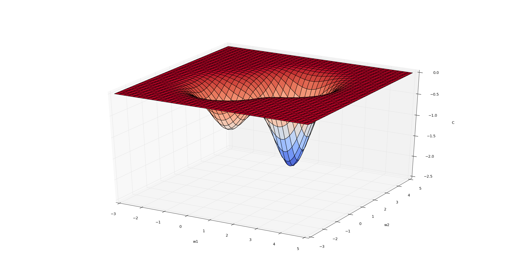{height="350"}</center>

Q: Sketch a contour plot that represents the same function as the figure above.

## Visualizing Optimization Problems (cont'd)

<center>{height="400"}</center>

Q: Sketch a contour plot that represents the same function as the figure above.

## Review: Contour Plots

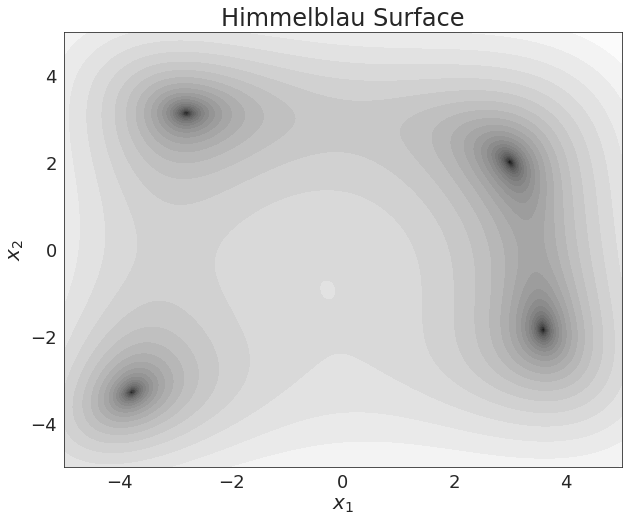{width="80%"}

Q: Where are the 4 local minima in this contour plot?

## Minimization Intuition in 1D

Suppose we have a function $f({\theta}): \mathbb{R}^1 \rightarrow \mathbb{R}$ that we wish to minimize. How do we go about doing this?

. . .

$\theta \rightarrow \theta - \alpha f'(\theta)$

. . .

Gradient descent and other techniques all are founded on approximating $f$ with its **Taylor series expansion**:

\begin{align*}
f(\theta) \approx f(\theta_0) + f'(\theta_0)^T(\theta - \theta_0) + \frac{1}{2} (\theta - \theta_0)^2 f''(\theta_0) + \ldots
\end{align*}

Understanding this use of the Taylor series approximation helps us understand more involved optimization techniques that use higher-order derivatives.

## Taylor Series Expansion in High Dimensions

Suppose we have a function $f({\theta}): \mathbb{R}^D \rightarrow \mathbb{R}$ that we wish to minimize.

Again, we can explore approximating $f$ with its **Taylor series expansion**:

\begin{align*}
f(\theta) \approx f(\theta_0) + \nabla f(\theta_0)^T(\theta - \theta_0) + \frac{1}{2} (\theta - \theta_0)^T H(\theta_0) (\theta - \theta_0) + \ldots
\end{align*}

Gradient descent uses first-order information, but other optimization algorithms use some information about the **Hessian**.

## Recap: Gradient

The **gradient** of a function $f({\theta}): \mathbb{R}^D \rightarrow \mathbb{R}$ is the vector of partial derivatives:

\begin{align*}
\nabla_{\theta} f = \frac{\partial f}{\partial {\theta}} = \begin{bmatrix}
\frac{\partial f}{\partial \theta_1}  \\
\frac{\partial f}{\partial \theta_2}  \\
\vdots \\
\frac{\partial f}{\partial \theta_D}  \\
\end{bmatrix}
\end{align*}

## Recap: Hessian

The **Hessian Matrix**, denoted ${\bf H}$ or $\nabla^2 f$ is the matrix of second derivatives

\begin{align*}
H = \nabla^2 f = \begin{bmatrix}
\frac{\partial^2 f}{\partial \theta_1^2}  & \frac{\partial^2 f}{\partial \theta_1 \partial \theta_2} & \dots  &
     & \frac{\partial^2 f}{\partial \theta_1 \partial \theta_D} \\
\frac{\partial^2 f}{\partial \theta_1 \partial \theta_2}  & \frac{\partial^2 f}{\partial \theta_2^2} & \dots  &
     & \frac{\partial^2 f}{\partial \theta_2 \partial \theta_D} \\
\vdots
\frac{\partial^2 f}{\partial \theta_n \partial \theta_2}  & \frac{\partial^2 f}{\partial \theta_n \partial \theta_2} & \dots  &
     & \frac{\partial^2 f}{\partial \theta_D^2} \\
\end{bmatrix}
\end{align*}

The Hessian is symmetric because $\frac{\partial^2 f}{\partial \theta_i \partial \theta_j} = \frac{\partial^2 f}{\partial \theta_j \partial \theta_i}$

## Multivariate Taylor Series

Recall the second-order **Taylor series expansion** of $f$:

\begin{align*}
f(\theta) \approx f(\theta_0) + \nabla f(\theta_0)^T(\theta - \theta_0) + \frac{1}{2} (\theta - \theta_0)^T H(\theta_0) (\theta - \theta_0)
\end{align*}

A **critical point** of $f$ is a point where the gradient is zero, so that

\begin{align*}
f(\theta) \approx f(\theta_0) + \frac{1}{2} (\theta - \theta_0)^T H(\theta_0) (\theta - \theta_0)
\end{align*}

## Multivariate Taylor Series (cont'd)

A **critical point** of $f$ is a point where the gradient is zero, so that

\begin{align*}
f(\theta) \approx f(\theta_0) + \frac{1}{2} (\theta - \theta_0)^T H(\theta_0) (\theta - \theta_0)
\end{align*}

How do we know if the critical point is a maximum, minimum, or something else?

. . .

-   **Minimum**: The Hessian is positive definite.
-   **Maximum**: The Hessian is negative definite.

## Spectral Decomposition of $H$

\begin{align*}
f(\theta) \approx f(\theta_0) + f'(\theta_0)^T(\theta - \theta_0) + \frac{1}{2} (\theta - \theta_0)^2 f''(\theta_0) + \ldots
\end{align*}

We won't go into details in this course, but...

-   A lot of important features of the optimization landscape can be characterized by the eigenvalues of the Hessian $H$.
-   Recall that a symmetric matrix (such as $H$) has only real eigenvalues, and there is an orthogonal basis of eigenvectors.

## Spectral Decomposition of $H$ (cont'd)

-   A lot of important features of the optimization landscape can be characterized by the eigenvalues of the Hessian $H$.
-   Recall that a symmetric matrix (such as $H$) has only real eigenvalues, and there is an orthogonal basis of eigenvectors.
-   This can be expressed in terms of the **spectral decomposition**: $H = Q\Lambda Q^T$, where $Q$ is an orthogonal matrix (whose columns are the eigenvectors) and $\Lambda$ is a diagonal matrix (whose diagonal entries are the eigenvalues).

## First- vs Second-Order Information

In Gradient Descent, we approximate $f$ with its **first-order Taylor approximation**. In other words, we are using **first-order** information in our optimization procedure.

An area of research known as **second-order optimization** develops algorithms which explicitly use curvature information (the Hessian $H$), but these are complicated and difficult to scale to large neural nets and large datasets.

But before we get there...

## Features of the Optimization Landscape

<center>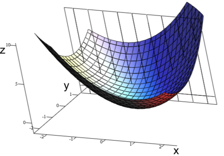{height="200"} 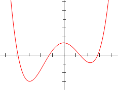{height="200"} {height="200"}</center>

<center>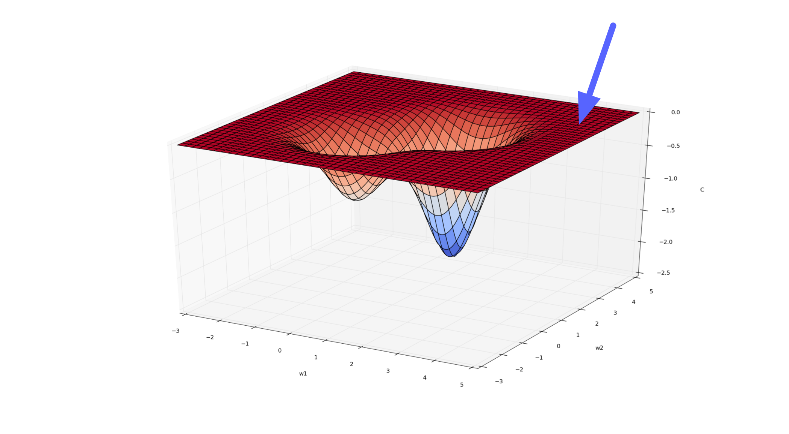{height="200"} 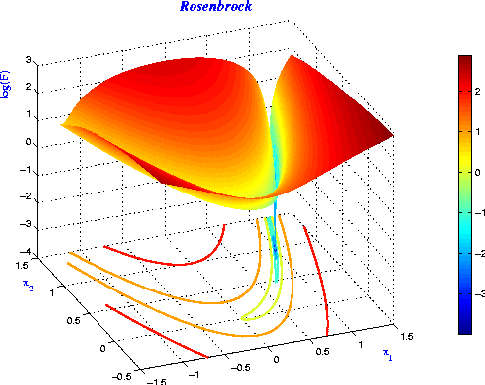{height="200"}</center>

## Feature 1: Convexity of Linear Models

Linear regression and logistic regressions are **convex** problems---i.e. its loss function is convex.

A function $f$ is convex if for any $a \in (0, 1)$

$$f(ax + (1 - a) y) <  af(x) + (1-a)f(y)$$

-   The cost function only has one minima.
-   There are no local minima that is not global minima.
-   Intuitively: the cost function is "bowl-shaped".

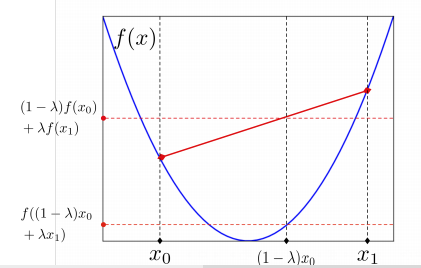{width="40%"}

## Q: Are these loss surfaces convex?

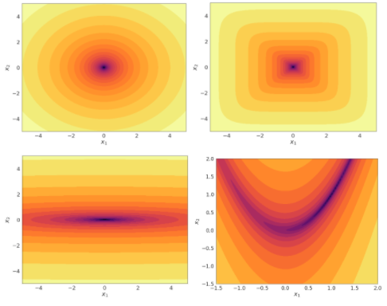{width="80%"}

## Convexity in 1D

How do we know if a function $f: \mathbb{R} \rightarrow \mathbb{R}$ is convex?

. . .

When $f''(x)$ is positive everywhere!

Likewise, analyzing the Hessian matrix $H$ tells us whether a function $f: \mathbb{R}^D \rightarrow \mathbb{R}$ is convex. (Hint: $H$ needs to have only positive eigenvalues)

## Neural Networks are Not Convex

In general, neural networks are **not convex**.

One way to see this is that neural networks have **weight space symmetry**:

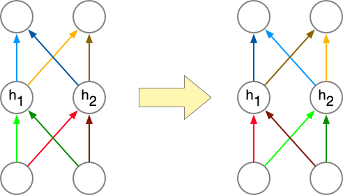{height="30%"}

## Neural Networks are Not Convex (cont'd)

-   Suppose you are at a local minima ${\bf \theta}$.
-   You can swap two hidden units, and therefore swap the corresponding weights/biases, and get ${\bf \theta}^\prime$,
-   then ${\bf \theta}^\prime$ must also be a local minima!

Video: [Convexity of MLP](https://play.library.utoronto.ca/watch/78367fbca4c4a42a30ec5862cdd0c756)

## Feature 2: Local Minima in Neural Networks

Even though any multilayer neural net can have local optima, we usually don’t worry too much about them.

It's possible to construct arbitrarily bad local minima even for ordinary classification MLPs. It's poorly understood why these don't arise in practice.

Over the past 5 years or so, CS theorists have made lots of progress proving gradient descent converges to global minima for some non-convex problems, including some specific neural net architectures.

## Feature 3: Saddle Points

<center>{height="200"}</center>

A saddle point has $\nabla_\theta \mathcal{E} = {\bf 0}$, even though we are not at a minimum.

Minima with respect to some directions, maxima with respect to others. In other words, $H$ has some positive and some negative eigenvalues.

## Feature 3: Saddle Points (cont'd)

A saddle point has $\nabla_\theta \mathcal{E} = {\bf 0}$, even though we are not at a minimum.

Minima with respect to some directions, maxima with respect to others. In other words, $H$ has some positive and some negative eigenvalues.

When would saddle points be a problem?

-   If we’re exactly on the saddle point, then we’re stuck.
-   If we’re slightly to the side, then we can get unstuck.

## Initialization

-   If we initialize all weights/biases to the same value, (e.g. 0)
-   ...then all the hidden states in the same layer will have the same value, (e.g. ${\bf h}$ will be a vector containing the same value repeated)
-   ...then all of the error signals for weights in the same layer are the same. (e.g. each row of $\overline{W^{(2)}}$ will be identical)

## Initialization (cont'd)

-   ...then all of the error signals for weights in the same layer are the same. (e.g. each row of $\overline{W^{(2)}}$ will be identical)

\begin{align*}
\overline{{\bf y}} &= \overline{\mathcal{L}}({\bf y} - {\bf t}) \\
\overline{W^{(2)}} &= \overline{{\bf y}}{\bf h}^T \\
\overline{{\bf h}} &= {W^{(2)}}^T \overline{{\bf y}} \\
\overline{{\bf z}} &= \overline{{\bf h}} \circ \sigma^\prime({\bf z}) \\
\overline{W^{(1)}} &= \overline{{\bf z}} {\bf x}^T
\end{align*}

## Random Initialization

**Solution**: don't initialize all your weights to zero!

Instead, *break the symmetry* by using small random values.

We initialize the weights by sampling from a random normal distribution with:

-   Mean = 0
-   Variance = $\frac{2}{{\rm fan\_in}}$ where `fan_in` is the number of input neurons that feed into this feature. (He et al. 2015)

## Feature 4: Plateaux

A flat region in the cost is called a **plateau**. (Plural: plateaux)

{height="50%"}

Can you think of examples?

-   logistic activation with least squares
-   0-1 loss
-   ReLU activation (potentially)

## Plateaux and Saturated Units

An important example of a plateau is a **saturated unit**. This is when activations always end up in the flat region of its activation function. Recall the backprop equation for the weight derivative:

\begin{columns}
\begin{column}{0.4 \linewidth}
  \begin{align*}
    \overline{z_i} &= \overline{h_i} \, \phi^{\prime}(z) \\
    \overline{w_{ij}} &= \overline{z_i} \, x_j
  \end{align*}
\end{column}
\begin{column}{0.3 \linewidth}
  \includegraphics[width=\linewidth]{imgs/logistic_function.png}
\end{column}
\end{columns}

-   If $\phi^{\prime}(z)$ is always close to zero, then the weights will get stuck.
-   If there is a ReLU unit whose input $z_i$ is always negative, the weight derivatives will be *exactly* 0. We call this neuron a **dead unit**.

## Ravines

\begin{center}
  \includegraphics[width=0.3\linewidth]{imgs/rosenbrock.png}
  \hspace{0.1 \linewidth}
  \includegraphics[width=0.4\linewidth]{imgs/rosenbrock_stuck.png}
\end{center}

Lots of sloshing around the walls, only a small derivative along the slope of the ravine’s floor.

## Ravines (2D Intuition)

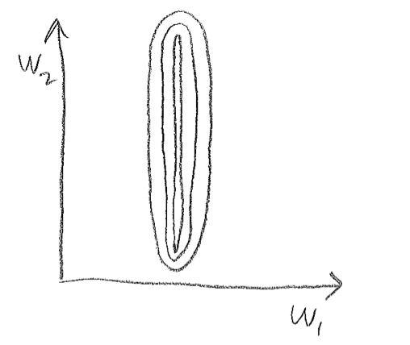{width="50%"}

-   Gradient component $\frac{\partial \mathcal{E}}{\partial w_1}$ is large
-   Gradient component $\frac{\partial \mathcal{E}}{\partial w_2}$ is small

## Ravines Example

Suppose we have the following dataset for linear regression.

\begin{columns}
\begin{column}{0.4 \textwidth}
  \begin{small}
  \begin{tabular}{rr|r}
    $x_1$ & $x_2$ & $t$ \\
    \hline
    114.8 & 0.00323 & 5.1 \\
    338.1 & 0.00183 & 3.2 \\
    98.8 & 0.00279 & 4.1 \\
    \vdots \hspace{1em} & \vdots \hspace{1.5em} & \vdots \hspace{0.5em}
  \end{tabular}
  \end{small}
\end{column}
\begin{column}{0.1 \textwidth}
  \[ \overline{w_i} = \overline{y} \, x_i \]
\end{column}
\begin{column}{0.4 \textwidth}
  \includegraphics[width=\linewidth]{imgs/scale_problem.png}
\end{column}
\end{columns}

-   Which weight, $w_1$ or $w_2$, will receive a larger gradient descent update?
-   Which one do you want to receive a larger update?
-   Note: the figure vastly *understates* the narrowness of the ravine!

## Ravines: another examples

```{=html}
<!-- \begin{columns}
\begin{column}{0.4 \textwidth}
  \begin{small}
  \begin{tabular}{rr|r}
    $x_1$ & $x_2$ & $t$ \\
    \hline
    1003.2 & 1005.1 & 3.3 \\
    1001.1 & 1008.2 & 4.8 \\
    998.3 & 1003.4 & 2.9 \\
    \vdots \hspace{1em} & \vdots \hspace{1.5em} & \vdots \hspace{0.5em}
  \end{tabular}
  \end{small}
\end{column}
\begin{column}{0.4 \textwidth}
  \includegraphics[width=\linewidth]{imgs/offset_problem.png}
\end{column}
\end{columns} -->
```

| $x_1$  | $x_2$  | $t$ |
|--------|--------|-----|
| 1003.2 | 1005.1 | 3.3 |
| 1001.1 | 1008.2 | 4.8 |
| 998.3  | 1003.4 | 2.9 |

<center>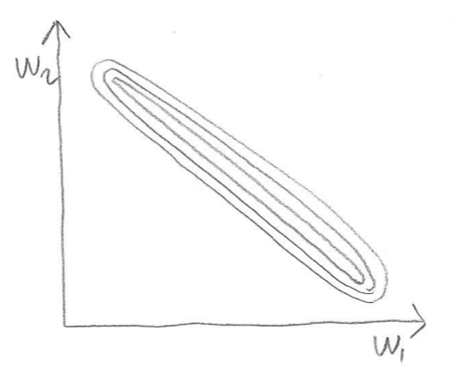{height="300"}</center>

## Avoiding Ravines

To help avoid these problems, it's a good idea to **center** or **normalize** your inputs to zero mean and unit variance, especially when they're in arbitrary units (feet, seconds, etc.).

Hidden units may have non-centered activations, and this is harder to deal with.

A recent method called **batch normalization** explicitly centers each hidden activation. It often speeds up training by 1.5-2x.

## Method: Batch Normalization

**Idea**: Normalize the activations **per batch** during training, so that the activations have zero mean and unit variance.

What about during test time (i.e. during model evaluation)?

-   Keep track of the activation mean $\mu$ and variance $\sigma$ during training.
-   Use that $\mu$ and $\sigma$ at test time: $z^\prime = \frac{z - \mu}{\sigma}$.

````{=html}
<!--
## Batch Normalization in PyTorch

```python
class PyTorchWordEmb(nn.Module):
  def __init__(self, emb_size=100, ...)
    super(PyTorchWordEmb, self).__init__()
    self.word_emb_layer = nn.Linear(vocab_size, ...)
    self.fc_layer1 = nn.Linear(emb_size * 3, num_hidden)
    self.bn = nn.BatchNorm1d(num_hidden)         # <----
    self.fc_layer2 = nn.Linear(num_hidden, 250)
    self.num_hidden = num_hidden
    self.emb_size = emb_size
  def forward(self, inp):
    embeddings = torch.relu(self.word_emb_layer(inp))
    embeddings = embeddings.reshape([-1, ...])
    hidden = torch.relu(self.fc_layer1(embeddings))
    hidden = self.bn(hidden)                    # <----
    return self.fc_layer2(hidden)
```

## Differentiating model training vs evaluation

Since model behaviour is different during training vs evaluation,
we need to annotate

```python
model.train()
```

...before a forward pass during training, and...

```python
model.eval()
```

...before a forward pass during evaluation.

-->
````

## Batch Normalization Video

<https://play.library.utoronto.ca/watch/3e2b87ac8e5730f404893ce9270b4b75>

## Method: Momentum

**Momentum** is a simple and highly effective method to deal with narrow ravines. Imagine a hockey puck on a frictionless surface (representing the cost function). It will accumulate momentum in the downhill direction:

\begin{align*}
{\bf p} &\gets \mu {\bf p} - \alpha \frac{\partial \mathcal{E}}{\partial \theta} \\
\theta &\gets \theta + {\bf p}
\end{align*}

## Method: Momentum (cont'd)

-   $\alpha$ is the learning rate, just like in gradient descent.
-   $\mu$ is a damping parameter. It should be slightly less than 1 (e.g. 0.9 or 0.99).
    -   If $\mu = 1$, conservation of energy implies it will never settle down.

## Why Momentum Works

-   In the high curvature directions, the gradients cancel each other out, so momentum dampens the oscillations.
-   In the low curvature directions, the gradients point in the same direction, allowing the parameters to pick up speed.

<center>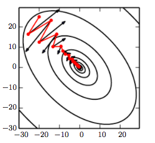{height="250"}</center>

## Why Momentum Works (cont'd)

<center>{height="250"}</center>

-   If the gradient is constant (i.e. the cost surface is a plane), the parameters will reach a terminal velocity of $-\frac{\alpha}{1 - \mu} \cdot \frac{\partial \mathcal{E}}{\partial \theta}$ This suggests if you increase $\mu$, you should lower $\alpha$ to compensate.
-   Momentum sometimes helps a lot, and almost never hurts.

## Gradient Descent with Momentum

Q: Which trajectory has the highest/lowest momentum setting?

<center>

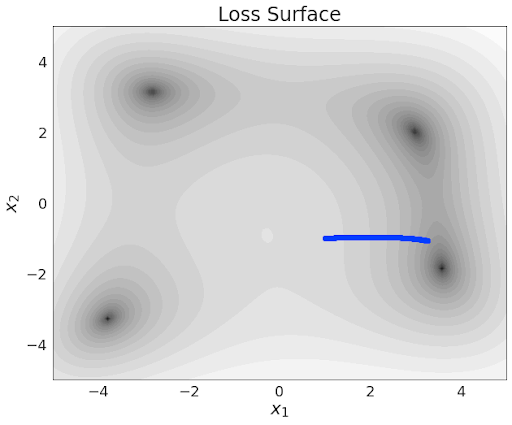{height="250"} 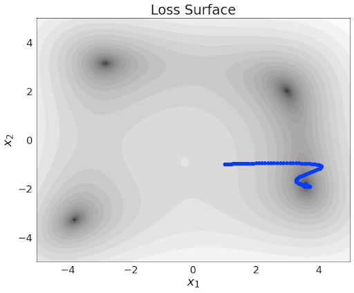{height="250"}

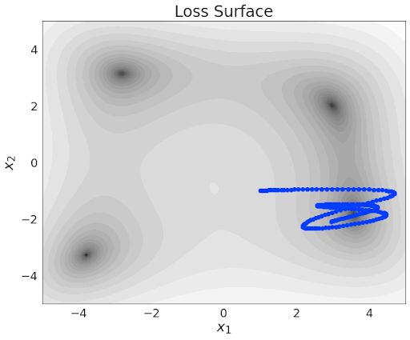{height="250"} {height="250"}

</center>

## Second-Order Information

An area of research known as **second-order optimization** develops algorithms which explicitly use curvature information (the Hessian $H$), but these are complicated and difficult to scale to large neural nets and large datasets.

But can we use just a bit of second-order information?

## Method: RMSProp

SGD takes large steps in directions of high curvature and small steps in directions of low curvature.

**RMSprop** is a variant of SGD which rescales each coordinate of the gradient to have norm 1 on average. It does this by keeping an exponential moving average $s_j$ of the squared gradients.

## Method: RMSProp (cont'd)

The following update is applied to each coordinate j independently: \begin{align*}
s_j &\leftarrow  (1-\gamma)s_j + \gamma \left(\frac{\partial \mathcal{J}}{\partial \theta_j}\right)^2 \\
\theta_j &\leftarrow \theta_j - \frac{\alpha}{\sqrt{s_j + \epsilon}} \frac{\partial \mathcal{J}}{\partial \theta_j}
\end{align*}

If the eigenvectors of the Hessian are axis-aligned (dubious assumption) then RMSprop can correct for the curvature. In practice, it typically works slightly better than SGD.

## Method: Adam

Adam = RMSprop + momentum

Adam is the most commonly used optimizer for neural network

<center>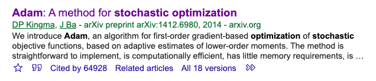{height="200"}</center>

<!-- 02optim -->

# Gradient Descent and SGD

## Learning Rate

The learning rate $\alpha$ is a hyperparameter we need to tune. Here are the things that can go wrong in batch mode:

<center>

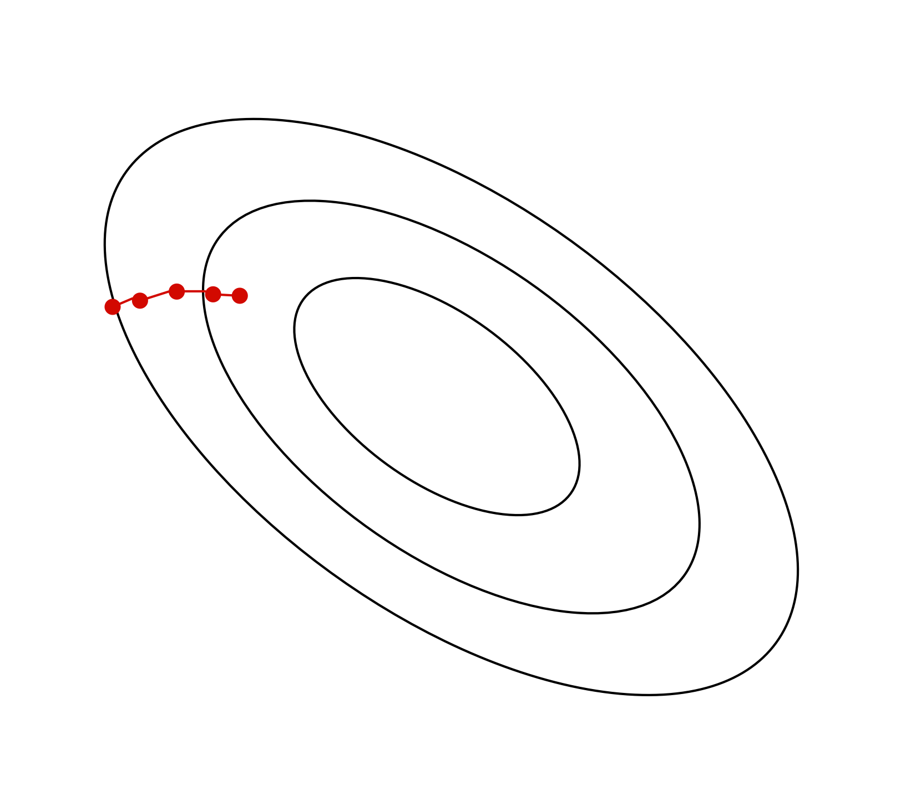{height="250"} {height="250"} {height="250"}

| $\alpha$ too small | $\alpha$ too large | $\alpha$ much too large |
|--------------------|--------------------|-------------------------|
| slow progress      | oscillations       | instability             |

</center>

## Stochastic Gradient Descent

Batch gradient descent moves directly downhill. SGD takes steps in a noisy direction, but moves downhill on average.

<center>

| batch gradient descent | stochastic gradient descent |
|------------------------------------|------------------------------------|
| {height="350"} | {height="350"} |

: {tbl-colwidths="\[55,55\]"}

</center>

## SGD Learning Rate

In stochastic training, the learning rate also influences the *fluctuations* due to the stochasticity of the gradients.

<center>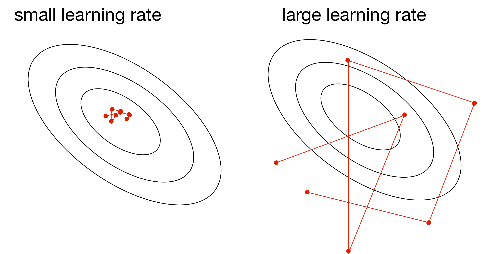{height="250"}</center>

-   Use a large learning rate early in training so you can get close to the optimum
-   Gradually decay the learning rate to reduce the fluctuations

## SGD Batch Size

The tradeoff between smaller vs larger batch size

\begin{align*}
Var\left[\frac{1}{S} \sum_{i=1}^S \frac{\partial \mathcal{L}^{(i)}}{\partial \theta_j}\right]
&=
\frac{1}{S^2} Var \left[\sum_{i=1}^S \frac{\partial \mathcal{L}^{(i)}}{\partial \theta_j} \right] \\
&=
\frac{1}{S} Var \left[\frac{\partial \mathcal{L}^{(i)}}{\partial \theta_j} \right]
\end{align*}

Larger batch size implies smaller variance, but at what cost?

## Training Curve (or Learning Curve)

To diagnose optimization problems, it's useful to look at **learning curves**: plot the training cost (or other metrics) as a function of iteration.

<center>{height="350"}</center>

## Training Curve (or Learning Curve) (cont'd)

-   **Note**: use a fixed subset of the training data to monitor the training error. Evaluating on a different batch (e.g. the current one) in each iteration adds a *lot* of noise to the curve!
-   **Note**: it's very hard to tell from the training curves whether an optimizer has converged. They can reveal major problems, but they can't guarantee convergence.

## Visualizing Optimization Algorithms

You might want to check out these links.

An overview of gradient descent algorithms:

-   <https://www.ruder.io/optimizing-gradient-descent/>

CS231n:

-   <https://cs231n.github.io/neural-networks-3/>

Why momentum really works:

-   <https://distill.pub/2017/momentum/>

<!-- next -->

# What to do this week?

-   Work on Assignment 1
-   Study the practice materials before the tutorial
-   Continue readings and using the weekly overviews/checklist