# Lecture Overview

## Last Week

::: incremental
-   Optimization Landscape
-   Gradient Descent and SGD
:::

## This week

::: incremental
-   Generalization
-   Diagnosing Issues using Learning Curves
-   Bias-Variance Tradeoff
-   Differential Privacy
:::

# Generalization

## Questions

. . .

-   How do we choose between different neural network models?
    -   For example, different number of hidden units, hidden layers, ...?

. . .

-   **How do we know how well a model will perform on new data?**

## The Training Set

The training set is used

. . .

-   to determine the value of the **parameters**

. . .

The model's prediction accuracy over the training set is called the **training accuracy**.

## The Training Set II

Q: Can we use the **training accuracy** to estimate how well a model will perform on new data?

. . .

-   No! It is possible for a model to fit well to the training set, but fail to *generalize*

. . .

-   We want to know how well the model performs on *new data* that we didn't already use to optimize the model

## Poor Generalization

<center>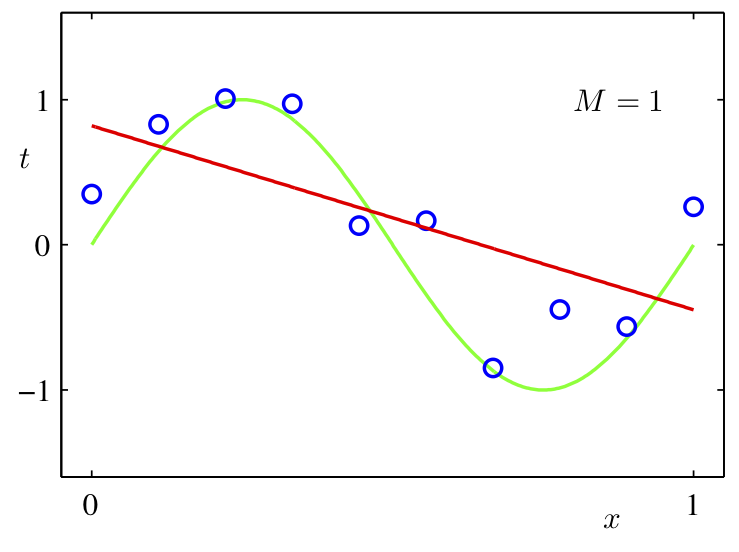{height="380"} 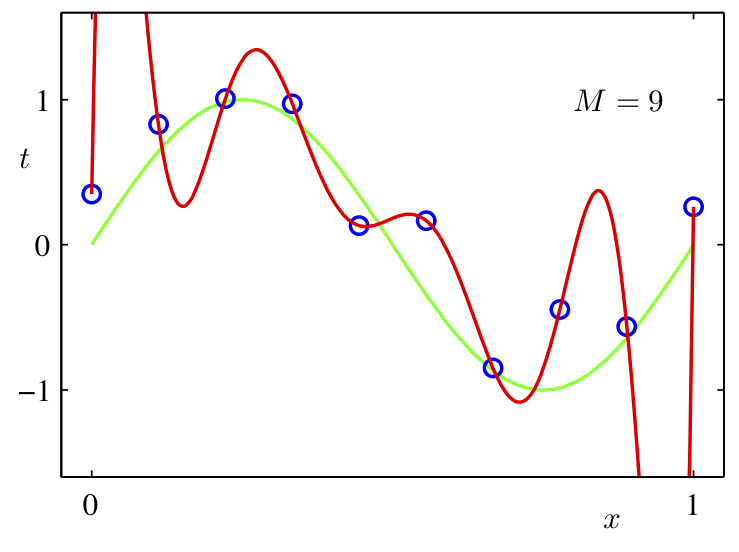{height="380"}</center>

::: notes
Example of poor generalization: - green: data generating process / red: fit. - Plot 1: datapoints fitted poorly. - Plot 2: datapoints fitted overly well.
:::

## Underfitting

-   The model is simple and doesn't fit the data

. . .

-   The model does not capture *discriminative* features of the data

## Overfitting

-   The model is too complex and does not generalize

. . .

-   The model captures information about patterns in training set that happened by chance
    -   e.g. Ringo happens to be always wearing a red shirt in the training set
    -   Model learns: high red pixel content =\> predict Ringo

## The Test Set

We set aside a **test set** of labeled examples.

. . .

The model's prediction accuracy over the test set is called the **test accuracy**.

. . .

The purpose of the test set is to give us a good estimate of how well a model will perform on new data.

. . .

Q: In general, will the test accuracy be *higher* or *lower* than the training accuracy?

::: notes
-   The test accuracy will be lower because the model can "memorize" the data.
:::

## Model Choices

But what about decisions like:

. . .

-   How many layers?

. . .

-   How many units in each layer?

. . .

-   What non-linear activation to use?

## Model Choices II

Q: Why can't we use the test set to determine which model we should deploy?

. . .

-   If we use the test set to make modeling decisions, then we will overestimate how well our model will perform on new data!

. . .

-   We are "cheating" by "looking at the test"

## The Validation Set

We therefore need a third set of labeled data called the **validation set**

The model's prediction accuracy over the validation set is called the **validation accuracy**.

## The Validation Set II

This dataset is used to:

. . .

-   Make decisions about models that is **not continuous** and can't be optimized via gradient descent

. . .

-   Example: choose $k$, choose which features $x_j$ to use, choose $\alpha$, ...
    -   These model settings are called **hyperparameters**

. . .

-   The validation set is used to optimize **hyperparameters**

## Splitting the Dataset

Example split:

. . .

-   60% Training

. . .

-   20% Validation

. . .

-   20% Test

. . .

The actual split depends on the amount of data that you have.

If you have more data, you can get a way with a smaller % validation and set.

## Detecting Overfitting

Learning curve:

::::: columns
::: {.column width="45%"}
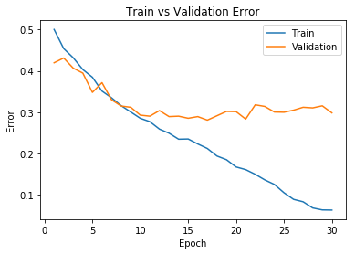{height="300"}
:::

::: {.column width="55%"}
-   **x-axis**: epochs or iterations
-   **y-axis**: cost, error, or accuracy
:::
:::::

. . .

Q: In which epochs is the model overfitting? Underfitting?

. . .

Q: Why don't we plot the test accuracy plot?

::: notes
-   Underfitting: the first \~8 epochs and overfitting after that
-   Test accuracy is only supposed to be used for the evaluation of the final trained model and not for any design decisions such as number of epochs.
:::

## Strategies to Prevent Overfitting

. . .

-   Data Augmentation

. . .

-   Reducing the number of parameters

. . .

-   Weight decay

. . .

-   Early stopping

. . .

-   Ensembles

. . .

-   Stochastic regularization (e.g. dropout)

```{=html}
<!--
- Collect more data: always the best first thing to try
    - data agumentation: add noise to the data
- Use a simpler model: doesn't work well in practice
- Early-stopping: stop training before training accuracy convergences
    - In practice, save (or **checkpoint**) the weights after every $E$ epochs. Use the weights that produce the highest validation accuracy
- Use a training strategy that reduces overfitting:
    - Example: weight decay, dropout
    -->
```

## Data Augmentation

The best way to improve generalization is to collect more data!

. . .

But if we already have all the data we're willing to collect. We can augment the training data by *transforming* the examples.

. . .

This is called **data augmentation**.

## Data Augmentation II

Examples (for images, but depends on task):

. . .

-   translation / rotation

. . .

-   horizontal or vertical flip

. . .

-   smooth warping

. . .

-   noise (e.g. flip random pixels)

We should only augment the training examples, not the validation or test examples (why?)

## Reducing the Number of Parameters

-   Networks with fewer trainable parameters are less likely to overfit.

. . .

-   We can reduce the number of layers, or the number of parameters per layer.

## Reducing the Number of Parameters II

Adding a **bottleneck layer** is another way to reduce the number of parameters

<center>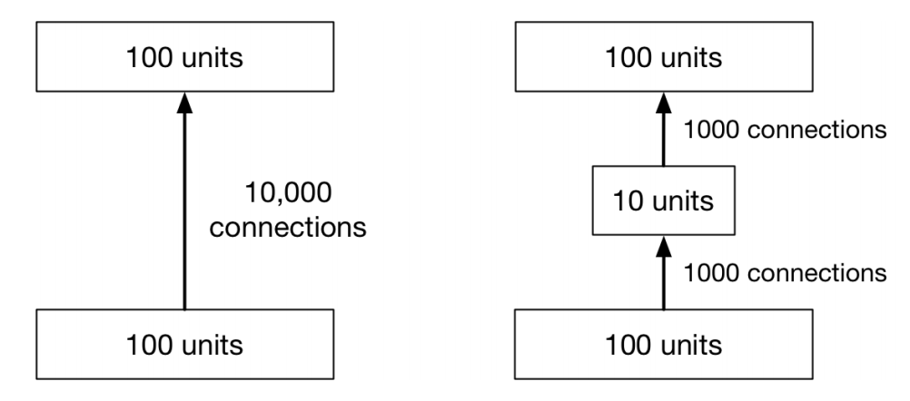{height="275"}</center>

. . .

In practise, this isn't a great idea (as too much informaiton may get lost).

## Weight Decay Idea

Idea: Penalize **large weights**, by adding a term (e.g. $\sum_k w_k ^ 2$) to the cost function

Q: Why is it not ideal to have large (absolute value) weights?

. . .

Because large weights mean that the prediction relies **a lot** on the content of one feature (e.g. one pixel)

## Small vs Large Weights

The red polynomial overfits. Notice it has really large coefficients

<center>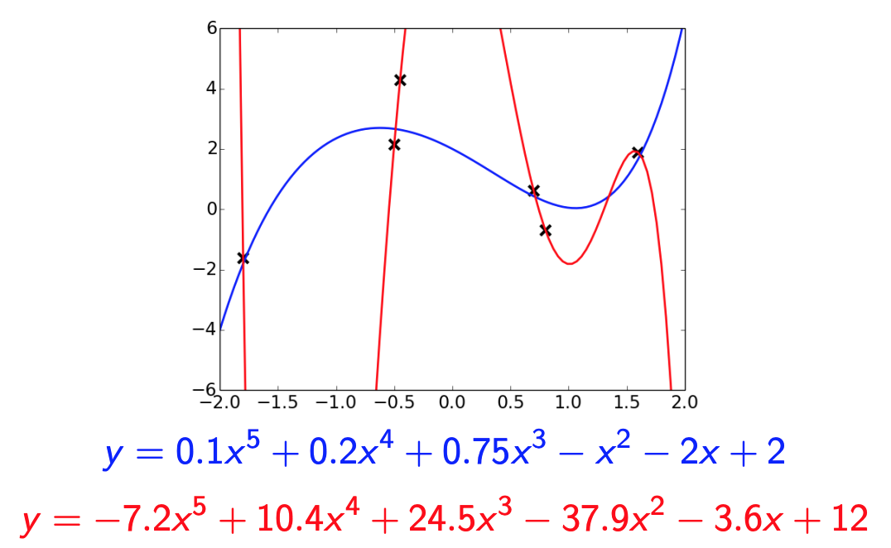{height="450"}</center>

## Weight Decay

. . .

-   $L^1$ regularization: add a term $\sum_{j=1}^D |w_j|$ to the cost function
    -   Mathematically, this term encourages weights to be exactly 0

. . .

-   $L^2$ regularization: add a term $\sum_{j=1}^D w_j^2$ to the cost function
    -   Mathematically, in each iteration the weight is pushed towards 0

. . .

-   Combination of both.

## Example: Weight Decay for Regression

Cost function:

$$\mathcal{E}({\bf w}, b) = \frac{1}{2N}\sum_i \left(\left({\bf w} {\bf x}^{(i)} + b\right) - t^{(i)}\right)^2$$

. . .

Cost function with weight decay:

$$\mathcal{E}_{WD}({\bf w}, b) = \frac{1}{2N}\sum_i \left(\left({\bf w} {\bf x}^{(i)} + b\right) - t^{(i)}\right)^2 + \lambda \sum_j w_j^2$$

## Weight Decay Nomanclature

$$\mathcal{E}_{WD}({\bf w}, b) = \frac{1}{2N}\sum_i \left(\left({\bf w} {\bf x}^{(i)} + b\right) - t^{(i)}\right)^2 + \lambda \sum_j w_j^2$$

. . .

$$\frac{\partial \mathcal{E}_{WD}}{\partial w_j} = \frac{\partial \mathcal{E}}{\partial w_j} + \lambda 2 w_j$$

. . .

So the gradient descent update rule becomes:

$$w_j \leftarrow w_j - \alpha\left(\frac{\partial \mathcal{E}}{\partial w_j} + 2 \lambda w_j\right)$$

## Early Stopping

Idea: Stop training when the validation error starts going up.

. . .

::::: columns
::: {.column width="45%"}
{height="350"}
:::

::: {.column width="55%"}
In practice, this is implemented by **checkpointing** (saving) the neural network weights every few iterations/epochs during training. <!-- <br>

Some other text that should be below the first paragraph. -->
:::
:::::

. . .

We choose the checkpoint with the best validation error to actually use. (And if there is a tie, use the **earlier** checkpoint)

## Why does Early Stopping Work?

Weights start off small, so it takes time for them to grow large.

. . .

Therefore, stopping early has a similar effect to weight decay.

. . .

If you're using sigmoid units, and the weights start out small, then the inputs to the activation functions take only a small range of values.

. . .

-   The neural network starts out approximately linear, and gradually becomes non-linear (and thus more powerful)

## Ensembles

If a loss function is convex (with respect to the predictions), you have a bunch of predictions for an input, and you don't know which one is best, you are always better off averaging them!

. . .

$$\mathcal{L}(\lambda_1 y_1 + \dots \lambda_N y_N, t) \le \lambda_1 \mathcal{L}(y_1, t) + \dots \lambda_N\mathcal{L}(y_N, t)$$

for $\lambda_i \ge 0$ and $\sum_i \lambda_i = 1$

. . .

**Idea**: Build multiple candidate models, and average the predictions on the test data.

. . .

This set of models is called an **ensemble**.

## Examples of Ensembles

. . .

-   Train neural networks starting from different random initialization (might not give enough diversity)

. . .

-   Train different network on different subset of the training data (called **bagging**)

. . .

-   Train networks with different architectures, hyperparameters, or use other machine learning models

. . .

Ensembles can improve generalization substantially.

. . .

However, ensembles are expensive.

::: notes
-   The first strategy is most common in practice.
:::

## Stochastic Regularization

For a network to overfit, its computations need to be really precise.

. . .

This suggests regularizing them by injecting noise into the computations, a strategy known as **stochastic regularization**.

. . .

One example is **dropout**: in each training iteration, random choose a portion of **activations** to set to 0.

## Stochastic Regularization II

The probability $p$ that an activation is set to 0 is a hyperparameter.

<center>{height="30%"}</center>

## Dropout

::::: columns
::: {.column width="50%"}
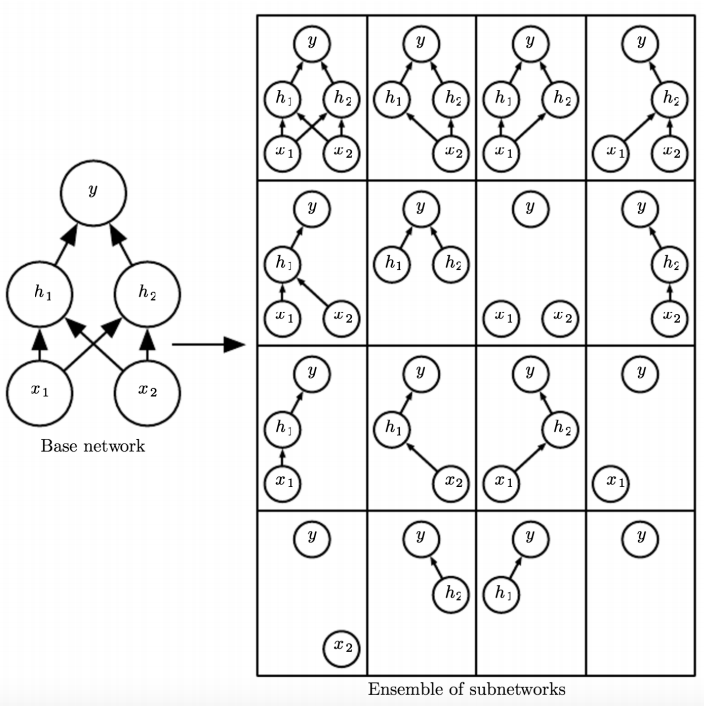{height="500"}
:::

::: {.column width="50%"}
-   Can be seen as training an ensemble of 2D different architectures with shared weights (where D is the number of units)
-   Avoids **co-adaptation**
:::
:::::

::: notes
-   **co-adaptation** refers to the phenomena where two neurons cancel each other out by learning essentially the same thing.
:::

## Dropout at Test Time

Don't do dropout at test time (why not?)

. . .

Multiply the weights by $1-p$ (why?)

. . .

::: notes
-   Dropout at test time would be like using one network of an ensemble.

-   Since the weights are on $1-p$ fraction of the time, multiplying the weights by $1-p$ matches the expected value of the activation magnitude (e.g. going into the next layer).
:::

## Summary of "Bag of Tricks"

. . .

-   Data Augmentation

. . .

-   Reducing the number of parameters

. . .

-   Weight decay

. . .

-   Early stopping

. . .

-   Ensembles

. . .

-   Stochastic regularization (e.g. dropout)

<!-- 04curves -->

# Diagnosing Issues using Learning Curves

## Why does the Training Curve look like his?

<!-- (From week 3 tutorial) -->

::::: columns
::: {.column width="35%"}
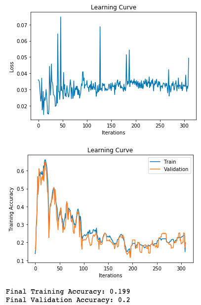{height="500"}
:::

::: {.column width="65%"}
-   The learning rate is too high
-   The learning rate is too low
-   The number of iterations is too low
-   The weights are all initialized to zero
:::
:::::

::: notes
-   Learning rate likely too high.
-   Loss curve shows jumps and no consistent decrease
:::

```{=html}
<!-- \begin{center}
\begin{minipage}{0.4 \linewidth}
  \includegraphics[width=\linewidth]{curve/curve1.png}
\end{minipage}
\begin{minipage}{0.4 \linewidth}
\begin{enumerate}
\item The learning rate is too high
\item The learning rate is too low
\item The number of iterations is too low
\item The weights are all initialized to zero
\end{enumerate}
\end{minipage}
\end{center} -->
```

## Why does the Training Curve look like this?

<!-- (From practice test) -->

::::: columns
::: {.column width="35%"}
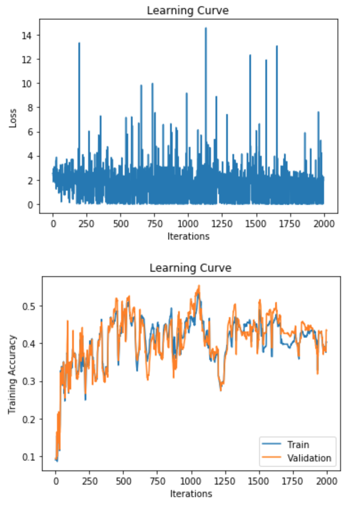{height="500"}
:::

::: {.column width="65%"}
-   The batch size is too small
-   Batch normalization was used
-   The number of parameters is too large
-   The learning rate is too small
:::
:::::

::: notes
-   Batch size likely too small.
-   Learning curve very noisy.
:::

```{=html}
<!-- \begin{center}
\begin{minipage}{0.4 \linewidth}
  \includegraphics[width=\linewidth]{curve/e3.png}
\end{minipage}
\begin{minipage}{0.4 \linewidth}
\begin{enumerate}
\item The batch size is too small
\item Batch normalization was used
\item The number of parameters is too large
\item The learning rate is too small
\end{enumerate}
\end{minipage}
\end{center} -->
```

<!-- (From old test) -->

## Why does the Training Curve look like this?

::::: columns
::: {.column width="35%"}
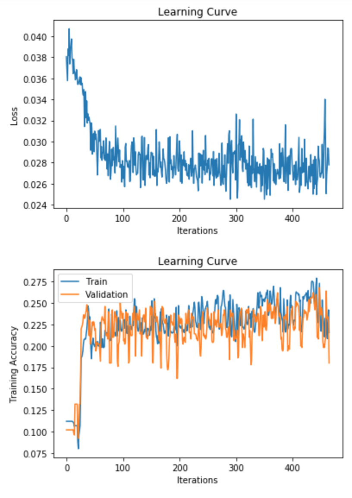{height="500"}
:::

::: {.column width="65%"}
-   The network probably has too few parameters
-   The network probably has too many parameters
-   The learning rate is probably too small
-   If weight decay is used, the lambda parameter is probably too large.
-   Either (1) or (4) could be true
:::
:::::

::: notes
-   Too few parameters as convergence stopped too early.
-   Too much weight decay has similar effect.
:::

```{=html}
<!-- \begin{center}
\begin{minipage}{0.4 \linewidth}
  \includegraphics[width=\linewidth]{curve/p1.png}
\end{minipage}
\begin{minipage}{0.4 \linewidth}
\begin{enumerate}
\item The network probably has too few parameters
\item The network probably has too many parameters
\item The learning rate is probably too small
\item If weight decay is used, the lambda parameter is probably too large.
\item Either (1) or (4) could be true
\end{enumerate}
\end{minipage}
\end{center} -->
```

## Why does the Training Curve look like this?

::::: columns
::: {.column width="35%"}
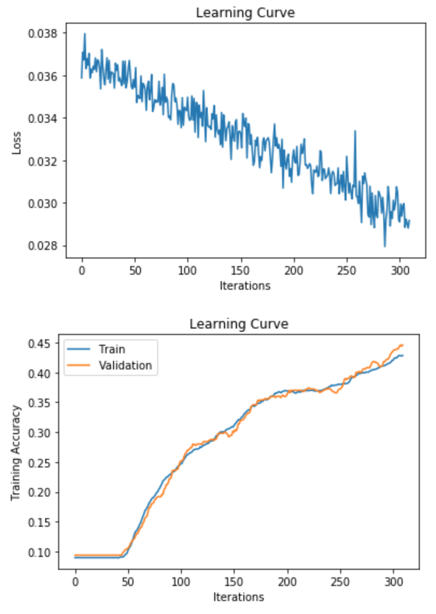{height="500"}
:::

::: {.column width="65%"}
-   Evidence of overfitting
-   Evidence of underfitting
-   Too much momentum
-   The weights were all initialized to 0
:::
:::::

::: notes
-   This model did not fit yet and is so far underfitting the data.
:::

```{=html}
<!-- \begin{center}
\begin{minipage}{0.4 \linewidth}
  \includegraphics[width=\linewidth]{curve/t1.png}
\end{minipage}
\begin{minipage}{0.4 \linewidth}
\begin{enumerate}
\item Evidence of overfitting
\item Evidence of underfitting
\item Too much momentum
\item The weights were all initialized to 0
\end{enumerate}
\end{minipage}
\end{center} -->
```

<!-- 05bias -->

# Bias-Variance Tradeoff

## Expected Test Error for Regression

. . .

-   Training set $D = \{(x_1, y_1), ..., (x_n, y_n)\}$ drawn i.i.d. from distribution $P(X,Y)$. Let's write this as $D \sim P^n$.

. . .

-   Assume for simplicity this is a regression problem with $y \in \mathbb{R}$ and $L_2$ loss.

. . .

-   What is the expected test error for a function $h_D(x)=y$ trained on the training set $D \sim P^n$, assuming a learning algorithm $\mathcal{A}$? It is:

## Method: RMSProp (cont'd)

The following update is applied to each coordinate j independently: \begin{align*}
\mathbb{E}_{D \sim P^n, (x,y) \sim P} \left[ (h_D(x) - y)^2 \right]
\end{align*}

## Expected Test Error for Regression II

\begin{align*}
\mathbb{E}_{D \sim P^n, (x,y) \sim P} \left[ (h_D(x) - y)^2 \right]
\end{align*}

. . .

-   The expectation is taken with respect to possible training sets $D \sim P^n$ and the test distribution P. Let's write the expectation as $\mathbb{E}_{D,x,y}$ for notational simplicity.

. . .

-   Note that this is the *expected test error* not the *empirical test error* that we report after training. How are they different?

## Decomposing the Expected Test Error

Let's start by adding and subtracting the same quantity \begin{multline*}
  \mathbb{E}_{D,x,y} \left[ \left(h_D(x) - y\right)^2 \right] \\
  = \mathbb{E}_{D,x,y} \left[ \left(h_D(x) - \hat{h}(x) + \hat{h}(x) - y\right)^2 \right]
\end{multline*}

. . .

$\hat{h}(x) = \mathbb{E}_{D \sim P^n}[h_D(x)]$ is the expected regressor over possible training sets, given the learning algorithm $\mathcal{A}$.

## Decomposing the Expected Test Error

After some algebraic manipulation ([proof](https://www.cs.cornell.edu/courses/cs4780/2018fa/lectures/lecturenote12.html)), we can show that:

\begin{multline*}
  \underbrace{\mathbb{E}_{D,x,y} \left[ (h_D(x) - y)^2 \right]}_{\text{Expected test error}} 
  = \underbrace{\mathbb{E}_{D,x} \left[\left(h_D(x) - \hat{h}(x)\right)^2 \right]}_{\text{Variance}} \\
  + \underbrace{\mathbb{E}_{x,y} \left[\left(\hat{y}(x) - y\right)^2 \right]}_{\text{Noise}} + 
         \underbrace{\mathbb{E}_{x} \left[\left(\hat{h}(x) - \hat{y}(x)\right)^2 \right]}_{\text{Bias}}
\end{multline*}

. . .

$\hat{y}(x) = \mathbb{E}_{y|x}[y]$ is the expected label given $x$. Labels might not be deterministic given x.

<!-- * You can find the proof in [this URL (*)](https://www.cs.cornell.edu/courses/cs4780/2018fa/lectures/lecturenote12.html) -->

# Differential Privacy

## What is Differential Privacy (DP)?

-   **Definition:** A mathematical framework for quantifying and controlling the privacy risks in data analysis.

. . .

-   **Goal:** Ensures that the inclusion or exclusion of a single data point does not significantly affect the output of a model.

. . .

**Why?**

. . .

-   Protects sensitive information in training data.

. . .

-   Prevents models from overfitting to individual samples.

## Definition of Differential Privacy

-   **Intuitive definition** An algorithm is *differentially private* if the addition or removal of a single data point does not significantly affect the output.

. . .

-   **Formal definition:** An algorithm is $\varepsilon$-differentially private if for all datasets ( D ) and ( D' ) differing in one element, and for all outputs ( S ):

\begin{align*}
\Pr[Model(D) = S] \leq \exp(\varepsilon) \cdot \Pr[Model(D') = S]
\end{align*}

## DP in Deep Learning

**Applying DP in Neural Networks:** Introduce noise to gradients during training.

. . .

**Mechanisms (DP-SGD)**

-   Clips gradients to a maximum norm.

. . .

-   Adds calibrated Gaussian noise to the gradients.

## Example – Healthcare Dataset

**Scenario:** Predicting Disease Risk

. . .

**Task:** A neural network is trained to predict the risk of a disease based on patient health records.

. . .

**Data:** Sensitive medical information such as diagnosis history.

## Example – Healthcare Dataset II

**What Happens Without DP?**

-   **Outcome:** The model performs well but memorizes some specific details from training samples.

. . .

-   **Risk:** If an attacker queries the model with information about a specific individual, the model could reveal their presence in the training set by giving a higher probability for that individual, leaking private information.

## Example – Healthcare Dataset III

**With DP:**

-   **Outcome:** The model's predictions are less influenced by any single training sample. The addition of noise prevents overfitting to specific patient data.

. . .

-   **Benefit:** The model's output is less likely to change noticeably even if a single patient's record is added or removed, protecting patient privacy.

## Example – E-Commerce Recommendations

**Scenario:** Personalized Product Recommendations

. . .

**Task:** A deep learning model recommends products based on customer browsing history and previous purchases.

. . .

**Data:** Includes user shopping patterns, age, and location.

## Example – E-Commerce Recommendations II

**Without DP:**

-   **Outcome:** The model gives highly personalized recommendations.

. . .

-   **Risk:** An attacker could infer specific details about individual users (e.g., based on specific product recommendations or similarities to other users' behaviors), leading to a privacy breach.

## Example – E-Commerce Recommendations III

**With DP:**

-   **Outcome:** Slightly less personalized recommendations but better generalization to unseen users.

. . .

-   **Benefit:** An attacker would have a much harder time inferring personal details from the recommendations, thanks to the noise added during model training.

# Wrap Up

## Summary

<center>{height="250"}</center>

<!-- 02optim -->

# Gradient Descent and SGD

## Learning Rate

The learning rate $\alpha$ is a hyperparameter we need to tune. Here are the things that can go wrong in batch mode:

<center>

| $\alpha$ too small: | $\alpha$ too large: | $\alpha$ much too large: |
|------------------------|------------------------|------------------------|
| {height="150"} | 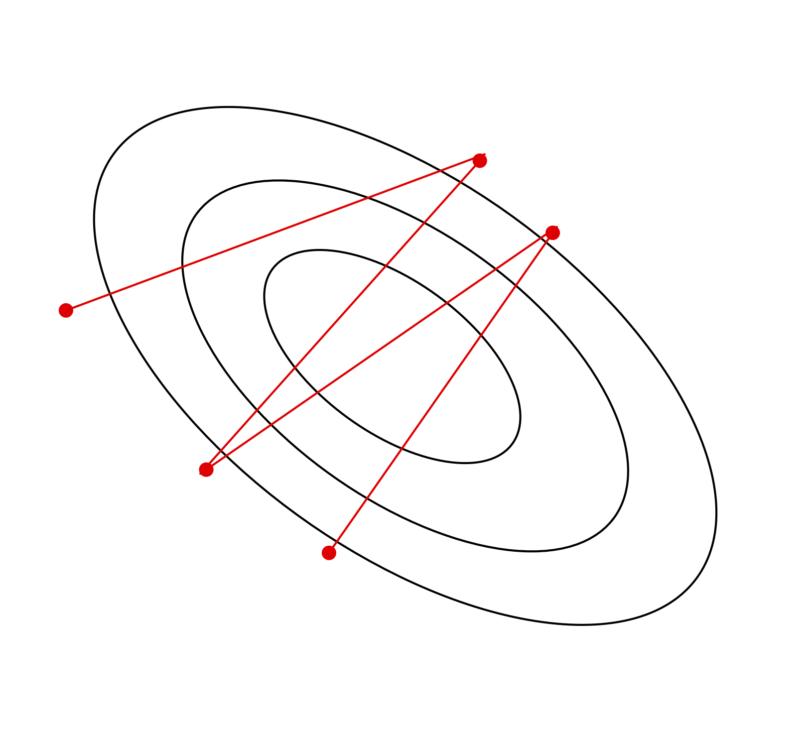{height="150"} | 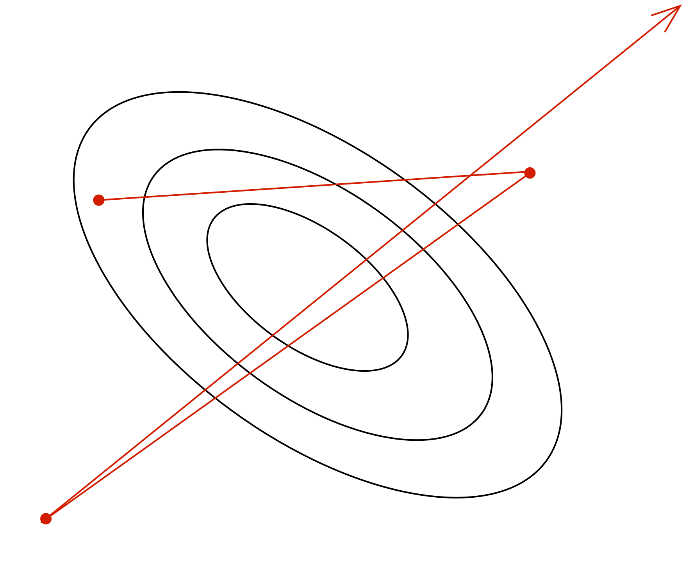{height="150"} |
| slow progress | oscillations | instability |

</center>

```{=html}
<!-- \begin{columns}
\begin{column}{0.25 \linewidth}
  \includegraphics[width=\linewidth]{imgs2/slow_progress.png}
  \begin{center}
    $\alpha$ too small: \\ slow progress
  \end{center}
\end{column}
\begin{column}{0.25 \linewidth}
  \includegraphics[width=\linewidth]{imgs2/oscillations.png}
  \begin{center}
    $\alpha$ too large: \\ oscillations
  \end{center}
\end{column}
\begin{column}{0.3 \linewidth}
  \includegraphics[width=\linewidth]{imgs2/instability.png}
  \begin{center}
    $\alpha$ much too large: \\ instability
  \end{center}
\end{column}
\end{columns} -->
```

## Stochastic Gradient Descent

Batch gradient descent moves directly downhill. SGD takes steps in a noisy direction, but moves downhill on average.

<center>

| batch gradient descent: | stochastic gradient descent: |
|------------------------------------|------------------------------------|
| 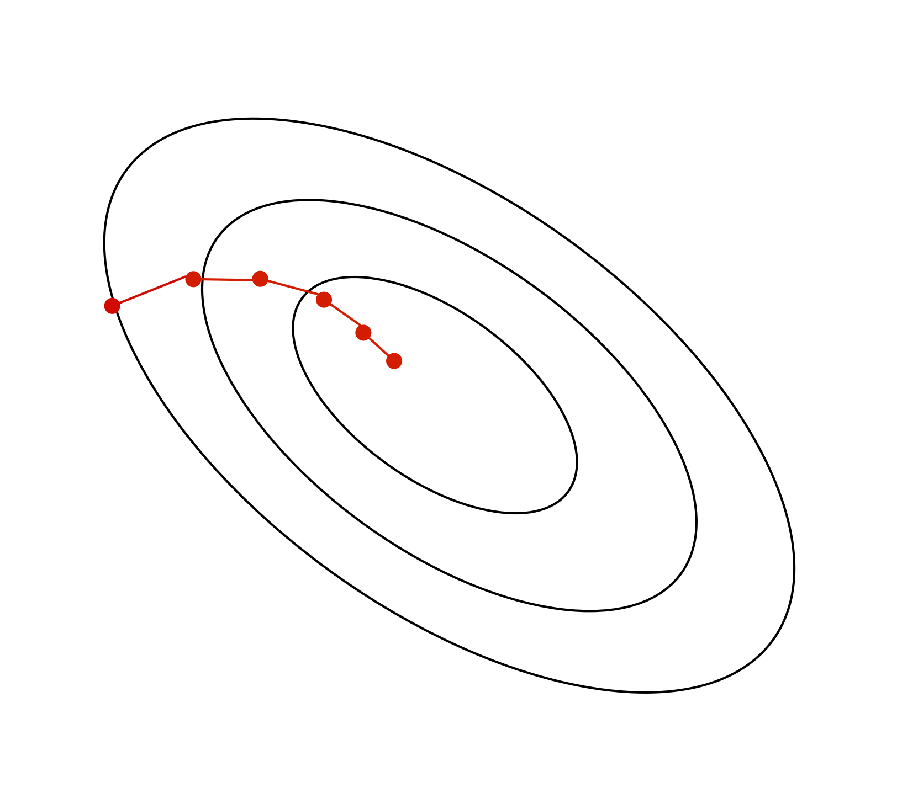{height="300"} | 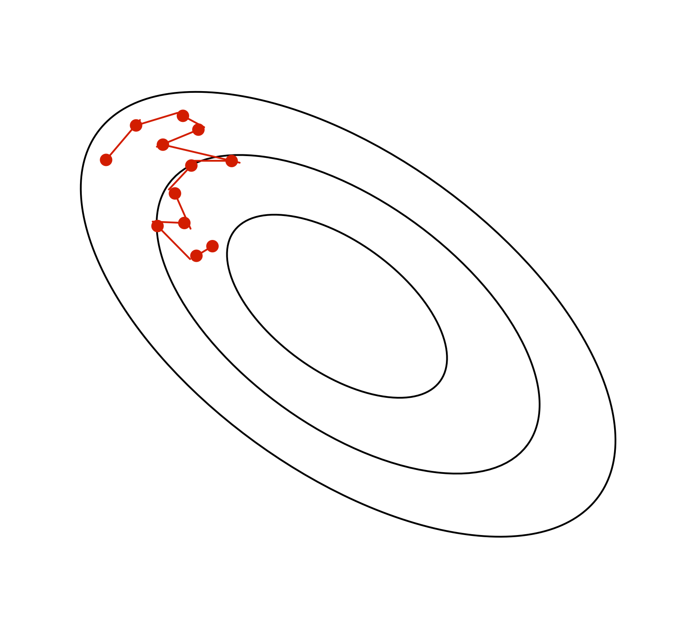{height="300"} |

</center>

```{=html}
<!-- \begin{columns}
\begin{column}{0.35 \linewidth}
  \includegraphics[width=\linewidth]{imgs2/batch_gradient_descent.png}
  \begin{center}
    {\bf \small batch gradient descent}
  \end{center}
\end{column}
    \begin{column}{0.4 \linewidth}
  \includegraphics[width=0.85\linewidth]{imgs2/sgd.png}
  \begin{center}
    {\bf \small stochastic gradient descent}
  \end{center}
\end{column}
\end{columns} -->
```

## SGD Learning Rate

In stochastic training, the learning rate also influences the *fluctuations* due to the stochasticity of the gradients.

<center>{height="250"}</center>

-   Use a large learning rate early in training so you can get close to the optimum
-   Gradually decay the learning rate to reduce the fluctuations

## SGD Batch Size

The tradeoff between smaller vs larger batch size

\begin{align*}
  \text{Var}\left[\frac{1}{S} \sum_{i=1}^S \frac{\partial \mathcal{L}^{(i)}}{\partial \theta_j}\right]
  &=
  \frac{1}{S^2} \text{Var} \left[\sum_{i=1}^S \frac{\partial \mathcal{L}^{(i)}}{\partial \theta_j} \right] \\
  &=
  \frac{1}{S} \text{Var} \left[\frac{\partial \mathcal{L}^{(i)}}{\partial \theta_j} \right]
\end{align*}

Larger batch size implies smaller variance, but at what cost?

## Training Curve (or Learning Curve)

To diagnose optimization problems, it's useful to look at **learning curves**: plot the training cost (or other metrics) as a function of iteration.

::::: columns
::: {.column width="45%"}
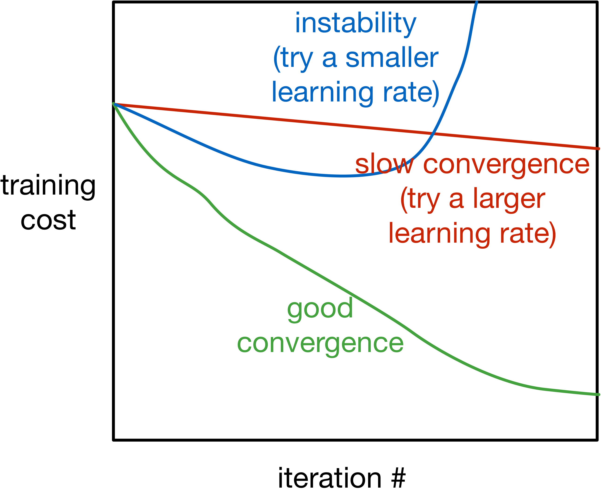{height="350"}
:::

::: {.column width="55%"}
-   **Note**: it's very hard to tell from the training curves whether an optimizer has converged. They can reveal major problems, but they can't guarantee convergence.
:::
:::::

## Visualizing Optimization Algorithms

You might want to check out these links:

-   An overview of gradient descent algorithms: <https://ruder.io/optimizing-gradient-descent>

-   CS231n: <https://cs231n.github.io/neural-networks-3/>

-   Why momentum really works: <https://distill.pub/2017/momentum/>

<!-- 03gen -->

# Generalization

## Questions

-   How do we choose between different neural network models?
    -   For example, different number of hidden units, hidden layers, ...?
-   **How do we know how well a model will perform on new data?**

## The Training Set

The training set is used

-   to determine the value of the **parameters**

The model's prediction accuracy over the training set is called the **training accuracy**.

## The Training Set (cont'd)

Q: Can we use the **training accuracy** to estimate how well a model will perform on new data?

. . .

-   No! It is possible for a model to fit well to the training set, but fail to *generalize*
-   We want to know how well the model performs on *new data* that we didn't already use to optimize the model

## Poor Generalization

<center>{height="380"} {height="380"}</center>

## Overfitting and Underfitting

Underfitting:

-   The model is simple and doesn't fit the data
-   The model does not capture *discriminative* features of the data

Overfitting:

-   The model is too complex and does not generalize
-   The model captures information about patterns in training set that happened by chance

```{=html}
<!--
## Preventing Overfitting

- Use a larger training set (expensive, often not feasible)
- Use a smaller network (requires starting over, might underfit)
- Other techniques (we'll explore later)
-->
```

## Overfitting and Underfitting (cont'd)

Overfitting:

-   The model is too complex and does not generalize
-   The model captures information about patterns in training set that happened by chance
    -   e.g. Ringo happens to be always wearing a red shirt in the training set
    -   Model learns: high red pixel content =\> predict Ringo

```{=html}
<!--
## Preventing Overfitting

- Use a larger training set (expensive, often not feasible)
- Use a smaller network (requires starting over, might underfit)
- Other techniques (we'll explore later)
-->
```

## The Test Set

We set aside a **test set** of labelled examples.

The model's prediction accuracy over the test set is called the **test accuracy**.

The purpose of the test set is to give us a good estimate of how well a model will perform on new data.

Q: In general, will the test accuracy be *higher* or *lower* than the training accuracy?

## Model Choices

But what about decisions like:

-   How many layers?
-   How many units in each layer?
-   What non-linear activation to use?

## Model Choices (cont'd)

Q: Why can't we use the test set to determine which model we should deploy?

. . .

-   If we use the test set to make modeling decisions, then we will overestimate how well our model will perform on new data!
-   We are "cheating" by "looking at the test"

## The Validation set

We therefore need a third set of labeled data called the **validation set**

The model's prediction accuracy over the validation set is called the **validation accuracy**.

This dataset is used to:

-   Make decisions about models that is **not continuous** and can't be optimized via gradient descent
-   Example: choose $k$, choose which features $x_j$ to use, choose $\alpha$, ...

## The Validation set (cont'd)

The model's prediction accuracy over the validation set is called the **validation accuracy**.

This dataset is used to:

-   Make decisions about models that is **not continuous** and can't be optimized via gradient descent
-   Example: choose $k$, choose which features $x_j$ to use, choose $\alpha$, ...
    -   These model settings are called **hyperparameters**
-   The validation set is used to optimize **hyperparameters**

## Splitting the data set

Example split:

-   60% Training
-   20% Validation
-   20% Test

The actual split depends on the amount of data that you have.

If you have more data, you can get a way with a smaller % validation and set.

## Detecting Overfitting

Learning curve:

::::: columns
::: {.column width="45%"}
{height="300"}
:::

::: {.column width="55%"}
-   **x-axis**: epochs or iterations
-   **y-axis**: cost, error, or accuracy
:::
:::::

Q: In which epochs is the model overfitting? Underfitting?

Q: Why don't we plot the test accuracy plot?

## Strategies to Prevent Overfitting

-   Data Augmentation
-   Reducing the number of parameters
-   Weight decay
-   Early stopping
-   Ensembles
-   Stochastic regularization (e.g. dropout)

```{=html}
<!--
- Collect more data: always the best first thing to try
    - data agumentation: add noise to the data
- Use a simpler model: doesn't work well in practice
- Early-stopping: stop training before training accuracy convergences
    - In practice, save (or **checkpoint**) the weights after every $E$ epochs. Use the weights that produce the highest validation accuracy
- Use a training strategy that reduces overfitting:
    - Example: weight decay, dropout
    -->
```

## Data Augmentation

The best way to improve generalization is to collect more data!

But if we already have all the data we're willing to collect. We can augment the training data by *transforming* the examples. This is called **data augmentation**.

## Data Augmentation (cont'd)

Example (for images, but depends on task):

-   translation
-   horizontal or vertical flip
-   rotation
-   smooth warping
-   noise (e.g. flip random pixels)

We should only warp the training examples, not the validation or test examples (why?)

## Reducing the Number of Parameters

Networks with fewer trainable parameters are less likely to overfit. We can reduce the number of layers, or the number of parameters per layer.

Adding a **bottleneck layer** is another way to reduce the number of parameters

## Reducing the Number of Parameters (cont'd)

Adding a **bottleneck layer** is another way to reduce the number of parameters

<center>{height="275"}</center>

In practise, this isn't a great idea.

## Weight Decay Idea

Idea: Penalize **large weights**, by adding a term (e.g. $\sum_k w_k ^ 2$) to the cost function

Q: Why is it not ideal to have large (absolute value) weights?

. . .

Because large weights mean that the prediction relies **a lot** on the content of one feature (e.g. one pixel)

## Small vs Large Weights

The red polynomial overfits. Notice it has really large coefficients

<center>{height="450"}</center>

## Weight Decay

-   $L^1$ regularization: add a term $\sum_{j=1}^D |w_j|$ to the cost function
    -   Mathematically, this term encourages weights to be exactly 0
-   $L^2$ regularization: add a term $\sum_{j=1}^D w_j^2$ to the cost function
    -   Mathematically, in each iteration the weight is pushed towards 0
-   Combination of $L^1$ and $L^2$ regularization: add a term $\sum_{j=1}^D |w_j| + w_j^2$ to the cost function

## Example: Weight Decay for Regression

Cost function:

$$\mathcal{E}({\bf w}, b) = \frac{1}{2N}\sum_i \left(\left({\bf w} {\bf x}^{(i)} + b\right) - t^{(i)}\right)^2$$

Cost function with weight decay:

$$\mathcal{E}_{WD}({\bf w}, b) = \frac{1}{2N}\sum_i \left(\left({\bf w} {\bf x}^{(i)} + b\right) - t^{(i)}\right)^2 + \lambda \sum_j w_j^2$$

## Weight Decay Nomanclature

$$\mathcal{E}_{WD}({\bf w}, b) = \frac{1}{2N}\sum_i \left(\left({\bf w} {\bf x}^{(i)} + b\right) - t^{(i)}\right)^2 + \lambda \sum_j w_j^2$$

$$\frac{\partial \mathcal{E}_{WD}}{\partial w_j} = \frac{\partial \mathcal{E}}{\partial w_j} + \lambda 2 w_j$$

So the gradient descent update rule becomes:

$$w_j \leftarrow w_j - \alpha\left(\frac{\partial \mathcal{E}}{\partial w_j} + 2 \lambda w_j\right)$$

## Early Stopping

Idea: Stop training when the validation error starts going up.

::::: columns
::: {.column width="45%"}
{height="350"}
:::

::: {.column width="55%"}
In practice, this is implemented by **checkpointing** (saving) the neural network weights every few iterations/epochs during training. <!-- <br>

Some other text that should be below the first paragraph. -->
:::
:::::

```{=html}
<!-- <center>
{ height=40% }
</center> -->
```

```{=html}
<!-- In practice, this is implemented by **checkpointing** (saving) the
neural network weights every few iterations/epochs during training. -->
```

We choose the checkpoint with the best validation error to actually use. (And if there is a tie, use the **earlier** checkpoint)

## Why does early stopping work?

Weights start off small, so it takes time for them to grow large.

Therefore, stopping early has a similar effect to weight decay.

If you're using sigmoid units, and the weights start out small, then the inputs to the activation functions take only a small range of values.

-   The neural network starts out approximately linear, and gradually becomes non-linear (and thus more powerful)

## Ensembles

If a loss function is convex (with respect to the predictions), you have a bunch of predictions for an input, and you don't know which one is best, you are always better off averaging them!

$$\mathcal{L}(\lambda_1 y_1 + \dots \lambda_N y_N, t) \le \lambda_1 \mathcal{L}(y_1, t) + \dots \lambda_N\mathcal{L}(y_N, t)$$

for $\lambda_i \ge 0$ and $\sum_i \lambda_i = 1$

**Idea**: Build multiple candidate models, and average the predictions on the test data.

This set of models is called an **ensemble**.

## Examples of Ensembles

-   Train neural networks starting from different random initialization (might not give enough diversity)
-   Train different network on different subset of the training data (called **bagging**)
-   Train networks with different architectures, hyperparameters, or use other machine learning models

Ensembles can improve generalization substantially.

However, ensembles are expensive.

## Stochastic Regularization

For a network to overfit, its computations need to be really precise. This suggests regularizing them by injecting noise into the computations, a strategy known as **stochastic regularization**.

One example is **dropout**: in each training iteration, random choose a portion of **activations** to set to 0.

## Stochastic Regularization (cont'd)

The probability $p$ that an activation is set to 0 is a hyperparameter.

<center>{height="30%"}</center>

## Dropout

::::: columns
::: {.column width="50%"}
{height="500"}
:::

::: {.column width="50%"}
Dropout can be seen as training an ensemble of 2D different architectures with shared weights (where D is the number of units)
:::
:::::

## Dropout at Test Time

Don't do dropout at test time (why not?)

Multiply the weights by $1-p$ (why?)

. . .

Since the weights are on $1-p$ fraction of the time, multiplying the weights by $1-p$ matches the expected value of the activation magnitude (e.g. going into the next layer).

## Summary of "Bag of Tricks"

-   Data Augmentation
-   Reducing the number of parameters
-   Weight decay
-   Early stopping
-   Ensembles
-   Stochastic regularization (e.g. dropout)

<!-- 04curves -->

# Diagnosing issues using learning curves

## Why does the training curve to look like this?

<!-- (From week 3 tutorial) -->

::::: columns
::: {.column width="35%"}
{height="500"}
:::

::: {.column width="65%"}
-   The learning rate is too high
-   The learning rate is too low
-   The number of iterations is too low
-   The weights are all initialized to zero
:::
:::::

```{=html}
<!-- \begin{center}
\begin{minipage}{0.4 \linewidth}
  \includegraphics[width=\linewidth]{curve/curve1.png}
\end{minipage}
\begin{minipage}{0.4 \linewidth}
\begin{enumerate}
\item The learning rate is too high
\item The learning rate is too low
\item The number of iterations is too low
\item The weights are all initialized to zero
\end{enumerate}
\end{minipage}
\end{center} -->
```

## Why does the training curve to look like this?

<!-- (From practice test) -->

::::: columns
::: {.column width="35%"}
{height="500"}
:::

::: {.column width="65%"}
-   The batch size is too small
-   Batch normalization was used
-   The number of parameters is too large
-   The learning rate is too small
:::
:::::

```{=html}
<!-- \begin{center}
\begin{minipage}{0.4 \linewidth}
  \includegraphics[width=\linewidth]{curve/e3.png}
\end{minipage}
\begin{minipage}{0.4 \linewidth}
\begin{enumerate}
\item The batch size is too small
\item Batch normalization was used
\item The number of parameters is too large
\item The learning rate is too small
\end{enumerate}
\end{minipage}
\end{center} -->
```

<!-- (From old test) -->

## Why does the training curve to look like this?

::::: columns
::: {.column width="35%"}
{height="500"}
:::

::: {.column width="65%"}
-   The network probably has too few parameters
-   The network probably has too many parameters
-   The learning rate is probably too small
-   If weight decay is used, the lambda parameter is probably too large.
-   Either (1) or (4) could be true
:::
:::::

```{=html}
<!-- \begin{center}
\begin{minipage}{0.4 \linewidth}
  \includegraphics[width=\linewidth]{curve/p1.png} 
\end{minipage}
\begin{minipage}{0.4 \linewidth}
\begin{enumerate}
\item The network probably has too few parameters
\item The network probably has too many parameters
\item The learning rate is probably too small
\item If weight decay is used, the lambda parameter is probably too large.
\item Either (1) or (4) could be true
\end{enumerate}
\end{minipage}
\end{center} -->
```

## Why does the training curve to look like this?

::::: columns
::: {.column width="35%"}
{height="500"}
:::

::: {.column width="65%"}
-   Evidence of overfitting
-   Evidence of underfitting
-   Too much momentum
-   The weights were all initialized to 0
:::
:::::

```{=html}
<!-- \begin{center}
\begin{minipage}{0.4 \linewidth}
  \includegraphics[width=\linewidth]{curve/t1.png}
\end{minipage}
\begin{minipage}{0.4 \linewidth}
\begin{enumerate}
\item Evidence of overfitting
\item Evidence of underfitting
\item Too much momentum
\item The weights were all initialized to 0
\end{enumerate}
\end{minipage}
\end{center} -->
```

<!-- 05bias -->

# Bias-Variance Tradeoff

## Expected Test Error for Regression

-   Training set $D = \{(x_1, y_1), ..., (x_n, y_n)\}$ drawn i.i.d. from distribution $P(X,Y)$. Let's write this as $D \sim P^n$.

-   Assume for simplicity this is a regression problem with $y \in \mathbb{R}$ and $L_2$ loss.

-   What is the expected test error for a function $h_D(x)=y$ trained on the training set $D \sim P^n$, assuming a learning algorithm $\mathcal{A}$? It is:

\begin{align*}
\mathbb{E}_{D \sim P^n, (x,y) \sim P} \left[ (h_D(x) - y)^2 \right]
\end{align*}

## Expected Test Error for Regression (cont'd)

\begin{align*}
\mathbb{E}_{D \sim P^n, (x,y) \sim P} \left[ (h_D(x) - y)^2 \right]
\end{align*}

-   The expectation is taken with respect to possible training sets $D \sim P^n$ and the test distribution P. Let's write the expectation as $\mathbb{E}_{D,x,y}$ for notational simplicity.

-   Note that this is the *expected test error* not the *empirical test error* that we report after training. How are they different?

## Decomposing the Expected Test Error

Let's start by adding and subtracting the same quantity \begin{align*}
  \mathbb{E}_{D,x,y} \left[ \left(h_D(x) - y\right)^2 \right] = \mathbb{E}_{D,x,y} \left[ \left(h_D(x) - \hat{h}(x) + \hat{h}(x) - y\right)^2 \right]
\end{align*}

$\hat{h}(x) = \mathbb{E}_{D \sim P^n}[h_D(x)]$ is the expected regressor over possible training sets, given the learning algorithm $\mathcal{A}$.

$\hat{y}(x) = \mathbb{E}_{y|x}[y]$ is the expected label given $x$. Labels might not be deterministic given x.

## Decomposing the Expected Test Error

After some algebraic manipulation ([proof](https://www.cs.cornell.edu/courses/cs4780/2018fa/lectures/lecturenote12.html)), we can show that:

\begin{align*}
  \underbrace{\mathbb{E}_{D,x,y} \left[ (h_D(x) - y)^2 \right]}_{\text{Expected test error}} =\;& \underbrace{\mathbb{E}_{D,x} \left[\left(h_D(x) - \hat{h}(x)\right)^2 \right]}_{\text{Variance}} + \\
    & \underbrace{\mathbb{E}_{x,y} \left[\left(\hat{y}(x) - y\right)^2 \right]}_{\text{Noise}} + \\
        & \underbrace{\mathbb{E}_{x} \left[\left(\hat{h}(x) - \hat{y}(x)\right)^2 \right]}_{\text{Bias}}
\end{align*}

<!-- * You can find the proof in [this URL (*)](https://www.cs.cornell.edu/courses/cs4780/2018fa/lectures/lecturenote12.html) -->

## Bias, Variance, ...

-   **Variance**: Captures how much your regressor $h_D$ changes if you train on a different training set. How "over-specialized" is your regressor $h_D$ to a particular training set $D$? I.e. how much does it overfit? If we have the best possible model for our training data, how far off are we from the average regressor $\hat{h}$?

-   **Bias**: What is the inherent error that you obtain from your regressor $h_D$ even with infinite training data? This is due to your model being "biased" to a particular kind of solution (e.g. linear model). In other words, bias is inherent to your model/architecture.

## ... and Noise

-   **Noise**: How big is the data-intrinsic noise? This error measures ambiguity due to your data distribution and feature representation. You can never beat this, it is an aspect of the physical data generation process, over which you have no control. You cannot improve this with more training data. It is sometimes called "aleatoric uncertainty".

## The Bias-Variance Tradeoff

::::: columns
::: {.column width="50%"}
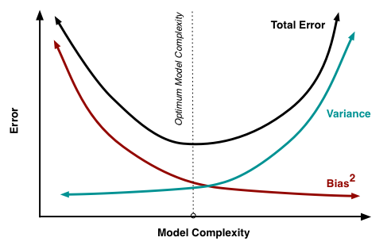{height="325"}
:::

::: {.column width="50%"}
-   If you use a high-capacity model, you will get low bias, but the variance over different training sets will be high.
:::
:::::

<!-- { height=35% } -->

<!-- - If you use a high-capacity model, you will get low bias, but the variance over different training sets will be high. -->

-   If you use a low-capacity model, you will get high bias, but the variance over different training sets will be low.

-   There is a sweet spot that trades off between the two.