# Lecture Plan

-   CNN Feature Visualization and Interpretation
-   Transfer Learning
-   Adversarial Examples
-   Influence Functions

<!-- 01arch -->

# CNN Review

## Example CNN: AlexNet

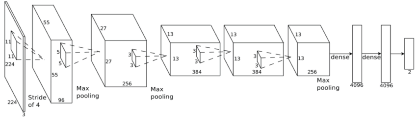

``` python
import torchvision.models
alexNet = torchvision.models.alexnet(pretrained=False)
```

## Convolutional Features

<center>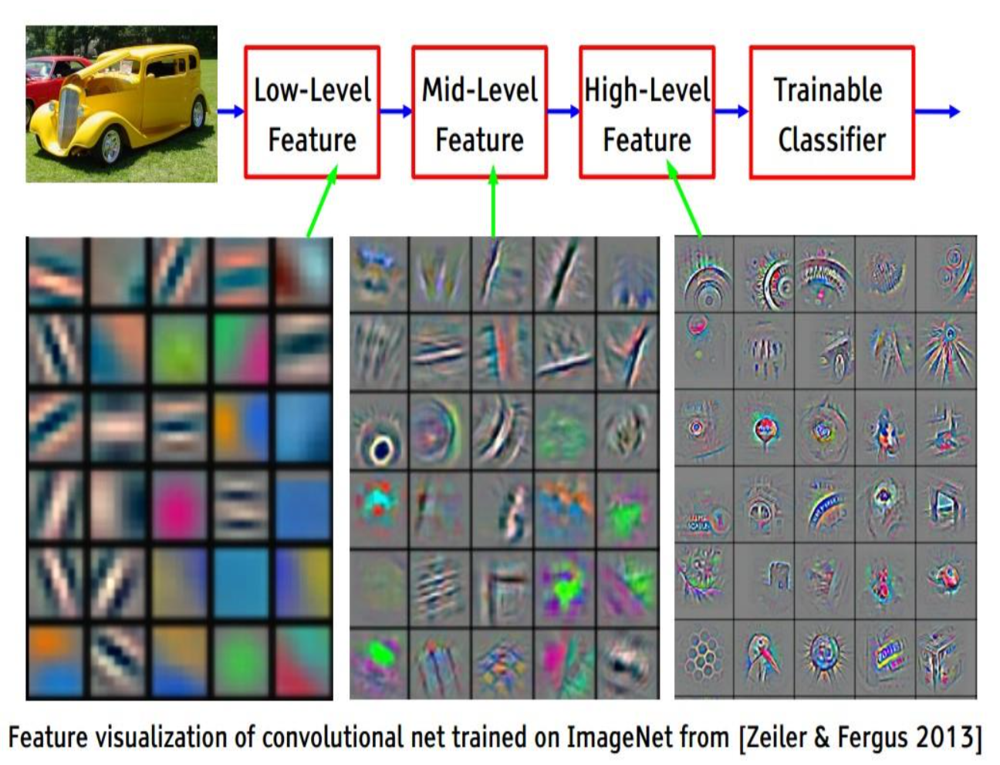{height="600"}</center>

## Receptive Fields

Because of downsampling (pooling and use of strides), higher-layer filters "cover" a larger region of the input than equal-sized filters in the lower layers.

## Transfer Learning

**Transfer Learning** is the idea of using weights/features trained on one task, and using it on another task.

We already saw the idea of transfer learning in project 2:

-   Train a model to predict the next work given the previous three
-   Use the weights to determine word similarities

## Transfer Learning with CNN

Practioners rarely train a CNN "from scratch". Instead we could:

1.  Take a pre-trained CNN model (e.g. AlexNet), and use its features network to compute **image features**, which we then use to classify our own images
2.  Initialize our weights using the weights of a pre-trained CNN model (e.g. AlexNet)

<center>{height="200"}</center>

## Transfer Learning with CNN

<center>{height="250"}</center>

What we want you to know:

-   How do we interpret CNN figures?
-   How were these architectures different from the previous?
-   What new idea was introduced?

## AlexNet (2012)


``` python
import torchvision.models
alexNet = torchvision.models.alexnet(pretrained=False)
```

## VGG (2014)

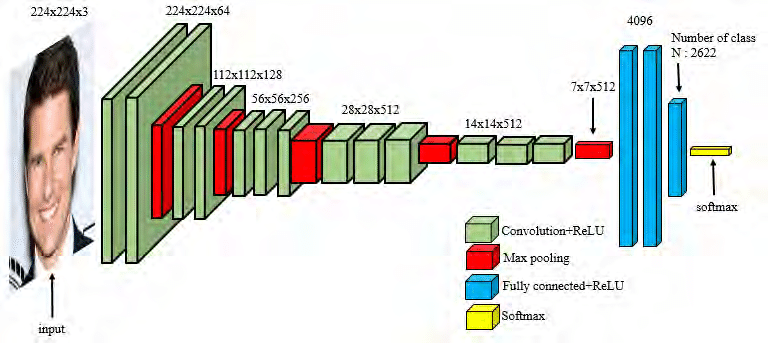

``` python
# There are many VGG versions
vgg16 = torchvision.models.vgg.vgg16(pretrained=False)
vgg19 = torchvision.models.vgg.vgg19(pretrained=False)
```

## What is new in VGG (compared to AlexNet)?

<center>{height="170"} {height="170"}</center>

. . .

-   VGG uses very small receptive fields ($3 \times 3$ instead of $11 \times 11$)
-   VGG incorporates $1 \times 1$ convolutional layers (why?)

## What is new in VGG (compared to AlexNet)?

<center>{height="170"} {height="170"}</center>

-   FC layers can be expressed as CONV layers and vice versa
-   E.g. FC layer with 4096 output units looking at an input volume of 7 x 7 x 512 is equivalent to a CONV layer with kernel size 7, stride 1, and 4096 filters.
-   See <https://cs231n.github.io/convolutional-networks/>.

## One More Idea...

Most of these networks have **fully connected layers** at the very end.

-   Pro: Fully connected layers computes features on the *entire* image
-   Con: what if we wanted to work with images of various sizes?

## One More Idea...

Idea: instead of fully connected layers, we could...

-   Use a convolution layer with the same kernel size as hidden unit size and no padding
-   Use global average-pooling

This is more frequently done on pixel-wise prediction problems, which we'll see later in this course.

<!-- 02interp -->

# Interpreting CNNs

## How do CNNs Work?

Convolutional neural networks are successful, but how do we know that the network has learned useful patterns from the training set?

Interpretation of deep learning models is a challenge, but there are some tricks we can use to interpret CNN models

## Weight Visualization

Recall: we can understand what first-layer features in a MLP are doing by visualizing the weight matrices (left)

<center>{height="300"} 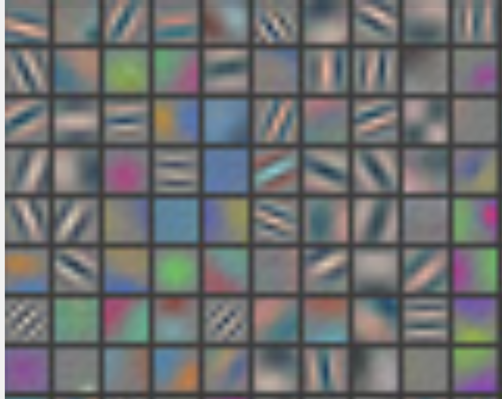{height="300"}</center>

We can do the same thing with convolutional networks (right)

But what about higher-level features?

## Feature Visualization

One approach: pick the images in the training set which activate a unit most strongly.

::::: columns
::: {.column width="50%"}
(Compute forward pass for each image in the training set, track when a feature was **most** active, and look for the portion of the image that lead to that activation)

Here is the visualization for layer 1:
:::

::: {.column width="50%"}
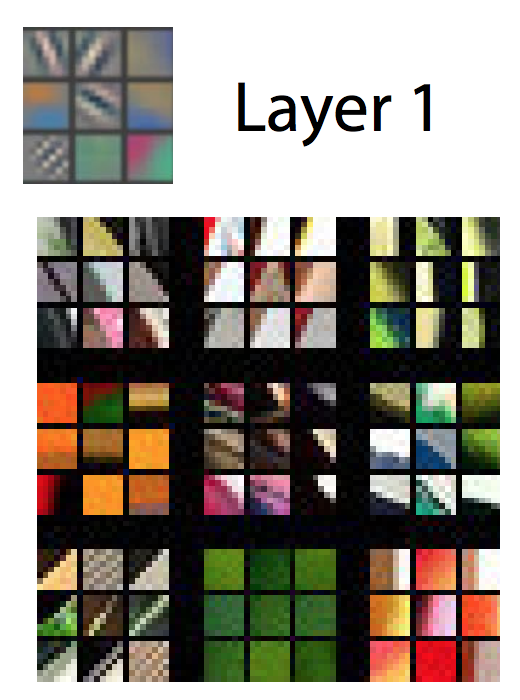{height="450"}
:::
:::::

## Feature Visualization: Layer 2

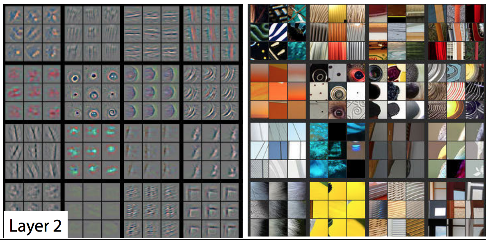{height="70%"}

## Feature Visualization: Layer 3

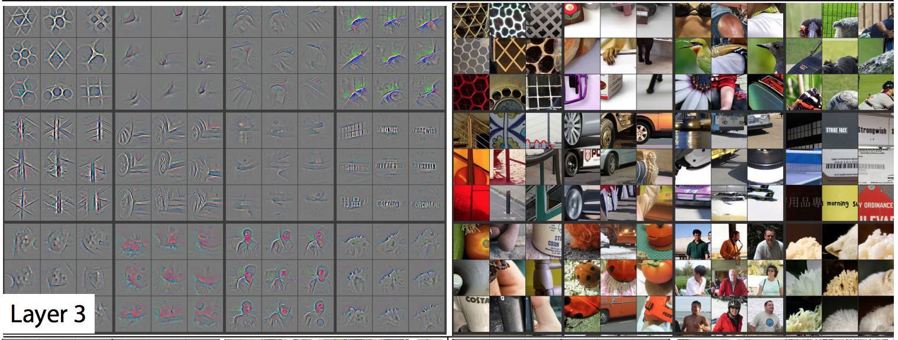{height="70%"}

## Feature Visualization: Layer 4

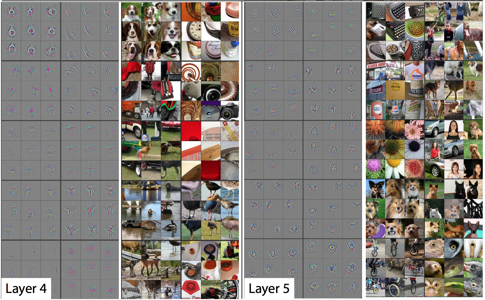{height="70%"}

## The issue with feature visualizations

Higher layer seems to pick up more abstract, high-level information.

Problem: Can't tell what unit is actually responding in the image!

Maybe we can use input gradients?

## Input Gradients

Recall this computation graph:

<center>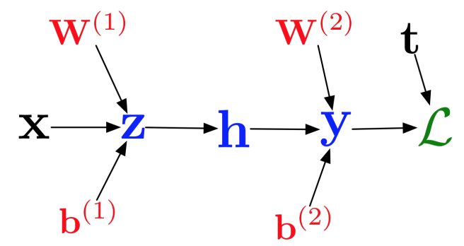{height="300"}</center>

From this graph, we could compute $\frac{\partial L}{\partial x}$ -- the model's sensitivity with respect to the input.

(We've never done this because there hasn't been a need to---until now!)

```{=html}
<!--
We can use this gradient to interpret (or break) the model:

- Visualizing what learned features represent
- Adversarial Inputs
- "Deep Dream"
-->
```

## The Problem with Input Gradients

Input gradients can be noisy and hard to interpret

Take a good object recognition conv net and compute the gradient of $\log\left(p(y = \text{"deer"}|{\bf x})\right)$

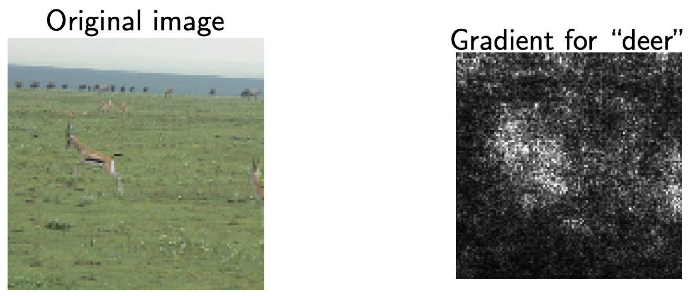{height="30%"}

## Smoothing the Input Gradients

Several methods modify these gradients:

-   Guided Backprop: accumulate only **positive gradients** when doing back propagation
-   SmoothGrad: do the backward pass on a few noisy version of the input image, then average their input gradients

<center>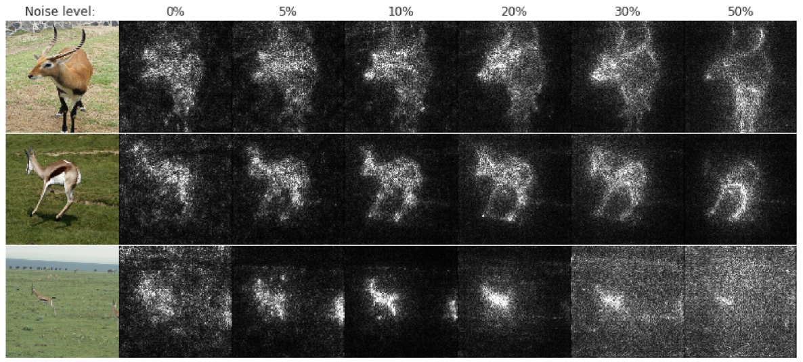{height="250"}</center>

## Cautionary Tale of Image Gradients

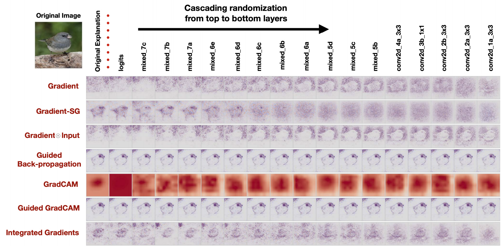{height="70%"}

From: <https://proceedings.neurips.cc/paper/2018/file/294a8ed24b1ad22ec2e7efea049b8737-Paper.pdf>

## Optimizing an Image to Maximize Activations

Can we use gradient ascent on an image to maximize the activation of a given neuron?

Requires a few tricks to make this work; see <https://distill.pub/2017/feature-visualization/>

## .

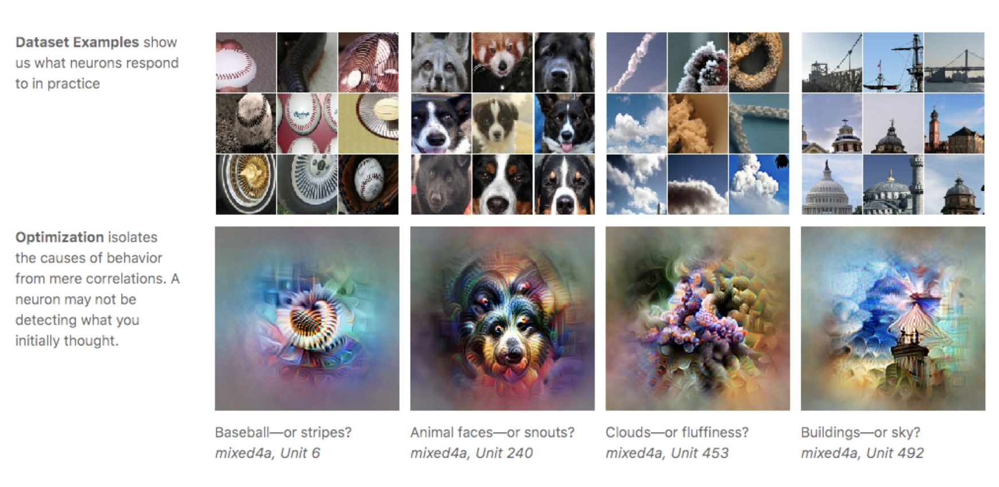{height="80%"}

## Deep Dream

Similar idea:

-   Start with an image, and run a conv net on it.
-   Pick a layer in the network.
-   Change the image such that units which were already highly activated get activated even more strongly. "Rich get richer."
-   Repeat.

This will accentuate whatever features of an image already kind of resemble the object ([link](https://ai.googleblog.com/2015/06/inceptionism-going-deeper-into-neural.html)).

<!-- 03adv -->

# Adversarial Examples

## What are these Images of?

<center>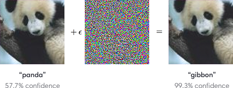{height="300"}</center>

. . .

**Producing adversarial images**: Given an image for one category (e.g. panda), compute the image gradient to maximize the network’s output unit for a different category (e.g. gibbon)

## Non-targetted Adversarial Attack

**Goal**: Choose a small perturbation $\epsilon$ on an image $x$ so that a neural network $\, f$ misclassifies $\, x + \epsilon$.

**Approach**:

Use the same optimization process to choose $\epsilon$ to **minimize** the probability that

$$f(x + \epsilon) = \text{correct class}$$

## Targeted Adversarial Attack

**Targeted attack**

Maximize the probability that $f(x + \epsilon) =$ target incorrect class

**Non-targeted attack**

Minimize the probability that $f(x + \epsilon) =$ correct class

## .

Demo time!

## Adversarial Attack

-   2013: ha ha, how cute!
    -   The paper which introduced adversarial examples was titled "Intriguing Properties of Neural Networks."
-   2018+: serious security threat
    -   Nobody has found a reliable method yet to defend against them!
    -   7 of 8 proposed defenses accepted to ICLR 2018 were cracked within days.

## White-box vs Black-box Adversarial Attacks

Adversarial examples transfer to different networks trained on a totally separate training set!

**White-box Adversarial Attack**: Model architecture and weights are known, so we can compute gradients. (What we've been doing so far in the demos)

## White-box vs Black-box Adversarial Attacks

**Black-box Adversarial Attack**: Model architecture and weights are unknown.

-   You don’t need access to the original network!
-   You can train up a new network to match its predictions, and then construct adversarial examples for that.

Attack carried out against proprietary classification networks accessed using prediction APIs (MetaMind, Amazon, Google)

## Adversarial Examples in 3D

It is possible to have a 3D object that gets misclassified by a neural network from all angles.

<https://www.youtube.com/watch?v=piYnd_wYlT8>

## Printed Adversarial Examples

It is possible for a printed image to cause object detection to fail.

<https://www.youtube.com/watch?v=MIbFvK2S9g8>

<!-- 04influence -->

# Influence Functions

## What if we exclude a training point?

-   Let's suppose we have a training set $D=\{(x_1,\, y_1),\, \ldots,\, (x_N,\, y_N)\}$

-   We typically solve the following problem on the training data:

\begin{align*}
    \hat{\theta} = \text{argmin}_{\theta} \frac{1}{N} \left[\sum_{i=1}^{N} L\left(x_i,\, y_i;\, \theta\right) \right]
\end{align*}

## What if we exclude a training point?

-   How much does the optimum change if we weight point $(x,\, y) \in D$ by $1+\epsilon$?

\begin{align*}
    \hat{\theta}({\epsilon}) = \text{argmin}_{\theta} \frac{1}{N} \left[ \sum_{i=1}^{N} L(x_i, y_i; \theta) \right] + \epsilon L(x,y; \theta)
\end{align*}

-   Removing point $(x,\, y)$ from $D$ means computing $\hat{\theta}({\epsilon})$ for $\epsilon=-1/N$

## Do We Need to Compute $\hat{\theta}({\epsilon})$ from Scratch?

-   Not exactly. We can approximate it using Taylor expansion:

\begin{align*}
    \hat{\theta}({\epsilon}) \approx \hat{\theta} + \epsilon\frac{d\hat{\theta}(\epsilon)}{d\epsilon} {\Bigr |}_{\epsilon=0}
\end{align*}

-   The derivative $\frac{d\hat{\theta}(\epsilon)}{d\epsilon}{\Bigr |}_{\epsilon=0}$ is called the influence of point $(x,y)$ on the optimum. We denote it as $\mathcal{I}(x,y)$.

-   How do we compute it?

## Computing $\mathcal{I}(x,\, y)$, the influence of training point $(x,\, y)$

-   Let's denote $R(\theta)=\frac{1}{N}\sum_{i=1}^{N}L(x_i, y_i; \theta)$

-   Since $\hat{\theta}({\epsilon}) = \text{argmin}_{\theta} \left[ R(\theta) + \epsilon L(x,y; \theta) \right]$ we have

\begin{align*}
    0 = \nabla_{\theta}R(\theta) + \epsilon \nabla_{\theta}L(x,y; \theta) {\Bigr |}_{\theta=\hat{\theta}(\epsilon)}
\end{align*}

## Computing $\mathcal{I}(x,\, y)$, the influence of training point $(x,\, y)$

-   But the RHS expression depends on $\hat{\theta}(\epsilon)$, whereas we'd like it to depend on $\hat{\theta}$. Let's apply Taylor series expansion on the RHS, in order to do that:

\begin{multline*}
0 \approx \nabla_{\theta}R(\hat{\theta}) + \epsilon \nabla_{\theta}L(x,y; \hat{\theta})\\ + \left[ \nabla_{\theta}^2 R(\hat{\theta})
  + \epsilon \nabla_{\theta}^2 L(x,y; \hat{\theta}) \right](\hat{\theta}(\epsilon) - \hat{\theta})
\end{multline*}

-   $\hat{\theta}$ is the minimizer of $R(\theta)$, so $\nabla_{\theta}R(\hat{\theta})=0$

## Computing $\mathcal{I}(x,\, y)$, the influence of training point $(x,\, y)$

-   So, the RHS expression becomes:

\begin{align*}
    \hat{\theta}(\epsilon) - \hat{\theta} \approx -\left[ \nabla_{\theta}^2 R(\hat{\theta}) + \epsilon \nabla_{\theta}^2 L(x,y; \hat{\theta}) \right]^{-1} \nabla_{\theta}L(x,y; \hat{\theta})\epsilon
\end{align*}

-   Or equivalently:

\begin{align*}
    \frac{\hat{\theta}(\epsilon) - \hat{\theta}}{\epsilon} \approx -\left[ \nabla_{\theta}^2 R(\hat{\theta}) + \epsilon \nabla_{\theta}^2 L(x,y; \hat{\theta}) \right]^{-1} \nabla_{\theta}L(x,y; \hat{\theta})
\end{align*}

## Computing $\mathcal{I}(x,\, y)$, the Influence of Training Point $(x,\, y)$

-   And as $\epsilon \rightarrow 0$:

\begin{align*}
    \frac{d \hat{\theta}(\epsilon)}{d \epsilon} {\Bigr |}_{\epsilon=0} \approx -\left[ \nabla_{\theta}^2 R(\hat{\theta}) \right]^{-1} \nabla_{\theta}L(x,y; \hat{\theta})
\end{align*}

-   So, we have an approximate way to compute the influence $\mathcal{I}(x,y)$ as a function of $\hat{\theta}$, without re-running the entire optimization process!

## Why is this important?

-   Because we can compute the sensitivity of the optimal weights to a training point

-   We can also compute the sensitivity of the test loss to a training point!

-   Consider a test point $(u,v)$, a training point $(x,y)$, and the test loss $L(u,v; \hat{\theta})$

-   How sensitive is $L(u,v; \hat{\theta}(\epsilon))$ to a perturbation $\hat{\theta}(\epsilon)$ where we have upweighted the training point $(x,y)$?

## Why is this important?

-   How sensitive is $L(u,v; \hat{\theta}(\epsilon))$ to a perturbation $\hat{\theta}(\epsilon)$ where we have upweighted the training point $(x,y)$?

-   Using chain rule:

\begin{align*}
\frac{d L(u,v; \hat{\theta}(\epsilon))}{d \epsilon} {\Bigr |}_{\epsilon=0} = \frac{d L(u,v; \theta)}{d \theta}{\Bigr |}_{\theta=\hat{\theta}} \frac{d \hat{\theta}(\epsilon)}{d \epsilon}{\Bigr |}_{\epsilon=0}
\end{align*}

-   We do not have to re-run the optimization process here either!