# Lecture Overview

## Last Week

::: incremental
-   CNN Feature Visualization and Interpretation
-   Transfer Learning
-   Adversarial Examples
-   Influence Functions
:::

## This week

::: incremental
-   Recurrent Neural Networks
-   Sentiment Analysis with Recurrent Neural Networks
-   Gradient Explosion and Vanishing
-   Text Generation with RNN
-   Sequence-to-Sequence Modelling
:::

<!-- 01rnn -->

# Recurrent Neural Networks

## Goal and Overview

Sometimes we're interested in making predictions about data in the form of **sequences**. Some examples are:

. . .

-   Given the price of a stock in the last week, predict whether stock price will go up

. . .

-   Given a sentence (sequence of chars/words) predict its sentiment

. . .

-   Given a sentence in English, translate it to French

. . .

This last example is a **sequence-to-sequence prediction** task, because both inputs and outputs are sequences.

## Language Model

We have already seen neural language models that make the **Markov Assumption**:

$$p(w_i | w_1, \ldots, w_{i-1}) = p(w_i | w_{i-3}, w_{i-2}, w_{i-1})$$

. . .

This means the model is **memoryless**, so it can only use information from its immediate context.

. . .

<center>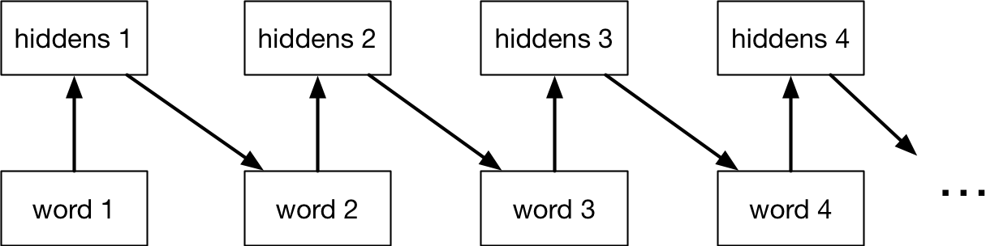{height="270"}</center>

::: notes
-   In this image, the context length is 1.
:::

## Recurrent Neural Network

But sometimes long-distance context can be important.

. . .

If we add connections between the hidden units, it becomes a **recurrent neural network (RNN)**.

. . .

Having a memory lets an RNN use longer-term dependencies:

<center>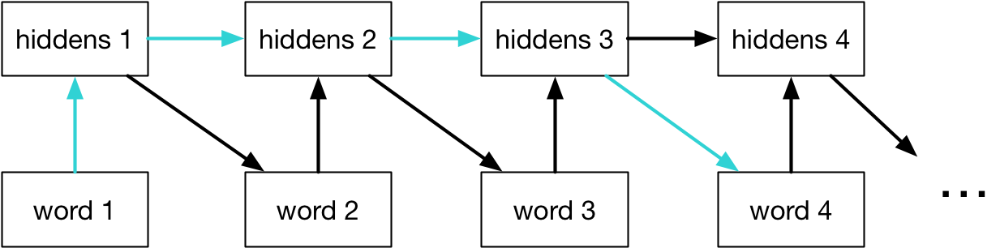{height="30%"}</center>

## RNN Diagram

We can think of an RNN as a dynamical system with one set of hidden units which feed into themselves. The network's graph would then have self-loops.

. . .

We can **unroll** the RNN's graph by explicitly representing the units at all time steps. The weights and biases are shared between all time steps

<center>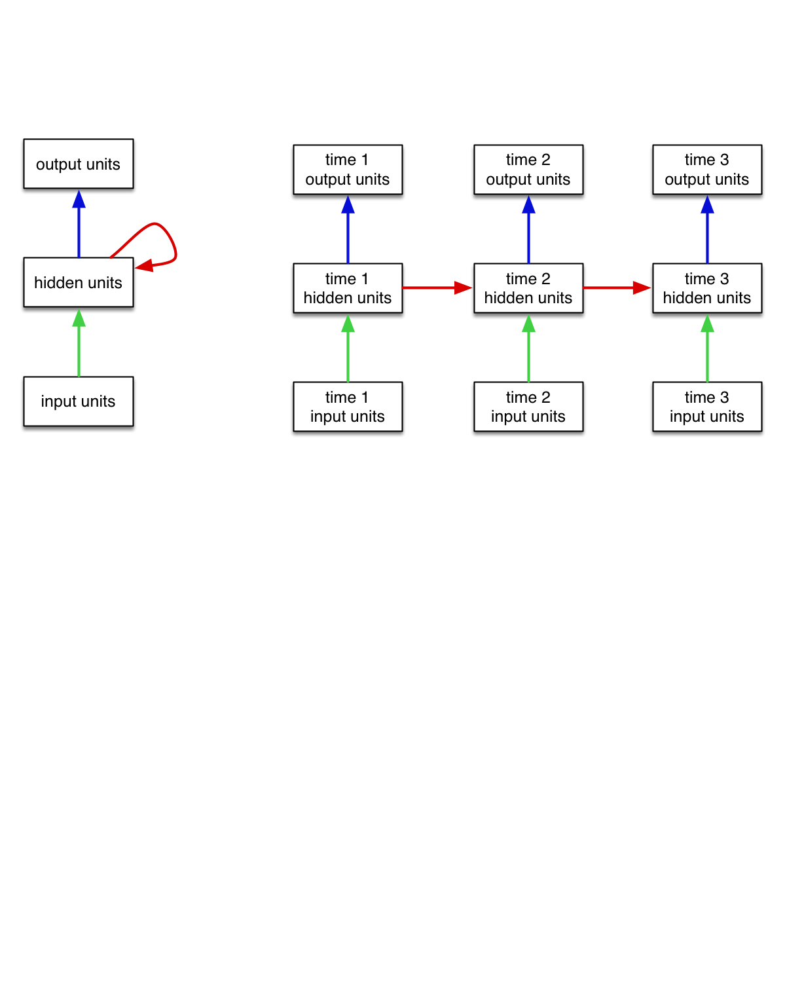{width="400"}</center>

## Simple RNNs

Let's go through a few examples of very simple RNNs to understand how RNNs compute predictions.

## Simple RNN Example: Sum

This simple RNN takes a sequence of numbers as input (scalars), and sums its inputs.

<center>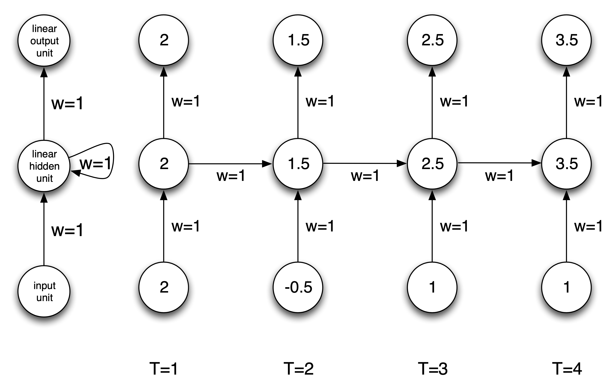{height="500"}</center>

## Simple RNN Example 2: Comparison

This RNN takes a sequence of **pairs of numbers** as input, and determines if the total values of the first or second input are larger:

<center>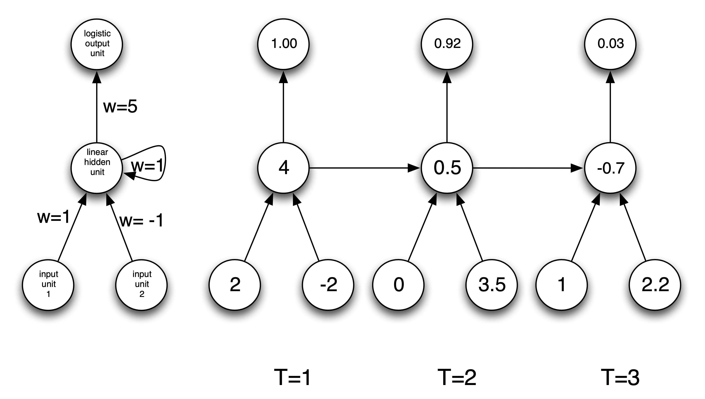{height="450"}</center>

## Simple RNN Example 3: Parity

Assume we have a sequence of binary inputs. We'll consider how to determine the **parity**, i.e. whether the number of 1's is even or odd. We can compute parity incrementally by keeping track of the parity of the input so far:

<center>

| [Parity bits:]{style="color:red;"} |   | \color{blue} [Input:]{style="color:blue;"} |
|--------------------------|--------------------|--------------------------|
| [0 1 1 0 1 1]{style="color:red;"} | $\longrightarrow$ | [0 1 0 1 1 0 1 0 1 1]{style="color:blue;"} |

</center>

. . .

Each parity bit is the XOR of the input and the previous parity bit. Parity is a classic example of a problem that's hard to solve with a shallow feed-forward net, but easy to solve with an RNN.

## Parity Approach

Let's find weights and biases for the RNN on the right so that it computes the parity. All hidden and output units are **binary threshold units** ($h(x) = 1$ if $x > 0$ and $h(x) = 0$ otherise).

. . .

**Strategy**

-   The output unit tracks the current parity, which is the XOR of the current input and previous output.

. . .

-   The hidden units help us compute the XOR.

## Parity Approach II

<center>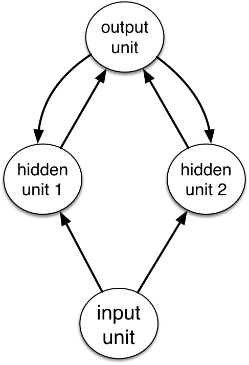{height="500"}</center>

## Unrolling Parity RNN

<center>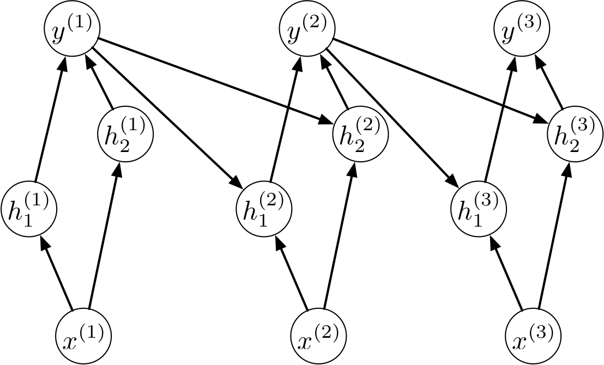{height="500"}</center>

## Parity Computation

The output unit should compute the XOR of the current input and previous output:

<center>

| $y^{(t-1)}$ | $x^{(t)}$ | $y^{(t)}$ |
|-------------|-----------|-----------|
| 0           | 0         | 0         |
| 0           | 1         | 1         |
| 1           | 0         | 1         |
| 1           | 1         | 0         |

</center>

::: notes
-   $y^{(t)}=0$ meants the number of 1's in the past input has been even.
-   $y^{(t)}=1$ meants the number of 1's in the past input has been odd.
:::

## Computing Parity

Let's use hidden units to help us compute XOR.

-   Have one unit compute AND, and the other one compute OR.

. . .

-   Then we can pick weights and biases just like we did for multilayer perceptrons.

## Computing Parity II

::::: columns
::: {.column width="50%"}
<center>

| $y^{(t-1)}$ | $x^{(t)}$ | $h_1^{(t)}$ | $h_2^{(t)}$ | $y^{(t)}$ |
|-------------|-----------|-------------|-------------|-----------|
| 0           | 0         | 0           | 0           | 0         |
| 0           | 1         | 0           | 1           | 1         |
| 1           | 0         | 0           | 1           | 1         |
| 1           | 1         | 1           | 1           | 0         |

</center>
:::

::: {.column width="50%"}
<center>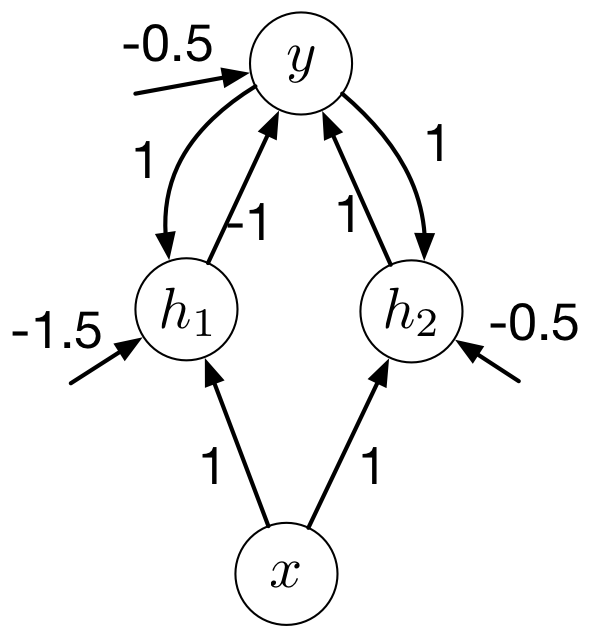{height="300"}</center>
:::
:::::

::: notes
-   $h_1$ computes *and* by subtracting -1.5 from the sum of $y$ and the current input $x$ and then applying the binary threshold activation function.
-   $h_2$ computes *or* by subtracting -0.5 from the sum of $y$ and the current input $x$ and then applying the binary threshold activation function.
:::

## Back Propagation Through Time

As you can guess, we don't usually set RNN weights by hand. Instead, we learn them using backprop.

. . .

In particular, we do backprop on the unrolled network. This is known as **backprop through time**.

::::: columns
::: {.column width="40%"}
<center>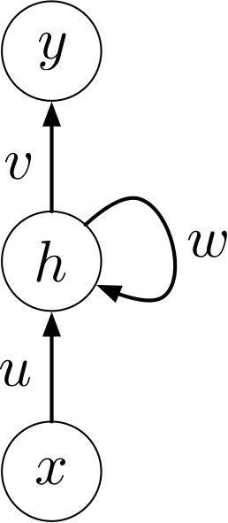{height="290"}</center>
:::

::: {.column width="60%"}
<center>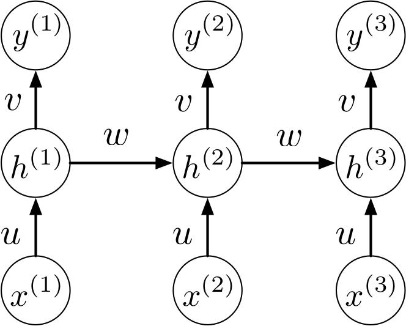{height="300"}</center>
:::
:::::

## Unrolled BPTT

Here's the unrolled computation graph. Notice the weight sharing.

<center>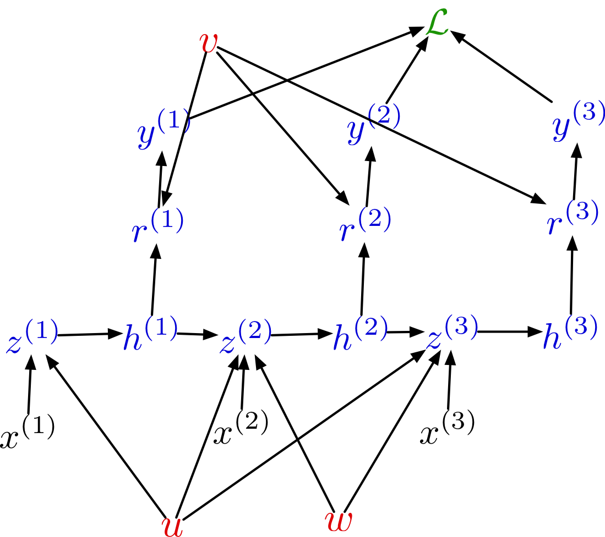{height="470"}</center>

## What can RNNs compute?

In 2014, Google researchers built an encoder-decoder RNN that learns to execute simple Python programs, one character at a time! <https://arxiv.org/abs/1410.4615>

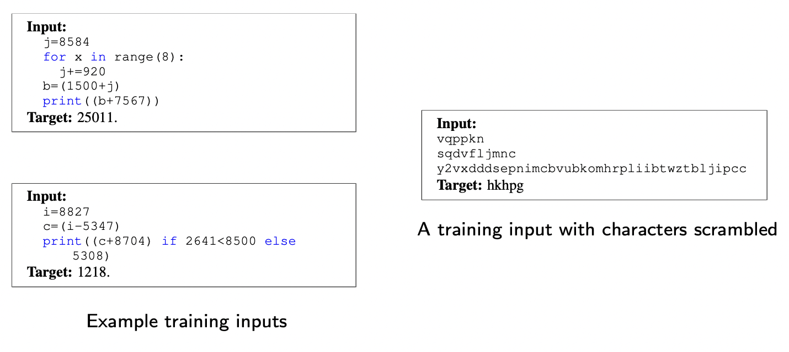{height="70%"}

## What can RNNs compute?

RNNs are good at learning complex syntactic structures: generate Algebraic Geometry LaTex source files that almost compiles:

<center>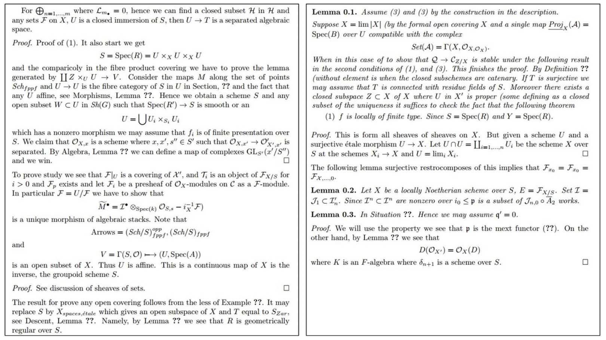{height="350"}</center>

<http://karpathy.github.io/2015/05/21/rnn-effectiveness/>

# Sentiment Analysis with Recurrent Neural Networks

## RNN for language modelling

Usually, the sequence of inputs $x_t$ will be **vectors**. The hidden states $h_t$ are also vectors.

. . .

For example, we might use a sequence of one-hot vectors ${\bf x}_t$ of words (or characters) to represent a sentence. (What else can we use?)

. . .

How would we use a RNN to determine (say) the sentiment conveyed by the sentence?

. . .

As usual, start with the forward pass...

## RNN: Initial Hidden State

<center>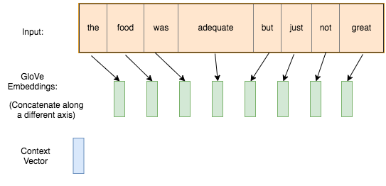{height="70%"}</center>

Start with an initial **hidden state** with a blank slate (can be a vector of all zeros, or a parameter that we train)

## RNN: Update Hidden State

<center>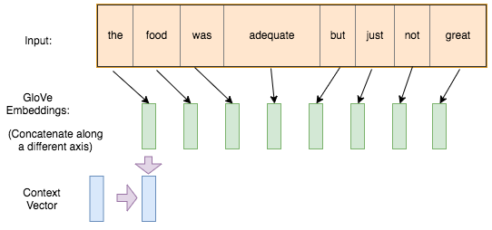{height="70%"}</center>

Compute the first hidden state based on the initial hidden state, and the input (the one-hot vector ${\bf x}_1$ of the **first word**).

## RNN: Continue Updating Hidden State

<center>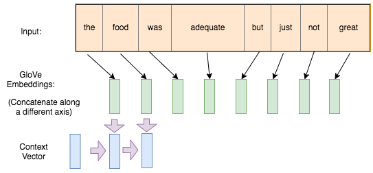{height="70%"}</center>

Update the hidden state based on the subsequent inputs. Note that we are using the **same weights** to perform the update each time.

## RNN: Last Hidden State

<center>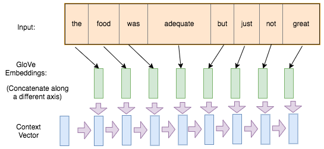{height="70%"}</center>

Continue updating the hidden state until we run out of words in our sentence.

## RNN: Compute Prediction

<center>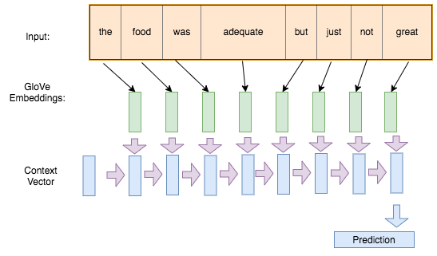{height="60%"}</center>

Use the **last hidden state** as input to a prediction network, usually a MLP.

. . .

Alternative: take the max-pool and average-pool over all computed hidden states.

## Sequence Classification

Lab: let's build this model!

<center>{height="500"}</center>

## Sentiment140 Data

Dataset of tweets with either a positive or negative emoticon, but with the emoticon removed.

**Input:** Tweet (sequence of words/characters)

**Target**: Positive or negative emoticon?

Example:

-   Negative: "Just going to cry myself to sleep after watching Marley and Me"

. . .

-   Positive: "WOOOOO! Xbox is back"

## Approach

::::: columns
::: {.column width="40%"}
<center>{height="200"}</center>
:::

::: {.column width="60%"}
-   Use GloVe embeddings to represent words as input ${\bf x}^{(t)}$ (note: we could have chosen to work at the character level)
:::
:::::

. . .

-   Use a recurrent neural network to get a combined embedding of the *entire* tweet

. . .

-   Use a fully-connected layer to make predictions (happy vs sad)

```{=html}
<!-- ## Video Demo

[https://play.library.utoronto.ca/watch/a1d297375e8bfe173b48325c37828a75](https://play.library.utoronto.ca/watch/a1d297375e8bfe173b48325c37828a75)
-->
```

## Key Considerations

-   We'll be using the PyTorch `nn.RNN` module, which can be unintuitive

. . .

-   Batching difficulties: each tweet is a different length, so how can we batch?
    -   One way is to *pad* shorter sequences with a special "padding" token at the end of the sequence
    -   However, we want to minimize this padding due to computational complexity

<!-- 03grad -->

# Gradient Explosion and Vanishing

## RNN Gradients

Recall the unrolled computation graph for a small RNN:

<center>{height="470"}</center>

## Backprop Through Time

::::: columns
::: {.column width="50%"}
**Activations:** \begin{align*}
    \overline{\mathcal{L}} &= 1 \\
    \overline{y^{(t)}} &= \overline{\mathcal{L}} \, \frac{\partial \mathcal{L}}{\partial y^{(t)}} \\
    \overline{r^{(t)}} &= \overline{y^{(t)}} \, \phi^\prime(r^{(t)}) \\
    {\color{magenta} \overline{h^{(t)}}} & {\color{magenta}\, = \overline{r^{(t)}} \, v + \overline{z^{(t+1)}} \, w} \\
    \overline{z^{(t)}} &= \overline{h^{(t)}} \, \phi^\prime(z^{(t)})
\end{align*}
:::

::: {.column width="50%"}
**Parameters:** \begin{align*}
    {\color{magenta} \overline{u}} &{\color{magenta} \, = \sum_t \overline{z^{(t)}} \, x^{(t)}} \\
    {\color{magenta} \overline{v}} &{\color{magenta} \,= \sum_t \overline{r^{(t)}} \, h^{(t)}} \\
    {\color{magenta} \overline{w}} &{\color{magenta} \,= \sum_t \overline{z^{(t+1)}} \, h^{(t)}}
\end{align*}
:::
:::::

Key idea: multivariate chain rule!

## Gradient Explosion and Vanishing

The longer your sequence, the longer gap the time step between when we see potentially important information and when we need it:

<center>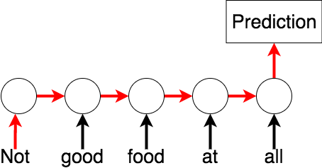{height="300"}</center>

. . .

The derivatives need to travel this entire pathway.

## Why Gradients Explode or Vanish

Consider a univariate version of the RNN:

<center>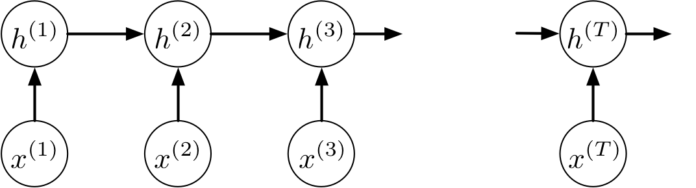{height="200"}</center>

::::: columns
::: {.column width="50%"}
**Backpropagation updates:** \begin{align*}
    \overline{h^{(t)}} &= \overline{z^{(t+1)}} \, w \\
    \overline{z^{(t)}} &= \overline{h^{(t)}} \, \phi^\prime(z^{(t)})
\end{align*}
:::

::: {.column width="50%"}
**Applying this recursively:** \begin{align*}
    \overline{h^{(1)}} = w^{T-1} \phi^\prime(z^{(2)}) \cdots \phi^\prime(z^{(T)}) \overline{h^{(T)}}
\end{align*}
:::
:::::

## Why Gradients Explode or Vanish II

**With linear activations:** $$\frac{\partial h^{(T)}}{\partial h^{(1)}} = w^{T-1}$$

$$\textbf{Exploding:} \qquad w=1.1, T=50 \Rightarrow \frac{\partial h^{(T)}}{\partial h^{(1)}} = 117.4$$

$$\textbf{Vanishing:} \qquad w=0.9, T=50 \Rightarrow \frac{\partial h^{(T)}}{\partial h^{(1)}} = 0.00515$$

## Multivariate Hidden States

More generally, in the multivariate case, the **Jacobians** multiply:

$$\frac{\partial {\bf h}^{(T)}}{\partial {\bf h}^{(1)}} = \prod_{t = 1}^{T - 1} \frac{\partial {\bf h}^{(t + 1)}}{\partial {\bf h}^{(t)}}$$

. . .

Matrices can "explode" or "vanish" just like scalar values, though it's slightly harder to make precise.

## Repeated Application of Functions

Another way to look at why gradients explode or vanish is that we are applying a function over and over again.

. . .

Each hidden layer computes some function of previous hidden layer and the current input: ${\bf h}^{(t)} = f({\bf h}^{(t-1)}, {\bf x}^{(t)})$

. . .

This function gets repeatedly applied:

\begin{align*}
{\bf h}^{(4)} &= f({\bf h}^{(3)}, {\bf x}^{(4)}) \\
              &= f(f({\bf h}^{(2)}, {\bf x}^{(3)}), {\bf x}^{(4)}) \\
              &= f(f(f({\bf h}^{(1)}, {\bf x}^{(2)}), {\bf x}^{(3)}), {\bf x}^{(4)})
\end{align*}

## Iterated Functions (Intuition)

We get complicated behaviour from iterated functions. Consider $f(x) = 3.5x(1-x)$

. . .

::::::: columns
::: {.column width="25%"}
$y = f(x)$

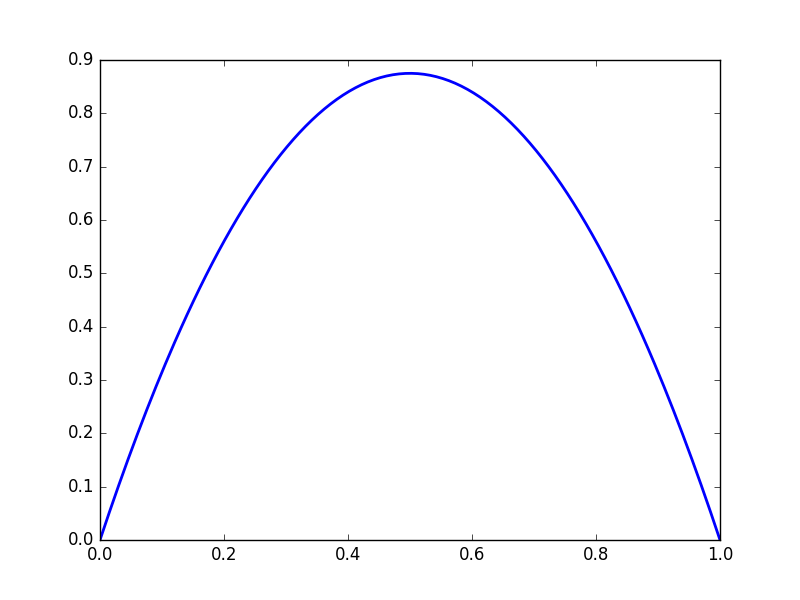{height="170"}
:::

::: {.column width="25%"}
$y = f(f(x))$

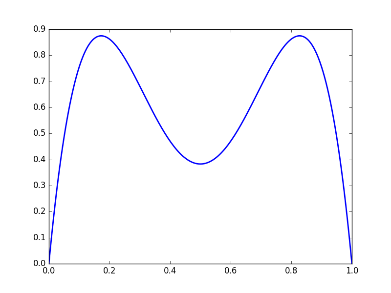{height="170"}
:::

::: {.column width="20%"}
$y = f^{\circ 3}(x)$

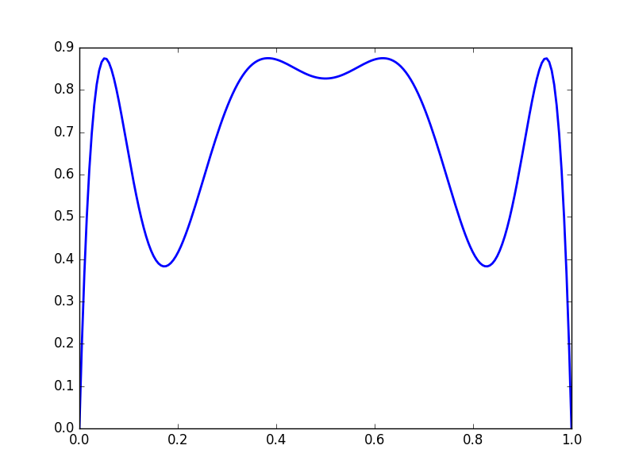{height="170"}
:::

::: {.column width="25%"}
$y = f^{\circ 6}(x)$

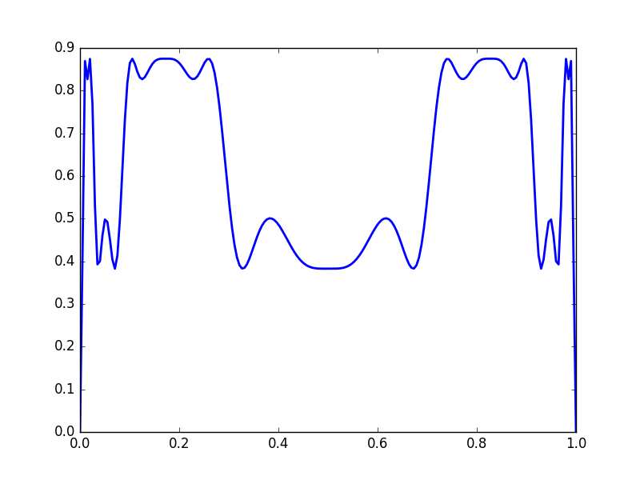{height="170"}
:::
:::::::

. . .

Note that the function values gravitate towards **fixed points**, and that the derivatives becomes either **very large** or **very small**.

## RNN with tanh activation

More concretely, consider an RNN with a tanh activation function:

<center>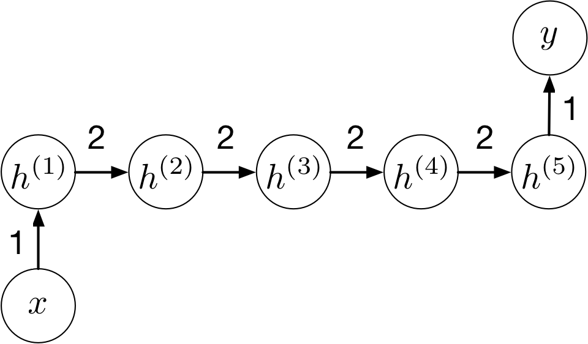{height="400"}</center>

## RNN with tanh activation II

The function computed by the network:

<center>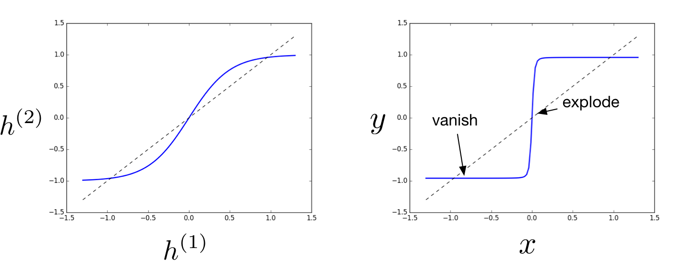{height="400"}</center>

## Cliffs

Repeatedly applying a function adds a new type possible loss landscape: **cliffs**, where the gradient of the loss with respect to a parameter is either close to 0, or very large.

<center>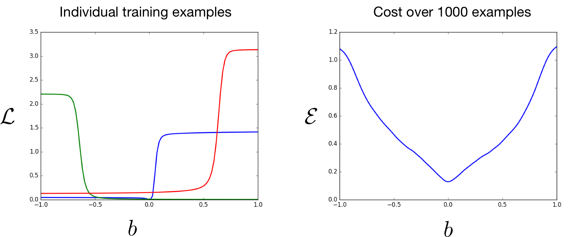{height="40%"}</center>

## Cliffs II

Generally, the gradient will explode on some inputs and vanish on others. In expectation, the cost may be fairly smooth.

## Gradient Clipping

One solution is to "clip" the gradient so that it has a norm of at most $\eta$. Otherwise, update the gradient ${\bf g}$ with ${\bf g} \leftarrow \eta\frac{{\bf g}}{||{\bf g}||}$

. . .

The gradients are biased, but at least they don't blow up:

<center>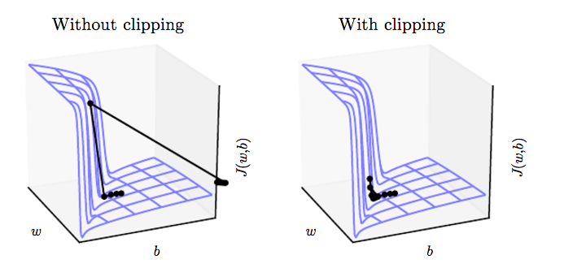{height="270"}</center>

. . .

Gradient clipping solves the exploding gradient problem, but not the vanishing gradient problem.

## Learning Long-Term Dependencies

**Idea**: Initialization

Hidden units are a kind of memory. Their default behaviour should be to **keep their previous value**.

. . .

If the function ${\bf h}^{(t)} = f({\bf h}^{(t-1)}, {\bf x}^{(t)})$ is close to the identity, then the gradient computations $\displaystyle \frac{\partial {\bf h}^{(t)}}{\partial {\bf h}^{(t-1)}}$ are stable.

. . .

This initialization allows learning much longer-term dependencies than "vanilla" RNNs

## Long-Term Short Term Memory

Change the **architecture** of the recurrent neural network by replacing each single unit in an RNN by a "memory block":

<center>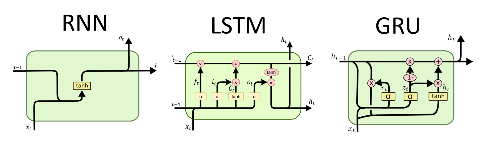{height="50%"}</center>

## LSTM

<center>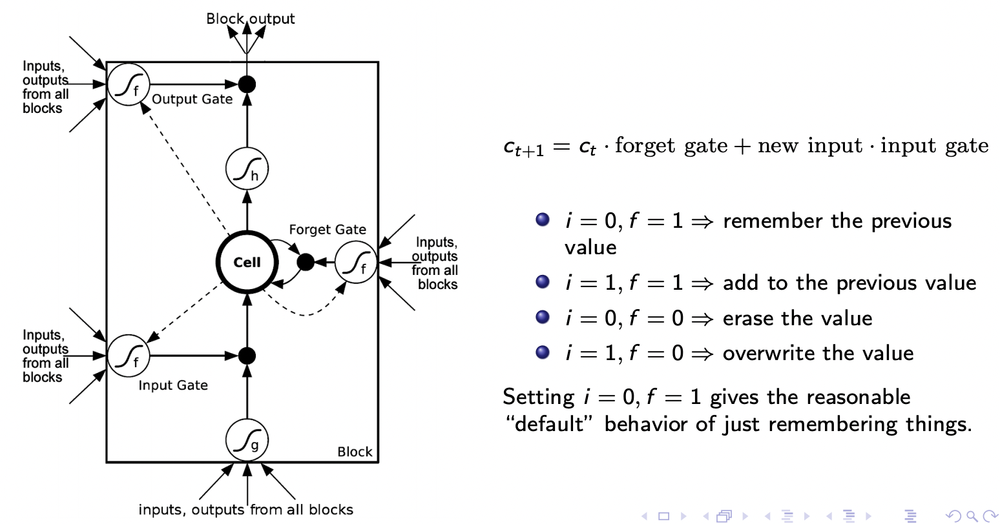{height="550"}</center>

## LSTM Math

In each step, we have a vector of memory cells ${\bf c}$, a vector of hidden units ${\bf h}$ and vectors of input, output, and forget gates ${\bf i}$, ${\bf o}$, and ${\bf f}$.

. . .

There's a full set of connections from all the inputs and hiddens to the inputs and all of the gates:

$$
\begin{pmatrix}
\bf{i}_t \\
\bf{f}_t \\
\bf{o}_t \\
\bf{g}_t \\
\end{pmatrix} =
\begin{pmatrix}
\sigma \\
\sigma \\
\sigma \\
\tanh
\end{pmatrix} {\bf W}
\begin{pmatrix}
{\bf x}_t \\
{\bf h}_{t - 1}
\end{pmatrix}
$$

## LSTM Math II

\begin{align*}
{\bf c_t } &= {\bf f_t } \circ {\bf c_{t-1} } + {\bf i_t } \circ {\bf g_t } \\
{\bf h_t } &= {\bf o_t } \circ \tanh({\bf c_t })
\end{align*}

. . .

**Exercise:** show that if ${\bf f}_{t+1} = 1$, ${\bf i}_{t+1} = 0$, and ${\bf o}_{t} = 0$, then the gradient of the memory cell gets passed through unmodified, i.e., $\bar{{\bf c}_t} = \bar{{\bf c}_{t+1}}$.

## Key Takeaways

You should be able to understand...

-   why learning long-term dependencies is hard for vanilla RNNs

. . .

-   why gradients vanish/explode in a vanilla RNN

. . .

-   what cliffs are and how repeated application of a function generates cliffs

. . .

-   what gradient clipping is and when it is useful

. . .

-   the mathematics behind why gating works

<!-- 04gen -->

# Text Generation with RNN

## RNN Hidden States

RNN For Prediction:

-   Process tokens one at a time

. . .

-   Hidden state is a representation of **all the tokens read thus far**

. . .

RNN For Generation:

-   Generate tokens one at a time

. . .

-   Hidden state is a representation of **all the tokens to be generated**

## RNN Hidden State Updates

RNN for Prediction:

-   Update hidden state with new input (token)

. . .

-   Get prediction (e.g. distribution over possible labels)

. . .

RNN for Generation:

-   Get prediction distribution of next token

. . .

-   Generate a token from the distribution

. . .

-   Update the hidden state with new token

## Text Generation Diagram

<center></center>

-   Get prediction distribution of next token

. . .

-   Generate a token from the distribution

. . .

-   Update the hidden state with new token

## Test Time Behaviour of Generative RNN

Unlike other models we discussed so far, the training time behaviour of Generative RNNs will be **different** from the test time behaviour

. . .

Test time behaviour at each time step:

-   Obtain a **distribution** over possible next tokens

. . .

-   Sample a token from that distribution

. . .

-   Update the hidden state based on the sample token

## Training Time Behaviour of Generative RNN

During training, we try to get the RNN to generate one particular sequence in the training set. At each time step:

-   Obtain a **distribution** over possible next tokens

. . .

-   Compare this with the *actual* next token

. . .

Q1: What kind of a problem is this? (regression or classification?)

. . .

Q2: What loss function should we use during training?

::: notes
-   A1: The problem is classification. The different tokens are the respective classes.
-   A2: The loss is a cross entropy loss as usual in classification
:::

## Text Generation: First Step

<center>{height="150"}</center>

-   Start with an initial hidden state

. . .

-   Update the hidden state with a "\<BOS\>" (beginning of string) token to initiate the hidden state

. . .

-   Get the distribution over the first character

. . .

-   Compute the cross-entropy loss against the ground truth (R)

::: notes
-   Each token is its own classification problem. This is the first one.
:::

## Text Generation with Teacher Forcing

<center>{height="150"}</center>

-   Update the hidden state with the **ground truth** token (R) regardless of the prediction from the previous step
    -   This technique is called **teaching forcing**

. . .

-   Get the distribution over the second character

. . .

-   Compute the cross-entropy loss against the ground truth (I)

## Text Generation: Later Steps

<center>{height="400"}</center>

Continue until we get to the "\<EOS\>" (end of string) token

## Some Remaining Challenges

-   Vocabularies can be very large once you include people, places, etc.

. . .

-   It's computationally difficult to predict distributions over millions of words.

. . .

-   How do we deal with words we haven't seen before?

. . .

-   In some languages, it's hard to define what should be considered a word.

## Character vs Word-level

Another approach is to model text *one character at a time*

. . .

This solves the problem of what to do about previously unseen words.

. . .

Note that long-term memory is essential at the character level!

# Sequence-to-Sequence Architecture

## Neural Machine Translation

Say we want to translate, e.g. English to French sentences.

. . .

We have pairs of translated sentences to train on.

. . .

Here, both the inputs and outputs are sequences!

What can we do?

## Sequence-to-sequence architecture

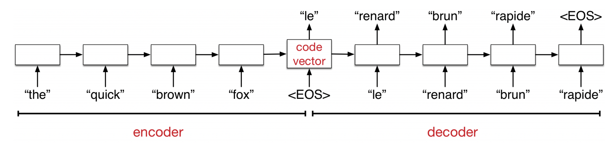{height="30%"}

The network first reads and memorizes the sentences.

. . .

When it sees the "end token", it starts outputting the translation.

. . .

The "encoder" and "decoder" are two different networks with different weights.

# Wrap Up

## Summary

::: incremental
-   Recurrent Neural Networks can be used for learning sequence data
-   Training RNNs may suffer from gradient explosion and vanishing
-   Important Applications of RNNs are text generation and sequence to sequence modelling
:::