## Announcements

-   The project plan is due early next week (March 21)

<!-- 00game -->

# RNN Review Game

## In what Situation would you use an RNN?

a.  When we want to make predictions about a sequence
b.  When we want to make predictions about an image
c.  When we want to generate a sequence
d.  When we want to generate an image

## Using GloVe Embeddings of Words as Input Features to an RNN is an Example of...

a.  LSTM
b.  GRU
c.  MLP
d.  Transfer Learning

## What is a Disadvantage of using a Vanilla RNN (without gating)?

a.  It is challenging to learn long-term dependencies
b.  The gradient might vanish
c.  The gradient might explode
d.  All of the above
e.  None of the above

## What is a Cliff?

A part of the loss landscape where the gradient of the loss with respect to a parameter...

a.  ... is large
b.  ... is close to 0
c.  ... is close to 0 in most regions, and very large in some places

## When Deep Learning Practitioners talk about RNNs, they are usually referring to...

a.  vanilla RNN (without gating)
b.  RNN with LSTM units, or sometimes GRU units

<!-- 01gen -->

## Text Generation with RNN

RNN For Prediction:

-   Process tokens one at a time

. . .

-   Hidden state is a representation of **all the tokens read thus far**

## Text Generation with RNN II

RNN For Generation:

-   Generate tokens one at a time

. . .

-   Hidden state is a representation of **all the tokens to be generated**

## RNN Hidden State Updates

RNN For Prediction:

-   Update hidden state with new input (token)

. . .

-   Get prediction (e.g. distribution over possible labels)

. . .

RNN For Generation:

-   Get prediction distribution of next token

. . .

-   Generate a token from the distribution

. . .

-   Update the hidden state with new token

## Text Generation Diagram

<center>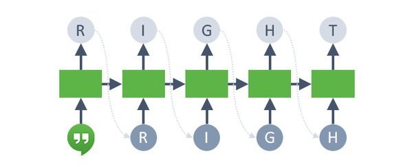{height="250"}</center>

-   Get prediction distribution of next token

. . .

-   Generate a token from the distribution

. . .

-   Update the hidden state with new token:

## Test Time Behaviour of Generative RNN

Unlike other models we discussed so far, the training time behaviour of Generative RNNs will be **different** from the test time behaviour

Test time behaviour:

-   At each time step:
    -   Obtain a **distribution** over possible next tokens
    -   Sample a token from that distribution
    -   Update the hidden state based on the sample token

## Training Time Behaviour of Generative RNN

During training, we try to get the RNN to generate one particular sequence in the training set:

-   At each time step:
    -   Obtain a **distribution** over possible next tokens
    -   Compare this with the *actual* next token

Q1: What kind of a problem is this? (regression or classification?)

Q2: What loss function should we use during training?

## Text Generation: Step 1

<center>{height="200"}</center>

First classification problem:

-   Start with an initial hidden state

. . .

-   Update the hidden state with a "\<BOS\>" (beginning of string) token, so that the hidden state becomes meaningful (not just zeros)

## Text Generation: Step 1 II

<center>{height="200"}</center>

First classification problem:

-   Get the distribution over the first character

. . .

-   Compute the cross-entropy loss against the ground truth (R)

## Text Generation with Teacher Forcing

<center>{height="200"}</center>

Second classification problem:

-   Update the hidden state with the **ground truth** token (R) regardless of the prediction from the previous step
    -   This technique is called **teacher forcing**

## Text Generation with Teacher Forcing II

<center>{height="200"}</center>

Second classification problem:

-   Get the distribution over the second character

. . .

-   Compute the cross-entropy loss against the ground truth (I)

## Text Generation: Later Steps


Continue until we get to the "\<EOS\>" (end of string) token

## Some Remaining Challenges

-   Vocabularies can be very large once you include people, places, etc.

. . .

-   It's computationally difficult to predict distributions over millions of words.

. . .

-   How do we deal with words we haven't seen before?

. . .

-   In some languages (e.g. German), it's hard to define what should be considered a word.

## Character vs Word-level

Another approach is to model text *one character at a time*

This solves the problem of what to do about previously unseen words.

Note that long-term memory is essential at the character level!

<!-- 02attn -->

# Recurrent Neural Networks with Attention

## Recurrent Neural Networks

In lecture 8, we showed a **discriminative RNN** that makes a *prediction* based on a sequence (sequence as an input).

In the week 11 tutorial, we will build a **generator RNN** to generate sequences (sequence as an output)

## Sequence-to-sequence Tasks

Another common example of a sequence-to-sequence task (seq2seq) is **machine translation**.

{height="30%"}

The network first reads and memorizes the sentences. When it sees the "end token", it starts outputting the translation. The "encoder" and "decoder" are two different networks with different weights.

## How Seq2Seq Works

The **encoder network** reads an input sentence and stores all the information in its hidden units.

The **decoder network** then generates the output sentence one word at a time.

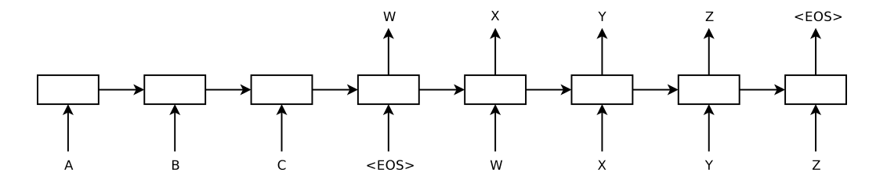{height="35%"}

## How Seq2Seq Works II

{height="35%"}

But some sentences can be really long. Can we really store all the information in a vector of hidden units?

Human translators **refer back to the input**.

## Attention-Based Machine Translation

We'll look at the translation model from the classic paper:

> Bahdanau et al., Neural machine translation by jointly learning to align and translate. ICLR, 2015.

Basic idea: each **output word** comes from **one input word**, or a handful of input words. Maybe we can learn to attend to only the relevant ones as we produce the output.

We'll use the opportunity to look at architectural changes we can make to RNN models to make it even more performant.

## Encoder & Decoder Architectures

The encoder computes an **annotation** (hidden state) of each word in the input.

-   The encoder is a **bidirectional RNN**

. . .

The decoder network is also an RNN, and makes predictions one word at a time.

-   The decoder uses an **attention** mechanism (RNN with attention)

## Encoder: Bidirectional RNN

The encoder is a **bidirectional RNN**. We have two RNNs: one that runs forward and one that runs backwards. These RNNs can be LSTMs or GRUs.

The annotation of a word is the concatenation of the forward and backward hidden vectors.

<center>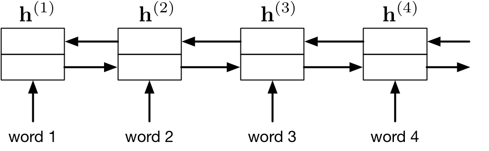{height="300"}</center>

## Decoder: RNN with Attention

The decoder network is also an RNN, and makes predictions one word at a time.

::::: columns
::: {.column width="60%"}
<center>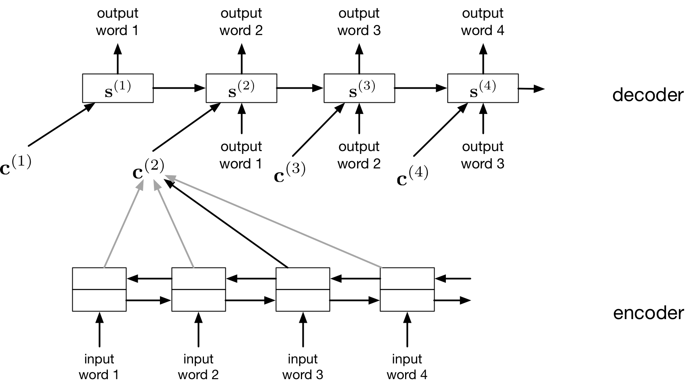</center>
:::

::: {.column width="40%"}
The difference is that it also derives a **context vector** ${\bf c}^{(t)}$ at each time step, computed by **attending to the inputs**
:::
:::::

## Intuition Behind "Attending to the Input"

> "My language model tells me the next word should be an adjective. Find me an adjective in the input"

We would like to *refer back* to one (or a few) of the input words to help with the translation task (e.g. find the adjective)

If you were programming a translator, you might...

## Intuition Behind Aattending to the Input" II

If you were programming a translator, you might

1.  find an input word that is most likely an adjective (the attention function)
2.  look up the input word that is the adjective (the weighted average)
3.  translate the input word, e.g. using the input word, and a dictionary (the projection MLP)

An attentional decoder is like a *continuous* form of these last three steps.

## The Math Behind "Attending to the Input"

-   "My language model tells me the next word should be an adjective. Find me an adjective in the input"

The context vector is computed as a **weighted average** of the encoder's annotations:

$${\bf c}^{(i)} = \sum_j \alpha_{ij} {\bf h}^{(j)}$$

## The Math Behind "Attending to the Input" II

The attention weights are computed as a softmax, where the input depends on the *annotation* ${\bf h}^{(j)}$ and the *decoder states* ${\bf s}^{(t)}$:

$$
e_{ij} = a({\bf s}^{(i-1)}, {\bf h}^{(j)}), \qquad \alpha_{ij} = \frac{ \exp(e_{ij}) }{\sum_{j^\prime} exp(e_{ij^\prime})}
$$

The attention function depends on the **annotation vector**, rather than the **position in the sentence**. It is a form of content-based addressing.

## Example: How to Obtain a Context Vector?

\begin{align*}
{\bf h}^{(1)} &= \begin{bmatrix}1 & 3 & 9\end{bmatrix}^\top \\
{\bf h}^{(2)} &= \begin{bmatrix}0 & 0 & 1\end{bmatrix}^\top \\
{\bf h}^{(3)} &= \begin{bmatrix}5 & -1 & 2\end{bmatrix}^\top \\
\\
{\bf c}^{(t)} &= \begin{bmatrix}? & ? & ?\end{bmatrix}^\top \\
\end{align*}

## Example: Average Pooling is Context Independent

\begin{align*}
{\bf h}^{(1)} &= \begin{bmatrix}1 & 3 & 9\end{bmatrix}^\top \\
{\bf h}^{(2)} &= \begin{bmatrix}0 & 0 & 1\end{bmatrix}^\top \\
{\bf h}^{(3)} &= \begin{bmatrix}5 & -1 & 2\end{bmatrix}^\top \\
\\
{\bf c}^{(t)} &= \text{average}({\bf h}^{(1)} , {\bf h}^{(2)}, {\bf h}^{(3)})\\
&= \begin{bmatrix}2 & 0.6 & 1\end{bmatrix}^\top \\
\end{align*}

## Example: Attention

\begin{align*}
{\bf h}^{(1)} &= \begin{bmatrix}1 & 3 & 9\end{bmatrix}^\top \\
{\bf h}^{(2)} &= \begin{bmatrix}0 & 0 & 1\end{bmatrix}^\top \\
{\bf h}^{(3)} &= \begin{bmatrix}5 & -1 & 2\end{bmatrix}^\top \\
\\
{\bf s}^{(t-1)} &= \begin{bmatrix}0 & 1 & 1\end{bmatrix}^\top \\
\alpha_t &= \text{softmax}\left(\begin{bmatrix}
f({\bf s}^{(t-1)}, {\bf h}^{(1)}) \\
f({\bf s}^{(t-1)}, {\bf h}^{(2)}) \\
f({\bf s}^{(t-1)}, {\bf h}^{(3)}) \\
\end{bmatrix}\right) = \begin{bmatrix}\alpha_{t1} \\ \alpha_{t2} \\ \alpha_{t3}\end{bmatrix}
\end{align*}

## Example: Dot-Product Attention

\begin{align*}
{\bf h}^{(1)} &= \begin{bmatrix}1 & 3 & 9\end{bmatrix}^\top \\
{\bf h}^{(2)} &= \begin{bmatrix}0 & 0 & 1\end{bmatrix}^\top \\
{\bf h}^{(3)} &= \begin{bmatrix}5 & -1 & 2\end{bmatrix}^\top \\
\\
{\bf s}^{(t-1)} &= \begin{bmatrix}0 & 1 & 1\end{bmatrix}^\top \\
\alpha_t &= \text{softmax}\left(\begin{bmatrix}
               {\bf s}^{(t-1)} \cdot {\bf h}^{(1)} \\
               {\bf s}^{(t-1)} \cdot {\bf h}^{(2)} \\
               {\bf s}^{(t-1)} \cdot {\bf h}^{(3)} \\
               \end{bmatrix}\right) = \begin{bmatrix}\alpha_{t1} \\ \alpha_{t2} \\ \alpha_{t3}\end{bmatrix}
\end{align*}

## Example: Dot-Product Attention II

\begin{align*}
{\bf h}^{(1)} &= \begin{bmatrix}1 & 3 & 9\end{bmatrix}^\top \\
{\bf h}^{(2)} &= \begin{bmatrix}0 & 0 & 1\end{bmatrix}^\top \qquad \quad {\bf s}^{(t-1)} = \begin{bmatrix}0 & 1 & 1\end{bmatrix}^\top \\
{\bf h}^{(3)} &= \begin{bmatrix}5 & -1 & 2\end{bmatrix}^\top \\
\\
\alpha_t &= \text{softmax}\left(\begin{bmatrix}1 & 0 & 5 \\ 3 & 0 & -1 \\ 0 & 1 &2 \end{bmatrix}^\top
                    \begin{bmatrix}0 \\ 1 \\ 1\end{bmatrix}\right) \\
{\bf c}^{(t)} &= \alpha_{t1} {\bf h}^{(1)} + \alpha_{t2} {\bf h}^{(2)} + \alpha_{t2} {\bf h}^{(3)}\\
\end{align*}

## Attention Demo Video

<https://play.library.utoronto.ca/watch/9ed8b3c497f82b510e9ecf441c5eef4f>

## Visualization of Attention

Visualization of the attention map (the $\alpha_{ij}$s at each time step)

<center>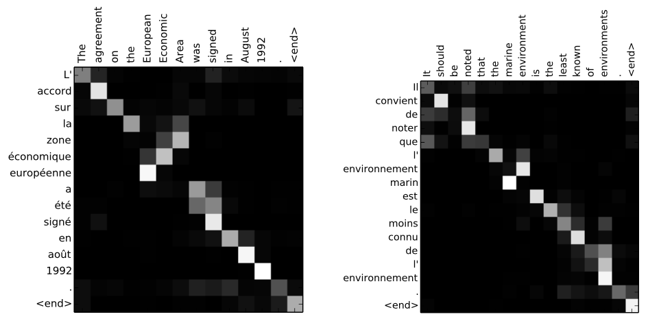{height="350"}</center>

Nothing forces the model to go (roughly) linearly through the input sentences, but somehow it learns to do it!

## Attention Performance

The attention-based translation model does much better than the encoder/decoder model on long sentences.

<center>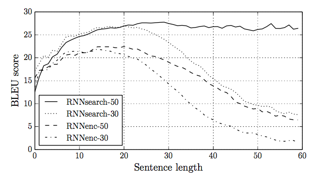{height="400"}</center>

## Attention-Based Caption Generation

Caption Generation Task:

-   Input: Image

. . .

-   Output: Caption (sequence of words or characters)

## Attention-Based Caption Generation II

Attention can also be used to understand images.

-   We humans can’t process a whole visual scene at once.

. . .

-   The fovea of the eye gives us high-acuity vision in only a tiny region of our field of view.

. . .

-   Instead, we must integrate information from a series of glimpses.

## Attention-Based Caption Generation III

The next few slides are based on this paper from the UofT machine learning group:

> Xu et al. Show, Attend, and Tell: Neural Image Caption Generation with Visual Attention. ICML, 2015.

## Attention for Caption Generation

The caption generation task: take an image as input, and produce a sentence describing the image.

-   **Encoder**: a classification conv net like VGG. This computes a bunch of feature maps over the image.

## Attention for Caption Generation II

-   **Decoder**: an attention-based RNN, analogous to the decoder in the translation model
    -   In each time step, the decoder computes an attention map over the entire image, effectively deciding which regions to focus on.
    -   It receives a context vector, which is the weighted average of the convnet features.

## Attention for Caption Generation III

Similar math as before: difference is that $j$ is a pixel location

\begin{align*}
e_{ij} &= a({\bf s}^{(i-1)}, {\bf h}^{(j)}) \\
\alpha_{ij} &= \frac{ \exp(e_{ij}) }{\sum_{j^\prime} exp(e_{ij^\prime})}
\end{align*}

## What Attention tells us

This lets us understand where the network is looking as it generates a sentence.

<center>

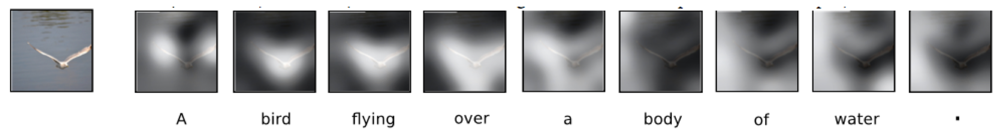

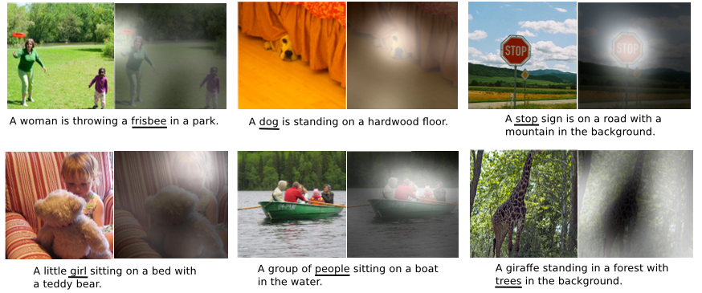{height="300"}

</center>

## What Attention tells us about mistakes

This can also help us understand the network's mistakes.

<center>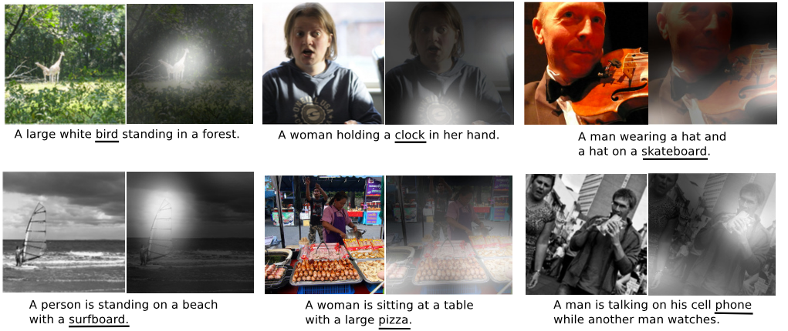</center>

## Multi-Layer RNNs

Finally, to get more capacity/performance out of RNNs, you can **stack** multiple RNN's together!

The hidden state of your first RNN becomes the input to your second layer RNN.

<center>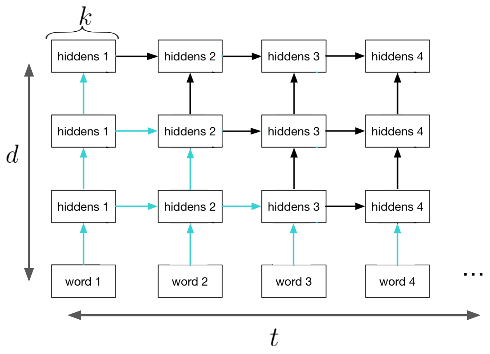{height="350"}</center>

## RNN Disadvantage

One disadvantage of RNNS (and especially multi-layer RNNs) is that they require a long time to train, and are more difficult to parallelize. (Need the previous hidden state $h^{(t)}$ to be able to compute $h^{(t+1)}$)

```{=html}
<!--

## Computational Cost and Parallelism

There are a few things we should consider when designing an RNN.

Computational cost:

- Number of connections. How many add-multiply operations for the forward and backward pass.
- Number of time steps. How many copies of hidden units to store for
- Backpropgation Through Time.  Number of sequential operations. The computations cannot be parallelized. (The part of the model that requires a for loop).

Maximum path length across time: the shortest path length
between the first encoder input and the last decoder output.

- It tells us how easy it is for the RNN to remember / retreive
information from the input sequence.

## Computational Cost Example

If we have a $d$ layer RNN with $k$ hidden units, training on a sequence of length $t$...

{ height=40% }

- There are $k^2$ connections for each hidden-to-hidden connections: total $tk^2d$ connections
- We need to store $tkd$ hidden units during training
- Only $kd$ hidden units need  to be stored at test time

## Parallelism

{ height=40% }

- Both the input embeddings and outputs of an RNN can be computed in parallel
- The blue hidden units are independent given the red
- The number of sequential operations is still proportional to $t$

## Backprop

During backprop, in the standard encoder-decoder RNN, the maximum
path length across time is the number of time steps.

Attention-based RNNs have a constant path length between the
encoder inputs and the decoder hidden states.
(Learning becomes easier. Why?)

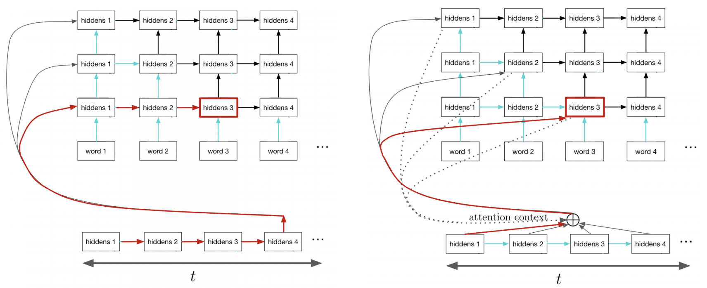{ height=40% }

## Backprop

Let's not get into this. I don't think our students will appreciate this...

-->
```

<!-- 03transformer -->

# Transformer

## ChatGPT

<center>

{height="450"}

</center>

## ChatGPT II

What is ChatGPT? We'll let it speak for itself:

> I am ChatGPT, a large language model developed by OpenAI. I use machine learning algorithms to generate responses to questions and statements posed to me by users. I am designed to understand and generate natural language responses in a variety of domains and topics, from general knowledge to specific technical fields. My purpose is to assist users in generating accurate and informative responses to their queries and to provide helpful insights and suggestions.

## ChatGPT III

ChatGPT is based on OpenAI's GPT-3, which itself is based on the **transformer** architecture.

## Transformer

Idea: Do away with recurrent networks altogether; instead exclusively use attention to obtain the history at the hidden layers

<center>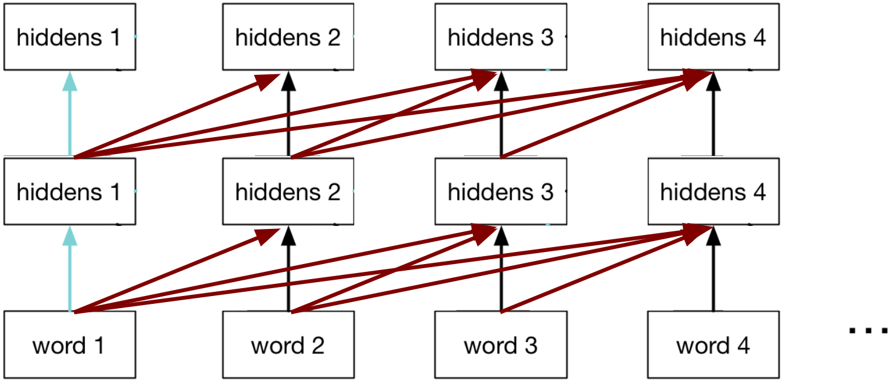{height="250"}</center>

> Vaswani, Ashish, et al. ”Attention is all you need.” Advances in Neural Information Processing Systems. 2017.

## Better Language Models

<https://openai.com/blog/better-language-models/>

-   Input: Human-Written Prompt (small paragraph)

. . .

-   Output: Article about the topic (many paragraphs)

## Transformer Tutorial

[www.youtube.com/watch?v=XSSTuhyAmnI&ab_channel=AriSeff](https://www.youtube.com/watch?v=XSSTuhyAmnI&ab_channel=AriSeff)

## Vaswani, Ashish, et al. Attention is all you need.

::::: columns
::: {.column width="60%"}
<center>

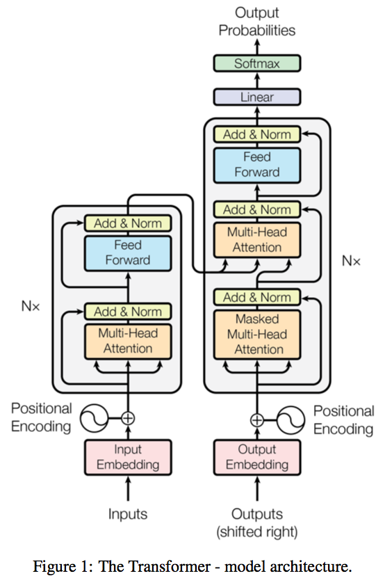{height="400"}

</center>
:::

::: {.column width="40%"}
Transformer has a encoder-decoder architecture similar to the previous sequence-to-sequence RNN models, except all the recurrent connections are replaced by the attention modules.
:::
:::::

## Attention Mapping

In general, attention mapping can be described as a function of a query and a set of key-value pairs. Transformer uses a "scaled dot-product attention" to obtain the context vector:

\begin{align*}
{\bf c}^{(t)} = \text{attention}(Q, K, V) = \text{softmax}\left(\frac{QK^\top}{\sqrt{d_K}}\right) V
\end{align*}

This is very similar to the attetion mechanism we saw eariler, but we scale the pre-softmax values (the logits) down by the square root of the key dimension $d_K$.

## Attention Mapping in the Decoder

When training the decoder (e.g. to generate a sequence), we desired output so that have to be careful to **mask out** the desired output so that we preserve the autoregressive property.

<center>{height="300"}</center>

## Recall: Dot-Product Attention

\begin{align*}
{\bf h}^{(1)} &= \begin{bmatrix}1 & 3 & 9\end{bmatrix}^\top \\
{\bf h}^{(2)} &= \begin{bmatrix}0 & 0 & 1\end{bmatrix}^\top \qquad \quad {\bf s}^{(t-1)} = \begin{bmatrix}0 & 1 & 1\end{bmatrix}^\top \\
{\bf h}^{(3)} &= \begin{bmatrix}5 & -1 & 2\end{bmatrix}^\top \\
\\
\alpha_t &= \text{softmax}\left(\begin{bmatrix}1 & 0 & 5 \\ 3 & 0 & -1 \\ 0 & 1 &2 \end{bmatrix}^\top
                    \begin{bmatrix}0 \\ 1 \\ 1\end{bmatrix}\right) \\
{\bf c}^{(t)} &= \alpha_{t1} {\bf h}^{(1)} + \alpha_{t2} {\bf h}^{(2)} + \alpha_{t2} {\bf h}^{(3)}\\
\end{align*}

## Scaled Dot-Product Attention

\begin{align*}
{\bf h}^{(1)} &= \begin{bmatrix}1 & 3 & 9\end{bmatrix}^\top \qquad \quad {\bf h}^{(2)} = \begin{bmatrix}0 & 0 & 1\end{bmatrix}^\top \\
{\bf h}^{(3)} &= \begin{bmatrix}5 & -1 & 2\end{bmatrix}^\top \qquad \quad {\bf s}^{(t-1)} = \begin{bmatrix}0 & 1 & 1\end{bmatrix}^\top \\
\alpha_t &= \text{softmax}\left(\frac{1}{\sqrt{3}} \begin{bmatrix}1 & 0 & 5 \\ 3 & 0 & -1 \\ 0 & 1 &2 \end{bmatrix}^\top
                    \begin{bmatrix}0 \\ 1 \\ 1\end{bmatrix}\right) \\
{\bf c}^{(t)} &= \alpha_{t1} {\bf h}^{(1)} + \alpha_{t2} {\bf h}^{(2)} + \alpha_{t2} {\bf h}^{(3)}\\
\end{align*} Q: Which values represent the Q, K, and V?

## Attending to the Input (Encoder)

Transformer models attend to both the encoder annotations and its previous hidden layers.

<center>

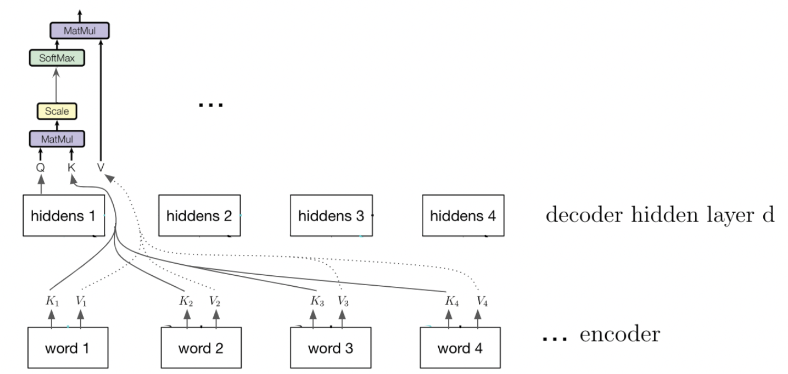{height="350"}

</center>

## Attending to the Input (Encoder) II

<center>

{height="350"}

</center>

When attending to the encoder annotations, the model computes the key-value pairs using linearly transformed the encoder outputs.

## Self-attention

Transformer models also use "self-attention" on its previous hidden layers. When applying attention to the previous hidden layers, the causal structure is preserved:

<center>

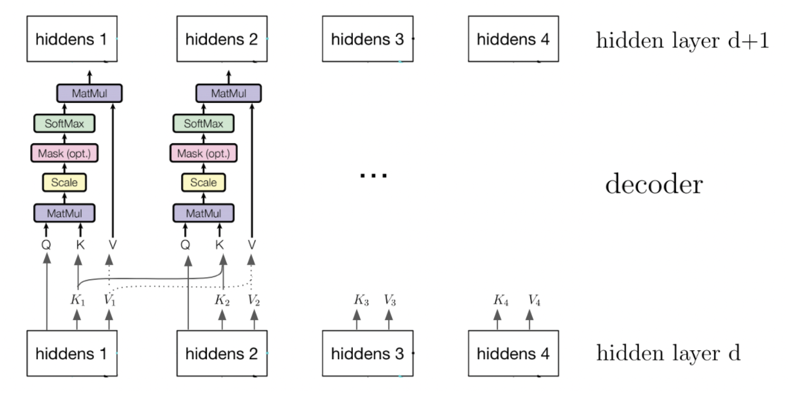{height="350"}

</center>

## Multi-headed Attention

The Scaled Dot-Product Attention attends to one or few entries in the input key-value pairs.

But humans can attend to many things simultaneously

**Idea:** apply scaled dot-product attention *multiple times* on the linearly transformed inputs:

\begin{align*}
\mathbf c_i &= \text{attention}\left(QW_i^Q, KW_i^K, VW_i^V\right) \\
\text{MultiHead}(Q, K, V) &= \text{concat}({\bf c_1}, \dots, {\mathbf c_h})W^O
\end{align*}

## Input Sequence Order

\begin{align*}
\mathbf c_i &= \text{attention}\left(QW_i^Q, KW_i^K, VW_i^V\right) \\
\text{MultiHead}(Q, K, V) &= \text{concat}({\bf c_1}, \dots, {\mathbf c_h})W^O
\end{align*}

Unlike RNNs and CNN encoders, the attention encoder output do *not* depend on the order of the inputs. Can you see why?

However, the order of the sequence convey important information for the machine translation task, language modeling, and other tasks.

## Positional Encoding

**Idea:** Add positional information of each input token in the sequence into the input embedding vectors.

\begin{align*}
PE_{\text{pos}, 2i} &= \sin\left(\text{pos}/10000^{2i/d_{emb}}\right) \\
PE_{\text{pos}, 2i+1} &= \cos\left(\text{pos}/10000^{2i/d_{emb}}\right)
\end{align*}

## Positional Encoding II

The final input embeddings are the concatenation of the learnable embeddings and the positional encoding.

<center>

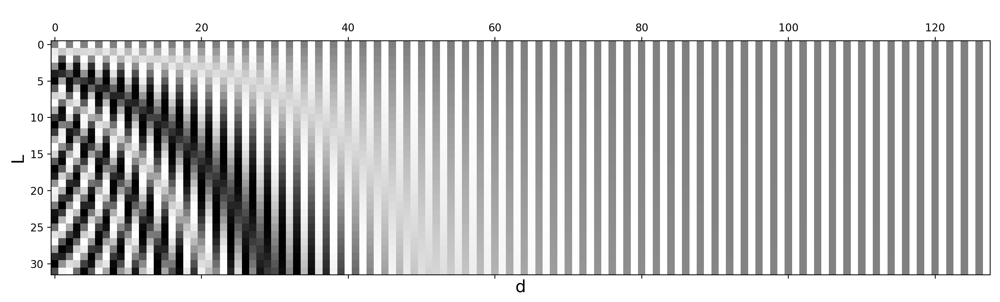

</center>

## Transformer Machine Translation

::::: columns
::: {.column width="30%"}
<center>

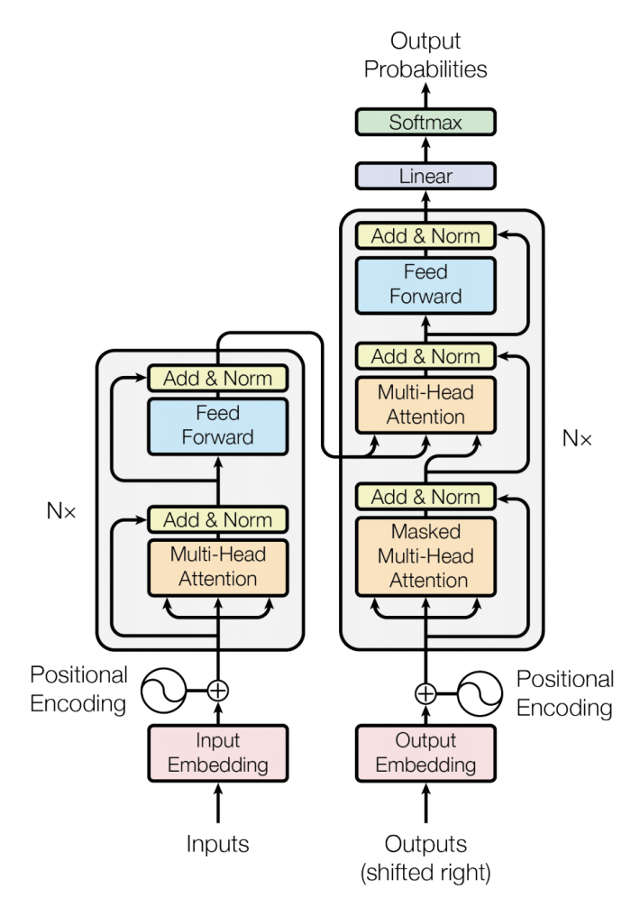

</center>
:::

::: {.column width="70%"}
-   Encoder-Decoder architecture like RNN, but use attention modules instead of recurrent modules.
-   Use N stacked self-attention layers.
-   Skip-connections help preserve the positional and identity information from the input sequences.
:::
:::::

## Visualizing Attention

Self-attention layer learns that "it" could refer to different entities in different contexts.

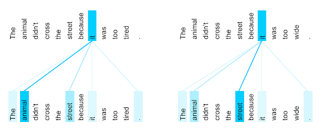{height="40%"}

See [ai.googleblog.com/2017/08/transformer-novel-neural-network.html](https://ai.googleblog.com/2017/08/transformer-novel-neural-network.html)

## Backprop

During backprop, in the standard encoder-decoder RNN, the maximum path length across time is the number of time steps.

<center>

{height="350"}

</center>

## Backprop II

<center>

{height="350"}

</center>

Attention-based RNNs have a constant path length between the encoder inputs and the decoder hidden states. (Learning becomes easier. Why?)

## Transformer Language Pre-Training

Similar to pre-training computer vision models on ImageNet, we can pre-train a language model for NLP tasks.

::::: columns
::: {.column width="60%"}
<center>

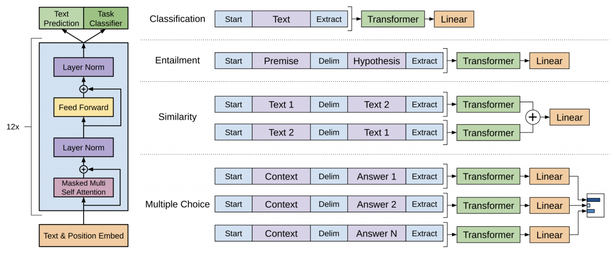{height="250"}

</center>
:::

::: {.column width="40%"}
The pre-trained model is then fine-tuned on textual entailment, question answering, semantic similarity assessment, and document classification
:::
:::::

## GPT-3: Generating an Article

\scriptsize

Title: United Methodists Agree to Historic Split

Subtitle: Those who oppose gay marriage will form their own denomination

## GPT-3: Generating an Article II

Article: After two days of intense debate, the United Methodist Church has agreed to a historic split - one that is expected to end in the creation of a new denomination, one that will be "theologically and socially conservative," according to The Washington Post. The majority of delegates attending the church's annual General Conference in May voted to strengthen a ban on the ordination of LGBTQ clergy and to write new rules that will "discipline" clergy who officiate at same-sex weddings. But those who opposed these measures have a new plan: They say they will form a separate denomination by 2020, calling their church the Christian Methodist denomination.

## GPT-3: Generating an Article III

The Post notes that the denomination, which claims 12.5 million members, was in the early 20th century the "largest Protestant denomination in the U.S.," but that it has been shrinking in recent decades. The new split will be the second in the church's history. The first occurred in 1968, when roughly 10 percent of the denomination left to form the Evangelical United Brethren Church.

## GPT-3: Generating an Article IV

The Post notes that the proposed split "comes at a critical time for the church, which has been losing members for years," which has been "pushed toward the brink of a schism over the role of LGBTQ people in the church." Gay marriage is not the only issue that has divided the church. In 2016, the denomination was split over ordination of transgender clergy, with the North Pacific regional conference voting to ban the

[Brown et al. 2020, Language Models are Few-Shot Learners](https://arxiv.org/pdf/2005.14165.pdf)

## GPT-3: Correcting English Grammar

\scriptsize

Poor English input: The patient was died.

Good English output: The patient died.

Poor English input: We think that Leslie likes ourselves.

Good English output: We think that Leslie likes us.

Poor English input: Janet broke Bill on the finger.

Good English output: Janet broke Bill's finger.

Poor English input: Mary arranged for, in St. Louis, John to rent a house cheap.

Good English output: Mary arranged for John to rent a house in St. Louis.

## GPT-3: Correcting English Grammar II

Poor English input: Today I have went to the store to to buys some many bottle of water.

Good English output: Today I went to the store to buy some bottles of water.

Poor English input: I have tried to hit ball with bat, but my swing is has miss.

Good English output: I tried to hit the ball with the bat, but my swing missed.

[Brown et al. 2020, Language Models are Few-Shot Learners](https://arxiv.org/pdf/2005.14165.pdf)

## Large Language Models (LLMs)

Many Transformer-based models have been developed since 2017.

-   Generative Pre-Trained Transformer (GPT-1/2/3)
    -   Decoder-only 12-layer/12-headed Transformer.
    -   Inspired GPT-Neo, GPT-J, GPT-NeoX, ChatGPT.
    -   GPT-4 coming out soon.

## Large Language Models (LLMs) II

-   Bidirectional Encoder Representations from Transformers (BERT)
    -   Encoder-only 12-layer/12-headed Transformer.
    -   Inspired ALBERT, RoBERTa, SBERT, DeBERTa, etc.

## Large Language Models (LLMs) III

-   And many, many more: [en.wikipedia.org/wiki/Large_language_model](https://en.wikipedia.org/wiki/Large_language_model)

Many benchmarks have been developed such as GLUE and SQuAD.

Big players in the LLM space include Google (Brain, DeepMind), Meta (formerly Facebook, FAIR), Microsoft, Amazon, EleutherAI, OpenAI, Cohere, Hugging Face.