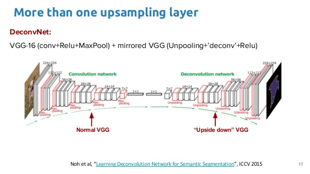
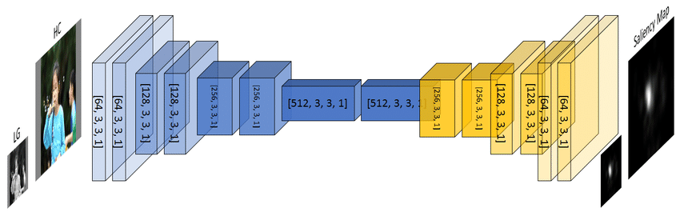
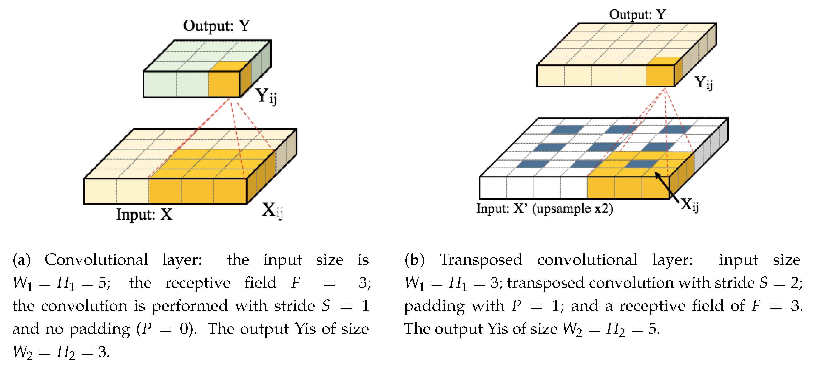
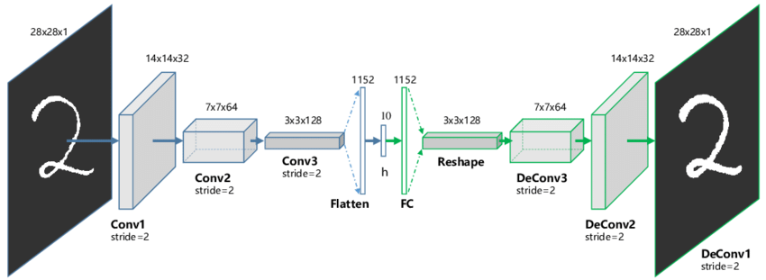
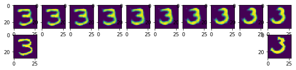

## Announcements

-   Test 2 is this week during tutorials
    -   Write during the tutorial section that you are enrolled in unless you have made (or are making) alternative arrangements

<!-- 01gen -->

# Generative Models

## Generating Images

How to generate new data of certain types

-   generate text that looks like our training data

. . .

-   generate **images** that look like our training data

## Generating Images II

Models:

-   Generative RNNs

. . .

-   Autoencoder

. . .

-   Variational Autoencoder (VAE)

. . .

-   Generative Adversarial Networks (GANs)
    -   [`arxiv.org/abs/1406.2661`](https://arxiv.org/abs/1406.2661)
    -   [`uoft-csc413.github.io/2023/assets/slides/lec09.pdf`](https://uoft-csc413.github.io/2023/assets/slides/lec09.pdf)

## Generating Images III

-   Diffusion Models
    -   [`lilianweng.github.io/posts/2021-07-11-diffusion-models/`](https://lilianweng.github.io/posts/2021-07-11-diffusion-models/)

. . .

We'll talk about autoencoders and VAEs today; GANs if we have time.

## Autoencoders

There are two ways of thinking of an image autoencoder:

-   a model that will eventually help us generate new images

. . .

-   a model that finds a **low-dimensional representation** of images

Both are considered **unsupervised learning** tasks, since no labels are involved.

However, we do have a dataset of unlabelled images.

## Image Autoencoder

Idea: In order to learn to generate images, we'll learn to **reconstruct** images from a low-dimensional representation.

An image autoencoder has two components:

. . .

1.  An **encoder** neural network that takes the image as input, and produces a low-dimensional embedding.

. . .

2.  A **decoder** neural network that takes the low-dimensional embedding as input, and reconstructs the image.

A good, low-dimensional representation should allow us to reconstruct everything about the image.

## The Components of an Autoencoder

**Encoder**:

-   Input = image
-   Output = low-dimensional embedding

**Decoder**:

-   Input = low-dimensional embedding
-   Output = image

## Why Autoencoders?

-   Dimension reduction:
    -   find a low dimensional representation of the image

. . .

-   Image Generation:
    -   generate new images not in the training set
    -   (Any guesses on how we can do this?)

## Image Encoder Architecture

What would the architecture of the encoder look like?

. . .

-   We could use a MLP, but there are some issues (recall: what are these issues?)

. . .

-   But we can also use a convolutional neural network!

. . .

We can use downsampling to reduce the dimensionality of the data

## Image Decoder Architecture

What would the architecture of the decoder look like?

We need to be able to **increase** the image resolution.

We haven't learned how to do this yet!

<!-- 02transpose -->

# Transpose Convolution

## Transpose Convolution

Used to increase the resolution of a feature map.

This is useful for:

. . .

-   image generation problems

. . .

-   pixel-wise prediction problems

## Pixel-wise prediction

A prediction problem where we label the content of each pixel is known as a **pixel-wise prediction problem**

<center>

{height="300"}

</center>

Q: How do we generate pixel-wise predictions?

## What we need:

We need to be able to **up-sample** features, i.e. to obtain high-resolution features from low-resolution features

. . .

-   Opposite of max-pooling OR

. . .

-   Opposite of a strided convolution

. . .

We need an **inverse** convolution -- a.k.a a **deconvolution** or **transpose convolution**.

## Architectures with Transpose Convolution

<center>{height="500"}</center>

## Architectures with Transpose Convolution 2



## Inverse Convolution

``` python
import torch
x = torch.randn(2, 8, 64, 64)
conv = torch.nn.Conv2d(in_channels=8,
                       out_channels=8,
                       kernel_size=5)
y = conv(x)
y.shape
```

. . .

```{python}
import torch
x = torch.randn(2, 8, 64, 64)
conv = torch.nn.Conv2d(in_channels=8,
                       out_channels=8,
                       kernel_size=5)
y = conv(x)
y.shape
```

. . .

``` python
convt = torch.nn.ConvTranspose2d(in_channels=8,
                                 out_channels=8,
                                 kernel_size=5)
x = convt(y)
x.shape
```

. . .

```{python}
convt = torch.nn.ConvTranspose2d(in_channels=8,
                                 out_channels=8,
                                 kernel_size=5)
x = convt(y)
x.shape
```

. . .

should get the same shape back!

## Inverse Convolution + Padding

``` python
x = torch.randn(2, 8, 64, 64)
conv = torch.nn.Conv2d(in_channels=8,
                       out_channels=8,
                       kernel_size=5,
                       padding=2)
y = conv(x)
y.shape
```

. . .

```{python}
x = torch.randn(2, 8, 64, 64)
conv = torch.nn.Conv2d(in_channels=8,
                       out_channels=8,
                       kernel_size=5,
                       padding=2)
y = conv(x)
y.shape
```

. . .

``` python
>>> convt = torch.nn.ConvTranspose2d(in_channels=8,
                                     out_channels=8,
                                     kernel_size=5,
                                     padding=2)
>>> x = convt(y)
>>> x.shape
```

. . .

```{python}
>>> convt = torch.nn.ConvTranspose2d(in_channels=8,
                                     out_channels=8,
                                     kernel_size=5,
                                     padding=2)
>>> x = convt(y)
>>> x.shape
```

. . .

should get the same shape back!

## Inverse Convolution + Stride

``` python
x = torch.randn(2, 8, 64, 64)
conv = torch.nn.Conv2d(in_channels=8,
                       out_channels=8,
                       kernel_size=5,
                       stride=2)
y = conv(x)
y.shape
```

. . .

```{python}
x = torch.randn(2, 8, 64, 64)
conv = torch.nn.Conv2d(in_channels=8,
                       out_channels=8,
                       kernel_size=5,
                       stride=2)
y = conv(x)
y.shape
```

. . .

``` python
convt = torch.nn.ConvTranspose2d(in_channels=8,
                                 out_channels=8,
                                 kernel_size=5,
                                 stride=2)
x = convt(y)
x.shape
```

. . .

```{python}
convt = torch.nn.ConvTranspose2d(in_channels=8,
                                 out_channels=8,
                                 kernel_size=5,
                                 stride=2)
x = convt(y)
x.shape
```

. . .

... almost the same shape ...

## Transpose Convolution Layer



More at <https://github.com/vdumoulin/conv_arithmetic>

## Output Padding

``` python
torch.nn.ConvTranspose2d(in_channels=8,
                         out_channels=8,
                         kernel_size=5,
                         stride=2,
                         output_padding=1) # +1 to output width/height
```

<!-- 03autoencoder -->

# Autoencoder

## Let's get back to the Autoencoder

Recall that we want a model that **generates images** that looks like our training data

Idea:

. . .

-   In order to learn to generate images, we'll learn to **reconstruct** images from a low-dimensional representation.

. . .

-   A good, low-dimensional representation should allow us to reconstruct everything about the image.

## The Components of an Autoencoder

<center></center>

**Encoder**:

. . .

-   Input = image

. . .

-   Output = low-dimensional embedding

## The Components of an Autoencoder II

<center></center>

**Decoder**:

. . .

-   Input = low-dimensional embedding

. . .

-   Output = image

## Why Autoencoders?

-   Dimension reduction:
    -   find a low dimensional representation of the image

. . .

-   Image Generation:
    -   generate new images not in the training set

. . .

Autoencoders are not used for **supervised learning**. The task is *not* to predict something about the image!

Autoencoders are considered a **generative model**.

## How to Train Autoencoders?

-   Loss function: How close were the reconstructed image from the original? Here are some ideas...
    -   **Mean Square Error (MSE)**: look at the mean square error across all pixels.
    -   **Mean Square-Gradient Error (MSGE)**: take the average of the differences of squared gradients (computed with something like the Sobel filter) across all pixels.
    -   $\ldots$

## How to Train Autoencoders? II

-   Loss function: How close were the reconstructed image from the original? Here are some ideas...
    -   $\ldots$
    -   **Corner Detection**: use computer vision to identify corners. Then across the image (or patches in a partition of the image), compare corner counts, corresponding positions, and/or nearest distances.

## How to Train Autoencoders? III

-   Optimizer:
    -   Just like before!
    -   Commonly used for other network architectures too

. . .

-   Training loop:
    -   Just like before!

# Let's Train an Autoencoder for MNIST

## Structure in the Embedding Space

The dimensionality reduction means that there will be structure in the embedding space.

If the dimensionality of the embedding space is not too large, similar images should map to similar locations.

## Interpolating in the Embedding Space



## Generating New Images

Q: Can we pick a random point in the embedding space, and decode it to get an image of a digit?

. . .

A: Unfortunately not necessarily. Can we figure out why not?

## Autoencoder Overfitting

Overfitting can occur if the size of the embedding space is too large.

If the dimensionality of the embedding space is small, then the neural network needs to map similar images to similar locations.

If the dimensionality of the embedding space is **too large**, then the neural network can simply memorize the images!

## Blurry reconstructions

Q: Why do autoencoders produce blurry images?

Hint: it has to do with the use of the MSELoss.

Read more: <https://ieeexplore.ieee.org/document/8461664>