## Today's Agenda

-   GANs

<!-- gan -->

# Generative Adversarial Networks

## Generative Model

-   A **generative model** learns the *structure* of a set of input data, and can be used to **generate** new data

. . .

-   Examples:
    -   RNN for text generation
    -   Autoencoder
    -   VAE

## Blurriness of Autoencoder Images

-   Blurry images, blurry backgrounds

. . .

-   Why? Because the loss function used to train an autoencoder is the **mean square error loss** (MSELoss)

. . .

-   To minimize the MSE loss, autoencoders predict the "average" pixel

Can we use a better loss function?

## Generative Adversarial Network

::::: columns
::: {.column width="40%"}
<center>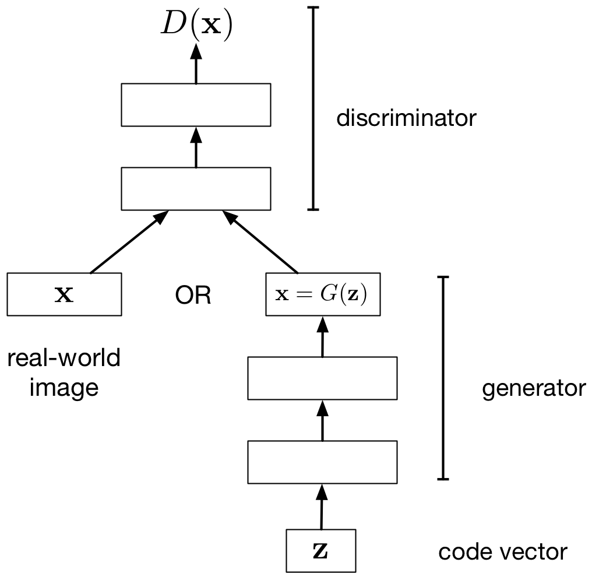{height="350"}</center>
:::

::: {.column width="60%"}
-   **Generator network**: try to fool the discriminator by generating real-looking images
-   **Discriminator network**: try to distinguish between real and fake images
:::
:::::

The loss function of the generator (the model we care about) is defined by the discriminator!

## GAN Generator

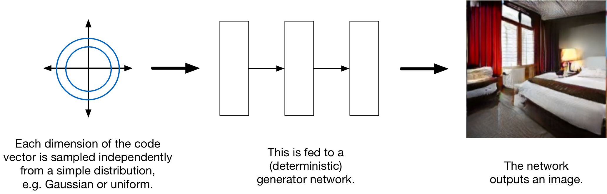{height="300"}

-   Generator Input: a random noise vector (Q: Why do we need to input noise?)

. . .

-   Generator Output: a generated image

## GAN Architecture

::::: columns
::: {.column width="50%"}
<center>{height="400"}</center>
:::

::: {.column width="50%"}
-   Discriminator Input: an image
-   Discriminator Output: a binary label (real vs fake)
:::
:::::

## GAN Loss Function Notation

Discriminator:

-   $D$ -- the discriminator neural network

. . .

-   $\theta$ -- the trainable parameters of the discriminator (we'll write $D_\theta$ if we want to make the dependency clear)

. . .

-   $x$ -- an image (either real or fake)

. . .

-   $D(x)$ or $D_\theta(x)$ -- the discriminator's determination of whether the image is real (1 = real, 0 = fake)

## GAN Loss Function Notation II

Generator:

-   $G$ -- the generator neural netowrk

. . .

-   $\phi$ -- the trainable parameters of the generator (we'll write $G_\phi$ if we want to make the dependency clear)

. . .

-   $z$ -- a random noise vector

. . .

-   $G(z)$ or $G_\phi(z)$ -- a generated image

. . .

Q: What does $D(G(z))$ mean?

## GAN: Optimizing the Generator

Let's assume the discriminator is fixed. Tune **generator** weights to:

-   **maximize** the probability that...
    -   discriminator labels a generated image as real
    -   Q: What loss function should we use?

. . .

We wish to tune $\phi$ to increase $D_\theta(G_\phi(z))$

. . .

$$
\min_\phi \left(\mathbb{E}_{z \sim  \mathcal{N}(0,I)}\left[\log \left(1 - D_\theta(G_\phi(z)) \right) \right]\right)
$$

## GAN: Optimizing the Discriminator

Let's assume the generator is fixed. Tune **discriminator** weights to:

-   **maximize** the probability that the
    -   discriminator labels a real image as real
    -   discriminator labels a generated image as fake
    -   Q: What loss function should we use?

## GAN: Optimizing the Discriminator II

We wish to tune $\theta$ to:

-   decrease $D_\theta(G_\phi(z))$, where $z \sim \mathcal{N}(0, I)$ (the data distribution)

. . .

-   increase $D_\theta(x)$, where $x \sim \mathcal{D}$ (the data distribution)

. . .

$$
\max_\theta \mathbb{E}_{x \sim \mathcal{D}}\left[\log D_\theta(x)\right] + \mathbb{E}_{z}\left[\log \left( 1 - D_\theta(G_\phi(z)) \right) \right]
$$

## GAN Optimization Problem

If we optimize both the generator and the discriminator then:

$$
\min_\phi \left(\max_\theta \left(\mathbb{E}_{x \sim \mathcal{D}}\left[\log D_\theta(x)\right] + \mathbb{E}_{z}\left[\log \left( 1 - D_\theta(G_\phi(z)) \right) \right]\right)\right)
$$

This is called the *minimax optimization problem* since the generator and discriminator are playing a zero-sum game against each other

## Training

Alternate between:

-   Training the discriminator

. . .

-   Training the generator

## Updating the Discriminator

<center>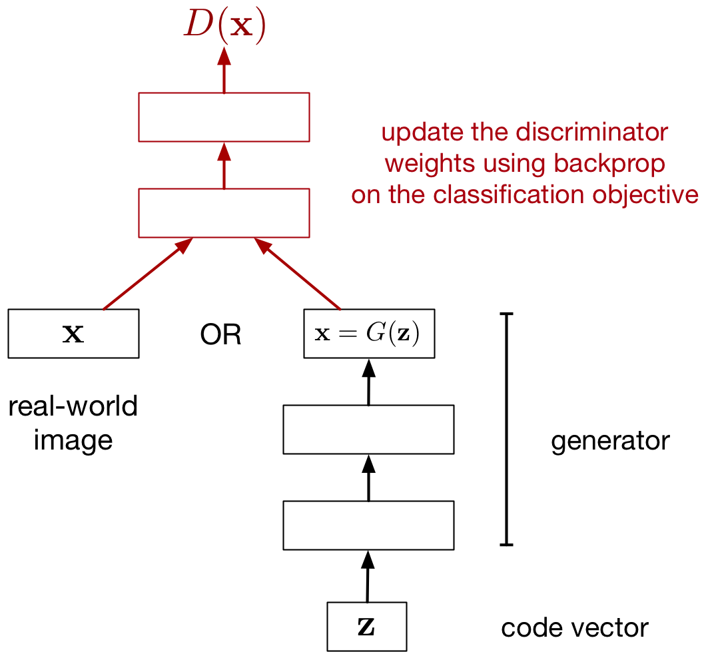{height="500"}</center>

## Updating the Generator

<center>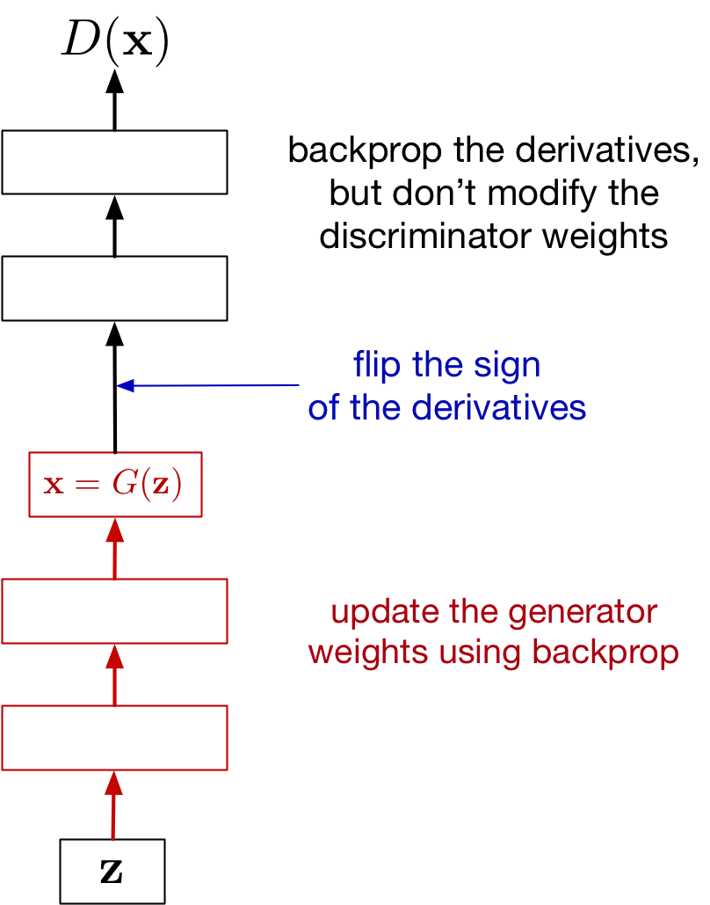{height="500"}</center>

## GAN Alternating Training Visualized

Black dots is the data distribution $\mathcal{D}$, green line is the generator distribution $G(z)$, and blue dotted line is the discriminator:

<center>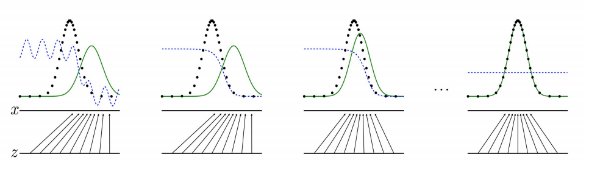{height="300"}</center>

## GAN Alternating Training Visualized

1.  The distributions $G(z)$ and $\mathcal{D}$ are quite different
2.  The discriminator is updated to be able to better distinguish real vs fake
3.  The generator is updated to be better match $\mathcal{D}$
4.  If training is successful, $G(z)$ is indistinguisable from $\mathcal{D}$

## A nice visualization of GAN training

<https://poloclub.github.io/ganlab/>

```{=html}
<!--

## A Better Cost Function

- We introduced the minimax cost function for the generator:

$$
\min_\phi \left(\mathbb{E}_{z}\left[\log \left( 1 - D_\theta(G_\phi(z)) \right) \right]\right)
$$

. . .

- One problem with this loss function is *saturation*


## A Better Cost Function

- Recall from classification. When the prediction is really wrong
    - "Logistic + square error" gets a weak gradient signal
    - "Logistic + cross-entropy " gets a strong gradient signal

. . .

- Here, if the generated sample is really bad, the discriminator's prediction is close to 0, and the generator's cost is flat

## A better generator cost function

Original minimax cost:

$$
\min_\phi \left(\mathbb{E}_{z}\left[\log \left( 1 - D_\theta(G_\phi(z)) \right) \right]\right)
$$

Modified generator cost:

$$
\min_\phi \left(\mathbb{E}_{z}\left[- \log D_\theta(G_\phi(z)) \right]
\right)
$$

-->
```

## GAN Training Caveats

-   Can work very well and produces crisp, high-res images, but **difficult to train**!

. . .

-   Difficult to numerically see whether there is progress
    -   Plotting the "training curve" (discriminator/generator loss) doesn't help much

. . .

-   Takes a long time to train (a long time before we see progress)

````{=html}
<!--
- To make the GAN train faster, we'll use:
    - LeakyReLU Activations instead of ReLU
    - Batch Normalization (later)

## GAN: Discriminator

```python
class Discriminator(nn.Module):
  def __init__(self):
    super().__init__()
    self.model = nn.Sequential(
      nn.Linear(28*28, 300),
      nn.LeakyReLU(0.2, inplace=True),
      nn.Linear(300, 100),
      nn.LeakyReLU(0.2, inplace=True),
      nn.Linear(100, 1))
  def forward(self, x):
    x = x.view(x.size(0), -1)
    out = self.model(x)
    return out.view(x.size(0))
```

## Leaky Relu activation

Like a relu, but "leaks" data:

- $f(x) = x$ if $x >= 0$
- $f(x) = \alpha x$ if $x < 0$

**Reason**:

- Always have some information pass through in the forwards pass
- Always have some information pass back in the backwards pass
- Better weight updates during the backwards pass

## GAN: Generator

```python
class Generator(nn.Module):
  def __init__(self):
    super().__init__()
    self.model = nn.Sequential(
      nn.Linear(100, 300),
      nn.LeakyReLU(0.2, inplace=True),
      nn.Linear(300, 28*28),
      nn.Sigmoid())

  def forward(self, x):
    out = self.model(x).view(x.size(0), 1, 28, 28)
    return out
```

## Training the Discriminator

```python
#images = batch of images
#batch_size = images.size(0)
noise = torch.randn(batch_size, 100)
fake_images = generator(noise)
inputs = torch.cat([images, fake_images])
labels = torch.cat([torch.zeros(batch_size)), # real
                    torch.ones(batch_size)])  # fake
d_outputs = discriminator(inputs)
d_loss = criterion(d_outputs, labels)
```

**Note: The labels (`real=0, fake=1`)
are opposite from our mathematical
derivation. This version turns out to perform better**

## Training the Generator

```python
noise = torch.randn(batch_size, 100)
fake_images = generator(noise)
outputs = discriminator(fake_images)
generator.zero_grad()
g_loss = criterion(outputs, torch.zeros(batch_size))
```

(Labels: `real=0, fake=1`)

## Let's look at the code!

{ height=15% }

{ height=15% }

{ height=15% }

{ height=15% }

{ height=15% }

-->
````

## GAN: Interpolation in $z$

<center>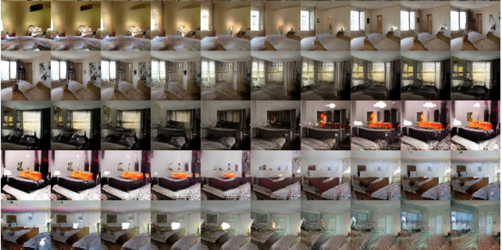{height="500"}</center>

```         
Radford et al. (2016) https://arxiv.org/pdf/1511.06434.pdf
```

## GAN: Vector Arithmetic in $z$

<center>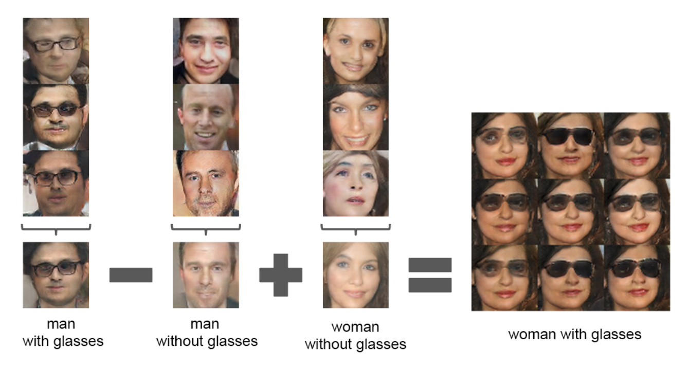{height="500"}</center>

```         
Radford et al. (2016) https://arxiv.org/pdf/1511.06434.pdf
```

## GAN Samples (2019)

ImageNet object categories (by BigGAN, a much larger model, with a bunch more engineering tricks)

<center>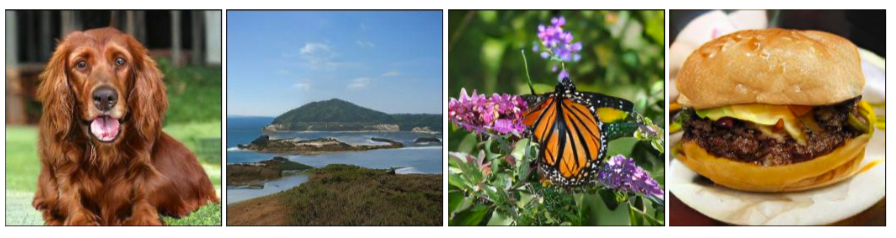{height="50%"}</center>

```         
Brock et al., 2019. Large scale GAN training for high fidelity natural image synthesis
```

## Mode Collapse

We don't actually know how well a GAN is modelling the distribution. One prominent issue is *mode collapse*

-   The word "mode" here means "peak" or " high-value local optimum"

. . .

-   GAN model learns to generate one type of input data (e.g. only digit 1)

. . .

-   Generating anything else leads to detection by discriminator

. . .

-   Generator gets stuck in that local optima

## Balance between Generator and Discriminator

If the discriminator is too good, then the generator will not learn due to **saturation**:

-   Remember that we are using the discriminator like a "loss function" for the generator

. . .

-   If the discriminator is too good, small changes in the generator weights won't change the discriminator output

. . .

-   If small changes in generator weights make no difference, then we can't incrementally improve the generator

## Wasserstein GAN (WGAN)

Idea: Use a different loss function.

```         
Arjovsky et al. (2017) Wasserstein GAN. https://arxiv.org/abs/1701.07875
```

-   Use the *Wasserstein distance* between the generator distribution and the data distribution

. . .

-   Reduces mode collapse, better measurement of progress

## Style Transfer with Cycle GAN

Style transfer problem: change the style of an image while preserving the content.

<center>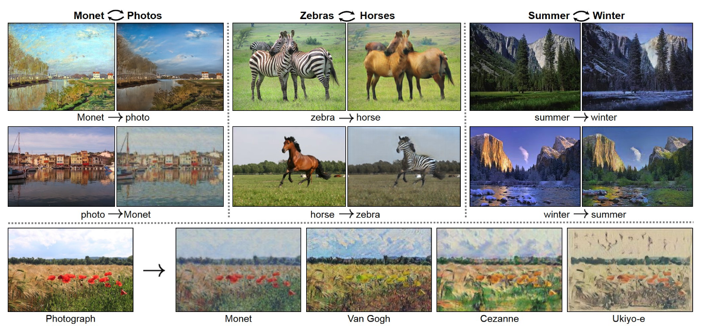{height="350"}</center>

Data: Two unrelated collections of images, one for each style

## Cycle GAN Idea

-   If we had paired data (same content in both styles), this would be a supervised learning problem. But this is hard to find.

## Cycle GAN Idea

-   The CycleGAN architecture learns to do it from unpaired data.
    -   Train two different generator nets to go from style 1 to style 2, and vice versa.
    -   Make sure the generated samples of style 2 are indistinguishable from real images by a discriminator net.
    -   Make sure the generators are **cycle-consistent**: mapping from style 1 to style 2 and back again should give you almost the original image.

## Cycle GAN Architecture

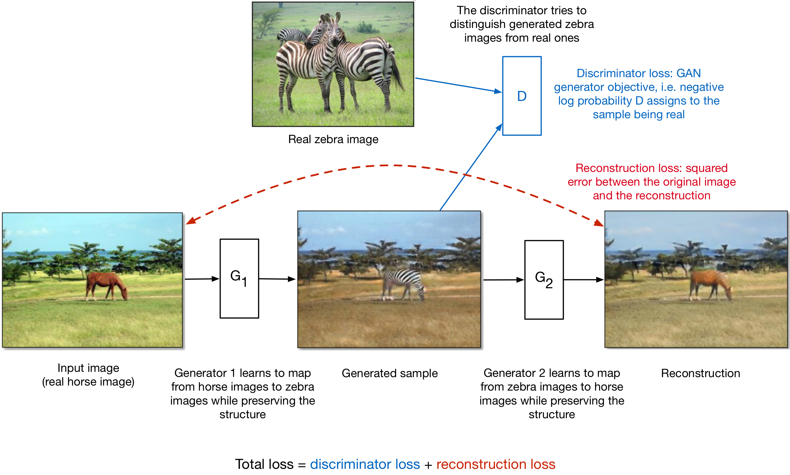{height="400"}

## Cycle GAN: Aerial photos and maps

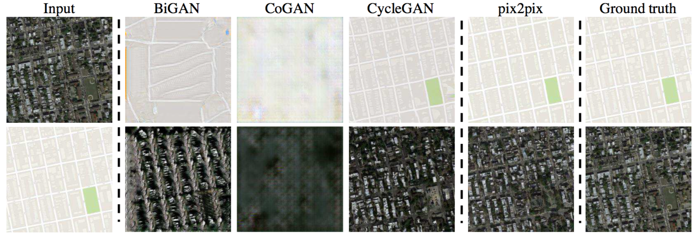{width="400"}

## Cycle GAN: Road scenes and semantic segmentation

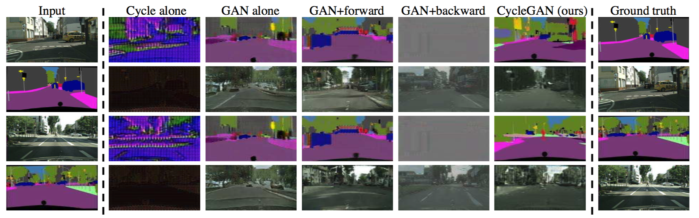{width="400"}

## Ethical and security issues with GANs

<https://thispersondoesnotexist.com>

## Deepfakes for voice

<iframe width="750 " height="515" src="https://www.youtube.com/embed/VnFC-s2nOtI?si=WV8Q5jf-G1btDqW_" title="YouTube video player" frameborder="0" allow="accelerometer; autoplay; clipboard-write; encrypted-media; gyroscope; picture-in-picture; web-share" referrerpolicy="strict-origin-when-cross-origin" allowfullscreen>

</iframe>