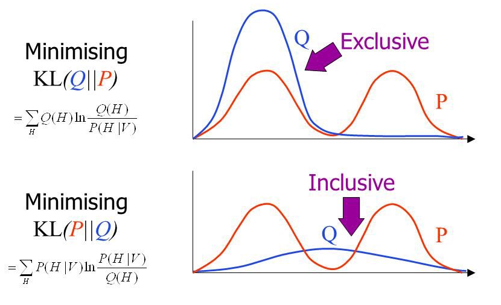
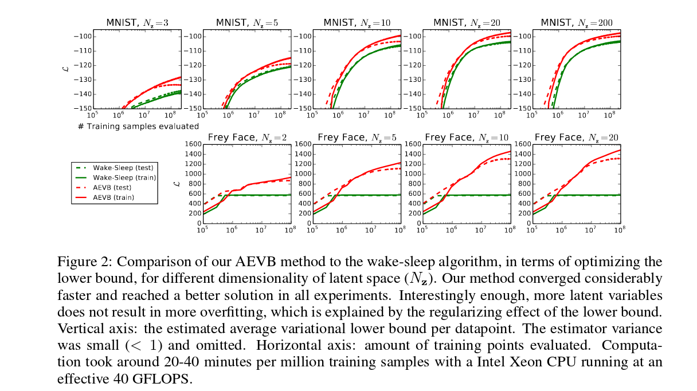
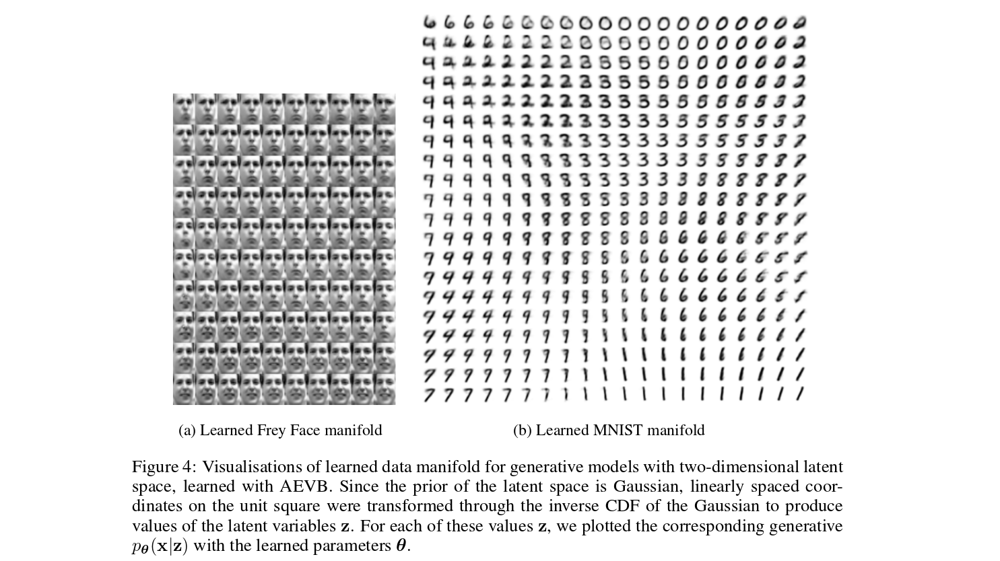
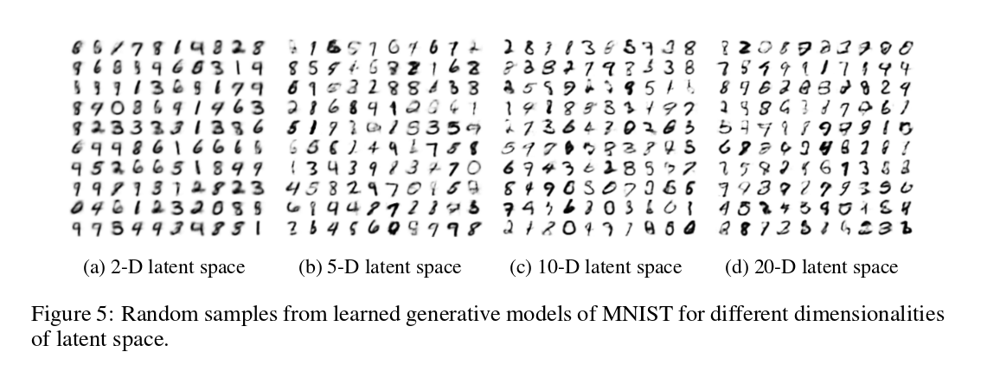
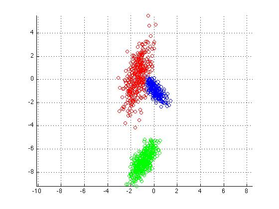
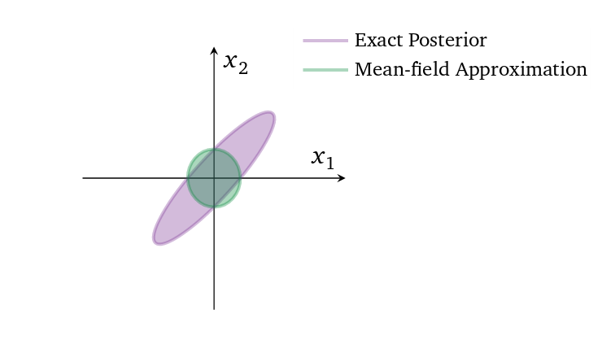
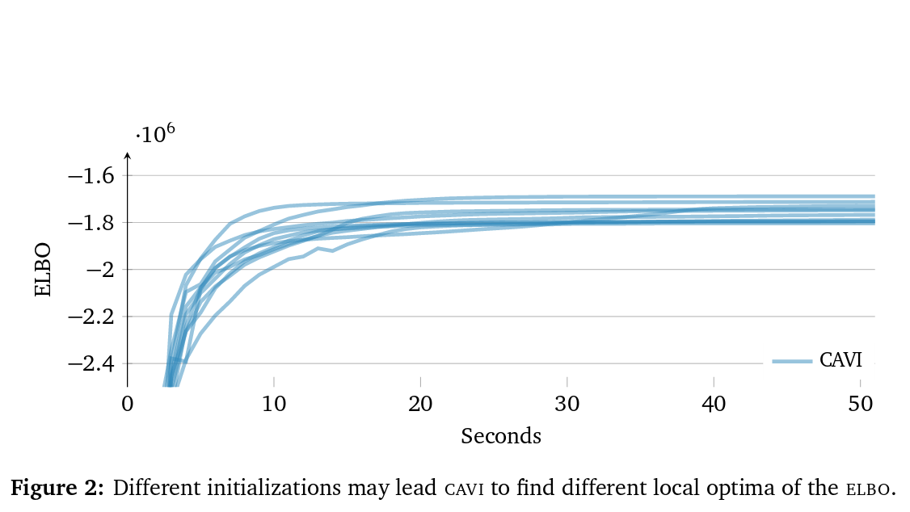

## Announcements

-   Book a meeting to discuss your project with an instructor if you haven't already!

. . .

-   You should have an overfit version of the model already

. . .

-   This is your first step, and should let you know the time/memory requirements of your model

## Review: Autoencoders

A couple of weeks ago, we discussed the **autoencoders**

-   Encoder: maps $x$ to a low-dimensional embedding $z$

. . .

-   Decoder: uses the low-dimensional embedding $z$ to reconstructs $x$

::::: columns
::: {.column width="40%"}
<center>{height="300"}</center>
:::

::: {.column width="60%"}
Let's see how much you remember!
:::
:::::

## Review Q1

What was the objective that we used to train the autoencoder?

\vspace{1in}

```{=html}
<!--
write in:
- minimize the reconstruction error (square loss):
$$\sum_j (\hat{\bf x}_j - {\bf x}_j)^2$$

where $\hat{\bf x} = Decoder(Encoder({\bf x}))$
-->
```

## Review Q2

If we train an autoencoder, what tasks can we accomplish with just the encoder portion of the autoencoder?

\vspace{1in}

```{=html}
<!--
write in
- compute distances
- possibly use for transfer learning
- semi-supervised learning?
-->
```

## Review Q3

If we train an autoencoder, what tasks can we accomplish with mainly the decoder portion of the autoencoder?

\vspace{1in}

```{=html}
<!--
write in
- generate new data points that look like your training set!
-->
```

## Review Q4

What are some limitations of the autoencoder?

\vspace{1in}

## Autoencoder Limitations

-   Images are blurry due to the use of MSE loss

. . .

-   It's not certain what good values of embeddings $z$ would be
    -   Which part of the embedding space does the encoder maps data to?
    -   This uncertainty means that we can't generate images without referring back to the encoder

. . .

-   It's not clear what the dimension of the embedding $z$ should be

## Autoencoder Limitations II

Could we resolve (but not all) some of the issues with autoencoder, if we use a more theoretically grounded approach?

Is there a probabilistic version of the autoencoder model?

<!-- 01vae -->

# Variational Autoencoders

## Generative Model

In CSC311, we learned about **generative models** that describe the distribution that the data comes from

. . .

-   i.e. describe the distribution ${\bf x} \sim p({\bf x})$, where ${\bf x}$ is a single data point

. . .

For example, in the Naive Bayes model for data ${\bf x}$ (e.g. bag-of-word encoding of an email, which could be spam or not spam) with ${\bf x} \sim p({\bf x})$, we assumed that $p({\bf x}) = \sum_c p({\bf x}|c)p(c)$, where $c$ is either spam or not spam. We made further assumptions about $p({\bf x}|c)$, e.g. that each $x_i$ is an independent Bernoulli.

## Mathematical Notation and Assumptions

Data $x_i \in \mathbb{R}^d$ are:

-   independent, identically distributed (i.i.d)

. . .

-   generated from the following joint distribution (with the true parameter $\theta^{*}$ unknown)

$$p_{\theta^{*}}(\textbf{z}, \textbf{x}) = p_{\theta^{*}}(\textbf{z})p_{\theta^{*}}(\textbf{x} | \textbf{z})$$

Where ${\bf z}$ is a low-dimensional vector (latent embedding)

## Mathematical Notation and Assumptions II

-   Example ${\bf x}$ could be an MNIST digit

. . .

-   Think of ${\bf z}$ as encoding digit features like digit shape, tilt, line thickness, font style, etc...

. . .

-   To generate an image, we first sample from the prior distribution $p_{\theta^{*}}(\textbf{z})$ to decide on these digit features, and use $p_{\theta^{*}}(\textbf{x} | \textbf{z})$ to generate an image given those features

## Intractability

Our data set is large, and so the following are *intractable*

-   evidence $p_{\theta^{*}}(\textbf{x})$

. . .

-   posterior distributions $p_{\theta^{*}}(\textbf{z} | \textbf{x})$

In other words, exactly computing the distribution of $p(\textbf{x})$ and $p(\textbf{z} | \textbf{x})$ using our dataset has high runtime complexity.

## The Decoder and Encoder

::::: columns
::: {.column width="40%"}
<center>{height="250"}</center>
:::

::: {.column width="60%"}
With this assumption, we can think of the autoencoder as doing the following:
:::
:::::

**Decoder**: A point approximation of the true distribution $p_{\theta^{*}}(\textbf{x}|\textbf{z})$

**Encoder**: Making a **point prediction** for the value of the latent vector $z$ that generated the image $x$

## The Decoder and Encoder II

Alternative:

-   what if, instead, we try to infer the **distribution** $p_{\theta^{*}}(\textbf{z}|\textbf{x})$?

## VAE Setup so far

**Decoder**: An approximation of the true distribution $p_{\theta^{*}}(\textbf{x}|\textbf{z})$

**Encoder**: An approximation of the true distribution $p_{\theta^{*}}(\textbf{z}|\textbf{x})$

## Computing the encoding distribution $p_{\theta^{*}}(\textbf{z}|\textbf{x})$

Unfortunately, the true distribution $p_{\theta^{*}}({\bf z}|{\bf x})$ is complex (e.g. can be multi-modal).

But can we approximate this distribution with a **simpler distribution**?

Let's restrict our estimate $q_\phi({\bf z}|{\bf x}) = \mathcal{N}({\bf z}; \boldsymbol{\mu}, \boldsymbol{\Sigma})$ to be a multivariate Gaussian distribution with $\phi = (\boldsymbol{\mu}, \boldsymbol{\Sigma})$

## Computing the encoding distribution $p_{\theta^{*}}(\textbf{z}|\textbf{x})$ II

-   It suffices to estimate the mean $\boldsymbol{\mu}$ and covariance matrix $\boldsymbol{\Sigma}$ of $q_\phi({\bf z}|{\bf x})$
-   Let's make it simpler and assume that the covariance matrix is diagonal, $\boldsymbol{\Sigma}=\sigma^2 \textbf{I}_{d \times d}$

(Note: we don't have to make this assumption, but it will make computation easier later on)

## VAE Setup so far

**Decoder**: An approximation of the true distribution $p_{\theta^{*}}(\textbf{x}|\textbf{z})$

**Encoder**: Predicts the mean and standard deviations of a distribution $q_\phi({\bf z}|{\bf x})$, so that the distribution is close to the true distribution $p_{\theta^{*}}(\textbf{z}|\textbf{x})$

We want our estimate distribution to be close to the true distribution. How do we measure the difference between distributions?

## (Discrete) Entropy

$$H[X] = \sum_x p(X = x) \log \left(\frac{1}{p(X = x)}\right) = \text{E}\left[\log \frac{1}{p(X)}\right]$$

Many ways to think about this quantity:

-   The expected number of yes/no questions you would need to ask to correctly predict the next symbol sampled from distribution $p(X)$

## (Discrete) Entropy II

-   The expected "surprise" or "information" in the possible outcomes of random variable $X$

. . .

-   The minimum number of bits required to compress a symbol $x$ sampled from distribution $p(X)$

## (Discrete) Entropy of a Coin Flip

::::: columns
::: {.column width="30%"}
<center>{height="250"}</center>
:::

::: {.column width="70%"}
-   Entropy of a fair coin flip is $0.5\log(2) + 0.5\log(2) = \log(2) = 1$ bits
-   Entropy of a fair dice is $\log(6) = 2.58$ bits
:::
:::::

. . .

-   Entropy of characters in English words is about 2.62 bits

. . .

-   Entropy of characters from the English alphabet selected uniformly at random is $\log(26) = 4.7$ bits

## Kullback-Leibler Divergence

Also called: KL Divergence, Relative Entropy

For discrete probability distributions:

$$D_\text{KL}(q(z) ~||~ p(z)) = \sum_z q(z) \log \left(\frac{q(z)}{p(z)}\right)$$

For continuous probability distributions:

$$D_\text{KL}(q(z) ~||~ p(z)) = \int q(z) \log \left(\frac{q(z)}{p(z)}\right)\, dz$$

## KL Divergence Example Computation

Approximating an unfair coin with a fair coin.

-   $p(z = 1) = 0.7$ and $p(z = 0) = 0.3$

. . .

-   $q(z = 1) = q(z = 0) = 0.5$

## KL Divergence Example Computation II

\begin{align*}
D_\text{KL}(q(z) ~||~ p(z)) &= \sum_z q(z) \log \left(\frac{q(z)}{p(z)}\right) \\
&= q(0) \log \left(\frac{q(0)}{p(0)}\right) +  q(1) \log \left(\frac{q(1)}{p(1)}\right) \\
&= 0.5 \log \left(\frac{0.5}{0.3}\right) +  0.5 \log \left(\frac{0.5}{0.7}\right) \\
&= 0.872
\end{align*}

## KL Divergence is not Symmetric!

Approximating a fair coin with an unfair coin.

-   $p(z = 1) = 0.7$ and $p(z = 0) = 0.3$

. . .

-   $q(z = 1) = q(z = 0) = 0.5$

## KL Divergence is not Symmetric! II

\begin{align*}
D_\text{KL}(p(z) ~||~ q(z)) &= \sum_z p(z) \log \left(\frac{p(z)}{q(z)}\right) \\
&= p(0) \log \left(\frac{p(0)}{q(0)}\right) +  p(1) \log \left(\frac{p(1)}{q(1)}\right) \\
&= 0.3 \log \left(\frac{0.3}{0.5}\right) +  0.7 \log \left(\frac{0.7}{0.5}\right) \\
&= 0.823 \\
&\neq D_\text{KL}(q(z) ~||~ p(z))
\end{align*}

## Minimizing KL Divergence

<center>{height="500"}</center>

## KL Divergence Properties

The KL divergence is a measure of the difference between probability distributions.

KL divergence is an asymmetric, nonnegative measure, not a norm. It doesn't obey the triangle inequality.

KL divergence is always positive. Hint: you can show this using the inequality $\ln(x) \leq x - 1$ for $x > 0$.

## KL Divergence: Continuous Example

Suppose we have two Gaussian distributions $p(x) \sim N\left(\mu_1, \sigma_1^2\right)$ and $q(x) \sim N\left(\mu_2, \sigma_2^2\right)$.

What is the KL divergence $D_\text{KL}(p(z) ~||~ q(z))$?

Recall:

$$p\left(z; \mu_1, \sigma_1^2\right) = \frac{1}{\sqrt{2 \pi \sigma_1^2}} e^{-\frac{(z - \mu_1)^2}{2\sigma_1^2}}$$

$$\log \left(p\left(z; \mu_1, \sigma_1^2\right)\right) = - \log \sqrt{2 \pi \sigma_1^2} - \frac{(z - \mu_1)^2}{2\sigma_1^2}$$

## KL Divergence: Entropy and Cross-Entropy

We can split the KL divergence into two terms, which we can compute separately:

\begin{align*}
D_\text{KL}(p(z) ~||~ q(z)) &= \int p(z) \log \frac{p(z)}{q(z)} dz \\
    &= \int p(z) (\log p(z) - \log q(z)) dz \\
    &= \int p(z) \log p(z) dz - \int p(z) \log q(z) dz \\
    &= -\text{entropy} - \text{cross-entropy}
\end{align*}

## KL Divergence: Continuous Example, Entropy Computation

\begin{align*}
\int p(z) \log\left(p(z)\right)\, dz \\
&\hspace{-24pt}= \int p(z) \left(-\log\left(\sqrt{2 \pi \sigma_1^2}\right) - \frac{(z - \mu_1)^2}{2\sigma_1^2}\right)\, dz \\
&\hspace{-24pt}=  - \int p(z) \frac{1}{2}\log\left(2 \pi \sigma_1^2\right)\, dz - \int p(z) \frac{(z - \mu_1)^2}{2\sigma_1^2}\, dz \\
&\hspace{-24pt}= \ldots
\end{align*}

## KL Divergence: Continuous Example, Entropy Computation II

\begin{align*}
\ldots &= -\frac{1}{2}\log\left(2 \pi \sigma_1^2\right) \int p(z)\, dz - \frac{1}{2\sigma_1^2}\int p(z) (z - \mu_1)^2\, dz \\
&= -\frac{1}{2}\log\left(2 \pi \sigma_1^2\right) - \frac{1}{2} \\
&= -\frac{1}{2}\log\left(\sigma_1^2\right) - \frac{1}{2}\log (2 \pi) - \frac{1}{2}
\end{align*}

Since $\displaystyle \int p(z)\, dz = 1$ and $\displaystyle\int p(z) (z - \mu_1)^2\, dz = \sigma_1^2$

## KL Divergence: Continuous Example, Cross-Entropy Computation

\begin{align*}
\int p(z) \log\left(q(z)\right)\, dz \\
&\hspace{-36pt}= \int p(z) \left(-\log\left(\sqrt{2 \pi \sigma_2^2}\right) - \frac{(z - \mu_2)^2}{2\sigma_2^2}\right)\, dz \\
&\hspace{-36pt}= -\int p(z) \frac{1}{2}\log (2 \pi \sigma_2^2)\, dz - \int p(z) \frac{(z - \mu_2)^2}{2\sigma_2^2}\, dz \\
&\hspace{-36pt}= -\frac{1}{2}\log (2 \pi \sigma_2^2) - \frac{1}{2\sigma_2^2}\int p(z) (z - \mu_2)^2\, dz =  \ldots
\end{align*}

## KL Divergence: Continuous Example, Cross-Entropy Computation II

$$\ldots = - \frac{1}{2}\log (2 \pi \sigma_2^2) - \frac{\sigma_1^2 + (\mu_1-\mu_2)^2}{2\sigma_2^2}$$

## Back to Autoencoders: Summary so far

Autoencoder:

-   Decoder: point estimate of $p_{\theta^{*}}(\textbf{x} | \textbf{z})$

. . .

-   Encoder: point estimate of the value of $\textbf{z}$ that generated the image $\textbf{x}$

## Back to Autoencoders: Summary so far II

VAE:

-   Decoder: probabilistic estimate of $p_{\theta^{*}}(\textbf{x} | \textbf{z})$

. . .

-   Encoder: probabilistic estimate of a Gaussian distribution $q_{\phi}(\textbf{z} | \textbf{x})$ that approximates the distribution $p_{\theta^{*}}(\textbf{z} | \textbf{x})$
    -   In particular, our encoder will be a neural network that predicts the mean and standard deviation of $q_{\phi}(\textbf{z} | \textbf{x})$
    -   We can then sample ${\bf z}$ from this distribution!

```{=html}
<!--
    - This uses the **reparamaterization trick**
    - Alternative is to sample $z ~ q_{\phi}(\textbf{z} | \textbf{x})$ directly.
      Doable, but gradient estimator will have high variance
-->
```

## VAE Objective

But how do we train a VAE?

We want to maximize the likelihood of our data:

$$\displaystyle \log(p(x)) = \log\left(\int p(x|z)p(x)\, dz\right)$$

And we want to make sure that the distributions $q(z|x)$ and $p(z|x)$ are close:

-   We want to minimize $D_\text{KL}(q({\bf z}|{\bf x}) ~||~ p({\bf z} | {\bf x}))$

. . .

-   This is a measure of encoder quality

## VAE Objective II

In other words, we want to maximize

$$-D_\text{KL}(q({\bf z}|{\bf x}) ~||~ p({\bf z} | {\bf x})) + \log(p(x))$$

How can we optimize this quantity in a tractable way?

## VAE: Evidence Lower-Bound

\begin{align*}
D_\text{KL}(q({\bf z}|{\bf x}) ~||~ p({\bf z} | {\bf x})) &= \int q({\bf z}|{\bf x}) \log\left(\frac{q({\bf z}|{\bf x})}{p({\bf z}|{\bf x})}\right)\, dz \\
&= \text{E}_q\left(\log\left(\frac{q({\bf z}|{\bf x})}{p({\bf z}|{\bf x})}\right)\right) \\
&= \text{E}_q (\log (q({\bf z}|{\bf x}))) - \text{E}_q(\log(p({\bf z}|{\bf x}))) \\
&= \text{E}_q(\log(q({\bf z}|{\bf x}))) - \text{E}_q(\log(p({\bf z},{\bf x}))) \\
&\hspace{12pt} + \text{E}_q(\log(p({\bf x}))) \\
&= \text{E}_q(\log(q({\bf z}|{\bf x}))) - \text{E}_q(\log(p({\bf z},{\bf x}))) \\
&\hspace{12pt} + \log p({\bf x})
\end{align*}

## VAE: Evidence Lower-Bound II

We'll define the **evidence lower-bound**: $$\text{ELBO}_q({\bf x}) = \text{E}_q(\log(p({\bf z},{\bf x})) - \log(q({\bf z}|{\bf x})))$$

So we have $$\log(p({\bf x})) - D_\text{KL}(q({\bf z}|{\bf x}) ~||~ p({\bf z} | {\bf x})) = \text{ELBO}_q({\bf x})$$

## Optimizing the ELBO

The ELBO gives us a way to estimate the gradients of $\log(p({\bf x})) - D_\text{KL}(q({\bf z}|{\bf x}) ~||~ p({\bf z} | {\bf x}))$

How?

$$\text{ELBO}_q({\bf x}) = \text{E}_q(\log(p({\bf z},{\bf x})) - \log(q({\bf z}|{\bf x})))$$

-   The right hand side of this expression is an expectation over $z \sim q(z|x)$

. . .

-   To estimate the ELBO, we can **sample** from the distribution $z \sim q(z|x)$, and compute the terms inside.

## Optimizing the ELBO II

-   We can estimate gradients in the same way---this is called a **Monte-Carlo gradient estimator**

## Monte Carlo Estimation

(This notation is unrelated to other slides: $p(z)$ is just a univariate Gaussian distribution, and $f_\phi(z)$ is a function parameterized by $\phi$)

Suppose we want to optimize an objective $\mathcal{L}(\phi) = \text{E}_{z \sim p(z)}(f_\phi(z))$ where $p(z)$ is a normal distribution.

We can **estimate** $\mathcal{L}(\phi)$ by sampling $z_i \sim p(z)$ and computing

$$\mathcal{L}(\phi) = \text{E}_{z \sim p(z)}(f_\phi(z)) = \int_z p(z)f_\phi(z)\, dz \approx \frac{1}{N} \sum_{i=1}^N f_\phi(z_i)$$

## Monte Carlo Gradient Estimation

Likewise, if we want to estimate $\nabla_\phi \mathcal{L}$, we can sample $z_i \sim p(z)$ and compute

\begin{align*}
\nabla_\phi \mathcal{L} &= \nabla_\phi \text{E}_{z \sim p(z)}(f_\phi(z)) \\
                        &= \nabla_\phi \int_z p(z)f_\phi(z)\, dz \\
                        &\approx \nabla_\phi  \frac{1}{N} \sum_{i=1}^N f_\phi(z_i) \\
                        &= \frac{1}{N} \sum_{i=1}^N \nabla_\phi  f_\phi(z_i) \\
\end{align*}

## The Reparamaterization Trick

$\text{ELBO}_{\theta,\phi}(\textbf{x}) = \text{E}_{q_{\phi}}(\log(p_{\theta}(\textbf{z}, \textbf{x})) - \log(q_{\phi}(\textbf{z}|\textbf{x})))$

Problem: typical Monte-Carlo gradient estimator with samples $\textbf{z} \sim q_{\phi}(\textbf{z}|\textbf{x})$ has very high variance.

Reparameterization trick: instead of sampling $\textbf{z} \sim q_{\phi}(\textbf{z}|\textbf{x})$ express $\textbf{z}=g_{\phi}(\epsilon, \textbf{x})$ where $g$ is deterministic and only $\epsilon$ is stochastic.

## The Reparamaterization Trick II

In practise, the reparameterization trick is what makes the VAE encoder deterministic. When running a VAE forward pass:

1.  We get the means and standard deviations from the VAE
2.  We sample from $\mathcal{N}({\bf 0}, {\bf I})$
3.  We use the samples from step 2 to get a sample from $q(z)$ obtained from step 1

## VAE: Summary so far

**Decoder**: estimate of $p_{\theta^{*}}(\textbf{x} | \textbf{z})$.

**Encoder**: estimate of a Gaussian distribution $q_{\phi}(\textbf{z} | \textbf{x})$ that approximates the distribution $p_{\theta^{*}}(\textbf{z} | \textbf{x})$.

-   Encoder is a NN that predicts the mean and standard deviation of $q_{\phi}(\textbf{z} | \textbf{x})$

. . .

-   Use the **reparameterization trick** to sample from this distribution

## VAE: Summary so far II

The VAE objective is equal to the evidence lower-bound:

$$\log(p({\bf x})) - D_\text{KL}(q({\bf z}|{\bf x}) ~||~ p({\bf z} | {\bf x})) = \text{ELBO}_q({\bf x})$$

Which we can estimate using Monte Carlo

$$\text{ELBO}_q({\bf x}) = \text{E}_q (\log(p({\bf z},{\bf x})) - \log(q({\bf z}|{\bf x})))$$

## VAE: Summary so far III

But given a value $z \sim q(z|x)$, how can we compute

$$\log p({\bf z},{\bf x}) - \log q({\bf z}|{\bf x})$$

...or its derivative with respect to the neural network parameters?

We need to do some more math to write this quantity in a form that is easier to estimate.

## VAE: a Simpler Form

$$\begin{aligned}
    \text{ELBO}_{\theta,\phi}(\textbf{x}) &= \text{E}_{q_{\phi}}(\log(p_{\theta}(\textbf{z}, \textbf{x})) - \log(q_{\phi}(\textbf{z}|\textbf{x}))) \\
    &= \text{E}_{q_{\phi}}(\log(p_{\theta}(\textbf{x} | \textbf{z})) + \log(p_{\theta}(\textbf{z})) - \log(q_{\phi}(\textbf{z}|\textbf{x}))) \\
    &= \text{E}_{q_{\phi}}(\log(p_{\theta}(\textbf{x} | \textbf{z}))) - \text{E}_{q_{\phi}}(\log(p_{\theta}(\textbf{z})) + \log(q_{\phi}(\textbf{z}|\textbf{x}))) \\
    &= \text{E}_{q_{\phi}}(\log(p_{\theta}(\textbf{x} | \textbf{z}))) - D_\text{KL}(q_{\phi}(\textbf{z}|\textbf{x}) ~||~ p_{\theta}(\textbf{z})) \\
    &= \text{decoding quality} - \text{encoding regularization}
\end{aligned}$$

Both terms can be computed easily if we make some simplifying assumptions

Let's see how...

## Computing Decoding Quality

In order to estimate this quantity

$$\text{E}_{q_{\phi}}(\log(p_{\theta}(\textbf{x} | \textbf{z})))$$

...we need to make some assumptions about the distribution $p_{\theta}(\textbf{x} | \textbf{z})$.

## Computing Decoding Quality II

If we make the assumption that $p_{\theta}(\textbf{x} | \textbf{z})$ is a normal distribution centered around some pixel intensity, then optimizing $p_{\theta}(\textbf{x} | \textbf{z})$ is equivalent to optimizing the *square loss*!

That is, $p_{\theta}(\textbf{x} | \textbf{z})$ tells us how intense a pixel could be, but that pixel could be a bit darker/lighter, following a normal distribution.

**Bonus: A traditional autoencoder is optimizing this same quantity!**

## Computing Encoding Quality

This KL divergence computes the difference in distribution between two distributions:

$$D_\text{KL}(q_{\phi}(\textbf{z}|\textbf{x})~||~p_{\theta}(\textbf{z}))$$

-   $q_{\phi}(\textbf{z}|\textbf{x})$ is a normal distribution that approximates $p_\theta(\textbf{z}|\textbf{x})$

. . .

-   $p_{\theta}(\textbf{z})$ is the **prior distribution on** ${\bf z}$
    -   distribution of $z$ when we don't know anything about ${\bf x}$ or any other quantity

## Computing Encoding Quality II

Since ${\bf z}$ is a *latent* variable, not actually observed in the real word, we can choose $p_{\theta}(\textbf{z})$

-   we choose $p_\theta (z) = \mathcal{N}({\bf 0}, {\bf I})$

...and we know how to compute the KL divergence of two Gaussian distributions!

## Interpretation

The VAE objective

$$\text{E}_{q_{\phi}}(\log(p_{\theta}(\textbf{x} | \textbf{z}))) - D_\text{KL}(q_{\phi}(\textbf{z}|\textbf{x}) ~||~ p_{\theta}(\textbf{z}))$$

has an extra regularization term that the traditional autoencoder does not.

This extra regularization term pushes the values of ${\bf z}$ to be closer to $0$.

## MNIST results

<center></center>

## Frey Faces results

<center></center>

## Dimension of latent variables

<center></center>

<!-- 02mog -->

# Mixture of Gaussians

## Variational Inference

Variational inference is used in other areas... (TODO)

## An example: Data from Mixture of Gaussians

-   K mixture components, corresponding to normal distributions

. . .

-   Means $\boldsymbol{\mu}=\{\mu_1,...,\mu_K\} \sim \mathcal{N}(0, \sigma^2\boldsymbol{I})$

. . .

-   Mixture selection variable $c_i \sim \text{Categorical}(1/K, ..., 1/K)$

## An example: Data from Mixture of Gaussians II

-   Joint model $\displaystyle p(\boldsymbol{\mu}, c_{1:n}, x_{1:n})=p(\boldsymbol{\mu}) \prod_{i=1}^n p(c_i)p(x_i|c_i,\boldsymbol{\mu})$

. . .

::::: columns
::: {.column width="40%"}
<center></center>
:::

::: {.column width="60%"}
-   Each $c_i$ has K options, and we have $n$ data points, so $O(K^n)$ to evaluate $\displaystyle p(x_{1:n}) = \int p(\boldsymbol{\mu}, c_{1:n}, x_{1:n})\, d\boldsymbol{\mu}dc_{1:n}$
:::
:::::

## An example: Data from Mixture of Gaussians III

-   Each $c_i$ has K options, and we have $n$ data points, so $O(K^n)$ to evaluate $\displaystyle p(x_{1:n}) = \int p(\boldsymbol{\mu}, c_{1:n}, x_{1:n})\, d\boldsymbol{\mu}dc_{1:n}$

. . .

-   Takeaway message: can't use direct estimation of the evidence $p(x_{1:n})$

. . .

-   In this particular example we can use EM, but in general it assumes that you know $p(\textbf{z}|\textbf{x})$

## Evidence Lower Bound (ELBO)

$$\begin{aligned}
    D_\text{KL}(q(\textbf{z})~||~p(\textbf{z}|\textbf{x})) &= \text{E}_{q}\left(\log\left(\frac{q(\textbf{z})}{p(\textbf{z} | \textbf{x})}\right)\right) \\
    &= \text{E}_{q}(\log(q(\textbf{z}))) - \text{E}_{q}(\log(p(\textbf{z} | \textbf{x}))) \\
    &= \text{E}_{q}(\log(q(\textbf{z}))) - \text{E}_{q}(\log(p(\textbf{z},\textbf{x}))) \\
    &\hspace{12pt} + \text{E}_{q}(\log(p(\textbf{x}))) \\
    &= \text{E}_{q}(\log(q(\textbf{z}))) - \text{E}_{q}(\log(p(\textbf{z},\textbf{x}))) \\
    &\hspace{12pt} + \log(p(\textbf{x})) \\
    &= -\text{ELBO}_{q}(\textbf{x}) + \log(p(\textbf{x}))
\end{aligned}$$

## Evidence Lower Bound (ELBO) II

Log-evidence:

$$\log(p(\textbf{x})) = D_\text{KL}(q(\textbf{z}) ~||~ p(\textbf{z} | \textbf{x})) + \text{ELBO}_q(\textbf{x})$$

Variational Inference $\rightarrow$ find $q(\textbf{z})$ that maximizes $\text{ELBO}_q$

## Mean-Field Approximation

-   Simplification for posterior approximator $q(\textbf{z})$:

. . .

-   $\displaystyle q(\textbf{z}) = \prod_j q_j(z_j)$

. . .

-   All latent variables $z_j$ are mutually independent

. . .

-   Each is governed by its own distribution $q_j$

. . .

-   WHY? It makes the optimization easier (analytical gradients)

## Mean-Field Approximation II

-   WHY NOT? It fails to model correlations among latent variables, and underestimates variance

<center></center>

## Optimization algorithms

-   Algo $\#1$: coordinate ascent along each latent variable of ELBO

. . .

-   Main problem is that it evaluates ELBO on the entire dataset (not great for big data)

## Optimization algorithms II

-   Also susceptible to local minima

<center>{height="450"}</center>

## Optimization algorithms III

-   Algo $\#2$: stochastic optimization over all latent variables

. . .

-   Uses the natural gradient to account for manifold on which distributions live

. . .

-   Evaluates ELBO on single data points, or minibatches