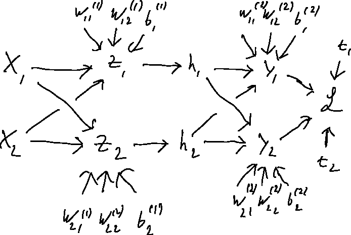



These exercises are optional and are not graded. They are based on the material from [Lecture 2](/lecs/w02/lec02.html). Try each exercise on your own first, then click on **Solution** to reveal a worked answer.

## Exercise 1 - Gradients and Computation Graphs

**(a)** Compute the gradient $\frac{\partial \mathcal{L}}{\partial w_j}$ of $\mathcal{L}$ with respect to a weight $w_j$ in the following computation:
$$
\mathcal{L}(y, t) = - t \log(y) - (1-t) \log(1-y), \qquad
y = \sigma(z), \qquad
z = \mathbf{w}^\top \mathbf{x}.
$$

**(b)** Draw the computation graph for the following neural network, showing the relevant scalar quantities. Assume that $\mathbf{y}, \mathbf{h}, \mathbf{x} \in \R^2$.
$$
\mathcal{L} = \frac{1}{2}\sum_k (y_k - t_k)^2, \qquad
y_k = \sum_i w_{ki}^{(2)} h_i + b_k^{(2)}, \qquad
h_i = \sigma(z_i), \qquad
z_i = \sum_j w_{ij}^{(1)} x_j + b_i^{(1)}.
$$

::: {.callout-tip collapse="true" title="Solution"}
**(a)** Applying the chain rule, we have
$$ \frac{\partial \mathcal{L}}{\partial w_j} = \frac{\partial \mathcal{L}}{\partial y} \frac{\partial y}{\partial z} \frac{\partial z}{\partial w_j}. $$
Looking at each term individually yields
$$
\begin{aligned}
\frac{\partial \mathcal{L}}{\partial y}
  &= \frac{\partial}{\partial y} [-t \log(y) - (1 - t) \log(1 - y)]
  = - \frac{t}{y} + \frac{1 - t}{1 - y},\\
\frac{\partial y}{\partial z}
  &= \sigma(z) (1 - \sigma(z))
  = y (1 - y),\\
\frac{\partial z}{\partial w_j}
  &= \frac{\partial}{\partial w_j} (\mathbf{w}^\top \mathbf{x}) = x_j.
\end{aligned}
$$
Bringing it all together yields
$$
\frac{\partial \mathcal{L}}{\partial w_j}
  = \left( - \frac{t}{y} + \frac{1 - t}{1 - y} \right) y (1 - y)\, x_j
  = (-t + ty + y - ty)\, x_j
  = (y - t)\, x_j.
$$

**(b)** The computation graph is shown below. Every scalar is a node, and there is an edge from $a$ to $b$ whenever $a$ is used to compute $b$. (In the hand drawing, the second weight under $z_2$ should read $w_{22}^{(1)}$.)

{width=60%}
:::

## Exercise 2 - Computing XOR

**(a)** Show that XOR is not linearly separable. That is, show that there are no $w_1, w_2, b$ such that $f(w_1 x_1 + w_2 x_2 + b)$ computes $x_1 \oplus x_2$ for all four binary inputs, where $f$ is the hard threshold function
$$
f(x) = \begin{cases} 1, & x \geq 0 \\ 0, & x < 0. \end{cases}
$$
*Hint:* use the fact that half-spaces are convex.

**(b)** Design, by hand, an MLP with two inputs, two hidden units, and one output unit (all using the hard threshold activation $f$) that computes XOR. Specify all weights and biases, and verify your network on all four inputs.

**(c)** Suppose we remove the activation function from the hidden layer of an MLP, so that $\mathbf{h} = \mathbf{W}^{(1)}\mathbf{x} + \mathbf{b}^{(1)}$ and $\mathbf{y} = \mathbf{W}^{(2)}\mathbf{h} + \mathbf{b}^{(2)}$. Show that this network is equivalent to a linear model. What does this tell you about the importance of nonlinear activations?

::: {.callout-tip collapse="true" title="Solution"}
**(a)** Suppose such $w_1, w_2, b$ exist. The positive examples $(0,1)$ and $(1,0)$ satisfy $w_1 x_1 + w_2 x_2 + b \geq 0$. The set of points satisfying this inequality is a half-space, which is convex, so their midpoint $(0.5, 0.5)$ must satisfy it too. The negative examples $(0,0)$ and $(1,1)$ satisfy $w_1 x_1 + w_2 x_2 + b < 0$, which is also a convex set, so their midpoint, again $(0.5, 0.5)$, must satisfy it as well. A single point cannot be in both sets, which is a contradiction.

**(b)** One solution uses one hidden unit to compute OR and another to compute AND. XOR is then "OR but not AND":
$$
h_1 = f(x_1 + x_2 - 0.5), \qquad
h_2 = f(x_1 + x_2 - 1.5), \qquad
y = f(h_1 - h_2 - 0.5).
$$
That is, $\mathbf{W}^{(1)} = \begin{pmatrix} 1 & 1 \\ 1 & 1 \end{pmatrix}$, $\mathbf{b}^{(1)} = \begin{pmatrix} -0.5 \\ -1.5 \end{pmatrix}$, $\mathbf{w}^{(2)} = \begin{pmatrix} 1 \\ -1 \end{pmatrix}$, $b^{(2)} = -0.5$.

| $x_1$ | $x_2$ | $h_1$ (OR) | $h_2$ (AND) | $y$ |
|:---:|:---:|:---:|:---:|:---:|
| 0 | 0 | 0 | 0 | 0 |
| 0 | 1 | 1 | 0 | 1 |
| 1 | 0 | 1 | 0 | 1 |
| 1 | 1 | 1 | 1 | 0 |

**(c)** Substituting,
$$
\mathbf{y} = \mathbf{W}^{(2)}\left(\mathbf{W}^{(1)}\mathbf{x} + \mathbf{b}^{(1)}\right) + \mathbf{b}^{(2)}
  = \underbrace{\mathbf{W}^{(2)}\mathbf{W}^{(1)}}_{\mathbf{W}'}\mathbf{x} + \underbrace{\mathbf{W}^{(2)}\mathbf{b}^{(1)} + \mathbf{b}^{(2)}}_{\mathbf{b}'},
$$
which is a linear model with weights $\mathbf{W}'$ and bias $\mathbf{b}'$. The same argument applies to any number of layers. Without nonlinear activations, adding layers does not increase what the network can represent (for example, it still cannot compute XOR).
:::

## Exercise 3 - Backpropagation in a Two-Layer MLP

Consider the network from lecture, with a ReLU activation in the hidden layer:
$$
\mathbf{z} = \mathbf{W}^{(1)}\mathbf{x} + \mathbf{b}^{(1)}, \qquad
\mathbf{h} = \text{ReLU}(\mathbf{z}), \qquad
\mathbf{y} = \mathbf{W}^{(2)}\mathbf{h} + \mathbf{b}^{(2)}, \qquad
\mathcal{L} = \frac{1}{2}\|\mathbf{y} - \mathbf{t}\|^2.
$$

**(a)** Using the error signal notation $\overline{v} = \frac{\partial \mathcal{L}}{\partial v}$, write down the backward pass in vectorized form, i.e. expressions for $\overline{\mathbf{y}}$, $\overline{\mathbf{W}^{(2)}}$, $\overline{\mathbf{b}^{(2)}}$, $\overline{\mathbf{h}}$, $\overline{\mathbf{z}}$, $\overline{\mathbf{W}^{(1)}}$, and $\overline{\mathbf{b}^{(1)}}$.

**(b)** Now let
$$
\mathbf{x} = \begin{pmatrix} 1 \\ -1 \end{pmatrix}, \quad
\mathbf{W}^{(1)} = \begin{pmatrix} 2 & 1 \\ -1 & 1 \end{pmatrix}, \quad
\mathbf{b}^{(1)} = \begin{pmatrix} 0 \\ 1 \end{pmatrix}, \quad
\mathbf{W}^{(2)} = \begin{pmatrix} 1 & -1 \\ 2 & 1 \end{pmatrix}, \quad
\mathbf{b}^{(2)} = \begin{pmatrix} 0 \\ 0 \end{pmatrix}, \quad
\mathbf{t} = \begin{pmatrix} 0 \\ 1 \end{pmatrix}.
$$
Compute the forward pass (all of $\mathbf{z}, \mathbf{h}, \mathbf{y}, \mathcal{L}$) and then the backward pass (all the error signals from (a)) by hand.

**(c)** Some entries of $\overline{\mathbf{W}^{(1)}}$ and $\overline{\mathbf{W}^{(2)}}$ are exactly zero. Explain why. What could go wrong if this happened for *every* training example?

**(d)** Verify your answer to (b) using PyTorch autograd.

::: {.callout-tip collapse="true" title="Solution"}
**(a)**
$$
\begin{aligned}
\overline{\mathbf{y}} &= \mathbf{y} - \mathbf{t}, &
\overline{\mathbf{W}^{(2)}} &= \overline{\mathbf{y}}\,\mathbf{h}^\top, &
\overline{\mathbf{b}^{(2)}} &= \overline{\mathbf{y}}, \\
\overline{\mathbf{h}} &= {\mathbf{W}^{(2)}}^\top\overline{\mathbf{y}}, &
\overline{\mathbf{z}} &= \overline{\mathbf{h}} \circ \text{ReLU}'(\mathbf{z}), \\
\overline{\mathbf{W}^{(1)}} &= \overline{\mathbf{z}}\,\mathbf{x}^\top, &
\overline{\mathbf{b}^{(1)}} &= \overline{\mathbf{z}},
\end{aligned}
$$
where $\circ$ is the elementwise product and $\text{ReLU}'(z) = 1$ if $z > 0$ and $0$ otherwise.

**(b)** Forward pass:
$$
\mathbf{z} = \begin{pmatrix} 2 - 1 + 0 \\ -1 - 1 + 1 \end{pmatrix} = \begin{pmatrix} 1 \\ -1 \end{pmatrix}, \quad
\mathbf{h} = \begin{pmatrix} 1 \\ 0 \end{pmatrix}, \quad
\mathbf{y} = \begin{pmatrix} 1 \\ 2 \end{pmatrix}, \quad
\mathcal{L} = \tfrac{1}{2}\left((1-0)^2 + (2-1)^2\right) = 1.
$$
Backward pass:
$$
\overline{\mathbf{y}} = \begin{pmatrix} 1 \\ 1 \end{pmatrix}, \quad
\overline{\mathbf{W}^{(2)}} = \begin{pmatrix} 1 & 0 \\ 1 & 0 \end{pmatrix}, \quad
\overline{\mathbf{b}^{(2)}} = \begin{pmatrix} 1 \\ 1 \end{pmatrix},
$$
$$
\overline{\mathbf{h}} = \begin{pmatrix} 1 & 2 \\ -1 & 1 \end{pmatrix}\begin{pmatrix} 1 \\ 1 \end{pmatrix} = \begin{pmatrix} 3 \\ 0 \end{pmatrix}, \quad
\overline{\mathbf{z}} = \begin{pmatrix} 3 \cdot 1 \\ 0 \cdot 0 \end{pmatrix} = \begin{pmatrix} 3 \\ 0 \end{pmatrix}, \quad
\overline{\mathbf{W}^{(1)}} = \begin{pmatrix} 3 & -3 \\ 0 & 0 \end{pmatrix}, \quad
\overline{\mathbf{b}^{(1)}} = \begin{pmatrix} 3 \\ 0 \end{pmatrix}.
$$

**(c)** The second hidden unit has $z_2 = -1 < 0$, so $h_2 = 0$ and $\text{ReLU}'(z_2) = 0$. As a result, the outgoing weights $w_{12}^{(2)}, w_{22}^{(2)}$ get zero gradient (because $h_2 = 0$), and the incoming weights $w_{21}^{(1)}, w_{22}^{(1)}, b_2^{(1)}$ get zero gradient (because $\text{ReLU}'(z_2) = 0$). If this happens for every training example, the unit never receives a gradient and never changes. This is called a "dead" ReLU unit.

**(d)**

```python
import torch

x = torch.tensor([1., -1.])
t = torch.tensor([0., 1.])
W1 = torch.tensor([[2., 1.], [-1., 1.]], requires_grad=True)
b1 = torch.tensor([0., 1.], requires_grad=True)
W2 = torch.tensor([[1., -1.], [2., 1.]], requires_grad=True)
b2 = torch.tensor([0., 0.], requires_grad=True)

z = W1 @ x + b1
h = torch.relu(z)
y = W2 @ h + b2
L = 0.5 * ((y - t) ** 2).sum()
L.backward()

print(L.item())               # 1.0
print(W1.grad, b1.grad)       # [[3., -3.], [0., 0.]]  [3., 0.]
print(W2.grad, b2.grad)       # [[1., 0.], [1., 0.]]   [1., 1.]
```
:::

## Exercise 4 - Sizes in MLPs

You are given an MLP with ReLU activations. It has 3 layers consisting of 5, 10, and 5 neurons respectively. The input is a vector of size 10. How many parameters does this network have?

::: {.callout-tip collapse="true" title="Solution"}
The number of parameters for each neuron is the number of weights plus one for the bias term. The number of weights corresponds to the number of inputs (activations) from the previous layer. So for the first layer, we have 10 inputs and thus 11 parameters per neuron, resulting in $5 \cdot 11 = 55$ parameters for the layer.

A similar computation gives $10 \cdot 6 = 60$ and $5 \cdot 11 = 55$ parameters for the next two layers. Thus, the network has a total of $55 + 60 + 55 = 170$ parameters.
:::
