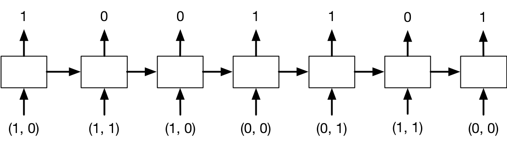



These exercises are optional and are not graded. They are based on the material from [Lecture 8](/lecs/w08/lec08.html). Try each exercise on your own first, then click on **Solution** to reveal a worked answer.

## Exercise 1 - RNN for Sentiment Analysis

Suppose we are training a vanilla RNN like the one below to determine whether a sentence expresses positive or negative sentiment. This RNN is a character-level RNN, where $x^{(1)}, \ldots, x^{(T)}$ is the sequence of input characters. The RNN is given as follows:
$$
\begin{aligned}
h^{(t)} &= \tanh\left(U x^{(t)} + W h^{(t-1)} + b\right) \\
y &= \sigma\left(V h^{(T)} + d\right)
\end{aligned}
$$

**(a)** How many times do we need to apply the weight matrices $U$, $W$, and $V$ to make a prediction?

**(b)** What are the shapes of the matrices $U$, $W$, and $V$?

**(c)** How many addition and multiplication operations are required to make a prediction? You can assume that no additions or multiplications are performed when applying the tanh and sigmoid activation functions.

::: {.callout-tip collapse="true" title="Solution"}
**(a)** We need to compute $h^{(t)}$ for $t = 1, \ldots, T$. Each of these computations applies $U$ and $W$ once. The matrix $V$ is only applied once at the end. Therefore, we apply $U$ and $W$ $T$ times each, and $V$ once.

**(b)** Let $d_x$, $d_h$, and $d_y$ be the dimensions of $x^{(t)}$, $h^{(t)}$, and $y$ ($d_y = 1$ for binary sentiment). Then $U$ is $d_h \times d_x$, $W$ is $d_h \times d_h$, and $V$ is $d_y \times d_h$.

**(c)** At each of the $T$ steps, we perform two matrix-vector multiplications ($Ux^{(t)}$ and $Wh^{(t-1)}$) and two vector additions (adding the two products, and adding $b$). Computing the output requires one more matrix-vector multiplication ($Vh^{(T)}$) and one vector addition ($+d$). Counting scalar operations:

- $Ux^{(t)}$: $d_h d_x$ multiplications and $d_h(d_x - 1)$ additions.
- $Wh^{(t-1)}$: $d_h^2$ multiplications and $d_h(d_h - 1)$ additions.
- The two vector additions: $2d_h$ additions.
- $Vh^{(T)} + d$: $d_y d_h$ multiplications and $d_y(d_h - 1) + d_y$ additions.

In total, there are $T(d_h d_x + d_h^2) + d_y d_h$ multiplications and the same number of additions.
:::

## Exercise 2 - Vanishing and Exploding Gradients in a Scalar RNN

Suppose we have the following vanilla RNN, where the inputs and hidden units are scalars:
$$
\begin{aligned}
h^{(t)} &= \tanh\left(w h^{(t-1)} + u x^{(t-1)} + b_h\right), \qquad t = 1, \ldots, T, \\
y &= \sigma\left(v h^{(T)} + b_y\right).
\end{aligned}
$$

**(a)** Show that if $|w| < 1$ and the number of time steps $T$ is large, then the gradient $\frac{\partial y}{\partial x^{(0)}}$ vanishes.

**(b)** Why is the result from (a) troubling?

**(c)** Does $|w| > 1$ imply that the gradient explodes? Explain.

**(d)** Gradient clipping rescales the gradient $\mathbf{g}$ to $\eta\frac{\mathbf{g}}{\|\mathbf{g}\|}$ whenever $\|\mathbf{g}\| > \eta$. Apply it with $\eta = 1$ to $\mathbf{g} = (3, 4)$ and to $\mathbf{g} = (0.3, 0.4)$. Does gradient clipping help with vanishing gradients?

::: {.callout-tip collapse="true" title="Solution"}
**(a)** Write $z^{(t)} = w h^{(t-1)} + u x^{(t-1)} + b_h$, so $h^{(t)} = \tanh(z^{(t)})$. The input $x^{(0)}$ only enters through $h^{(1)}$, and each subsequent hidden state depends on the previous one. By the chain rule,
$$
\frac{\partial y}{\partial x^{(0)}}
  = \underbrace{\sigma'\left(v h^{(T)} + b_y\right) v}_{\partial y / \partial h^{(T)}}
    \cdot \prod_{t=2}^{T} \underbrace{\tanh'\left(z^{(t)}\right) w}_{\partial h^{(t)} / \partial h^{(t-1)}}
    \cdot \underbrace{\tanh'\left(z^{(1)}\right) u}_{\partial h^{(1)} / \partial x^{(0)}}.
$$
Since $|\tanh'(z)| \leq 1$ and $|\sigma'(z)| \leq \frac{1}{4}$ for all $z$, we get
$$
\left|\frac{\partial y}{\partial x^{(0)}}\right| \leq \frac{1}{4}\,|v|\,|u|\,|w|^{T-1}.
$$
Because $|w| < 1$, the bound goes to $0$ exponentially fast as $T \to \infty$, so the gradient vanishes.

**(b)** The gradient with respect to early inputs (and, similarly, the contribution of early time steps to the gradient with respect to the weights) becomes negligible. Gradient descent therefore receives almost no signal about how early inputs should affect the output, so the network cannot learn long-term dependencies, e.g. that the first word of a long review determines its sentiment.

**(c)** No. The bound above becomes large, but the factors $\tanh'(z^{(t)})$ can be very small if the hidden units saturate ($|z^{(t)}|$ large). Whether the gradient explodes depends on the product $\prod_t \tanh'(z^{(t)})\, w$. Explosion is possible when the units stay in the near-linear regime of tanh (around $0$), where $\tanh' \approx 1$, so the product behaves like $w^{T-1}$.

**(d)** $\|(3, 4)\| = 5 > 1$, so it is rescaled to $(0.6, 0.8)$, which has norm 1 and the same direction. $\|(0.3, 0.4)\| = 0.5 \leq 1$, so it is left unchanged. Gradient clipping only ever makes gradients smaller, so it addresses exploding gradients but does nothing about vanishing gradients.
:::

## Exercise 3 - RNN Addition

In this problem, you will design a recurrent neural network that implements binary addition. The inputs are given as binary sequences, starting with the *least* significant binary digit. (It is easier to start from the least significant bit, just like how you did addition in grade school.) The sequences are padded with at least one zero as the most significant digit, so that the output length is the same as the input length. For example, the problem $100111 + 110010$, whose target output value is $1011001$, is represented as follows:
$$
\mathbf{x}^{(1)} = \begin{pmatrix}1 \\ 0\end{pmatrix},\;
\mathbf{x}^{(2)} = \begin{pmatrix}1 \\ 1\end{pmatrix},\;
\mathbf{x}^{(3)} = \begin{pmatrix}1 \\ 0\end{pmatrix},\;
\mathbf{x}^{(4)} = \begin{pmatrix}0 \\ 0\end{pmatrix},\;
\mathbf{x}^{(5)} = \begin{pmatrix}0 \\ 1\end{pmatrix},\;
\mathbf{x}^{(6)} = \begin{pmatrix}1 \\ 1\end{pmatrix},\;
\mathbf{x}^{(7)} = \begin{pmatrix}0 \\ 0\end{pmatrix},
$$
with target outputs
$$
y^{(1)} = 1,\; y^{(2)} = 0,\; y^{(3)} = 0,\; y^{(4)} = 1,\; y^{(5)} = 1,\; y^{(6)} = 0,\; y^{(7)} = 1.
$$

There are two input units corresponding to the two inputs, and one output unit. Therefore, the pattern of inputs and outputs for this example is:

{width=70%}

Design, by hand, the weights and biases for an RNN that has two input units, three hidden units, and one output unit, and implements binary addition as described above. All of the units use the hard threshold activation function ($f(x) = 1$ if $x > 0$ and $0$ otherwise). In particular, specify the weight matrices $\mathbf{U}$, $\mathbf{v}$, and $\mathbf{W}$, the bias vector $\mathbf{b}_{\mathbf{h}}$, and the scalar bias $b_y$ for the following architecture:
$$
\begin{aligned}
\mathbf{h}^{(t)} &= f\left(\mathbf{W}\mathbf{h}^{(t-1)} + \mathbf{U}\mathbf{x}^{(t)} + \mathbf{b}_{\mathbf{h}}\right) \\
y^{(t)} &= f\left(\mathbf{v}^\top \mathbf{h}^{(t)} + b_y\right)
\end{aligned}
$$

**(a)** What are the shapes of $\mathbf{U}$, $\mathbf{v}$, $\mathbf{W}$, and $\mathbf{b}_{\mathbf{h}}$?

**(b)** Come up with values for $\mathbf{U}$, $\mathbf{W}$, and $\mathbf{b}_{\mathbf{h}}$. Justify your answer.

*Hint:* When performing binary addition, in addition to adding up the two digits in a column, we need to track whether there is a *carry* digit from the previous column. We will choose one of the three units in $\mathbf{h}^{(t)}$, say $h_2^{(t)}$, to represent this carry digit. You may also find it helpful to set $h_1$ to activate if the sum of the 3 digits is at least 1, $h_2$ to activate if the sum is at least 2, and $h_3$ to activate if the sum is 3.

**(c)** Come up with values for $\mathbf{v}$ and $b_y$. Justify your answer.

::: {.callout-tip collapse="true" title="Solution"}
**(a)** The inputs $\mathbf{x}^{(t)}$ are $2 \times 1$ and the hidden states $\mathbf{h}^{(t)}$ are $3 \times 1$, so:

- $\mathbf{W}$ is $3 \times 3$
- $\mathbf{U}$ is $3 \times 2$
- $\mathbf{b}_{\mathbf{h}}$ is $3 \times 1$
- $\mathbf{v}$ is $3 \times 1$

**(b)** We follow the hint. Let $S^{(t)} = x_1^{(t)} + x_2^{(t)} + c^{(t-1)}$ be the sum of the two digits and the carry $c^{(t-1)}$ from the previous column. ($S^{(t)}$ and $c^{(t-1)}$ are not variables of the model, just notation to help us work out the solution.) We want:

1. $h_1^{(t)} = 1$ if and only if $S^{(t)} \geq 1$,
2. $h_2^{(t)} = 1$ if and only if $S^{(t)} \geq 2$,
3. $h_3^{(t)} = 1$ if and only if $S^{(t)} = 3$.

The carry for the next column is $1$ exactly when $S^{(t)} \geq 2$, i.e. when $h_2^{(t)} = 1$. So $c^{(t-1)} = h_2^{(t-1)}$ (with $\mathbf{h}^{(0)} = \mathbf{0}$, i.e. no initial carry). Each hidden unit must therefore compute $S^{(t)} = x_1^{(t)} + x_2^{(t)} + h_2^{(t-1)}$ and compare it with a threshold of $0.5$, $1.5$, and $2.5$ respectively:
$$
\mathbf{U}= \begin{pmatrix}
  1 & 1 \\
  1 & 1 \\
  1 & 1 \end{pmatrix},\quad
\mathbf{W}=\begin{pmatrix}
  0 & 1 & 0 \\
  0 & 1 & 0 \\
  0 & 1 & 0\end{pmatrix},\quad
\mathbf{b}_{\mathbf{h}}= \begin{pmatrix}
  -0.5 \\
  -1.5 \\
  -2.5 \end{pmatrix}.
$$

**(c)** The output digit is $1$ if and only if $S^{(t)}$ is odd, i.e. $S^{(t)} \in \{1, 3\}$. In terms of the hidden units, this happens when $\mathbf{h}^{(t)} = (1, 0, 0)$ or $\mathbf{h}^{(t)} = (1, 1, 1)$, and not when $\mathbf{h}^{(t)} = (0, 0, 0)$ or $(1, 1, 0)$. We can achieve this with
$$\mathbf{v}=\begin{pmatrix} 1 \\ -1 \\ 1 \end{pmatrix}, \qquad b_y = -0.5,$$
since $\mathbf{v}^\top\mathbf{h}^{(t)} + b_y$ equals $-0.5$, $0.5$, $-0.5$, and $0.5$ for $S^{(t)} = 0, 1, 2, 3$ respectively.
:::

## Exercise 4 - LSTMs

Recall the LSTM update from lecture:
$$
\begin{pmatrix}
\mathbf{i}_t \\
\mathbf{f}_t \\
\mathbf{o}_t \\
\mathbf{g}_t
\end{pmatrix} =
\begin{pmatrix}
\sigma \\
\sigma \\
\sigma \\
\tanh
\end{pmatrix} \left( \mathbf{W}
\begin{pmatrix}
\mathbf{x}_t \\
\mathbf{h}_{t - 1}
\end{pmatrix} + \mathbf{b} \right), \qquad
\begin{aligned}
\mathbf{c}_t &= \mathbf{f}_t \circ \mathbf{c}_{t-1} + \mathbf{i}_t \circ \mathbf{g}_t, \\
\mathbf{h}_t &= \mathbf{o}_t \circ \tanh(\mathbf{c}_t).
\end{aligned}
$$

**(a)** Show that if $\mathbf{f}_{t+1} = \mathbf{1}$, $\mathbf{i}_{t+1} = \mathbf{0}$, and $\mathbf{o}_t = \mathbf{0}$, then the memory cell is copied unchanged ($\mathbf{c}_{t+1} = \mathbf{c}_t$) and its gradient is passed through unmodified, i.e. $\overline{\mathbf{c}_t} = \overline{\mathbf{c}_{t+1}}$. Why does this help with vanishing gradients?

**(b)** For an LSTM with input size $d_x$ and hidden size $d_h$, what is the shape of $\mathbf{W}$ and how many parameters does the LSTM layer have? How many does `nn.LSTM(input_size=50, hidden_size=64)` have? (PyTorch uses two bias vectors, `bias_ih` and `bias_hh`, instead of one.)

::: {.callout-tip collapse="true" title="Solution"}
**(a)** With $\mathbf{f}_{t+1} = \mathbf{1}$ and $\mathbf{i}_{t+1} = \mathbf{0}$, we get $\mathbf{c}_{t+1} = \mathbf{c}_t$. For the gradient, $\mathbf{c}_t$ affects the loss through $\mathbf{c}_{t+1}$ and through $\mathbf{h}_t$, so
$$
\overline{\mathbf{c}_t} = \overline{\mathbf{c}_{t+1}} \circ \mathbf{f}_{t+1} + \overline{\mathbf{h}_t} \circ \mathbf{o}_t \circ \tanh'(\mathbf{c}_t) = \overline{\mathbf{c}_{t+1}} \circ \mathbf{1} + \mathbf{0} = \overline{\mathbf{c}_{t+1}}.
$$
(The gates also depend on $\mathbf{h}_t$, but with $\mathbf{o}_t = \mathbf{0}$ we have $\mathbf{h}_t = \mathbf{0}$, and the gradient through $\mathbf{h}_t$ is multiplied by $\mathbf{o}_t = \mathbf{0}$.) Unlike a vanilla RNN, where the gradient is multiplied by $w \tanh'(\cdot)$ at every step, the memory cell provides a path along which the gradient is multiplied by the forget gate only. When the forget gate is close to 1, gradients can flow over many time steps without vanishing.

**(b)** $\mathbf{W}$ maps the concatenated $(d_x + d_h)$-dimensional vector to the four $d_h$-dimensional gate pre-activations, so it has shape $4d_h \times (d_x + d_h)$. With one bias vector, the layer has $4d_h(d_x + d_h) + 4d_h$ parameters. For `nn.LSTM(50, 64)`: $4 \cdot 64 \cdot (50 + 64) + 2 \cdot 4 \cdot 64 = 29184 + 512 = 29696$ parameters. A vanilla RNN of the same size would have about a quarter as many.
:::

## Exercise 5 - Text Generation and Teacher Forcing

**(a)** Explain how a trained character-level RNN language model generates new text at test time.

**(b)** During training, we use teacher forcing. What is teacher forcing, and why is it used?

**(c)** What mismatch between training and test time does teacher forcing create, and what problem can this cause?

::: {.callout-tip collapse="true" title="Solution"}
**(a)** We feed a start token (or a prompt) into the RNN, which outputs a probability distribution over the next character. We *sample* a character from this distribution (possibly with a temperature parameter), feed the sampled character back in as the next input, and repeat until we generate an end token or reach a maximum length.

**(b)** With teacher forcing, the input at each time step during training is the *ground-truth* previous character from the training sequence, not the model's own prediction. All time steps can then be computed from known inputs, the loss at each step (cross-entropy with the true next character) is well defined, and early mistakes do not derail the rest of the sequence, which makes training faster and more stable.

**(c)** During training, the model only ever sees correct prefixes. At test time, it conditions on its own (possibly wrong) samples. Once it makes a mistake, it may be in a state it never encountered during training, and errors can compound over the generated sequence. This is sometimes called *exposure bias*.
:::
